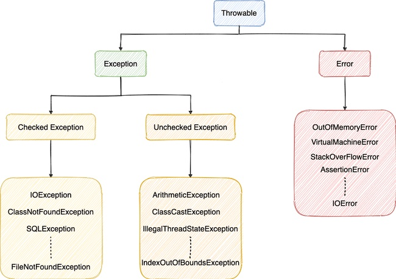

## Java 基础


### Java 面向对象

#### Java 语言三大特性？

封装、继承和多态

封装是指将对象的属性私有化，提供一些可以访问属性的方法，我们通过访问这些方法得到对象的属性。

继承是指某新类继承已经存在的类，该新类拥有被继承的类的所有属性和方法，并且新类可以根据自己的情况拓展属性或方法。其中新类称为子类，原存在的类被称为父类。通过使用继承，可以快速地创建新的类，可以提高代码的重用，程序的可维护性，节省大量创建新类的时间 ，提高开发效率。

多态我的理解是不同的类对同一个行为具有多个不同表现形式。在 Java 中有两种形式可以实现多态：继承 (多个子类对同一方法的重写) 和接口 (多个类实现接口并覆盖接口中同一方法)。

#### 重载与重写的区别？

重载发生在同一个类中，具有相同方法名，但是有不同的参数或者参数个数或者不同的参数顺序的方法。比如构造方法。

重写是发生在当子类继承父类时，对父类中的一些方法根据自己的需求进行重写操作。

| 区别点     | 重载方法 | 重写方法                                                     |
| :--------- | :------- | :----------------------------------------------------------- |
| 发生范围   | 同一个类 | 子类                                                         |
| 参数列表   | 必须修改 | 一定不能修改                                                 |
| 返回类型   | 可修改   | 子类方法返回值类型应比父类方法返回值类型更小或相等           |
| 异常       | 可修改   | 子类方法声明抛出的异常类应比父类方法声明抛出的异常类更小或相等 |
| 访问修饰符 | 可修改   | 访问修饰符范围大于等于父类。父类被 private/final/static 修饰不能重写 |
| 发生阶段   | 编译期   | 运行期                                                       |

#### 接口和抽象类有什么共同点和区别？

**共同点** ：

- 都不能被实例化。
- 都可以包含抽象方法。
- 都可以有默认实现的方法 (Java 8 可以用 `default` 关键在接口中定义默认方法)。

**区别** ：

- 接口主要用于对类的行为进行约束，你实现了某个接口就具有了对应的行为。抽象类主要用于代码复用，强调的是所属关系（比如抽象一个发送短信的抽象类）。
- 一个类只能继承一个类，但是可以实现多个接口。
- 接口中的成员变量只能是 `public static final` 类型的，不能被修改且必须有初始值，而抽象类的成员变量默认 `default`，可在子类中被重新定义，也可被重新赋值。

#### 引用拷贝、浅拷贝和深拷贝?

引用拷贝：两个不同的引用指向同一个对象。

浅拷贝：浅拷贝会在堆上创建一个新的对象 (区别于引用拷贝的一点)，如果原对象内部的属性是引用类型的话，浅拷贝会直接复制内部对象的引用地址，也就是说拷贝对象和原对象共用同一个内部对象。

深拷贝：深拷贝会完全复制整个对象，包括这个对象所包含的内部对象。

#### 内部类?

内部类有四种，分别是 `静态内部类` 、`局部内部类` 、`匿名内部` 和 `成员内部类`。

成员内部类：定义在一个类中的类，最基本的内部类

静态内部类：使用 `static` 来修饰一个内部类，则这个内部类就属于外部类本身，而不属于外部类的某个对象。称为静态内部类

局部内部类：定义在方法中的类叫做局部内部类

匿名内部类：是指使用继承一个父类或者实现一个接口这两种方式直接定义并使用的类，匿名内部类没有class关键字，直接使用 `new` 生成一个对象

#### final 关键字?

`final` 关键字可以修饰类、方法和属性。

当final修饰类的时候，表明**这个类不能被继承**。final 类中的所有成员方法都会被隐式地指定为 final 方法。

当final修饰方法的时候，表明这个方法不能被重写。

当final修饰属性的时候，如果是基本数据类型的变量，则其数值一旦在初始化之后便**不能更改**；如果是引用类型的变量，则在对其初始化之后便**不能再让其指向另一个对象**。

### Java 数据类型

| 基本类型  | 位数 | 字节 | 默认值  | 取值范围                                   |
| :-------- | :--- | :--- | :------ | ------------------------------------------ |
| `byte`    | 8    | 1    | 0       | -128 ~ 127                                 |
| `short`   | 16   | 2    | 0       | -32768 ~ 32767                             |
| `int`     | 32   | 4    | 0       | -2147483648 ~ 2147483647                   |
| `long`    | 64   | 8    | 0L      | -9223372036854775808 ~ 9223372036854775807 |
| `char`    | 16   | 2    | 'u0000' | 0 ~ 65535                                  |
| `float`   | 32   | 4    | 0f      | 1.4E-45 ~ 3.4028235E38                     |
| `double`  | 64   | 8    | 0d      | 4.9E-324 ~ 1.7976931348623157E308          |
| `boolean` | 1    |      | false   | true、false                                |

#### 基本类型和包装类型的区别？

- 包装类型不赋值就是 `null` ，而基本类型有默认值且不是 `null`。

- 包装类型可用于泛型，而基本类型不可以。

- 基本数据类型的局部变量存放在 Java 虚拟机栈中的局部变量表中，基本数据类型的成员变量 (未被 `static` 修饰) 存放在 Java 虚拟机的堆中。包装类型属于对象类型，我们知道几乎所有对象实例都存在于堆中。

- 相比于对象类型，基本数据类型占用的空间更小。

  包装类占用的内存大小 = 对象头 (header) 大小 + 基本数据类型的大小。对于基本类型 `int` 只占用 4 个字节。但是包装类型 `Integer` 还需要加上对象头 header 所占用的 12 字节。

#### 包装类的缓存机制？

Java 基本数据类型的包装类型的大部分都用到了缓存机制来提升性能。

`Byte`, `Short`, `Integer`, `Long` 这 4 种包装类默认创建了数值 **[-128，127]** 的相应类型的缓存数据，`Character` 创建了数值在 **[0,127]** 范围的缓存数据，`Boolean` 直接返回 `True` or `False`。超出范围会创建新的对象。

两种浮点数类型的包装类 `Float`, `Double` 并没有实现缓存机制。

```java
// 下面两行是等价的
Integer num1 = 123;
Integer num2 = Integer.valueOf(123);	// 发生了装箱
// 只要 new 了，就创建了新对象 num1 == num2 != num3
Integer num3 = new Integer(123);
```

#### `==` 与 `equals` 的区别？

`==` ：基本数据类型比较的是值是否相等，引用数据类型判断的是两个对象的地址是否相等

`equals` ：如果类中没有重写 `equals()` 方法，等价于使用 `==` 来比较两个对象；如果重写了 `equals()` 方法，则使用重写的方法来判断两个对象是否相等。

#### hashCode() 的作用？

获取对象在哈希表中的索引位置。

`Object` 的 `hashCode()` 方法是本地方法，也就是用 C 语言或 C++ 实现的，该方法通常用来将对象的内存地址转换为整数之后返回。

其实，`hashCode()` 和 `equals()` 都是用于比较两个对象是否相等。

#### 为什么两个对象有相同的 `hashCode` 值，它们也不一定是相等的？

因为多个不同的对象通过哈希算法可能计算出相同的 hashCode 值，这时候就还需要 equals() 方法来判断两个对象是否相同。

- 如果两个对象的`hashCode` 值相等，那这两个对象不一定相等（哈希碰撞）。
- 如果两个对象的`hashCode` 值相等并且`equals()`方法也返回 `true`，我们才认为这两个对象相等。
- 如果两个对象的`hashCode` 值不相等，我们就可以直接认为这两个对象不相等。

所以重写 `equals()` 时必须重写 `hashCode()` 方法.。

#### String、StringBuffer、StringBuilder 的区别？

`String` 类型中使用 `final` 关键字来修饰字符数组，所以 `String` 对象是不可修改的。

> `final` 修饰的字符数组是一个引用类型，这里只是该引用不能再指向其他对象，并不是不能修改字符数组的内容。
>
> `String` 真正不可变有下面几点原因：
>
> 1. 保存字符串的数组被 `final` 修饰且为私有的，并且`String` 类没有提供/暴露修改这个字符串的方法。
> 2. `String` 类被 `final` 修饰导致其不能被继承，进而避免了子类破坏 `String` 不可变。

`StringBuilder` 与 `StringBuffer` 都继承自 `AbstractStringBuilder` 类，没有用 `final` 关键字修饰字符数组，所以这两种类的对象是可以修改的。`StringBuffer` 在方法中加了同步锁，所以是线程安全的。`StringBuilder` 不是线程安全的。

1. 操作少量的数据: 适用 `String`
2. 单线程操作字符串缓冲区下操作大量数据: 适用 `StringBuilder`
3. 多线程操作字符串缓冲区下操作大量数据: 适用 `StringBuffer`

#### 字符串拼接用 "+" 还是 StringBuilder ？

Java 语言本身并不支持运算符重载，“+”和“+=”是专门为 String 类重载过的运算符，也是 Java 中仅有的两个重载过的运算符。

字符串对象通过“+”的字符串拼接方式，实际上是通过 `StringBuilder` 调用 `append()` 方法实现的，拼接完成之后调用 `toString()` 得到一个 `String` 对象 。

比较明显的缺陷就是编译器不会创建单个 `StringBuilder` 以复用，会导致创建过多的 `StringBuilder` 对象。

建议直接使用 `StringBuilder` 进行拼接。

#### 字符串常量池的作用？

`JVM` 为了提升性能和减少内存消耗针对字符串 (String 类) 专门开辟的一块区域，主要目的是为了避免字符串的重复创建。

```java
// 在堆中创建字符串对象"ab"
// 将字符串对象"ab"的引用保存在字符串常量池中
String aa = "ab";
// 直接返回字符串常量池中字符串对象”ab“的引用
String bb = "ab";
System.out.println(aa == bb);// true
```

####  String s1 = new String("abc"); 这句话创建了几个字符串对象？

// TODO


#### intern 方法有什么作用?

// TODO


#### String 类型的变量和常量做“+”运算时发生了什么？

// TODO


### Java 异常

`Java` 中的异常分为 `Error` 和 `Exception`



#### Exception 和 Error 有什么区别？

- **`Exception`**：程序可以处理的异常，可以通过 `catch` 捕获或 `Throws` 抛出。`Exception` 分为 `Checked Exception` (受检查异常，必须处理) 和 `Unchecked Exception` (不受检查异常，可以不处理) 两种。

  - 代码在编译过程中，如果受检查异常没有被 `catch` 或者 `throws` 关键字处理的话，无法通过编译。除了 `RuntimeException` 及其子类以外，其他的 `Exception` 类及其子类都属于受检查异常 。

    > 常见的受检查异常：IO 相关的异常、`ClassNotFoundException` 、`SQLException`...。

  - 代码在编译过程中 ，即使不处理不受检查异常也可以正常通过编译。`RuntimeException` 及其子类都属于非受检查异常。

    > 常见的非受检查异常：`NullPointerException`、`ArrayIndexOutOfBoundsException`、`ClassCastException`...

- **`Error`** ：`Error` 属于程序无法处理的错误。例如虚拟机运行错误 (`Virtual MachineError`)、虚拟机内存溢出错误 (`OutOfMemoryError`)、栈溢出错误 (`StackOverFlowError`) 等 。这些异常发生时，Java 虚拟机一般会终止线程。

#### try-catch-finally 如何使用？

- `try` 块： 用于捕获异常。其后可接零个或多个 `catch` 块，如果没有 `catch` 块，必须跟一个 `finally` 块。
- `catch` 块： 用于处理 `try` 捕获到的异常。
- `finally` 块：无论是否捕获或处理异常，`finally` 块里的语句都会被执行。当在 `try` 块或 `catch` 块中遇到 `return` 语句时，`finally` 语句块将在方法返回之前被执行。

> **注意：不要在 finally 语句块中使用 return。** 当 `try`  `catch` 语句和 `finally` 语句中都有 `return` 语句时， `try` `catch` 语句块中的 `return` 语句会被忽略。这是因为 `try` 语句中的 `return` 返回值会先被暂存在一个本地变量中，当执行到 `finally` 语句中的 `return` 之后，这个本地变量的值就变为了 `finally` 语句中的 `return` 返回值。

#### finally 中的代码一定会执行吗？

不一定。

`finally` 执行之前虚拟机被终止运行、程序所在的线程死亡，`finally` 中的代码就不会被执行。


### 泛型

#### 什么是 Java 泛型 (Generics) ？有什么作用？

使用泛型参数，可以增强代码的可读性以及稳定性。
