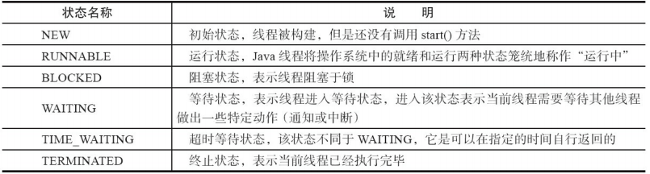
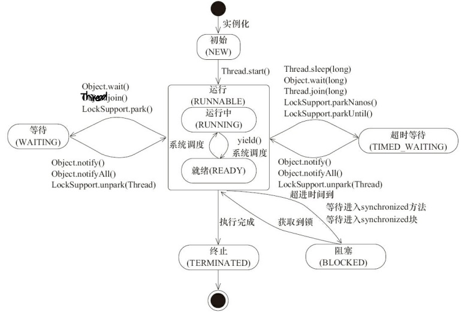

## Java 多线程

### 什么是进程？

进程是程序的一次执行过程，是系统运行程序的基本单位，因此进程是动态的。系统程序从启动到关闭即是一个进程从创建，运行到消亡的过程。

在 `Java` 中，当我们启动 `main` 函数时其实就是启动了一个 `JVM` 的进程，而 `main` 函数所在的线程就是这个进程中的一个线程，也称主线程。

### 什么是线程？

线程被称为轻量级的进程。与进程相似，但线程是一个比进程更小的执行单位。一个进程在其执行的过程中可以创建多个线程。

多个线程共享进程的**堆**和**方法区**资源，但每个线程有自己的**程序计数器**、**虚拟机栈**和**本地方法栈**，所以系统在创建一个线程，或是在线程之间作切换时，开销要比进程小得多。

> 关于进程和线程更多的内容应该写在**操作系统**和 **`JVM`** 里。

### 并发与并行的区别？

- **并发**：两个及两个以上的任务在同一 **时间段** 内执行。
- **并行**：两个及两个以上的任务在同一 **时刻** 执行。

### 使用多线程可能会带来什么问题？

并发编程的目的就是为了能提高程序的执行效率提高程序运行速度。

但是并发编程可能会遇到很多问题，比如：内存泄漏、死锁、线程不安全等等。

### 线程的生命周期和状态？

`Java` 线程在运行的生命周期中的指定时刻只可能处于下面 `6` 种不同状态的其中一个状态。

线程的状态随着代码的执行在不同状态之间切换。

---

### 什么是上下文切换？

线程在执行过程中会有自己的运行条件和状态 (也称上下文)，比如程序计数器，栈信息等。当出现如下情况的时候，线程会从占用 `CPU` 状态中退出。

- 主动让出 `CPU`，比如调用了 `sleep()`, `wait()` 等。
- 时间片到期。
- 调用了阻塞类型的系统中断，比如请求 `IO`，线程被阻塞。
- 被终止或结束运行

这其中前三种都会发生线程切换，线程切换意味着需要保存当前线程的上下文，等到线程下次占用 `CPU` 的时候恢复现场。并加载下一个将要占用 `CPU` 的线程的上下文。这就是 **上下文切换**。

上下文切换每次需要保存信息和恢复信息，这会占用 `CPU`、内存等系统资源，如果频繁切换就会造成整体效率低下。

### 什么是线程死锁？如何预防/避免死锁？

#### 线程死锁？

多个线程同时无限期地阻塞，它们中的一个或者全部都在等待某个资源被释放。

产生死锁的四个必要条件：

1. 互斥条件：该资源任意一个时刻只由一个线程占用。
2. 请求与保持条件：一个线程因请求资源而阻塞时，不释放已经获得的资源。
3. 不剥夺条件：线程已获得的资源在未使用完之前不能被其他线程强行剥夺，只有自己使用完毕后才释放资源。
4. 循环等待条件：若干线程之间形成循环等待资源关系。

#### 如何预防死锁？

1. **破坏请求与保持条件**：一次性申请所有的资源。
2. **破坏不剥夺条件**：占用部分资源的线程进一步申请其他资源时，如果申请不到，可以主动释放它占有的资源。
3. **破坏循环等待条件**：线程按顺序申请资源，按反序释放资源，这样破坏了循环等待条件。

#### 如何避免死锁？

避免死锁就是在资源分配时，借助于算法 (比如银行家算法) 对资源分配进行计算评估，使其进入安全状态。

// TODO 银行家算法，应该写在操作系统里

### `sleep()` 方法和 `wait()` 方法区别和共同点？

- 两者最主要的区别在于：**`sleep()` 方法没有释放锁，而 `wait()` 方法释放了锁** 。
- 两者都可以暂停线程的执行。
- `wait()` 通常被用于线程间交互/通信，`sleep() `通常被用于暂停执行。
- `wait()` 方法被调用后，线程不会自动苏醒，需要别的线程调用同一个对象上的 `notify() `或者 `notifyAll()` 方法。`sleep() `方法执行完成后，线程会自动苏醒。或者可以使用 `wait(long timeout)` 超时后线程会自动苏醒。

