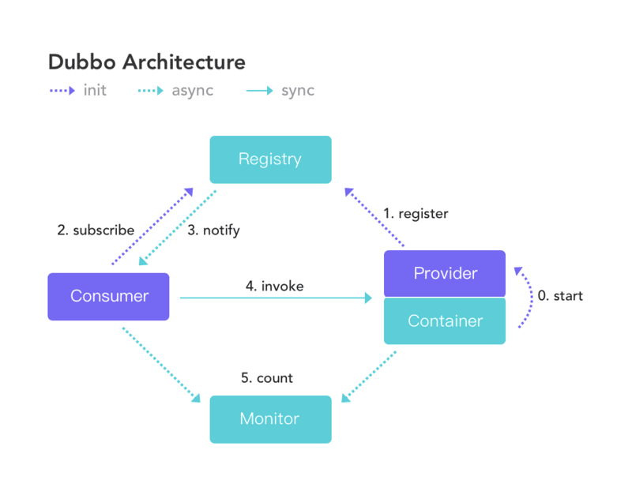

## RPC 框架

### RPC 基础、原理？

RPC (Remote Procedure Call) 即远程过程调用。

#### 为什么要用 RPC ？

不同服务器上的服务提供的方法不在同一个内存空间。

所以需要通过网络编程传递方法调用所需要的参数，以及接收方法调用的结果。

使用 `RPC` 方便我们进行远程方法的调用，不需要考虑底层的传输协议和序列化方式等。

#### RPC 的原理？

RPC 由这几部分组成

* 客户端 (服务消费端)：调用远程方法的一端。
* 客户端 Stub (桩)：代理类。把需要调用的方法、参数等信息传递到服务器端。
* 网络传输：传输方法、参数到服务端；传输返回结果到客户端。可以使用 Socket 或 Netty。
* 服务端 Stub (桩)：不是代理类，是接收到客户端执行方法的请求后，去指定对应的方法并返回结果给客户端的类。
* 服务端 (服务提供端)：提供远程方法的一端。

执行流程：

1. 客户端 (client) 以本地调用的方式调用远程服务。
2. 客户端 Stub (client stub)
   1. 接收到调用后，将方法、参数等组装成能进行网络传输的消息体，即生成 `RpcRequest`，并将其序列化。
   2. 找到远程服务的地址，并将消息发送到服务端。
3. 服务端 Stub
   1. 收到消息后将消息反序列化为 Java 对象，即 `RpcRequest`。
   2. 根据 `RpcRequest` 中的类、方法和参数等信息调用本地方法。
   3. 得到方法执行结果，组装成 `RpcResponse` 序列化之后发送给客户端。
4. 客户端 Stub 接收到消息，将消息反序列化为 `RpcResponse` 得到执行结果。

#### 如何设计一个 RPC 框架？

---

一个基本的 RPC 框架需要：

##### 1. 注册中心

一般使用 Zookeeper、Nacos。

注册中心负责服务地址的注册与查找，相当于目录服务。

服务端启动后将自身的服务名称及对应的地址 (ip + port) 注册到注册中心。

客户端根据服务名称找到对应的服务地址，对服务端发起网络请求。

调用关系：

1. 服务容器启动和加载服务端。
2. 服务端 (服务提供者) 启动后，向注册中心注册自己的服务。
3. 客户端 (消费者) 启动后，向注册中心订阅自己所需的服务。
4. 注册中心返回服务地址列表给客户端，如有变更，注册中心将推送变更数据给客户端。
5. 客户端从服务地址列表中，基于负载均衡算法选择一个地址发起调用，如果调用失败再换一个。
6. 客户端和服务端，在内存中记录调用次数和调用时间，定时发送到监控中心。

##### 2. 网络传输

通过发送网络请求来传递目标类、方法的信息和方法的参数等信息到服务端。

Socket、Netty

##### 3. 序列化和反序列化

发送端将对象转化为二进制数据在网络中传输，接收端收到后将其转换为 Java 对象。

Java 自带 `Serializable` 接口。

比较常用 hessian、kyro。

##### 4. 动态代理

当调用远程方法时，实际会通过代理对象来传输网络请求。

##### 5. 负载均衡

避免单个服务器响应过多请求导致宕机、崩溃等问题。

##### 6. 传输协议

设计一个私有的 RPC 协议，提供给客户端和服务端进行交流。

### Socket 网络通信

#### 什么是 `Socket`？

Socket 是一个抽象概念。应用程序可以通过 Socket 将数据在网络中传输。

Socket 是 IP 与端口号的组合 (`IP` 地址`:`端口号)。

要让客户端和服务端进行网络通信，需要一对 Socket。

运行在服务器端的 Server Socket。运行在客户端的 Client Socket。

#### `Socket` 通信过程？

---

简单流程：

1. 启动服务端，开始监听客户端请求。
2. 客户端发起请求，服务端和客户端建立连接。
3. 进行数据传输。
4. 关闭连接。

具体流程：

1. **服务端**创建 `ServerSocket` 对象并且绑定 `ip` 和 `port`。通过 `accept()` 方法监听客户端请求。
2. **客户端**创建 `Socket` 对象并且向指定服务器的 `ip` 和 `port` 发起连接。
3. 连接建立后，**客户端**通过输出流向服务器发送请求，**服务端**通过输入流读取客户端的请求。
4. **服务端**通过输出流向客户端发送响应信息。**客户端**通过输入流接收响应信息。
5. 双方都关闭资源。

#### Socket 的缺点？

使用 `BIO` 的话，一个线程只能处理一个客户端请求。

直接使用 `NIO` 比较麻烦，建议使用基于 `NIO` 的网络编程框架 `Netty`。

### Netty 网络通信

Netty 是一个基于 NIO 的 client-server 框架，可以简化网络应用程序的开发。

#### 用 Netty 可以做什么？

1. 作为 RPC 框架的网络通信工具。
2. 实现一个基本的 HTTP 服务器。
3. 实现一个即使通讯系统。

Dubbo、RocketMQ、Elasticsearch 都用到了 Netty。

#### 如何使用 Netty 传输对象？

##### 传输实体类

1. 定义客户端与服务端进行交互的实体类。

   客户端将 RpcRequest 类型的对象发送给服务端，服务端处理后，返回 RpcResponse 类型的对象给客户端。

##### 客户端

1. 初始化客户端，通过 sendMessage() 方法将 RpcRequest 对象发送给服务端。

   sendMessage() 过程：

   1. 首先初始化了一个 Bootstrap。
   2. 通过 Bootstrap 对象连接服务端。
   3. 通过 Channel 向服务端发送消息 RpcRequest。
   4. 发送成功后，阻塞等待，知道 Channel 关闭。
   5. 拿到服务端返回的结果 RpcResponse。

