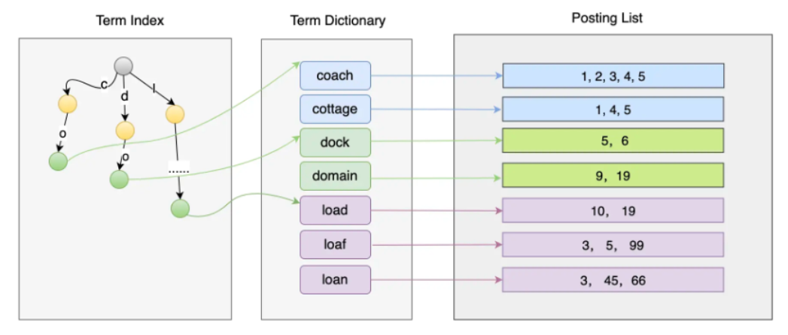

# Elasticsearch

一个流行的搜索引擎

## 集群层面基本概念

### 集群 Cluster

多个协同工作的 ES 实例组合成的集合称为**集群**。

集群是一种提供无间断服务的方案，**因为分布式系统的架构设计，使 ES 拥有高可用性和可扩展性**。

- **高可用性**，分为服务可用性、数据可用性。
  - 服务可用性，在有部分节点挂掉的情况下系统还可以对外提供服务。
  - 数据可用性，部分节点挂掉，并且这些节点的数据无法恢复的情况下，也能保证数据不丢失。
- **可扩展性**，当并发量提升，或者数据量增多的情况下，可以通过增加节点数来解决问题。

### 结点 Node

**单个 ES 的服务实例叫做节点，本质上就是一个 Java 进程**。

每个实例都有自己的名字，就是配置里的 'node.name' 设置的内容。为了标识每个节点，每个节点启动后都会分配一个 UID，存储在 data 目录。各个节点受到集群的管理，可以通过增加或者减少节点来达到扩容或减容的目的。

节点类型如下：

- **主节点（Master）**。主节点在整个集群是唯一的，Master 从有资格进行选举的节点（Master Eligible）中选举出来。主节点主要负责管理集群变更、元数据的更改。
- **数据节点（Data Node）**。其负责保存数据，要扩充存储时候需要扩展这类节点。数据节点还负责执行数据相关的操作，如：搜索、聚合、CURD 等。所以对节点机器的 CPU、内存、I/O 要求都比较高。
- **协调节点（Coordinating Node）**。负责接受客户端的请求，将请求路由到对应的节点进行处理，并且把最终结果汇总到一起返回给客户端。因为需要处理结果集和对其进行排序，需要较高的 CPU 和内存资源。
- **预处理节点（Ingest Node）**。预处理操作允许在写入文档前通过定义好的一些 processors（处理器）和管道对数据进行转换。默认情况下节点启动后就是预处理节点。
- **热暖结点/冷热结点 (Hot & Warm Node)**。不同硬件配置的 Data Node，用来实现 Hot & Warm 架构的节点，有利于降低集群热暖部署成本。例如，在硬件资源好的机器中部署 Hot 类型的数据节点，而在硬件资源一般的机器上部署 Warm Node 节点。**热节点存放用户查询最多的热数据，使用SSD比较快，暖节点存放用户最近不关心的数据，使用机械硬盘就比较节约成本。**

### 分片（Shard）

把数据分割成多个部分，存放在多个ES实例中。

一般来说，面对海量数据的时候，分布式系统可以通过增加机器数量来进行水平扩展。所以，系统需要将数据分成多个小块数据，并且尽量均匀地分配到各个机器上，然后可以通过某种策略找到对应数据块所在的位置。

**分片（Shard）是 ES 底层基本的读写单元，分片是为了分割巨大的索引数据，让读写可以由多台机器来完成，从而提高系统的吞吐量。**

### 副本（Replica）

为了保证数据可靠性，一般分布式系统都会对数据进行冗余备份，也就是副本。

**ES将数据副本分为主从两类型：主分片（primary shard）和副分片（replica shard）** 。

在写入的过程中，先写主分片，成功后并发写副分片，在数据恢复时以主分片为主。多个副本除了可以保证数据可靠性外，还有一个好处是可以承担系统的读负载。

不同的副本会尽量分配到不同的节点上，如果相同副本分配到相同节点上，集群的健康状态会变成 Yellow。

### 集群健康状态

三种健康状态：

- **Green**，集群处于健康状态，所有的主分片和副本分片都正常运行。
- **Yellow**，所有的主分片都运行正常，但是有部分副本分片不正常，意味着可能存在单点故障的风险（如果部分主分片没有备份了，一旦这个主分片数据丢失，将导致这些数据永久丢失）。
- **Red**，有部分主分片没有正常运行。

每个索引也有这三种状态，**如果索引丢失了一个副本分片，那么这个索引和集群的状态都变为 Yellow 状态，但是其他索引的的状态仍为 Green**。

## 数据层面基本概念

### 索引（Index）

索引是一类相似文档的集合。ES 将数据存储在一个或者多个 Index 中，例如将用户数据存储在 User Index 中，而将订单数据存储在 Order Index 中。一个索引有一个或者多个分片，索引的数据会以某种方式分散到各个分片上去存储。

### Mapping

**Mapping 定义了索引里的文档到底有哪些字段及这些字段的类型**，类似于数据库中表结构的定义。Mapping 有两种作用：

- 定义了索引中各个字段的名称和对应的类型；
- 定义各个字段、倒排索引的相关设置，如使用什么分词器等。

**Mapping 一旦定义后，已经定义的字段的类型是不能更改的**。

### 文档（Doc）

**向 ES 中写入的每一条数据都是一个文档（类似数据库中的一条记录），搜索也是以文档为单位的，所以文档是 ES 中的主要实体**。

文档有以下几个特性：

- ES 是面向文档的并且以文档为单位进行搜索的，如一条书本记录。
- 文档以 JSON 格式进行序列化存储。
- 每个文档都有唯一的 ID。如果使用：POST /books/\_doc 这样插入，ES 会自动生成唯一 ID，也可以使用 POST /books/\_doc/1 指定记录的 ID。**不指定 ID 时插入的性能会好点**，因为系统不需要进一步判断这个 ID 是否已经存在。

### 字段（Field）

每个文档都有一个或者多个字段。

> 例如 books 索引指定了书本的记录有 book_id 和 name 两个字段，其实就是 JSON 中的 Key。

每个字段都有指定的类型，常见的有：字符串类型 (keyword、text)、数字类型（integer、long、float、double等）、对象类型等。

keyword 类型适合存储简短、结构化的字符串，例如产品 ID、产品名字等。而 text 类型的字段适合存储全文本数据，如短信内容、邮件内容等。

### 词项（Term）

分词器会对插入的数据进行分词。

### 倒排索引

**实体 ID 到数据实体内容的关联关系的索引我们称为正排索引**。

比如一个对话表，里面存了 messageid 和 messsageInfo 等等信息。

如果是存在 MySQL 这种关系型数据库里，要通过messageInfo查询对话信息，如果 messageInfo 建立了二级索引，就先在二级索引上查，找到了 对应的 messageid 再回表到主键索引里查到所有信息。

倒排索引的做法就是把 messageInfo 进行分词，分词之后把词项到实体ID 的关系给保存下来。

简单情况下可以用哈希表+链表来实现倒排索引，但是在词项和对应文档非常多的情况下就不行了。（怎么找词项、对应的文档太多，链表太长了）

倒排索引的组成主要有 3 个部分：**Term Index**、**Term Dictionary** 和 **Posting List**。其中，Term Dictionary 保存的是词项，随着词项越来越多，从 Term Dictionary 中查找一个词项势必越来越慢，所以必须对这些词项做索引，从而有了 **Term Index，它是 Term Dictionary 的索引，最好设计得越小越好，这样缓存在内存中也没有压力**。Posting List 保存着每个词项对应的文档 ID 列表。

### 索引别名

索引 *别名* 就像一个快捷方式或软连接，可以指向一个或多个索引，也可以给任何一个需要索引名的API来使用。*别名* 带给我们极大的灵活性，允许我们做下面这些：

- 在运行的集群中可以无缝的从一个索引切换到另一个索引
- 给多个索引分组 (例如， `last_three_months`)
- 给索引的一个子集创建 `视图`

