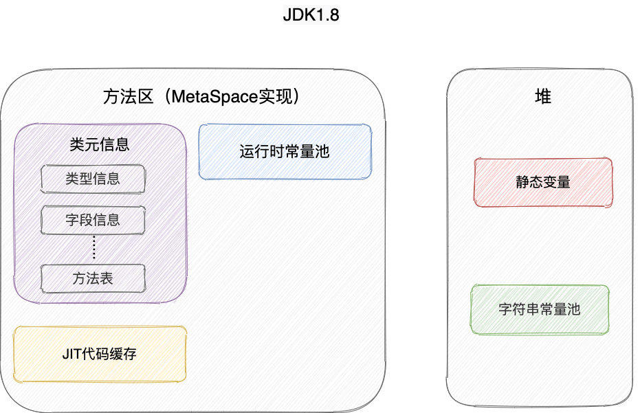

# Java 虚拟机

`Java` 使用虚拟机自动管理内存，不需要像 `C/C++` 为 `new` 操作去写对应的 `delete/free`。

### 引用类型总结

无论是通过引用计数法判断对象引用数量，还是通过可达性分析法判断对象的引用链是否可达，判定对象的存活都与“引用”有关。

#### 强引用（StrongReference）

使用最普遍的引用。如果一个对象具有强引用，那就类似于**必不可少的生活用品**，垃圾回收器绝不会回收它。当内存空间不足，Java 虚拟机宁愿抛出 OutOfMemoryError 错误，使程序异常终止，也不会回收具有强引用的对象。

#### 软引用（SoftReference）

如果内存空间足够，垃圾回收器就不会回收它，如果内存空间不足了，就会回收这些对象的内存。只要垃圾回收器没有回收它，该对象就可以被程序使用。软引用可用来实现内存敏感的**高速缓存**。

软引用可以和一个引用队列（ReferenceQueue）联合使用，如果软引用所引用的对象被垃圾回收，JAVA 虚拟机就会把这个软引用加入到与之关联的引用队列中。

#### 弱引用（WeakReference）

弱引用与软引用的区别在于：只具有弱引用的对象拥有更短暂的生命周期。

在垃圾回收器线程扫描内存区域的过程中，一旦发现了只具有弱引用的对象，不管当前内存空间足够与否，都会回收它的内存。

> 不过，由于垃圾回收器是一个优先级很低的线程， 因此不一定会很快发现那些只具有弱引用的对象。

弱引用可以和一个引用队列（ReferenceQueue）联合使用，如果弱引用所引用的对象被垃圾回收，Java 虚拟机就会把这个弱引用加入到与之关联的引用队列中。

#### 虚引用（PhantomReference）

虚引用并不会决定对象的生命周期。如果一个对象仅持有虚引用，那么它就和没有任何引用一样，在任何时候都可能被垃圾回收。

**虚引用主要用来跟踪对象被垃圾回收的活动**。

**虚引用与软引用和弱引用的一个区别在于：** 虚引用必须和引用队列（ReferenceQueue）联合使用。当垃圾回收器准备回收一个对象时，如果发现它还有虚引用，就会在回收对象的内存之前，把这个虚引用加入到与之关联的引用队列中。程序可以通过判断引用队列中是否已经加入了虚引用，来了解被引用的对象是否将要被垃圾回收。程序如果发现某个虚引用已经被加入到引用队列，那么就可以在所引用的对象的内存被回收之前采取相应操作。

> 在程序设计中一般很少使用弱引用与虚引用，使用软引用的情况较多，这是因为**软引用可以加速 JVM 对垃圾内存的回收速度，可以维护系统的运行安全，防止内存溢出（OutOfMemory）等问题的产生**。

## Java 文件执行过程

`HelloWorld.java` 文件

经过 Java 编译器编译

`HelloWorld.class` 字节码文件

通过类加载器将 `.class` 文件搬运到

运行时数据区域中的 方法区

执行引擎中的 解释器 将 字节码文件 解释成本地机器码执行

## 内存区域/运行时数据区域？

Java 虚拟机在执行 Java 程序的过程中会把它管理的内存划分成若干个不同的数据区域。

### 线程私有

#### 程序计数器 (Program Counter Register)

程序计数器是一块较小的内存空间，可以看作是当前线程所执行的字节码的行号指示器。

- 字节码解释器通过改变程序计数器来依次读取指令，从而实现代码的流程控制，如：顺序执行、选择、循环、异常处理。
- 在多线程的情况下，程序计数器用于记录当前线程执行的位置，从而当线程被切换回来的时候能够恢复之前运行的现场。

当执行的是本地方法时，程序计数器可以为空。

#### 虚拟机栈 (VM Stack)

除了一些 Native 方法调用是通过本地方法栈实现的，其他所有的 Java 方法调用都是通过栈来实现的（也需要和其他运行时数据区域比如程序计数器配合）。

方法调用的数据需要通过栈进行传递，每一次方法调用都会有一个对应的栈帧被压入栈中，每一个方法调用结束后，都会有一个栈帧被弹出。栈由一个个栈帧组成，而每个栈帧中都拥有：局部变量表、操作数栈、动态链接、方法返回地址。

##### 局部变量表

主要存放了编译期可知的各种数据类型（boolean、byte、char、short、int、float、long、double）、对象引用（reference 类型，它不同于对象本身，可能是一个指向对象起始地址的引用指针，也可能是指向一个代表对象的句柄或其他与此对象相关的位置）。

##### 操作数栈

主要作为方法调用的中转站使用，用于存放方法执行过程中产生的中间计算结果。另外，计算过程中产生的临时变量也会放在操作数栈中。

##### 动态链接

主要服务一个方法需要调用其他方法的场景。在 Java 源文件被编译成字节码文件时，所有的变量和方法引用都作为符号引用（Symbilic Reference）保存在 Class 文件的常量池里。

当一个方法要调用其他方法，需要将常量池中指向方法的符号引用转化为其在内存地址中的直接引用。动态链接的作用就是为了将符号引用转换为调用方法的直接引用。

**栈帧随着方法调用而创建，随着方法结束而销毁。无论方法正常完成还是异常完成都算作方法结束。**

程序运行中栈可能会出现两种错误：

- **`StackOverFlowError`：** 若栈的内存大小不允许动态扩展，那么当线程请求栈的深度超过当前 Java 虚拟机栈的最大深度的时候，就抛出 `StackOverFlowError` 错误。
- **`OutOfMemoryError`：** 如果栈的内存大小可以动态扩展， 如果虚拟机在动态扩展栈时无法申请到足够的内存空间，则抛出`OutOfMemoryError`异常。

#### 本地方法栈 (Native Method Stack)

**虚拟机栈为虚拟机执行 Java 方法 （也就是字节码）服务，而本地方法栈则为虚拟机使用到的 Native 方法服务。** 在 HotSpot 虚拟机中和 Java 虚拟机栈合二为一。

### 线程共享

#### 堆 (Heap)

堆是所有线程共享的一块内存区域，在虚拟机启动时创建。

**此内存区域的唯一目的就是存放对象实例，几乎所有的对象实例以及数组都在这里分配内存。**

> 从 JDK 1.7 开始已经默认开启逃逸分析，如果某些方法中的对象引用没有被返回或者未被外面使用（也就是未逃逸出去），那么对象可以直接在栈上分配内存。

在 JDK 7 版本及 JDK 7 版本之前，堆内存被通常分为下面三部分：

1. 新生代内存 (Young Generation)
2. 老生代 (Old Generation)
3. 永久代 (Permanent Generation)

下图所示的 Eden 区、两个 Survivor 区 S0 和 S1 都属于新生代，中间一层属于老年代，最下面一层属于永久代。**JDK 8 之后 PermGen(永久) 已被 Metaspace(元空间) 取代，元空间使用的是直接内存**。

---

对象都会首先在 Eden 区域分配，在一次新生代垃圾回收后，如果对象还存活，则会进入 S0 或者 S1，并且对象的年龄还会加 1 (Eden 区->Survivor 区后对象的初始年龄变为 1)，当它的年龄增加到一定程度（默认为 15 岁），就会被晋升到老年代中。对象晋升到老年代的年龄阈值，可以通过参数 `-XX:MaxTenuringThreshold` 来设置。

#### 方法区

当虚拟机要使用一个类时，它需要读取并解析 Class 文件获取相关信息，再将信息存入到方法区。方法区会存储已被虚拟机加载的 **类信息、字段信息、方法信息、常量、静态变量、即时编译器编译后的代码缓存等数据**。

**永久代**是 JDK 1.8 之前的方法区实现，JDK 1.8 及以后方法区的实现变成了**元空间**。永久代受 JVM 本身设置的固定大小限制，而元空间使用的是直接内存，只受本机可用内存的限制，可以根据运行时的应用程序需求动态地重新调整大小。

#### 运行时常量池

Class 文件中除了有类的版本、字段、方法、接口等描述信息外，还有用于存放编译期生成的各种字面量（Literal）和符号引用（Symbolic Reference）的 **常量池表(Constant Pool Table)** 。

> 字面量是源代码中的固定值的表示法，即通过字面我们就能知道其值的含义。
>
> 字面量包括整数、浮点数和字符串字面量，符号引用包括类符号引用、字段符号引用、方法符号引用和接口方法符号引用。

常量池表会在类加载后存放到方法区的运行时常量池中。

既然运行时常量池是方法区的一部分，自然受到方法区内存的限制，当常量池无法再申请到内存时会抛出 `OutOfMemoryError` 错误。

#### 字符串常量池

JVM 为了提升性能和减少内存消耗针对字符串（String 类）专门开辟的一块区域，主要目的是为了避免字符串的重复创建。其中**保存的是字符串对象的引用，字符串对象的引用指向堆中的字符串对象。**

---

### 直接内存

直接内存并不是虚拟机运行时数据区的一部分，也不是虚拟机规范中定义的内存区域，但是这部分内存也被频繁地使用。而且也可能导致 OutOfMemoryError 错误出现。

JDK1.4 中新加入的 **NIO(New Input/Output) 类**，引入了一种基于**通道（Channel）与缓存区（Buffer）的 I/O 方式，它可以直接使用 Native 函数库直接分配堆外内存，然后通过一个存储在 Java 堆中的 DirectByteBuffer 对象作为这块内存的引用进行操作。这样就能在一些场景中显著提高性能，因为避免了在 Java 堆和 Native 堆之间来回复制数据**。

## HotSpot 虚拟机对象

### 对象创建过程

#### Step1 类加载检查

虚拟机遇到一条 new 指令时，首先检查是否能在常量池中定位到这个类的符号引用，并且检查这个符号引用代表的类是否已被加载过、解析和初始化过。如果没有，那必须先执行相应的类加载过程。

#### Step2 分配内存

在**类加载检查**通过后，接下来虚拟机将为新生对象**分配内存**。对象所需的内存大小在类加载完成后便可确定，为对象分配空间的任务等同于把一块确定大小的内存从 Java 堆中划分出来。**分配方式**有 **“指针碰撞”** 和 **“空闲列表”** 两种。

- 指针碰撞 ：
  - 适用场合 ：堆内存规整（即没有内存碎片）的情况下。
  - 原理 ：用过的内存全部整合到一边，没有用过的内存放在另一边，中间有一个分界指针，只需要向着没用过的内存方向将该指针移动对象内存大小位置即可。
  - 使用该分配方式的 GC 收集器：Serial, ParNew。
- 空闲列表 ：
  - 适用场合：堆内存不规整的情况下。
  - 原理：虚拟机会维护一个列表，该列表中会记录哪些内存块是可用的，在分配的时候，找一块儿足够大的内存块儿来划分给对象实例，最后更新列表记录。
  - 使用该分配方式的 GC 收集器：CMS。

#### Step3 初始化零值

内存分配完成后，虚拟机需要将分配到的内存空间都初始化为零值（不包括对象头），这一步操作保证了对象的实例字段在 Java 代码中可以不赋初始值就直接使用，程序能访问到这些字段的数据类型所对应的零值。

#### Step4 设置对象头

初始化零值完成之后，**虚拟机要对对象进行必要的设置**，例如这个对象是哪个类的实例、如何才能找到类的元数据信息、对象的哈希码、对象的 GC 分代年龄等信息。 **这些信息存放在对象头中。** 

#### Step5 执行 init 方法

在上面工作都完成之后，从虚拟机的视角来看，一个新的对象已经产生了，但从 Java 程序的视角来看，对象创建才刚开始，`<init>` 方法还没有执行，所有的字段都还为零。所以一般来说，执行 new 指令之后会接着执行 `<init>` 方法，把对象按照程序员的意愿进行初始化，这样一个真正可用的对象才算完全产生出来。

### 对象内存分配策略

对象优先在 Eden 分配，如果说 Eden 内存空间不足，就会发生 Minor GC/Young GC。大对象直接进入老年代

> ⼤对象：需要⼤量连续内存空间的Java对象，比如很⻓的字符串和大型数组，1、导致内存有空间，还是需要提前进行垃圾回收获取连续空间来放他们，2、会进行⼤量的内存复制。 

`-XX:PretenureSizeThreshold` 参数 ，⼤于这个数量直接在⽼年代分配，缺省为0 ，表示绝不会 直接分配在⽼年代。

长期存活的对象将进⼊老年代，默认15岁，`-XX:MaxTenuringThreshold` 调整。

动态对象年龄判定，为了能更好地适应不同程序的内存状况，虚拟机并不是永远地要求对象的年龄必须达到了 `MaxTenuringThreshold` 才能晋升老年代，如果在 Survivor空间 中相同年龄所有对象大小的总和大于 Survivor空间 的⼀半，年龄大于或等于该年龄的对象就可以直接进入老年代，不需要等到 `MaxTenuringThreshold` 中要求的年龄。

#### 空间分配担保

新生代中有大量的对象存活，survivor空间 不够，当出现大量对象在 MinorGC (新生代 GC) 后仍然存活的情况，就需要老年代进行分配担保，把 Survivor 无法容纳的对象直接进⼊老年代。只要老年代的连续空间大于新生代对象的总大小或者历次晋升的平均大小，就进行 Minor GC，否则 FullGC。

#### 内存溢出与内存泄漏的区别？

* 内存溢出：内存空间不足；
* 内存泄漏：该释放的对象没有释放，常见使用容器保存元素的情况下。

### 对象的内存布局 

在 Hotspot 虚拟机中，对象在内存中的布局可以分为 3 块区域：**对象头**、**实例数据**和**对齐填充**。

**Hotspot 虚拟机的对象头包括两部分信息**，**第一部分用于存储对象自身的运行时数据**（哈希码、GC 分代年龄、锁状态标志等等），**另一部分是类型指针**，即对象指向它的类元数据的指针，虚拟机通过这个指针来确定这个对象是哪个类的实例。

**实例数据部分是对象真正存储的有效信息**，也是在程序中所定义的各种类型的字段内容。

**对齐填充部分不是必然存在的，也没有什么特别的含义，仅仅起占位作用。** 因为 Hotspot 虚拟机的自动内存管理系统要求对象起始地址必须是 8 字节的整数倍，换句话说就是对象的大小必须是 8 字节的整数倍。而对象头部分正好是 8 字节的倍数（1 倍或 2 倍），因此，当对象实例数据部分没有对齐时，就需要通过对齐填充来补全。

### 对象的访问定位

使用句柄来访问的最大好处是 reference 中存储的是稳定的句柄地址，在对象被移动时只会改变句柄中的实例数据指针，而 reference 本身不需要修改。使用直接指针访问方式最大的好处就是速度快，它节省了一次指针定位的时间开销。

#### 句柄

如果使用句柄的话，那么 Java 堆中将会划分出一块内存来作为句柄池，reference 中存储的就是对象的句柄地址，而句柄中包含了对象实例数据与类型数据各自的具体地址信息。

#### 直接指针

如果使用直接指针访问，那么 Java 堆对象的布局中就必须考虑如何放置访问类型数据的相关信息，而 reference 中存储的直接就是对象的地址。

## JVM 垃圾回收

Java 堆是垃圾收集器管理的主要区域，因此也被称作**GC 堆（Garbage Collected Heap）**。

### 如何判断对象已死？

* 引用计数法：对象中添加⼀个引用计数器，每当有⼀个地⽅引用它，计数器就加1；当引用失 效，计数器就减1；任何时候计数器为0的对象就是不可能再被使用的。
* 可达性分析：通过一系列的 GC Roots 的根对象作为起始节点，从这些节点开始，根据引用关 系向下搜索，如果某个对象到 GC Roots 间没有任何引用链相连，就表示该对象不再被使用。

#### GCroot 可以是哪些？

* 在虚拟机栈中引⽤的对象，⽐如各个线程被调⽤的⽅法堆栈中使⽤到的参数、局部变量、 临时变量等。 
* 在⽅法区中类静态属性引⽤的对象，⽐如Java类的引⽤类型静态变量。
* 在⽅法区中常量引⽤的对象，⽐如字符串常量池⾥的引⽤。
* 在本地⽅法栈中 JNI 引⽤的对象。
* Java虚拟机内部的引⽤，如基本数据类型对应的Class对象，⼀些常驻的异常对象。
* 所有被同步锁持有的对象。

#### 被标志为 GC 的对象⼀定会被 GC 掉吗？

不⼀定，还有逃脱的可能。真正宣告⼀个对象死亡至少经历两次标记的过程。

如果对象进行可达性分析后没有与 `GC Roots` 相连，那么这是第⼀次标记，之后会在进行一次 筛选，筛选的条件是是否有必要执行 finalize() ⽅法。

### 垃圾回收算法有哪些？

* 标记清除

  分为“标记”和“清除”两个阶段：首先标记出所有需要回收的对象，在标记完成后统⼀回收所有被标记的对象。标记清除之后会产生大量不连续的内存碎片，碎片太多可能会导致后续程序运行过程中需要分配较⼤对象时，无法找到足够的连续内存，从而提前触发另⼀次垃圾收集动作。

* 标记复制

  将可用内存按容量划分为大小相等的两块，每次只使用其中的⼀块。当这⼀块的内存用完了，就将还存活着的对象复制到另外⼀块上，然后再把已使用过的内存空间⼀次清空。这样使得每次都是对整个半区进行内存回收，内存分配时也就不用考虑内存碎片等复杂情况，只要按顺序分配内存即可，实现比较简单。代价是将内存缩小为了原来的⼀半。

* 标记整理

  首先标记出所有需要回收的对象，在标记完成后，后续步骤不是直接对可回收对象进行清理，而是让所有存活的对象都向⼀端移动，然后直接清理掉端边界以外的内存。

#### 新生代和老年代一般使用什么算法？

* 新生代⼀般使用标记复制和标记整理算法
* 老年代⼀般使用标记清除算法。

#### 为什么新生代不使用标记清除算法？

* 在新生代中，每次垃圾收集时都有大量对象死去，只有少量存活，选标记复制法，只需要付出少量存活对象的复制成本就可以完成收集。
* 老年代中因为对象存活率高、没有额外空间对它进行分配担保，就必须使用 “标记清除” 或者 “标记整理” 算法来进行回收。

### 垃圾收集器有哪些？

垃圾回收器可以在新⽣代和⽼年代都有，在新⽣代有Serial、ParNew、Parallel Scavenge；⽼年代有CMS、Serial Old、Parallel Old；还有不区分年的G1算法。

#### CMS垃圾回收器的过程是什么样的？会带来什么问题？

##### CMS 步骤

1. 初试标记：初试标记仅仅只是标记⼀下 GC Roots 能直接关联到的对象，速度很快，但需要暂停所有其他的工作线程。
2. 并发标记：GC 和用户线程一起工作，执行 GC Roots 跟踪标记过程，不需要暂停工作线程。
3. 重新标记：在并发标记过程中用户线程继续运作，导致在垃圾回收过程中部分对象的状态发生了变化，为了确保这部分对象的状态的正确性，需要对其重新标记并暂停工作线程。
4. 并发清除：清理删除掉标记阶段判断的已经死亡的对象，这个过程用户线程和 GC线程同时发生。

##### CMS 的问题

* CMS 收集器会占用处理器资源。如果应用本来的处理器负载就很高，还要分出一半的运算能力去执行收集器线程，就可能导致用户程序的执行速度忽然大幅降低。
* CMS 无法处理“浮动垃圾”。在CMS的并发标记和并发清理阶段，用户线程是还在继续运行的，程序在运行自然就还会伴随有新的垃圾对象不断产生，但这一部分垃圾对象是出现在标记过程结束以后，CMS无法在当次收集中处理掉它们，只好留待下一次垃圾收集时再清理掉。这一部分垃圾就称为“浮动垃圾”。
* CMS 是基于标记-清除算法，会产生大量的空间碎片。

#### G1垃圾回收器的改进是什么？相比于 CMS 突出的地方是什么？

##### G1 的改进

G1垃圾回收器抛弃了分代的概念，将堆内存划分为大小固定的独立区域，并维护⼀个优先级列表，在垃圾回收过程中根据系统允许的最长垃圾回收时间，优先回收垃圾最多的区域。（G1算法是可控STW的⼀种算法，GC收集器和我们GC调优的⽬标就是尽可能的 减少STW的时间和次数。）

##### G1 突出的地方

基于标记整理算法，不产生垃圾碎片。可以精确的控制停顿时间，在不牺牲吞吐量的前提下实现短停顿垃圾回收。

#### 现在 jdk 默认使用的是哪种垃圾回收器？

* jdk1.7 默认垃圾收集器 Parallel Scavenge（新生代）+ Parallel Old（老年代）。
* jdk1.8 默认垃圾收集器 Parallel Scavenge（新生代）+ Parallel Old（老年代）。
* jdk1.9 默认垃圾收集器 G1。

## 类加载机制

Class 文件需要加载到虚拟机中之后才能运行和使用，系统加载 Class 类型的文件主要三步：**加载->连接->初始化**。连接过程又可分为三步：**验证->准备->解析**。

* **加载**
  1. 通过全类名获取定义此类的二进制字节流
  2. 将字节流所代表的静态存储结构转换为方法区的运行时数据结构
  3. 在内存中生成一个代表该类的 `Class` 对象，作为方法区这些数据的访问入口

* **验证**

* **准备**

  在方法区中为类变量分配内存空间并设置类中变量的初始值。

* **解析**

解析阶段是虚拟机将常量池内的符号引用替换为直接引用的过程。

解析动作主要针对类或接口、字段、类方法、接口方法、方法类型、方法句柄和调用限定符7类符号引用进行。

符号引用就是一组符号来描述目标，可以是任何字面量。**直接引用**就是直接指向目标的指针、相对偏移量或一个间接定位到目标的句柄。

> 在程序实际运行时，只有符号引用是不够的，举个例子：在程序执行方法时，系统需要明确知道这个方法所在的位置。Java 虚拟机为每个类都准备了一张方法表来存放类中所有的方法。当需要调用一个类的方法的时候，只要知道这个方法在方法表中的偏移量就可以直接调用该方法了。通过解析操作符号引用就可以直接转变为目标方法在类中方法表的位置，从而使得方法可以被调用。

综上，解析阶段是虚拟机将常量池内的符号引用替换为直接引用的过程，也就是得到类或者字段、方法在内存中的指针或者偏移量。

* **初始化**

初始化阶段是执行初始化方法 `<clinit> ()` 方法的过程，是类加载的最后一步，这一步 JVM 才开始真正执行类中定义的 Java 程序代码(字节码)。

* **卸载**

卸载类即该类的 Class 对象被 GC。

卸载类需要满足 3 个要求:

1. 该类的所有的实例对象都已被 GC，也就是说堆不存在该类的实例对象。
2. 该类没有在其他任何地方被引用
3. 该类的类加载器的实例已被 GC

所以，在 JVM 生命周期内，由 jvm 自带的类加载器加载的类是不会被卸载的。但是自定义的类加载器加载的类是可能被卸载的。

> jdk 自带的 `BootstrapClassLoader`, `ExtClassLoader`, `AppClassLoader` 负责加载 jdk 提供的类，所以它们(类加载器的实例)肯定不会被回收。而自定义的类加载器的实例是可以被回收的，所以使用自定义加载器加载的类是可以被卸载掉的。

### 类加载有哪些？

JVM提供了三种类加载器，分别启动类加载器（Bootstrap Classloader）、扩展类加载器（Extention Classloader）和应用类加载器（Application Classloader）。

### 什么叫双亲委派机制？

双亲委派机制是指⼀个类在收到类加载请求后不会尝试自己加载这个类，把类加载请求委派给父类去完成，父类在接收到该加载请求后⼜会将其委派给自己的父类，以此类推，这样所有的类加载请求都被向上委派到启动类加载器中。

若父类加载器在接收到类加载请求后发现自己也无法加载该类，则父类会将该请求反馈给子类向下委派子类加载器加载该类，直到被加载成功，如果找不到会抛出异常。

### 如何打破双亲委派机制？

重写⼀个类继承 `ClassLoader`，并重写 `loadClass` 方法。（Tomcat 是不支持双亲委派机制的）。

## JVM 调优

### 常用命令

Linux中有top、vmstat、pidstat，jdk中的jstat、jstack、jps、jmap等。

### 内存持续上升，如何排查？

CPU 100% 那么一定有线程在占用系统资源， 找出哪个进程 cpu 较高（top），该进程中的哪个线程cpu较高（top -Hp）， 导出该线程的堆栈 (jstack) ， 查找哪个方法（栈帧）消耗时间 (jstack) 工作线程占比高 | 垃圾回收线程占比高 。

1. 通过top找到占⽤率⾼的进程。
2. 通过top -Hp pid找到占⽤CPU高的线程ID。
3. 把线程ID转化为16进制，得到线程IDxx。
4. 通过命令 jstack 找到有问题的代码。

### jstack 和 jsp 的区别是什么？

*  jstack：（Stack Trace for Java）命令用于生成虚拟机当前时刻的线程快照。

  > 线程快照就是当前虚拟机内每⼀条线程正在执⾏的⽅法堆栈的集合，⽣成线程快照的 主要⽬的是定位线程出现⻓时间停顿的原因，如线程间死锁、死循环、请求外部资源 导致的⻓时间等待等都是导致线程⻓时间停顿的常⻅原因。 
  >
  > 在代码中可以⽤java.lang.Thread类的getAllStackTraces（）⽅法⽤于获取虚拟机中 所有线程的StackTraceElement对象。使⽤这个⽅法可以通过简单的⼏⾏代码就完成 jstack的⼤部分功能，在实际项⽬中不妨调⽤这个⽅法做个管理员⻚⾯，可以随时使 ⽤浏览器来查看线程堆栈。

* jps：列出当前机器上正在运行的虚拟机进程。

  > -p :仅仅显示VM 标示，不显示jar,class, main参数等信息。
  >
  > -m:输出主函数传⼊的参数. 下的hello 就是在执⾏程序时从命令⾏输⼊的参数。
  >
  > -l: 输出应⽤程序主类完整package名称或jar完整名称。
  >
  > -v: 列出jvm参数, -Xms20m -Xmx50m是启动程序指定的jvm参数。

