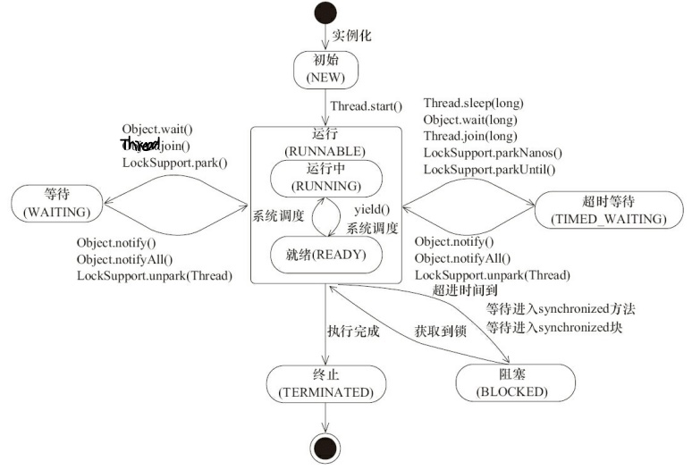

## Java 多线程


### 什么是进程？

进程是程序的一次执行过程，是系统运行程序的基本单位，因此进程是动态的。

程序从启动到关闭即是一个进程从创建，运行到消亡的过程。

在 `Java` 中，当我们启动 `main` 函数时其实就是启动了一个 `JVM` 的进程，而 `main` 函数所在的线程就是这个进程中的一个线程，也称主线程。

### 什么是线程？

线程被称为轻量级的进程。与进程相似，但线程是一个比进程更小的执行单位。一个进程在其执行的过程中可以创建多个线程。

多个线程共享进程的**堆**和**方法区**资源，但每个线程有自己的**程序计数器**、**虚拟机栈**和**本地方法栈**，所以系统在创建一个线程，或是在线程之间作切换时，开销要比进程小得多。

> 关于进程和线程更多的内容应该写在**操作系统**和 **`JVM`** 里。

### 并发与并行的区别？

- **并发**：两个及两个以上的任务在同一 **时间段** 内执行。
- **并行**：两个及两个以上的任务在同一 **时刻** 执行。

### 使用多线程可能会带来什么问题？

并发编程的目的就是为了能提高程序的执行效率提高程序运行速度。

但是并发编程可能会遇到很多问题，比如：内存泄漏、死锁、线程不安全等等。

### 线程的生命周期和状态？

`Java` 线程在运行的生命周期中的指定时刻只可能处于下面 `6` 种不同状态的其中一个状态。

- `New`：新创建的线程，尚未执行；

- `Runnable`：运行中的线程，正在执行 `run()` 方法；

- `Blocked`：运行中的线程，因为某些操作被阻塞而挂起；

- `Waiting`：运行中的线程，因为某些操作在等待中；`wait()` 方法等待

- `Timed Waiting`：运行中的线程，因为执行 `sleep()` 方法正在计时等待；

- `Terminated`：线程已终止，因为 `run()` 方法执行完毕。


线程的状态随着代码的执行在不同状态之间切换。



---


### 什么是上下文切换？

线程在执行过程中会有自己的运行条件和状态 (也称上下文)，比如程序计数器，栈信息等。当出现如下情况的时候，线程会从占用 `CPU` 状态中退出。

- 主动让出 `CPU`，比如调用了 `sleep()`, `wait()` 等。
- 时间片到期。
- 调用了阻塞类型的系统中断，比如请求 `IO`，线程被阻塞。
- 被终止或结束运行

这其中前三种都会发生线程切换，线程切换意味着需要保存当前线程的上下文，等到线程下次占用 `CPU` 的时候恢复现场。并加载下一个将要占用 `CPU` 的线程的上下文。这就是 **上下文切换**。

上下文切换每次需要保存信息和恢复信息，这会占用 `CPU`、内存等系统资源，如果频繁切换就会造成整体效率低下。

### 什么是线程死锁？如何预防/避免死锁？

#### 线程死锁？

多个线程同时无限期地阻塞，它们中的一个或者全部都在等待某个资源被释放。程序不能正常终止。

产生死锁的四个必要条件：

1. 互斥条件：该资源任意一个时刻只由一个线程占用。
2. 请求与保持条件：一个线程因请求资源而阻塞时，不释放已经获得的资源。
3. 不剥夺条件：线程已获得的资源在未使用完之前不能被其他线程强行剥夺，只有自己使用完毕后才释放资源。
4. 循环等待条件：若干线程之间形成循环等待资源关系。

#### 如何预防死锁？

1. **破坏请求与保持条件**：一次性申请所有的资源。
2. **破坏不剥夺条件**：占用部分资源的线程进一步申请其他资源时，如果申请不到，可以主动释放它占有的资源。
3. **破坏循环等待条件**：线程按顺序申请资源，按反序释放资源，这样破坏了循环等待条件。

#### 如何避免死锁？

避免死锁就是在资源分配时，借助于算法 (比如银行家算法) 对资源分配进行计算评估，使其进入安全状态。

// TODO 银行家算法，应该写在操作系统里

### `Java` 线程实现方式？

继承 `Thread` 类、实现 `Runnable` 接口、实现 `Callable` 接口、创建线程池。

### 线程终止的原因？

- 线程正常终止：`run()` 方法执行到 `return` 语句返回；
- 线程意外终止：`run()` 方法因为未捕获的异常导致线程终止；
- 对某个线程的 `Thread` 实例调用 `stop()` 方法强制终止，会造成线程不安全；
- 当线程未处于阻塞状态，调用 `interrupted()` 方法来终止线程；`t.join()` 等待 t 线程执行结束后再继续运行

### 线程唤醒方式？

* 另一个线程调用这个对象的 `notify()` 方法且刚好被唤醒的是本线程。
* 另一个线程调用这个对象的 `notifyAll()` 方法。
* 过了 `wait(long timeout)` 规定的超时时间，如果传入 `0` 就是永久等待。

### 守护线程 `Daemon Thread` ？

在调用 `start()` 方法前，调用 `setDaemon(true)` 把该线程标记为守护线程；守护线程是指为其他线程服务的线程。在 `JVM` 中，所有非守护线程都执行完毕后，无论有没有守护线程，虚拟机都会自动退出。

### `sleep()` 方法和 `wait()` 方法区别？

sleep后进⼊Time waiting超时等待状态，wait后进⼊等待waiting状态。

区别：

* `sleep` 方法属于 `Thread` 类，`wait` 方法属于 `Object` 类

- `sleep()` 方法没有释放锁，而 `wait()` 方法释放了锁 。
- `wait()` 方法被调用后，线程不会自动苏醒，需要别的线程调用同一个对象上的 `notify() `或者 `notifyAll()` 方法。`sleep() `方法执行完成后，线程会自动苏醒。或者可以使用 `wait(long timeout)` 超时后线程会自动苏醒。

### 为什么 `wait()` 方法在 `Object` 类中？

释放锁资源实际是通知对象内置的 `monitor` 对象进行释放，而只有所有对象都有内置的 `monitor` 对象才能实现对任何对象的锁资源进行操作。又因为所有类都继承自 `Object`，所以 `wait()` 就成了 `Object` 类的方法。

### 为什么调用 `start()` 方法时会执行 `run()` 方法，为什么不能直接调用 `run()` 方法？

线程调用 `start()`方法，会启动该线程并使线程进入就绪状态，当分配到时间片后就可以开始运行了。`start()` 会执行线程的相应准备工作，然后自动执行 `run()` 方法的内容，这是真正的多线程工作。 

但是，直接执行 `run()` 方法，会把 `run()` 方法当成一个 `main` 线程下的普通方法去执行，并不会新启动一个线程执行它，所以这并不是多线程工作。

### 什么是线程同步？

当多个线程同时运行时，线程的调度由操作系统决定。如果多个线程同时读写共享变量，就会出现数据不一致的问题。可以使用 `synchronized` 给**对象**进行加锁来实现线程同步。

### `synchronized` 关键字？

`synchronized` 关键字解决的是多个线程之间访问资源的同步性，该关键字可以保证被它修饰的方法或者代码块在任意时刻只能有一个线程执行。

#### `synchronized` 关键字的使用？

1. 修饰实例方法：作用于当前**对象实例**加锁，进入同步代码前要获得当前**对象实例**的锁。

2. 修饰静态方法：给当前**类**加锁，会作用于类的所有**对象实例** ，进入同步代码前要获得当前**类**的锁。

   > 如果线程 `A` 调用**实例对象**的非静态 `synchronized` 方法，而线程 `B` 需要调用这个实例对象所属**类**的静态 `synchronized` 方法，不会产生互斥，因为访问静态 `synchronized` 方法占用的锁是当前**类**的锁，而访问非静态 `synchronized` 方法占用的锁是当前**实例对象**锁。

3. 修饰代码块：可以指定加锁对象，对给定对象/类加锁。

   > `synchronized(this|object)` 表示进入同步代码块前要获得**给定对象的锁**。`synchronized(类.class)` 表示进入同步代码块前要获得**当前类的锁**。

#### 双重检验锁方式实现单例模式？

```java
public class Singleton {

    private volatile static Singleton uniqueInstance;

    private Singleton() {
    }

    public static Singleton getUniqueInstance() {
       // 先判断对象是否已经实例化过，没有实例化过才进入加锁代码
        if (uniqueInstance == null) {
            // Singleton 类加锁
            synchronized (Singleton.class) {
                if (uniqueInstance == null) {
                    uniqueInstance = new Singleton();
                }
            }
        }
        return uniqueInstance;
    }
    
}
```

需要注意 `uniqueInstance` 应该采用 `volatile` 关键字修饰。

因为 `uniqueInstance = new Singleton();` 这段代码其实是分为三步执行：

1. 为 `uniqueInstance` 分配内存空间。
2. 初始化 `uniqueInstance`。
3. 将 `uniqueInstance` 指向分配的内存地址。

但是由于 `JVM` 具有指令重排的特性，执行顺序有可能改变。

指令重排在单线程环境下不会出现问题，但是在多线程环境下会导致一个线程获得还没有初始化的实例。

> 例如，线程 `T1` 执行了 1 和 3，此时 `T2` 调用 `getUniqueInstance()` 后发现 `uniqueInstance` 不为空，因此返回 `uniqueInstance`，但此时 `uniqueInstance` 还未被初始化。

使用 `volatile` 可以禁止 `JVM` 的指令重排，保证在多线程环境下也能正常运行。

#### 构造方法可以使用 `synchronized` 关键字修饰么？

构造方法不能使用 synchronized 关键字修饰。构造方法本身就属于线程安全的。

#### `synchronized` 关键字的底层原理？

##### `synchronized` 修饰代码块的情况：

查看编译后生成的 `.class` 文件查看字节码信息。

其中可以看出：`synchronized` 同步语句块的实现使用的是 `monitorenter` 和 `monitorexit` 指令，其中 `monitorenter` 指令指向同步代码块的开始位置，`monitorexit` 指令则指明同步代码块的结束位置。

当执行 `monitorenter` 指令时，线程试图获取对象的锁，如果锁的计数器为 `0` 则表示锁可以被获取，获取后将锁计数器加 `1`。获取锁其实就是获取对象中 **对象监视器 `monitor`** 的持有权。

拥有对象锁的线程执行 `monitorexit` 指令来释放锁。将锁计数器设为 `0`，表明锁被释放，其他线程可以尝试获取锁。如果获取对象锁失败，那当前线程就要阻塞等待，直到锁被别的线程释放为止。

##### `synchronized` 修饰方法的的情况：

`synchronized` 修饰的方法在字节码中有一个 `ACC_SYNCHRONIZED` 标识，该标识指明了该方法是一个同步方法。`JVM` 通过 `ACC_SYNCHRONIZED` 访问标志来辨别一个方法是否声明为同步方法，从而执行相应的同步调用。**本质也是对对象监视器 `monitor` 的获取。**

如果是实例方法，`JVM` 会尝试获取**实例对象**的锁。如果是静态方法，`JVM` 会尝试获取当前**类**的锁。

// TODO 对象监视器 `monitor`

##### `synchronized` 锁升级的过程？


* 偏向锁：

  大多数时候是不存在锁竞争的，常常是⼀个线程多次获得同⼀个锁，因此如果每次都要竞争锁会增⼤很多没有必要付出的代价，为了降低获取锁的代价，才引⼊的偏向锁。

  


#### `synchronized` 和 `ReentrantLock` 的区别？

两者都可以控制多线程对共享资源的访问、都是可重入锁、都保证了可见性和互斥性。

**可重入锁** 指的是自己可以再次获取自己的内部锁。比如一个线程获得了某个对象的锁，此时这个对象锁还没有释放，当其再次想要获取这个对象的锁的时候还是可以获取的，如果是不可重入锁的话，就会造成死锁。同一个线程每次获取锁，锁的计数器都自增 `1`，所以要等到锁的计数器下降为 `0` 时才能释放锁。

* `synchronized` 依赖于 `JVM` 而 `ReentrantLock` 依赖于 `API` (`AQS` 实现)，是 `Lock` 接口下的一个实现类。
* `ReentrantLock` 等待可中断。
* `synchronized` 中的锁是非公平的，`ReentrantLock` 默认也是非公平的，但是可以通过修改参数来实现公平锁。
* `synchronized` 隐式获取锁和释放锁，`ReentrantLock` 显示获取和释放锁 (需要 `lock()` 和 `unlock()` 方法配合 `try/finally` 语句块)。

### `volatile` 关键字？

#### `Java` 本地内存和主内存数据不一致？

每个线程都有一个私有的**本地内存** (比如机器的寄存器) 来存储共享变量的副本，每个线程只能访问自己的本地内存，无法访问其他线程的本地内存。这就可能造成一个线程在主存中修改了一个变量的值，而另外一个线程还继续使用寄存器中的变量值的拷贝，造成**数据的不一致**。

要解决这个问题，就需要把变量声明为 **`volatile`** ，这就指示 `JVM`，这个变量是共享且不稳定的，每次使用它都到主存中进行读取。这就保证了变量的**可见性**。

#### 并发编程的三个重要特性？

1. **原子性**: 执行一组操作，要么所有的操作全部都得到执行并且不会受到任何因素的干扰而中断，要么都不执行。`synchronized` 可以保证代码片段的原子性。
2. **可见性**：当一个线程对共享变量进行了修改，那么另外的线程都是立即可以看到修改后的最新值。`volatile` 关键字可以保证共享变量的可见性。
3. **有序性**：指的是代码在执行的过程中的先后顺序。`Java` 在编译器以及运行期间存在优化，所以代码的执行顺序未必就是编写代码时候的顺序。`volatile` 关键字可以禁止指令进行重排序优化。

#### `synchronized` 关键字和 `volatile` 关键字的区别？

`synchronized` 关键字和 `volatile` 关键字是互补的。

- `volatile` 关键字是**线程同步的轻量级实现**，性能会优于 `synchronized` 关键字。但是 `volatile` 只能修饰变量而 `synchronized` 可以修饰方法以及代码块。 
- `volatile` 关键字能保证数据的**可见性**，不能保证数据的**原子性**。`synchronized` 关键字两者都能保证。 
- `volatile` 关键字主要用于保证共享变量在多个线程之间的可见性，`synchronized` 关键字解决的是多个线程之间访问资源的同步性。

### `ThreadLocal` 关键字？

`Java` 中每一个线程都有自己的专属本地变量，`ThreadLocal` 类主要解决的就是让每个线程绑定本地变量的值。

1. `ThreadLocal `是 `Java` 中所提供的线程本地存储机制，可以将数据存在某个线程内部，该线程可以在任意时刻、任意方法中获取缓存的数据。

2. `ThreadLocal` 底层是通过 `ThreadLocalmap` 来实现的，每个 `Thread` 对象 (注意不是 `ThreadLocal` 对象) 中都存在一个 `ThreadLocalMap`，`Map` 的 `key` 为 `ThreadLocal` 对象的弱引用，`Map` 的 `value` 为需要缓存的值。

#### `ThreadLocal` 内存泄露问题？

`ThreadLocalMap` 中使用的 `key` 为 `ThreadLocal` 的弱引用，而 `value` 是强引用。所以，如果 `ThreadLocal` 没有被外部强引用的情况下，在垃圾回收的时候，`key` 会被清理掉，而 `value` 不会被清理掉。这样一来，`ThreadLocalMap` 中就会出现 `key` 为 `null` 的 `Entry`。

如果不做任何措施，`value` 永远无法被 `GC` 回收，这个时候就可能会产生内存泄露。`ThreadLocalMap` 实现中已经考虑了这种情况，在调用 `set()`、`get()`、`remove()` 方法的时候，会清理掉 `key` 为 `null` 的记录。所以使用完 `ThreadLocal`方法后最好手动调用`remove()`方法。

// TODO ThreadLocal more specific 


### 线程池？

**线程池**提供了一种限制和管理资源  (包括执行一个任务) 的方式。 

#### 为什么要用线程池/线程池优点？

- **降低资源消耗**。通过重复利用已创建的线程降低线程创建和销毁造成的消耗。
- **提高响应速度**。当任务到达时，有空闲线程就能立即执行。
- **提高线程的可管理性**。线程如果无限制的创建，不仅会消耗系统资源，还会降低系统的稳定性，使用线程池可以进行统一的分配，调优和监控。

#### 如何创建线程池？

可以通过 `Executor` 框架的工具类 `Executors` 来创建四种线程池：

- **`FixedThreadPool`**：固定线程数量的线程池。当有一个新的任务提交时，线程池中若有空闲线程，则立即执行。若没有，则新的任务会被暂存在一个任务队列中，等有线程空闲时，再处理在队列中的任务。

- **`SingleThreadExecutor`：**只有一个线程的线程池。多余任务也会在等待队列。

  > `FixedThreadPool` 和 `SingleThreadExecutor` 等待队列的最大长度为 `Integer.MAX_VALUE`，可能堆积大量的请求，从而导致 `OOM` 内存溢出。

- **`CachedThreadPool`：**可根据实际情况调整线程数量的线程池。线程池的线程数量不确定，但若有空闲线程可以复用，则会优先使用可复用的线程。若所有线程均在工作，又有新的任务提交，则会创建新的线程处理任务。所有线程在当前任务执行完毕后，将返回线程池进行复用。

  > `CachedThreadPool` 允许创建的最大线程数量为 `Integer.MAX_VALUE`，可能会创建大量线程，从而导致 `OOM`。

- **`ScheduledThreadPoolExecutor`：**主要用来在给定的延迟后运行任务，或者定期执行任务。 

这些线程池都有缺点，所以一般不用 `Executors` 去创建。而是通过 `ThreadPoolExecutor` 的构造函数去创建线程池。

**`ThreadPoolExecutor` 重要的参数：**

- **`corePoolSize`：**定义该线程池中核心线程数的最大值。
- **`maximumPoolSize`：**核心线程数 + 非核心线程数的最大值。即可同时运行的最大线程数。
- **`workQueue`：**当新任务来的时候会先判断当前运行的线程数量是否达到最大核心线程数，如果达到的话，新任务就会被存放在队列中。
- **`handler`：**拒绝策略。
  - `AbortPolicy`：直接抛异常，阻止系统正常工作。
  - `CallerRunsPolicy`：直接在调用者线程中，运行当前被丢弃的任务，任务提交线程的性能极有可能急剧下降。
  - `DiscardOldestpolicy`：丢弃即将执行的下一个任务，并尝试再次提交当前任务。
  - `DiscardPolicy`：丢弃当前任务，不予处理。

当一个任务通过 `submit()` 或者 `execute()` 方法提交到线程池的时候：

1. 如果正在运行的线程数量小于 `corePoolSize`，那么马上创建线程运行这个任务。
2. 如果正在运行的线程数量大于或等于 `corePoolSize`，那么将这个任务放入队列。
3. 如果这时候队列满了，而且正在运行的线程数量小于 `maximumPoolSize`，那么还是要创建非核心线程立刻运行这个任务。
4. 如果队列满了，而且正在运行的线程数量大于或等于 `maximumPoolSize`，执行拒绝策略。

#### 常见的阻塞队列有哪些？

* ArrayBlockingQueue：有界队列，其内部的实现是基 于数组来实现的。
* LinkedBlockingQueue：从它的名字我们可以知道，它是⼀个由链表实现的队列，这个队列 的长度Integer.MAX_VALUE。此队列按照先进先出的顺序进⾏排 序。
* SynchronousQueue：是⼀个不存储任何元素的阻塞队列，每⼀个put操作必须等待take操 作，否则不能添加元素。同时它也⽀持公平锁和⾮公平锁。
* PriorityBlockingQueue：是⼀个⽀持优先级排序的⽆界阻塞队列，可以通过⾃定义实现 compareTo() ⽅法来指定元素的排序规则，或者通过构造器参数 Comparator 来指定排序规 则。但是需要注意插⼊队列的对象必须是可⽐较⼤⼩的，也就是 Comparable 的，否则会抛 出 ClassCastException 异常。
* DelayQueue：是⼀个实现 PriorityBlockingQueue 的延迟获取的⽆界队列。具有“延迟”的功 能。

### `Atomic` 原子类？

在多线程环境下，使用原子类，不会被其他线程锁干扰。

`AtomicInteger` 类主要利用 `CAS (compare and swap)` + `volatile` 和 native 方法来保证原子操作，从而避免 `synchronized` 的高开销，执行效率大为提升。

`CAS` 的原理是拿期望的值和原本的一个值作比较，如果相同则更新成新的值。

> UnSafe 类的 objectFieldOffset() 方法是一个本地方法，这个方法是用来拿到“原来的值”的内存地址。另外 value 是一个 volatile 变量，在内存中可见，因此 JVM 可以保证任何时刻任何线程总能拿到该变量的最新值。

### `AQS` (`AbstractQueuedSynchronizer`) ？

`AQS` 是一个用来构建锁和同步器的框架，使用 `AQS` 能构造出各种应用广泛的同步器，比如 `ReentrantLock`、`Semaphore` 、`CountDownLatch`。

`AQS` 核心思想：

如果被请求的共享资源空闲，则让当前请求资源的线程占有该资源，并且将共享资源设置为锁定状态。

如果被请求的共享资源被占用，那么就需要一套线程阻塞等待以及被唤醒时 锁分配的机制，这个机制 `AQS` 是用 `CLH` 队列锁实现的，即将暂时获取不到锁的线程加入到队列中。`AQS` 是将每条请求共享资源的线程封装成一个 `CLH` 锁队列的一个结点 (Node) 来实现锁的分配。


---

`AQS` 使用一个`volatile` 修饰的 `int` 成员变量 `state` 来表示同步状态，通过内置的 `FIFO` 队列 `CLH` 来完成获取资源线程的排队工作。`AQS` 使用 `CAS` 对该同步状态进行原子操作实现对其值的修改。

#### `CAS(Compare and Swap)` ？

`CAS` 指 `Compare and swap` 比较和替换是设计并发算法时用到的一种技术。`CAS` 操作是乐观锁，每次不加锁而是假设没有冲突而去完成某项操作，如果因为冲突失败就重试，直到成功为止。

`CAS` 指令有三个操作数，分别是内存位置 (在 `Java` 中可以简单的理解为变量的内存地址，用 `V` 表示)，旧的预期值 (用 `A` 表示) 和准备设置的新值 (用 `B` 表示)。`CAS` 指令在执行的时候，当且仅当 `V` 符合 `A` 时，才会用 `B` 更新`V` 的值，否则不会执行更新。

##### `CAS` 带来的问题？

`ABA` 问题。一般加版本号进行解决。

具体操作：乐观锁每次在执行数据的修改操作时都会带上一个版本号，在预期的版本号和数据的版本号一致时就可以执行修改操作，并对版本号执行加 `1` 操作，否则执行失败。

#### `AQS` 构造的 `ReentrantLock`？

`ReentrantLock` 一次只允许一个线程访问某个资源。`state` 初始化为 `0`，表示未锁定状态。`A` 线程 `lock()` 时，会调用 `tryAcquire()` 独占该锁并将 `state+1` 。此后，其他线程再 `tryAcquire()` 时就会失败，直到 `A` 线程 `unlock()` 到 `state=`0 (即释放锁) 为止，其它线程才有机会获取该锁。释放锁之前，`A` 线程自己是可以重复获取此锁的 (`state` 会累加)，这就是可重入的概念。但要注意，获取多少次就要释放多少次，这样才能保证 `state` 能回零即释放锁。

#### `AQS` 构造的 `CountDownLatch`？

`CountDownLatch` 允许 `N` 个线程阻塞在一个地方，直至所有线程的任务都执行完毕。例如多线程读取多个文件最后处理的场景 。任务分为 `N` 个子线程去执行，`state` 也初始化为 `N`。这 `N` 个子线程是并行执行的，每个子线程执行完后 ` countDown()` 一次，`state` 会 `CAS(Compare and Swap)` 减 `1`。等到所有子线程都执行完后(即 `state=0` )，会 `unpark()` 主调用线程，然后主调用线程就会继续后续动作。

#### 使用 `AQS` 自定义构造器？

同步器的设计是基于模板方法模式的，如果需要自定义同步器一般的方式是这样：

1. 自定义同步器继承 `AbstractQueuedSynchronizer` 并重写指定的方法。重写方法的功能是对共享资源 `state` 的获取和释放方式。
2. 调用其模板方法，而这些模板方法会调用自定义同步器重写的方法。

// TODO AQS 更详细


### 线程池大小确定？

如果设置的线程池数量太小，当同一时间有大量任务需要处理，可能会导致大量的任务在任务队列中排队等待执行，甚至会出现任务队列满了之后任务/请求无法处理的情况，或者大量任务堆积在任务队列导致 `OOM`。`CPU` 资源没有得到充分利用。

如果我们设置线程数量太大，大量线程可能会同时在争取 `CPU` 资源，这样会导致大量的上下文切换，从而增加线程的执行时间，影响了整体执行效率。

- **CPU 密集型任务(N+1)：** 这种任务消耗的主要是 CPU 资源，可以将线程数设置为 N（CPU 核心数）+1，比 CPU 核心数多出来的一个线程是为了防止线程偶发的缺页中断，或者其它原因导致的任务暂停而带来的影响。一旦任务暂停，CPU 就会处于空闲状态，而在这种情况下多出来的一个线程就可以充分利用 CPU 的空闲时间。
- **I/O 密集型任务(2N)：** 这种任务应用起来，系统会用大部分的时间来处理 I/O 交互，而线程在处理 I/O 的时间段内不会占用 CPU 来处理，这时就可以将 CPU 交出给其它线程使用。因此在 I/O 密集型任务的应用中，我们可以多配置一些线程，具体的计算方法是 2N。


