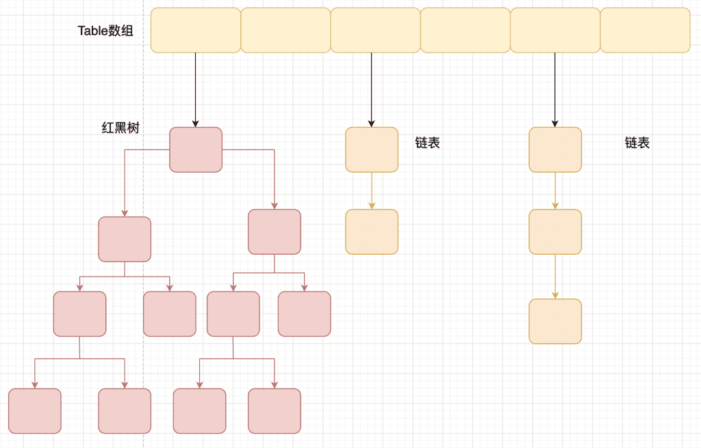

[TOC]

## Java 集合

Java 集合， 也叫作容器，主要是由两大接口派生而来：

* `Collection` 接口，主要用于存放单一元素；其中有三个主要的子接口：`List`、`Set` 和 `Queue`。
* `Map` 接口，主要用于存放键值对。


---

### `ArrayList` 、`LinkedList` 和 `Vector` 的异同？

|            | 实现接口 | 线程安全 | 底层数据结构 | 查找时间复杂度 | 添加/删除时间复杂度 | 空间浪费               |
| ---------- | -------- | -------- | ------------ | -------------- | ------------------- | ---------------------- |
| ArrayList  | List     | 不安全   | 对象数组     | O(1)           | O(n)                | 对象数组预留空间       |
| Vector     | List     | 安全     | 对象数组     | O(1)           | O(n)                | 对象数组预留空间       |
| LinkedList | List     | 不安全   | 双向链表     | O(n)           | O(1)                | 双向链表存储前驱和后继 |

`ArrayList` ：线程不安全，效率高；底层使用的是对象数组。可以对元素进行随机存取，所以查找的时间复杂度为 `O(1)`；插入和删除元素时需要移动数组，所以添加和删除的时间复杂度为 `O(n)` 。对象数组会预留一定空间。

`Vector`：线程安全，效率低 (使用 `synchronized` 修饰方法保证线程安全) ；底层使用的是对象数组。

`LinkedList`：线程不安全；底层使用的是双向链表。只能对元素进行顺序存取，所以查找的时间复杂度为 `O(n)`；插入和删除元素只需要修改节点的前驱和后继的引用，所以添加和删除的时间复杂度为 `O(1)`。前驱和后继会占用空间。

### 复制 `ArrayList` 的方式？

* 在 `ArrayList` 的构造函数中传入集合参数，其中使用了 `Arrays.copyOf()` 方法
* 使用 `ArrayList` 中的 `addAll()` 方法
* 使用 `clone()` 方法进行克隆
* 使用 `Collections.copy()` 方法

List 中存放的是基本数据类型的包装类和 String 类型时，可以达到深拷贝的效果。

存放的是其他的引用数据类型时，仅仅只会拷贝引用。所以是浅拷贝。

### `ArrayList` 扩容机制？

以无参数构造方法创建 `ArrayList` 时，实际上初始化赋值的是一个空数组。当进行添加元素操作时，才真正分配容量。即向数组中添加第一个元素时，数组容量会扩到 `10`。

当添加元素数量超出数组容量时，就会进行扩容，每次扩容后容量为原来的 `1.5` 倍。

> ```java
> int newCapacity = oldCapacity + (oldCapacity >> 1)
> ```

如果扩容之后的容量还是小于最少需要的容量，那么就把最少需要的容量作为数组的新容量。

> ```java
> if (newCapacity - minCapacity < 0)
> newCapacity = minCapacity;
> ```

如果新的容量大于 `MAX_ARRAY_SIZE`，则执行 `hugeCapacity()` 方法来比较 `minCapacity` 和 `MAX_ARRAY_SIZE`，如果 `minCapacity` 大于 `MAX_ARRAY_SIZE`，把新容量设置为 `Integer.MAX_VALUE` ，否则，把新容量设置为 `MAX_ARRAY_SIZE` 即 `Integer.MAX_VALUE - 8`。

### `Queue`、`Deque` 和 `LinkedList` 的区别？

`queue` 是单端队列。`deque` 是双端队列。`LinkedList` 可以做单端队列也可以做双端队列。

// TODO

### 说一说 `PriorityQueue`？

`PriorityQueue` 是非线程安全的，且不支持存储 `NULL` 对象。

使用堆作为底层数据结构，元素出队顺序是与优先级相关的，即优先级最高的元素先出队。

由于使用了堆，插入元素和删除堆顶元素的时间复杂度为 `O(log(n))`。

// TODO 堆的原理


### `Set` 的实现

`Set` 中不允许出现重复的元素且其中元素无序，`Java` 有三种方法实现 `Set` 

* `HashSet` 基于 `HashMap` 实现，`HashMap` 中的 `key` 值就是 `HashSet` 的元素值，`value` 被定义为一个 `final` 类型的 `Object` 变量。在比较元素是否相同时，先比较 `hashCode` ，如果相同再使用 `equals()` 比较。
* `LinkedHashSet`，继承自 `HashSet`，基于 `LinkedHashMap` 实现，通过双向链表维护元素插入其中的顺序。
* `TreeSet` 是基于 `TreeMap` 实现的，底层是红黑树。

### `Map` 的实现

* `HashMap`：线程不安全，效率高；可以存储 `null` 的 `key` 和 `value`。初始容量为 `16`，每次扩容为原来的 `2`倍。`JDK7` 前基于数组+链表，`JDK8` 后基于数组+链表+红黑树 (当链表长度大于阈值 (默认为 `8`) 时，转化为红黑树，优化查询效率)

* `LinkedHashMap`：线程不安全；通过双向链表维护元素插入其中的顺序。

* ~~`Hashtable`：线程安全，效率低；不能存储 `null` 的 `key` 和 `value`~~

  * ~~继承 `Dictoinary` 类，实现了 `Map` 接口，初始容量为 11 扩容后为 `2n + 1`~~

* `ConcurrentHashMap `：与 `Hashtable` 的主要区别在于锁的粒度不同，能够显著提高并发性。

  （1）在 `jdk7` 使用分段锁 `segment`，每一把锁只锁容器其中一部分数据，多线程访问容器里不同数据段的数据，就不会存在锁竞争，提高并发访问率。

  （2）在 `jdk8` 抛弃了 `segment` 的概念，使用 `Node` 数组+链表+红黑树的数据结构，并发控制使用 `synchronized` 和 `CAS`。`synchronized` 只锁住当前链表或红黑树的首节点。

### `HashMap` 的底层实现？

`HashMap` 通过 `key` 的 `hashCode()` 得到 `hash` 值，然后通过 `(n - 1) & hash` 判断当前元素存放的位置 (这里的 `n` 指的是数组的长度)，如果当前位置存在元素的话，就判断该元素与要存入的元素的 `hash` 值以及 `key` 是否相同，如果相同的话，直接覆盖，不相同就通过拉链法解决冲突。

`JDK8` 之后，当链表长度大于阈值 (默认为 `8`) 时，将链表转化为红黑树，以减少搜索时间。



// TODO 红黑树原理

见数据结构


### `HashMap` 的容量及扩容问题？

`HashMap` 中有几个重要的参数：

```java
static final int DEFAULT_INITIAL_CAPACITY = 1 << 4; //哈希桶的默认长度是 16 
static final float DEFAULT_LOAD_FACTOR = 0.75f; //加载因子
transient int size; //hashmap 实际存在的 node 数量
transient int modCount; //结构修改的次数
int threshold; //哈希桶长度*加载因子，超过此数量后扩容，容量翻倍
```

* 初始容量为 `16`，当添加元素数量超过阈值 `threshold` 时，就要进行扩容，扩容之后哈希桶的容量扩大到之前的两倍。
* 扩容操作时，会 `new` 一个新的 `Node` 数组作为哈希桶，然后将原哈希表中的所有数据移动到新的哈希桶中，相当于对原哈希表中所有数据做 `put` 操作，原 `Node` 数组被垃圾处理回收。所以扩容操作对性能影响很大，特别是哈希表容量较大的时候。
* 对于负载因子，如果内存空间足够且对时间效率要求较高，可以降低负载因子的值，即降低冲突，提高时间效率；如果内存空间紧张且对时间效率要求不高，可以提高负载因子的值，即增加冲突，提高空间利用率。

#### `HashMap` 扩容的时候为什么是 2 的 n 次幂？

一般咱们会使用对数组长度取余来编写散列函数，但是取余的效率低于位运算。

`table` 数组下标的计算方法是 `hash & (length - 1)` ，当数组长度为 `2` 的幂次时，`hash % length` 等价于 `hash & (length - 1)`。所以 `HashMap` 的长度一直为 `2` 的幂次方。

### `HashMap` 的 `get` 流程？

1. 判断 `table` 的长度是否为 `0`，是则返回 `null`。
2. 判断 `key` 是否为 `null`，如果为 `null` 则直接取 `null` 对应的 `value`。
3. 如果 `key` 不为 `null`，计算 `key` 对应的哈希值，根据哈希值与 `table` 容量计算索引，找到对应的 `Entry`，遍历链表，根据哈希值与 `key` 值找到对应的节点，获取 `value`。

### `HashMap` 的 `put` 流程？

通过阅读源码，可以从 `Jdk7` 和 `Jdk8` 两个角度来回答：

1. 根据 `key` 通过哈希算法与与运算得到数组下标。
2. 如果数组下标元素为空，则将 `key` 和 `value` 封装为 `Entry` 对象 (`JDK7` 是 `Entry` 对象，`JDK8` 是 `Node` 对象) 并放入该位置。
3. 如果数组下标位置元素不为空，则要分情况讨论：
   1. 在 `JDK7`，生成 `Entry` 对象，并使用**头插法**添加到当前链表中。
   2. 在 `JDK8`，先判断当前位置存放的类型，看是红黑树节点 `TreeNode` 还是链表节点 `Node`。
      1. 如果是红黑树节点 `TreeNode`，则将 `key` 和 `value` 封装为红黑树节点并添加到红黑树中，在这个过程中会判断红黑树中是否存在当前 `key`，如果存在则更新 `value`。
      2. 如果是链表节点 `Node`，则将 `key` 和 `value` 封装为一个 `Node` 节点并通过**尾插法**插入到链表中，尾插法需要遍历链表，所以在遍历过程中还能判断是否存在当前 `key`，如果存在则更新其 `value`，当遍历完链表后，将新的 `Node` 插入到链表中，之后会计算当前链表的节点个数，如果大于 `8`，则会将链表转为红黑树。
      3. 在 `put` 完成后还要判断是否需要扩容，如果需要扩容，还要进行扩容流程。

### `HashMap` 如何解决冲突/碰撞？

使用拉链法的思想解决。两个键值对根据 `key` 算出的 `hash` 值相同，此时根据 `hash` 值与 `table.length - 1` 计算出的索引号 `index` 也相同，此时将后插入的键值对放入对应的链表中。在 `JDK8` 中，链表节点数大于 `8` 时还会转化为红黑树。

```java
index = h & (table.length -1)
```

### `HashMap` 在高并发下如果没有处理线程安全会有怎样的安全隐患？

* 多线程 `put` 时可能会导致 `get` 无限循环，具体表现为 `CPU` 使用率 `100%`。

  原因：在向 `HashMap` 中 `put` 元素时，会检查 `HashMap` 的容量是否足够，如果不足，则会新建一个比原来容量大两倍的表，然后把数组从旧表中迁移到新表中，多个线程同时操作就有可能会形成循环链表，当使用 `get()` 获取元素时，就会出现无限循环的情况。

* 多线程 `put` 时可能导致元素丢失。

  原因：当多个线程同时执行 `addEntry(hash, key ,value, i)` 时，如果产生哈希碰撞，导致两个线程得到同样的 `index` 去存储，就可能会发生元素覆盖丢失的情况。

### `ConcurrentHashMap` 和 `Hashtable` 的区别？

// TODO


### `HashMap` 和 `TreeMap` 区别？

`TreeMap` 和`HashMap` 都继承自`AbstractMap` ，但是 `TreeMap` 还实现了 `NavigableMap` 接口和 `SortedMap`  接口。


实现 `NavigableMap` 接口让 `TreeMap`  可以对集合内元素进行搜索。

实现 `SortedMap` 接口让 `TreeMap` 可以对集合内元素根据 `key` 排序。默认按 `key` 的升序排序，也可以指定排序的比较器 ( `new Comparator<Object>()` )。

### Collections 工具类常用方法

```java
// 排序操作
void reverse(List list)//反转
void shuffle(List list)//随机排序
void sort(List list)//按自然排序的升序排序
void sort(List list, Comparator c)//定制排序，由Comparator控制排序逻辑
void swap(List list, int i , int j)//交换两个索引位置的元素
void rotate(List list, int distance)//旋转。当distance为正数时，将list后distance个元素整体移到前面。当distance为负数时，将 list的前distance个元素整体移到后面
    
// 查找、替换操作
int binarySearch(List list, Object key)//对List进行二分查找，返回索引，注意List必须是有序的
int max(Collection coll)//根据元素的自然顺序，返回最大的元素。 类比int min(Collection coll)
int max(Collection coll, Comparator c)//根据定制排序，返回最大元素，排序规则由Comparatator类控制。类比int min(Collection coll, Comparator c)
void fill(List list, Object obj)//用指定的元素代替指定list中的所有元素
int frequency(Collection c, Object o)//统计元素出现次数
int indexOfSubList(List list, List target)//统计target在list中第一次出现的索引，找不到则返回-1，类比int lastIndexOfSubList(List source, list target)
boolean replaceAll(List list, Object oldVal, Object newVal)//用新元素替换旧元素
```


