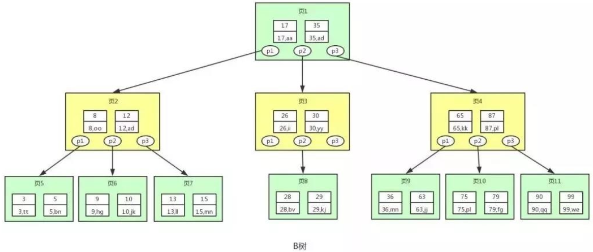
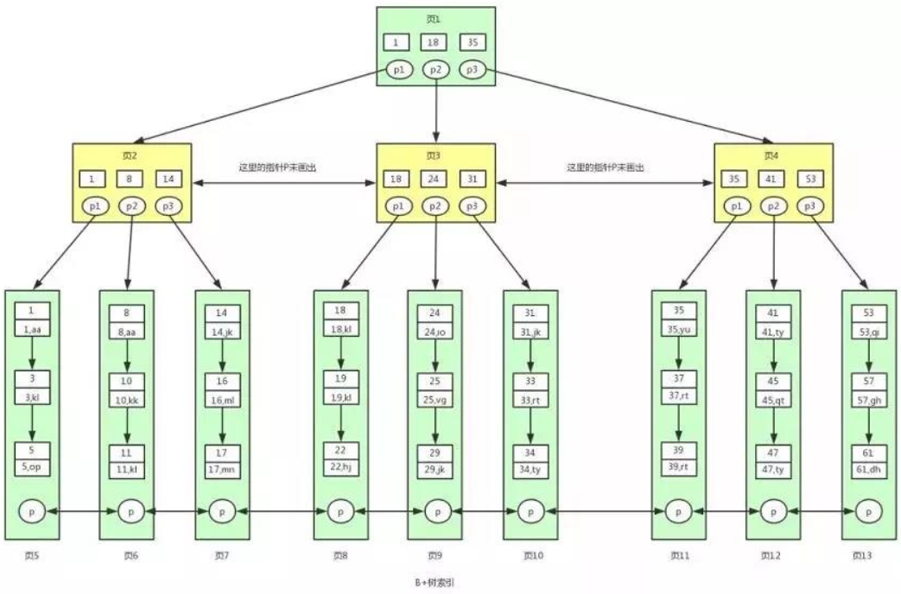
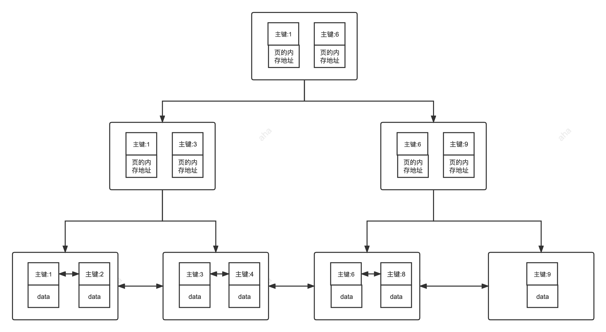
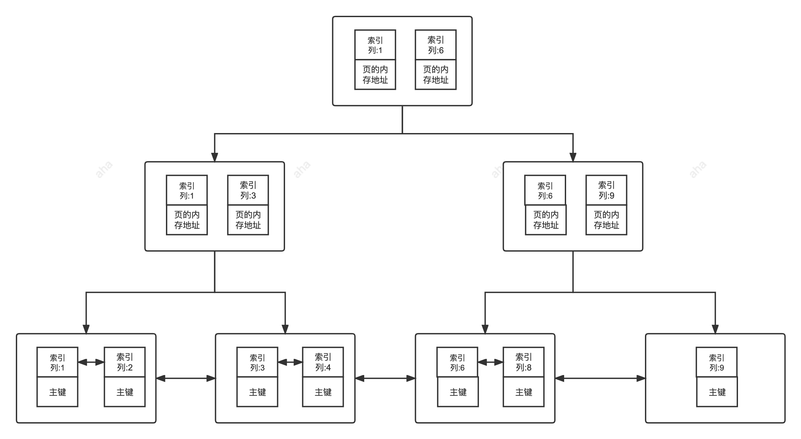
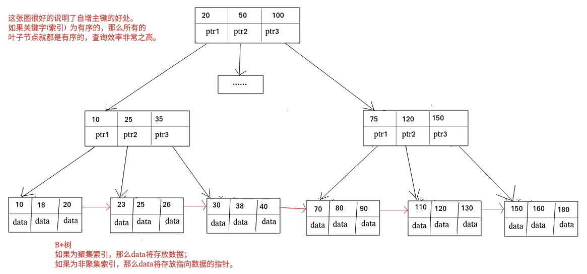
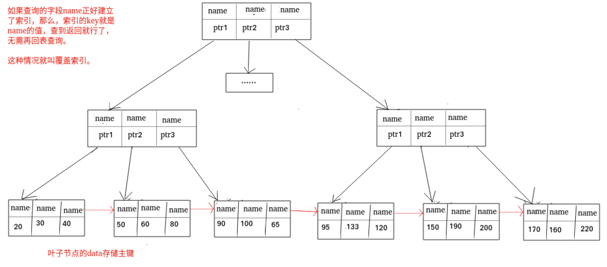

[TOC]


# 关系型数据库基础

## 什么是元组, 码, 候选码, 主码, 外码, 主属性, 非主属性？

- **元组**：元组 (`tuple`) 是关系数据库中的基本概念，关系是表，表中的每行 (即数据库中的每条记录) 就是元组，每列就是一个属性。

- **码**：码就是实体的属性，对应表中的列。

- **候选码**：若关系中的某一属性或属性组的值能唯一的标识一个元组，而其任何子集都不能再标识，则称该属性或属性组为候选码。

  > 例如：在学生实体中，“学号”是能唯一的区分学生实体的，同时又假设“姓名”、“班级”的属性组合足以区分学生实体，那么{学号}和{姓名，班级}都是候选码。

- **主码**：主码也叫主键。主码是从候选码中选出来的。 一个实体集中只能有一个主码，但可以有多个候选码。

- **外码**：外码也叫外键。如果一个关系中的一个**属性**是另外一个关系中的**主码**则这个属性为**外码**。

- **主属性**：**候选码**中出现过的属性称为**主属性**。

  > 例如：关系 工人 (工号，身份证号，姓名，性别，部门)。工号和身份证号都能够唯一标示这个关系，所以都是候选码。工号、身份证号这两个属性就是主属性。

- **非主属性：**不包含在任何一个**候选码**中的属性称为**非主属性**。

## 主键和外键有什么区别？

- **主键 (主码)**：主键用于唯一标识一个元组，不能有重复，不允许为空。一个表只能有一个主键。
- **外键 (外码)**：外键用来和其他表建立联系，是另一张表的主键，外键是可以有重复的，可以是空值。一个表可以有多个外键。

## 什么是 `ER` 图？

实体-联系图 (`Entity Relationship Diagram`)，提供了表示实体类型、属性和联系的方法，用来描述实体之间的关系。

## 数据库范式？

第一范式：数据库表中所有字段都是不可分割的原子值。

第二范式：满足第一范式，且所有非主属性都完全依赖于主码。

第三范式：满足第二范式，所有非主属性对任何候选码都不存在依赖传递。

// TODO example

## 什么是存储过程？

存储过程可以看成是一些 `SQL` 语句的集合，其中可以增加逻辑控制语句。

存储过程方便多次调用，比直接 `SQL` 语句执行要快，因为存储过程是预编译过的。

但是存储过程难以调试和扩展，没有移植性，还会消耗数据库资源。

## `drop`、`delete` 与 `truncate` 区别？

- `drop` (丢弃数据)：`drop table 表名`，删除整张表，包括表结构。
- `truncate` (清空数据)：`truncate table 表名`，清空表中数据，再插入数据的时候自增 `id` 又从 `1` 开始。不产生数据库日志。
- `delete` (删除数据)：`delete from 表名 where 列名=值`，删除某一行的数据，如果不加 `where`，也会删除整张表的数据。会产生数据库的 `binlog` 日志。

## 设计数据库通常分为哪几步？

1. **需求分析**：分析用户的需求，包括数据、功能和性能需求。
2. **概念结构设计**：画 `E-R` 图。
3. **逻辑结构设计**：将 `E-R` 图转换成关系表。
4. **物理结构设计**：为所设计的数据库选择合适的存储结构和存取路径。
5. **数据库实施**：编程、测试和试运行。
6. **数据库的运行和维护**：系统的运行与数据库的日常维护。

# MySQL

`MySql` 是关系型数据库。就是一种建立在关系模型的基础上的数据库。关系模型表明了数据库中所存储的数据之间的联系 (一对一、一对多、多对多)。

关系型数据库中，数据都被存放在了各种表中 (比如用户表)，表中的每一行就存放着一条数据 (比如一个用户的信息)。

## 简述 `MySQL` 的架构？

* `Server` 层
  * **连接器：**身份权限认证 (登录 `MySQL` 的时候)。
  * **查询缓存：**执行查询语句的时候，会先查询缓存 (`MySQL 8.0` 版本后移除)。
  * **分析器：**没有命中缓存的话，`SQL` 语句就会经过分析器，分析并检查 `SQL` 语法。
  * **优化器：**按照 `MySQL` 认为最优的方案去执行。
  * **执行器：**执行语句，然后从存储引擎返回数据。

* 存储引擎层：存储数据，提供读写接口。支持 `InnoDB`、`MyISAM`。

## 简述执行 `SQL` 语言的过程？

查询语句：

* 客户端首先通过**连接器**进行身份和权限认证。
* 如果执行的是查询语句，会先查询缓存，`MySQL 8.0` 后该步骤移除。
* 如果没有命中缓存，`SQL` 语句就会经过解析器，分析语句，包括语法检查等等。
* 接下来通过优化器，将 `SQL` 语句按照 `MySQL` 认为最优的方案去执行。
* 从存储引擎返回数据。

更新语句：

- 查询到需要修改的数据，如果有缓存，也会用到缓存。

- 对数据进行修改，调用存储引擎的 `API` 接口，准备写入这一行数据。

  此时 `InnoDB` 会把数据保存在内存中，同时记录 `redo log` 并且进入 `prepare` 状态，告诉执行器，该更新随时可以提交。

- 执行器收到通知后记录 `binlog`，然后调用引擎接口执行更新，并提交 `redo log`。

- 更新完成。

### 为什么 `redo log` 需要先进入 `prepare` 状态？

`binlog` 是 `MySQL`自带的归档日志 (数据备份、主从同步)，`redo log` 是 `InnoDB` 的重做日志 (用来支持事务)。

- **先写 `redo log` 直接提交，然后写 `binlog`**。假设写完 `redo log` 并提交后，机器挂了，`binlog` 日志没有被写入，那么机器重启后，这台机器会通过 `redo log` 恢复数据，但是 `binlog` 并没有记录该数据，后续进行机器备份或主从同步时的时候，就会丢失这些数据。

- **先写 `binlog`，然后写 `redo log`**。假设写完了 `binlog`，机器挂了，由于没有 `redo log`，本机是无法恢复这一条记录的，但是 `binlog` 又有记录，同样会产生数据不一致的情况。

- 假设 `redo log` 处于预提交状态，`binlog` 也已经写完了，机器挂了。依赖 `MySQL` 的处理机制：

  当 `redo log` 只是预提交但不是 `commit` 状态，判断 `binlog` 是否完整，如果完整就提交 `redo log`，不完整就回滚事务。

## `MySQL` 日志

`MySQL` 日志中比较重要的是 `binlog` (归档日志)、`redo log` (重做日志) 和 `undo log` (回滚日志)。

### `redo log` (重做日志)

`redo log` (重做日志) 是 `InnoDB` 存储引擎独有的，它让 `MySQL` 拥有了崩溃恢复能力。当 `MySQL` 实例挂了，重启时，`InnoDB` 存储引擎会使用 `redo log` 恢复数据，**保证数据的持久性**。

`redo log` 是物理日志，记录内容是 “在某个数据页上做了什么修改”，属于 `InnoDB` 存储引擎。

// TODO more specific

### `undo log` (回滚日志)

事务的回滚是通过 **`undo log`** 实现的，所有事务进行的修改都会先记录到回滚日志中，然后再执行相关的操作。如果执行过程中遇到异常的话，直接利用 **回滚日志** 中的信息将数据回滚到修改之前。

回滚日志会先于数据持久化到磁盘上。这样就保证了即使遇到数据库突然宕机等情况，当用户再次启动数据库的时候，数据库还能够通过查询回滚日志来回滚之前未完成的事务。**保证事务的原子性。**

### `binlog` (归档日志)

`binlog` 是逻辑日志，记录内容是语句的原始逻辑，类似于“给 ID=2 这一行的 x 字段加 1”。

不管用什么存储引擎，只要发生了表数据更新，都会产生 `binlog` 日志。

`MySQL` 的**数据备份、主备、主主、主从**都需要依靠 `binlog` 来同步数据，**保证数据一致性。**

// TODO more specific

## `MyISAM` 和 `InnoDB` 的区别？

* **锁的级别不同。**

  `MyISAM` 只有表级锁 (`table-level locking`)，而 `InnoDB` 支持行级锁 (`row-level locking`) 和表级锁，默认为行级锁。表级锁会一次性锁住整张表，非常影响对数据库并发操作的性能。

* **是否支持事务。**

  `MyISAM` 不支持事务。`InnoDB` 支持事务，具有提交 (`commit`) 和回滚 (`rollback`) 事务的能力。使用 **`undo log` (回滚日志)** 来保证事务的**原子性**。

* **是否支持外键。**

  `MyISAM` 不支持外键，而 `InnoDB` 支持。

* **数据库异常崩溃后的安全恢复能力。**

  `MyISAM` 不支持。

  使用 `InnoDB` 的数据库在异常崩溃后，数据库重新启动的时候会保证数据库恢复到崩溃前的状态。这个恢复的过程依赖于 `redo log`，可以保证数据的**持久性**。

## 锁机制与 `InnoDB` 锁算法？


### 表级锁和行级锁对比：

- **表级锁：** `MySQL` 中锁定 **粒度最大** 的一种锁，对当前操作的整张表加锁。实现简单，资源消耗少，加锁快，不会出现死锁。触发锁冲突的概率最高，并发度最低，`MyISAM` 和 `InnoDB` 引擎都支持表级锁。

- **行级锁：** `MySQL` 中锁定 **粒度最小** 的一种锁，只针对当前操作的行进行加锁。加锁开销大，加锁慢，会出现死锁。 触发锁冲突的概率小，并发度高。

  InnoDB 的行锁是针对索引字段加的锁，表级锁是针对非索引字段加的锁。

  当执行 `UPDATE`、`DELETE` 语句时，如果 `WHERE` 条件中字段没有命中索引或者索引失效的话，就会导致扫描全表对表中的所有记录进行加锁。

### 共享锁和排他锁

不论是表级锁还是行级锁，都存在共享锁（Share Lock，S 锁）和排他锁（Exclusive Lock，X 锁）这两类：

- **共享锁（S 锁）** ：又称读锁，事务在读取记录的时候获取共享锁，允许多个事务同时获取（锁兼容）。
- **排他锁（X 锁）** ：又称写锁/独占锁，事务在修改记录的时候获取排他锁，不允许多个事务同时获取。如果一个记录已经被加了排他锁，那其他事务不能再对这条事务加任何类型的锁（锁不兼容）。

排他锁与任何的锁都不兼容，共享锁仅和共享锁兼容。

### 意向锁

假设，事务A获取了某一行的排它锁，尚未提交，此时事务B想要获取表锁时，必须要确认表的每一行都不存在排他锁，很明显效率会很低，引入意向锁之后，效率就会大为改善：

1. 如果事务 A 获取了某一行的排它锁，实际此表存在两种锁，表中**某一行的排他锁** 和 **表上的意向排他锁**。
2. 如果事务 B 试图在该表级别上加锁时，则受到表上意向锁的阻塞，在锁定该表前不必检查各个页或行锁，而只需检查表上的意向锁。

意向锁是 InnoDB 自己维护的，用户无法手动操作意向锁，在为数据行加共享 / 排他锁之前，InnoDB 会先获取该数据行所在在数据表的对应意向锁。

| 兼容性 | IS     | IX     | S      | X      |
| ------ | ------ | ------ | ------ | ------ |
| IS     | 兼容   | 兼容   | 兼容   | 不兼容 |
| IX     | 兼容   | 兼容   | 不兼容 | 不兼容 |
| S      | 兼容   | 不兼容 | 兼容   | 不兼容 |
| X      | 不兼容 | 不兼容 | 不兼容 | 不兼容 |

这里的排他(X)、共享(S)锁，说的是表锁。表级锁不会和行级锁做比较。

### 插入意向锁

**插入意向锁**是在插入一条记录行前，由 **INSERT** 操作产生的一种 `间隙锁`，是一种行锁。

该锁用以表示插入**意向**，当多个事务在**同一区间**（gap）插入**位置不同**的多条数据时，事务之间**不需要互相等待**。

* 插入意向锁是一种特殊的**间隙锁** —— 间隙锁可以锁定**开区间**内的部分记录。
* 插入意向锁之间互不排斥，所以即使多个事务在同一区间插入多条记录，只要记录本身（**主键**、**唯一索引**）不冲突，那么事务之间就不会出现**冲突等待**。

### InnoDB 有哪几类行锁？

#### Record Lock 记录锁

记录锁，单个行记录上的锁。记录锁也是 **排它(X)锁**，会阻塞其他事务对其 **更新**。

**记录锁是锁住索引记录，而不是真正的数据记录**。如果要锁的列没有索引，则对全表记录加锁。

```sql
-- 在 id=1 的记录上加上记录锁，以阻止其他事务插入，更新，删除 id=1 这一行。
SELECT * FROM `test` WHERE `id`=1 FOR UPDATE;
```

- **id 列必须为唯一索引列或主键列**，否则上述语句加的锁就会变成 **临键锁**。
- **同时查询语句必须为精准匹配（=）**，不能为 >、<、like等，否则也会变成 **临键锁**。

#### Gap Lock 间隙锁

间隙锁 是 **Innodb 在 RR(可重复读) 隔离级别** 下为了解决 `幻读问题` 时引入的锁机制。

**使用间隙锁锁住的是一个区间 (不包括记录本身)，而不仅仅是这个区间中的每一条数据**。

```sql
-- 锁住id大于100的区间
SELECT * FROM emp WHERE id > 100 FOR UPDATE
```

解决了幻读问题。锁住了间隙，事务 A 查找数据的时候，事务 B 无法插入新的数据。

> **幻读：**幻读与不可重复读类似。当事务 `A` 读取了几行数据，接着事务 `B` 插入了一些数据。随后事务 `A` 再次查询数据，就会发现多了一些原本不存在的记录，像发生了幻觉一样，所以称为幻读。

#### Next-key Lock 临键锁

Next-key锁是记录锁和间隙锁的组合，它指的是加在某条记录以及这条记录前面间隙上的锁。

每个数据行上的**非唯一索引列**上都会存在一把**临键锁**，当某个事务持有该数据行的**临键锁**时，会锁住一段**左开右闭区间**的数据。

**临键锁**只与**非唯一索引列**有关，在`唯一索引列（包括主键列）上不存在临键锁`。

### `MVCC`？

#### 一致性非锁定读


## 索引？

索引是一种用于快速查询和检索数据的数据结构。常见的索引结构有：B 树， B+树和 Hash。

### 索引的优缺点？

优点 ：

- 使用索引可以加快数据的检索速度。
- 通过创建唯一性索引，可以保证数据库表中每一行数据的唯一性。

缺点 ：

- 创建索引和维护索引需要耗费时间。当对表中的数据进行增删改的时候，如果数据有索引，那么索引也需要动态的修改，会降低 `SQL` 执行效率。
- 索引需要使用物理文件存储，会耗费一定空间。

### 索引的底层数据结构？

#### `Hash` 表

不适合用作 `MySQL` 索引。会产生 `Hash` 冲突。

#### `B树`

为磁盘等辅助存储设备设计的**多路平衡查找树**。



---

与二叉树相比，B 树的每个非叶节点可以有多个子树。因此，当总结点数量相同时，B 树的高度远远小于平衡二叉树和红黑树，磁盘 IO 次数大大减少 (在不考虑缓存的情况下，获取一个结点需要一次 IO)。

> 一颗 m 阶 B 树，需要满足以下条件：
>
> * 根结点的孩子数为 `[2, M]`。包含的关键字数为 `[1, M-1]`。
>
> * 除根结点外，每个非叶子结点的孩子数为 `[ceil(M/2), M]`。包含的关键字个数为 `[ceil(M/2)-1, M-1]`。
>
> * 所有非叶子结点的结构如下：
>
>   |  n   |  P0  |  K1  |  P1  |  K2  |  P2  | ...  |  Kn  |  Pn  |
>   | :--: | :--: | :--: | :--: | :--: | :--: | :--: | :--: | :--: |
>
>   其中，`Ki (i = 1, 2, ..., n)` 为节点的关键字，且满足 `K1 < K2 < ... < Kn`；
>
>   `Pi (i = 0, 1, ..., n)` 为指向子树根结点的指针，且指针 `Pi-1` 所指子树中所有结点的关键字均小于 `Ki`，`Pi` 所指子树中所有结点的关键字均大于 `Ki`，`n` 为节点中关键字的个数。
>
> * 所有叶子结点都在同一层。

`B` 树的优势除了高度小，还有对**访问局部性原理**的利用。

当一个数据被使用时，其附近的数据有较大概率在短时间内被使用。`B` 树将关键字相近的数据存储在同一个结点，当访问某个数据时，会将整个结点读取到缓存中。当临近的数据被访问时，不要再进行 `IO`，可以直接在缓存中获取。

B 树的查找分两步，先将磁盘上的一个节点读入内存，再在内存中对节点内的关键字进行顺序/折半查找。

#### `B+树`

`B+` 树也是**多路平衡查找树**。为满足数据库而设计。




---

B+ 树与 B 树的不同 ：

* B+ 树非叶子节点上只存储键，而 B 树节点中不仅存储键，也会存储数据。

  数据库中页的大小是固定的，`InnoDB` 中每个结点使用一个页，页的默认大小是 `16KB`。

  不存储数据，就可以存储更多的键，树的阶数就会更大，高度就会更小，所以**查找数据进行磁盘的 `IO` 次数会更少**，数据查询的效率也会更快。

  > 举个例子：
  >
  > 假设每个非叶子结点页面存储 `1000` 条记录，即每条记录大约 `16` 字节。
  >
  > 因为叶子结点需要存储键值和数据，假设每个非叶子结点页面存储 100 条记录，即每条记录大约 `160` 字节。
  >
  > 一颗 `3` 层 `B+` 树，第一层根结点有 `1` 个页面；第二层有 `1000` 个页面；第三层叶子结点有 `100万` 个页面，可以存储 `1亿` 条记录。
  >
  > 一般根节点是常驻内存的，所以查找这 `1亿` 条数据，只需要 `2` 次磁盘 `IO`。

* **`B+` 树更适合范围查询。**

  在 `B` 树中进行范围查询时，首先要找到查找的下限，然后对 `B` 树进行中序遍历，直到找到查找的上线。

  而 `B+` 树的叶子结点之间通过双向链表连接。范围查询只要遍历链表即可。

* **`B+` 树的查询效率更加稳定。**

  `B` 树的查询时间复杂度在 `1` 到树高之间。

  `B+` 树的查询时间复杂度稳定为树高，因为数据只存在叶子结点。

* **B+ 树消耗的存储空间更大。**

  B+ 树会存储键和数据在叶子结点。在非叶子结点上就会重复存储键，所以会占用更多的空间。

### 索引类型？

#### 主键索引 (`Primary Key`)

数据表的主键列使用的就是主键索引。一张数据表有只能有一个主键，并且主键不能为 `null`，不能重复。

使用 `InnoDB` 时，当没有显示的指定表的主键时，`InnoDB` 会先检查表中是否有唯一索引且不允许存在`null` 值的字段，如果有，则选择该字段为默认的主键。否则 `InnoDB` 会自动创建一个 6Byte 的自增主键。



---

#### 二级索引 (辅助索引)

二级索引又称为辅助索引，是因为二级索引的叶子节点存储的数据是主键。通过二级索引，可以定位主键的位置。

唯一索引，普通索引，前缀索引等索引属于二级索引。

1. **唯一索引 (Unique Key)**：唯一索引也是一种约束。**唯一索引的属性列不能出现重复的数据，但是允许数据为 NULL，一张表允许创建多个唯一索引。** 建立唯一索引的目的大部分时候都是为了该属性列的数据的唯一性，而不是为了查询效率。
2. **普通索引 (Index)**：**普通索引的唯一作用就是为了快速查询数据，一张表允许创建多个普通索引，并允许数据重复和 NULL。**
3. **前缀索引 (Prefix)**：前缀索引只适用于字符串类型的数据。前缀索引是对文本的前几个字符创建索引，相比普通索引建立的数据更小， 因为只取前几个字符。
4. **全文索引 (Full Text)** ：全文索引主要是为了检索大文本数据中的关键字的信息，是目前搜索引擎数据库使用的一种技术。



---

#### 聚集索引

**聚集索引即索引结构和数据一起存放的索引。**

主键索引属于聚集索引。

> 在 MySQL 中，InnoDB 引擎的表的 `.ibd`文件就包含了该表的索引和数据，对于 InnoDB 引擎表来说，该表的索引 (B+树) 的每个非叶子节点存储索引，叶子节点存储索引和索引对应的数据。

##### 聚集索引的优点

聚集索引的查询速度非常的快，因为整个 `B+树` 本身是多路平衡查找树，叶子节点也都是有序的，定位到索引的节点，就相当于定位到了数据。

##### 聚集索引的缺点

* **依赖于有序的数据**：因为 `B+树` 是多路平衡树，如果索引的数据不是有序的，那么就需要在插入时排序，如果数据是整型还好，否则类似于字符串或 UUID 这种又长又难比较的数据，插入或查找的速度肯定比较慢。

* **更新代价大**：如果索引列的数据被修改，那么对应的索引也将会被修改，而且聚集索引的叶子节点还存放着数据，修改代价很大。所以对于主键索引来说，主键都是不可被修改的。

#### 非聚集索引

**非聚集索引即索引结构和数据分开存放的索引。**

二级索引属于非聚集索引。

二级索引的叶子结点存放的是主键或指向数据的指针，可能还需要进行二次查询。

##### 非聚集索引的优点

* **更新代价比聚集索引要小**。叶子节点不存放数据。

##### 非聚集索引的缺点

* 跟聚集索引一样，非聚集索引也依赖于有序的数据。

* **会有二次查询 (回表)**：当查到索引对应的指针或主键后，可能还需要根据指针或主键再到数据文件或表中查询数据。



---

##### 非聚集索引一定回表查询吗 (覆盖索引)？

不一定，如果查询的字段正好建立了索引，那么查到的数据正好是所需要的。

#### 覆盖索引

如果一个索引包含 (或者说覆盖) 所有需要查询的字段的值，就称为 `覆盖索引`。

在 `InnoDB` 中，如果不是主键索引，叶子节点存储的是主键。需要通过主键再查表一次，这样比较慢。

**覆盖索引即需要查询的字段正好是索引的字段，那么直接根据该索引，就可以查到数据了，而无需回表查询。**



---

#### 联合索引

使用表中的多个字段创建索引，就是 **联合索引**，也叫 **组合索引** 或 **复合索引**。

**最左前缀匹配原则**：

在使用联合索引时，**MySQL** 会根据联合索引中的字段顺序，从左到右依次到查询条件中去匹配。

如果查询条件中存在与联合索引中最左侧字段相匹配的字段，则就会使用该字段过滤一批数据，直至联合索引中全部字段匹配完成，或者在执行过程中遇到范围查询，如 **`>`**、**`<`**、**`between`** 和 **`以%开头的like查询`** 等条件，才会停止匹配。

所以，在使用联合索引时，应该将区分度高的字段放在最左边，可以过滤更多数据。

### 创建索引的注意事项？

**1.选择合适的字段创建索引：**

- **不为 NULL 的字段** ：索引字段的数据应该尽量不为 NULL，因为对于数据为 NULL 的字段，数据库较难优化。如果字段频繁被查询，但又避免不了为 NULL，建议使用 0,1,true,false 这样语义较为清晰的短值或短字符作为替代。
- **被频繁查询的字段** ：我们创建索引的字段应该是查询操作非常频繁的字段。
- **被作为条件查询的字段** ：被作为 WHERE 条件查询的字段，应该被考虑建立索引。
- **频繁需要排序的字段** ：索引已经排序，这样查询可以利用索引的排序，加快排序查询时间。
- **被经常频繁用于连接的字段** ：经常用于连接的字段可能是一些外键列，对于外键列并不一定要建立外键，只是说该列涉及到表与表的关系。对于频繁被连接查询的字段，可以考虑建立索引，提高多表连接查询的效率。

**2.被频繁更新的字段应该慎重建立索引。**

虽然索引能带来查询上的效率，但是维护索引的成本也是不小的。 如果一个字段不被经常查询，反而被经常修改，那么就更不应该在这种字段上建立索引了。

**3.尽可能的考虑建立联合索引而不是单列索引。**

因为索引是需要占用磁盘空间的，可以简单理解为每个索引都对应着一颗 B+树。如果一个表的字段过多，索引过多，那么当这个表的数据达到一个体量后，索引占用的空间也是很多的，且修改索引时，耗费的时间也是较多的。如果是联合索引，多个字段在一个索引上，那么将会节约很大磁盘空间，且修改数据的操作效率也会提升。

**4.注意避免冗余索引** 。

冗余索引指的是索引的功能相同，能够命中索引(a, b)就肯定能命中索引(a) ，那么索引(a)就是冗余索引。如（name,city ）和（name ）这两个索引就是冗余索引，能够命中前者的查询肯定是能够命中后者的 在大多数情况下，都应该尽量扩展已有的索引而不是创建新索引。

**5.考虑在字符串类型的字段上使用前缀索引代替普通索引。**

前缀索引仅限于字符串类型，较普通索引会占用更小的空间，所以可以考虑使用前缀索引带替普通索引。

## MySQL 事务

1. **原子性**（`Atomicity`）：事务是最小的执行单位，不允许分割。事务的原子性确保动作要么全部完成，要么完全不起作用；
2. **一致性**（`Consistency`）：执行事务前后，数据保持一致，例如转账业务中，无论事务是否成功，转账者和收款人的总额应该是不变的；
3. **隔离性**（`Isolation`）：并发访问数据库时，一个用户的事务不被其他事务所干扰，各并发事务之间数据库是独立的；
4. **持久性**（`Durabilily`）：一个事务被提交之后。它对数据库中数据的改变是持久的，即使数据库发生故障也不应该对其有任何影响。

**只有保证了事务的持久性、原子性、隔离性之后，一致性才能得到保障。也就是说 A、I、D 是手段，C 是目的！**。

##### 并发事务带来了哪些问题？

- **脏读（Dirty read）:** 当一个事务正在访问数据并且对数据进行了修改，而这种修改还没有提交到数据库中，这时另外一个事务也访问了这个数据，然后使用了这个数据。因为这个数据是还没有提交的数据，那么另外一个事务读到的这个数据是“脏数据”，依据“脏数据”所做的操作可能是不正确的。
- **丢失修改（Lost to modify）:** 指在一个事务读取一个数据时，另外一个事务也访问了该数据，那么在第一个事务中修改了这个数据后，第二个事务也修改了这个数据。这样第一个事务内的修改结果就被丢失，因此称为丢失修改。 例如：事务 1 读取某表中的数据 A=20，事务 2 也读取 A=20，事务 1 修改 A=A-1，事务 2 也修改 A=A-1，最终结果 A=19，事务 1 的修改被丢失。
- **不可重复读（Unrepeatable read）:** 指在一个事务内多次读同一数据。在这个事务还没有结束时，另一个事务也访问该数据。那么，在第一个事务中的两次读数据之间，由于第二个事务的修改导致第一个事务两次读取的数据可能不太一样。这就发生了在一个事务内两次读到的数据是不一样的情况，因此称为不可重复读。
- **幻读（Phantom read）:** 幻读与不可重复读类似。它发生在一个事务（T1）读取了几行数据，接着另一个并发事务（T2）插入了一些数据时。在随后的查询中，第一个事务（T1）就会发现多了一些原本不存在的记录，就好像发生了幻觉一样，所以称为幻读。

**不可重复读和幻读区别** ：不可重复读的重点是修改比如多次读取一条记录发现其中某些列的值被修改，幻读的重点在于新增或者删除比如多次查询同一条查询语句（DQL）时，记录发现记录增多或减少了。


> 详见 [`Spring`事务](Spring.md)。东西都一样。

## `MySQL` 优化

// TODO

