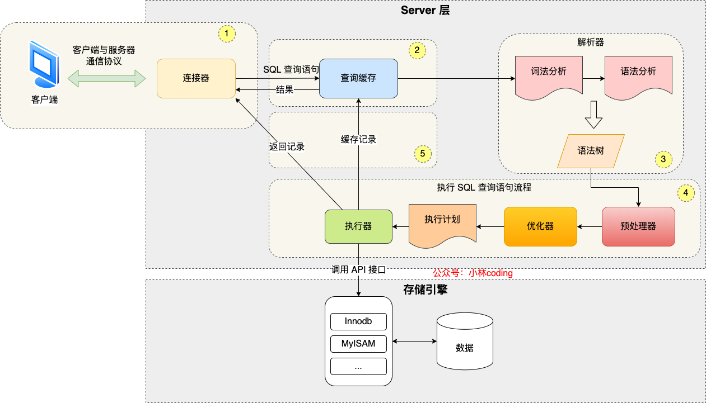
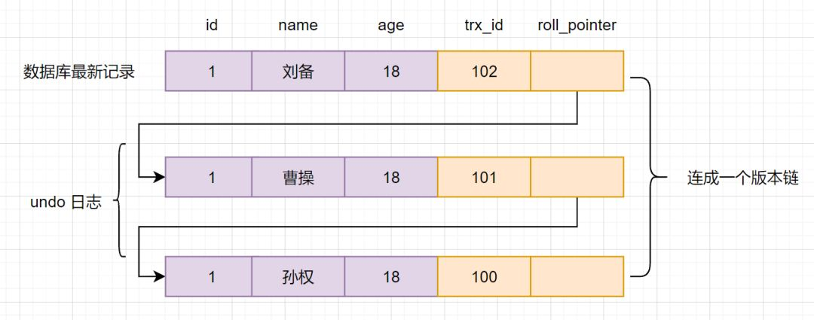

[TOC]

# 关系型数据库基础

## 什么是元组, 码, 候选码, 主码, 外码, 主属性, 非主属性？

- **元组**：元组 (`tuple`) 是关系数据库中的基本概念，关系是表，表中的每行 (即数据库中的每条记录) 就是元组，每列就是一个属性。

- **码**：码就是实体的属性，对应表中的列。

- **候选码**：若关系中的某一属性或属性组的值能唯一的标识一个元组，而其任何子集都不能再标识，则称该属性或属性组为候选码。

  > 例如：在学生实体中，“学号”是能唯一的区分学生实体的，同时又假设“姓名”、“班级”的属性组合足以区分学生实体，那么{学号}和{姓名，班级}都是候选码。

- **主码**：主码也叫主键。主码是从候选码中选出来的。 一个实体集中只能有一个主码，但可以有多个候选码。

- **外码**：外码也叫外键。如果一个关系中的一个**属性**是另外一个关系中的**主码**则这个属性为**外码**。

- **主属性**：**候选码**中出现过的属性称为**主属性**。

  > 例如：关系 工人 (工号，身份证号，姓名，性别，部门)。工号和身份证号都能够唯一标示这个关系，所以都是候选码。工号、身份证号这两个属性就是主属性。

- **非主属性：**不包含在任何一个**候选码**中的属性称为**非主属性**。

## 主键和外键有什么区别？

- **主键 (主码)**：主键用于唯一标识一个元组，不能有重复，不允许为空。一个表只能有一个主键。
- **外键 (外码)**：外键用来和其他表建立联系，是另一张表的主键，外键是可以有重复的，可以是空值。一个表可以有多个外键。

## 什么是 `ER` 图？

实体-联系图 (`Entity Relationship Diagram`)，提供了表示实体类型、属性和联系的方法，用来描述实体之间的关系。

## 数据库范式？

* 第一范式：数据库表中所有字段都是不可分割的原子值。

* 第二范式：满足第一范式，且所有非主属性都完全依赖于主码。这个规则是用来拆表的。

  > 例如：把订单信息和商品信息都放在一个表中，订单id和商品id作为复合主键。订单信息依赖于订单id，商品信息依赖于商品id，这就不满足第二范式。应该把这一个表拆成三个表，分别是，订单表、商品表和订单id与商品id的关联表。

* 第三范式：满足第二范式，所有非主属性对任何候选码都不存在依赖传递。也就是所有非主属性要直接依赖于主码。

  > 例如：订单表中存放了客户信息，但是客户信息是直接依赖于客户id，间接依赖订单id，不满足第三范式。在订单表中应该只保留客户id，其余客户信息在用到的时候再去客户表中查找。

## 什么是存储过程？

存储过程可以看成是一些 `SQL` 语句的集合，其中可以增加逻辑控制语句。

存储过程方便多次调用，比直接 `SQL` 语句执行要快，因为存储过程是预编译过的。

但是存储过程难以调试和扩展，没有移植性，还会消耗数据库资源。

## `drop`、`delete` 与 `truncate` 区别？

* `drop` (丢弃数据)：`drop table 表名`，删除整张表，包括表结构。

* `truncate` (清空数据)：`truncate table 表名`，清空表中数据，再插入数据的时候自增 `id` 又从 `1` 开始。不产生数据库日志。

* `delete` (删除数据)：`delete from 表名 where 列名=值`，删除某一行的数据，如果不加 `where`，也会删除整张表的数据。会产生数据库的 `binlog` 日志。

## 设计数据库通常分为哪几步？

1. **需求分析**：分析用户的需求，包括数据、功能和性能需求。

2. **概念结构设计**：画 `E-R` 图。

3. **逻辑结构设计**：将 `E-R` 图转换成关系表。

4. **物理结构设计**：为所设计的数据库选择合适的存储结构和存取路径。

5. **数据库实施**：编程、测试和试运行。

6. **数据库的运行和维护**：系统的运行与数据库的日常维护。

# MySQL

`MySql` 是关系型数据库。就是一种建立在关系模型的基础上的数据库。关系模型表明了数据库中所存储的数据之间的联系 (一对一、一对多、多对多)。

关系型数据库中，数据都被存放在了各种表中 (比如用户表)，表中的每一行就存放着一条数据 (比如一个用户的信息)。

## 简述 `MySQL` 的架构？

* `Server` 层
    * **连接器：**身份权限认证 (登录 `MySQL` 的时候)。
    * **查询缓存：**执行查询语句的时候，会先查询缓存 (`MySQL 8.0` 版本后移除)。
    * **分析器：**没有命中缓存的话，`SQL` 语句就会经过分析器，分析并检查 `SQL` 语法。
    * **优化器：**按照 `MySQL` 认为最优的方案去执行。
    * **执行器：**执行语句，然后从存储引擎返回数据。

* 存储引擎层：存储数据，提供读写接口。支持 `InnoDB`、`MyISAM`。

## 简述执行 `SQL` 语言的过程？



---

1. 客户端通过 TCP协议 与服务端的连接器进行连接

2. 客户端发送 SQL语句，如果是 select语句 会先去查询缓存，如果命中缓存，直接返回结果。MySQL 8.0 后取消缓存。如果表频繁更新，缓存根本就用不上。

3. 接下来 SQL语句 会进入**解析器**。通过词法分析和语法分析判断 SQL语句 是否合法，如果语法不对会在这个阶段就报错。

4. 接下来进入**预处理器**。检查 SQL语句 中的表或者字段是否存在，并将 * 扩展为表上的所有列。

5. 再进入**优化器**。优化器负责给 SQL语句 制定一个执行计划。比如在表里面有多个索引的时候，优化器会基于查询成本的考虑，来决定选择使用哪个索引。

   > 查询主键索引的 B+ 树的成本会比查询二级索引的 B+ 的成本大。
   >
   > 逻辑层面的优化主要有命中索引优化、顺序优化、排序优化等。

6. 经过优化器确定了执行计划之后，将执行计划交给**执行器**。在执行过程中，执行器会和存储引擎进行数据交互。将返回的数据传输给客户端。

更新语句：

- 查询到需要修改的数据，如果有缓存，也会用到缓存。

- 对数据进行修改，调用存储引擎的 `API` 接口，准备写入这一行数据。

  此时 `InnoDB` 会把数据保存在内存中，同时记录 `redo log` 并且进入 `prepare` 状态，告诉执行器，该更新随时可以提交。

- 执行器收到通知后记录 `binlog`，然后调用引擎接口执行更新，并提交 `redo log`。

- 更新完成。

### 为什么 `redo log` 需要先进入 `prepare` 状态？

`binlog` 是 `MySQL`自带的归档日志 (数据备份、主从同步)，`redo log` 是 `InnoDB` 的重做日志 (用来保证数据的持久性)。

- **先写 `redo log` 直接提交，然后写 `binlog`**。假设写完 `redo log` 并提交后，机器挂了，`binlog` 日志没有被写入，那么机器重启后，这台机器会通过 `redo log`
  恢复数据，但是 `binlog` 并没有记录该数据，后续进行机器备份或主从同步时的时候，就会丢失这些数据。

- **先写 `binlog`，然后写 `redo log`**。假设写完了 `binlog`，机器挂了，由于没有 `redo log`，本机是无法恢复这一条记录的，但是 `binlog` 又有记录，同样会产生数据不一致的情况。

- 假设 `redo log` 处于预提交状态，`binlog` 也已经写完了，机器挂了。依赖 `MySQL` 的处理机制：

  当 `redo log` 只是预提交但不是 `commit` 状态，判断 `binlog` 是否完整，如果完整就提交 `redo log`，不完整就回滚事务。

## `MySQL` 日志

`MySQL` 日志中比较重要的是 `binlog` (归档日志)、`redo log` (重做日志) 和 `undo log` (回滚日志)。

### `redo log` (重做日志)

`redo log` (重做日志) 是 `InnoDB` 存储引擎独有的，它让 `MySQL` 拥有了崩溃恢复能力。当 `MySQL` 实例挂了，重启时，`InnoDB` 存储引擎会使用 `redo log` 恢复数据，**保证数据的持久性**。

`redo log` 是物理日志，记录内容是 “在某个数据页上做了什么修改”，属于 `InnoDB` 存储引擎。

`redo log` 是循环写，空间固定会用完。

// TODO more specific

### `undo log` (回滚日志)

事务的回滚是通过 **`undo log`** 实现的，所有事务进行的修改都会先记录到回滚日志中，然后再执行相关的操作。如果执行过程中遇到异常的话，直接利用 **回滚日志** 中的信息将数据回滚到修改之前。

回滚日志会先于数据持久化到磁盘上。这样就保证了即使遇到数据库突然宕机等情况，当用户再次启动数据库的时候，数据库还能够通过查询回滚日志来回滚之前未完成的事务。**保证事务的原子性。**

### `binlog` (归档日志)

`binlog` 是逻辑日志，记录内容是语句的原始逻辑，类似于“给 ID=2 这一行的 x 字段加 1”。

不管用什么存储引擎，只要发生了表数据更新，都会产生 `binlog` 日志。

`MySQL` 的**数据备份、主备、主主、主从**都需要依靠 `binlog` 来同步数据，**保证数据一致性。**

`binlog` 文件写到一定大小之后会切换到下一个，不会覆盖之前的日志。

// TODO more specific

## `MyISAM` 和 `InnoDB` 的区别？

* **锁的级别不同。**

  `MyISAM` 只有表级锁 (`table-level locking`)，而 `InnoDB` 支持行级锁 (`row-level locking`)
  和表级锁，默认为行级锁。表级锁会一次性锁住整张表，非常影响对数据库并发操作的性能。

* **是否支持事务。**

  `MyISAM` 不支持事务。`InnoDB` 支持事务，具有提交 (`commit`) 和回滚 (`rollback`) 事务的能力。使用 **`undo log` (回滚日志)** 来保证事务的**原子性**。

* **是否支持外键。**

  `MyISAM` 不支持外键，而 `InnoDB` 支持。

* **数据库异常崩溃后的安全恢复能力。**

  `MyISAM` 不支持。

  使用 `InnoDB` 的数据库在异常崩溃后，数据库重新启动的时候会保证数据库恢复到崩溃前的状态。这个恢复的过程依赖于 `redo log`，可以保证数据的**持久性**。

## 索引？

索引是一种用于快速查询和检索数据的数据结构。常见的索引结构有：B 树， B+树和 Hash。

### 索引的优缺点？

优点 ：

- 使用索引可以加快数据的检索速度。
- 通过创建唯一性索引，可以保证数据库表中每一行数据的唯一性。

缺点 ：

- 创建索引和维护索引需要耗费时间。当对表中的数据进行增删改的时候，如果数据有索引，那么索引也需要动态的修改，会降低 `SQL` 执行效率。
- 索引需要使用物理文件存储，会耗费一定空间。

### 索引的底层数据结构？

#### `Hash` 表

不适合用作 `MySQL` 索引。会产生 `Hash` 冲突。

#### `B树`

为磁盘等辅助存储设备设计的**多路平衡查找树**。


---

与二叉树相比，B 树的每个非叶节点可以有多个子树。因此，当总结点数量相同时，B 树的高度远远小于平衡二叉树和红黑树，磁盘 IO 次数大大减少 (在不考虑缓存的情况下，获取一个结点需要一次 IO)。

> 一颗 m 阶 B 树，需要满足以下条件：
>
> * 根结点的孩子数为 `[2, M]`。包含的关键字数为 `[1, M-1]`。
>
> * 除根结点外，每个非叶子结点的孩子数为 `[ceil(M/2), M]`。包含的关键字个数为 `[ceil(M/2)-1, M-1]`。
>
> * 所有非叶子结点的结构如下：
    >
    >   | n | P0 | K1 | P1 | K2 | P2 | ... | Kn | Pn |
    > | :--: | :--: | :--: | :--: | :--: | :--: | :--: | :--: | :--: |
    >
    >   其中，`Ki (i = 1, 2, ..., n)` 为节点的关键字，且满足 `K1 < K2 < ... < Kn`；
    >
    >   `Pi (i = 0, 1, ..., n)` 为指向子树根结点的指针，且指针 `Pi-1` 所指子树中所有结点的关键字均小于 `Ki`，`Pi` 所指子树中所有结点的关键字均大于 `Ki`，`n` 为节点中关键字的个数。
>
> * 所有叶子结点都在同一层。

`B` 树的优势除了高度小，还有对**访问局部性原理**的利用。

当一个数据被使用时，其附近的数据有较大概率在短时间内被使用。`B` 树将关键字相近的数据存储在同一个结点，当访问某个数据时，会将整个结点读取到缓存中。当临近的数据被访问时，不要再进行 `IO`，可以直接在缓存中获取。

B 树的查找分两步，先将磁盘上的一个节点读入内存，再在内存中对节点内的关键字进行顺序/折半查找。

#### `B+树`

`B+` 树也是**多路平衡查找树**。为满足数据库而设计。


---

B+ 树与 B 树的不同 ：

* B+ 树非叶子节点上只存储键，而 B 树节点中不仅存储键，也会存储数据。

  数据库中页的大小是固定的，`InnoDB` 中每个结点使用一个页，页的默认大小是 `16KB`。

  不存储数据，就可以存储更多的键，树的阶数就会更大，高度就会更小，所以**查找数据进行磁盘的 `IO` 次数会更少**，数据查询的效率也会更快。

  > 举个例子：
  >
  > 假设每个非叶子结点页面存储 `1000` 条记录，即每条记录大约 `16` 字节。
  >
  > 因为叶子结点需要存储键值和数据，假设每个非叶子结点页面存储 100 条记录，即每条记录大约 `160` 字节。
  >
  > 一颗 `3` 层 `B+` 树，第一层根结点有 `1` 个页面；第二层有 `1000` 个页面；第三层叶子结点有 `100万` 个页面，可以存储 `1亿` 条记录。
  >
  > 一般根节点是常驻内存的，所以查找这 `1亿` 条数据，只需要 `2` 次磁盘 `IO`。

* **`B+` 树更适合范围查询。**

  在 `B` 树中进行范围查询时，首先要找到查找的下限，然后对 `B` 树进行中序遍历，直到找到查找的上线。

  而 `B+` 树的叶子结点之间通过双向链表连接。范围查询只要遍历链表即可。

* **`B+` 树的查询效率更加稳定。**

  `B` 树的查询时间复杂度在 `1` 到树高之间。

  `B+` 树的查询时间复杂度稳定为树高，因为数据只存在叶子结点。

* **B+ 树消耗的存储空间更大。**

  B+ 树会存储键和数据在叶子结点。在非叶子结点上就会重复存储键，所以会占用更多的空间。

### 索引类型？

- 按「数据结构」分类：**B+tree索引、Hash索引、Full-text索引**。
- 按「物理存储」分类：**聚簇索引（主键索引）、二级索引（辅助索引）**。
- 按「字段特性」分类：**主键索引、唯一索引、普通索引、前缀索引**。
- 按「字段个数」分类：**单列索引、联合索引**。

#### 主键索引 (`Primary Key`)

数据表的主键列使用的就是主键索引。一张数据表有只能有一个主键，并且主键不能为 `null`，不能重复。

在创建表时，InnoDB 存储引擎会根据不同的场景选择不同的列作为索引：

- 如果有主键，默认会使用主键作为聚簇索引的 key。
- 如果没有主键，就选择第一个不包含 NULL 值的唯一列作为聚簇索引的 key。
- 在上面两个都没有的情况下，InnoDB 将自动生成一个 6byte 隐式自增 id 列作为聚簇索引的 key。


---

#### 二级索引 (辅助索引)

二级索引又称为辅助索引，是因为二级索引的叶子节点存储的数据是主键。通过二级索引，可以定位主键的位置。

唯一索引，普通索引，前缀索引等索引属于二级索引。

##### 唯一索引 (Unique Key)

唯一索引也是一种约束。**唯一索引的属性列不能出现重复的数据，但是允许数据为 NULL，一张表允许创建多个唯一索引。** 建立唯一索引的目的大部分时候都是为了该属性列的数据的唯一性，而不是为了查询效率。

##### 普通索引 (Index)

普通索引的作用就是为了快速查询数据，一张表允许创建多个普通索引，并允许数据重复和 NULL。

**前缀索引 (Prefix)**

前缀索引只适用于字符串类型的数据。当字段很长时，适合建立前缀索引。前缀索引是对文本的前部分个字符创建索引，相比普通索引建立的数据更小。

###### 如何确定前缀索引的长度

通过计算选择性来确定前缀索引的选择性。计算该字段去重后有多少种，计算取某一长度缀后该字段有多少种，约接近索引的区分度就越大效果也就越好。

全列选择性：

```SQL
SELECT COUNT(DISTINCT column_name) / COUNT(*)
FROM table_name;
```

某一长度前缀的选择性：

```SQL
SELECT COUNT(DISTINCT LEFT (column_name, prefix_length)) / COUNT(*)
FROM table_name;
```

当前缀的选择性越接近全列选择性的时候，索引效果越好。

##### 全文索引 (Full Text)

全文索引主要是为了检索大文本数据中的关键字的信息，是目前搜索引擎数据库使用的一种技术。


---

#### 聚集索引

**聚集索引即索引结构和数据一起存放的索引。**

主键索引属于聚集索引。

> 在 MySQL 中，InnoDB 引擎的表的 `.ibd`文件就包含了该表的索引和数据，对于 InnoDB 引擎表来说，该表的索引 (B+树) 的每个非叶子节点存储索引，叶子节点存储索引和索引对应的数据。

##### 聚集索引的优点

聚集索引的查询速度非常的快，因为整个 `B+树` 本身是多路平衡查找树，叶子节点也都是有序的，定位到索引的节点，就相当于定位到了数据。

##### 聚集索引的缺点

* **依赖于有序的数据**：因为 `B+树` 是多路平衡树，如果索引的数据不是有序的，那么就需要在插入时排序，如果数据是整型还好，否则类似于字符串或 UUID 这种又长又难比较的数据，插入或查找的速度肯定比较慢。

* **更新代价大**：如果索引列的数据被修改，那么对应的索引也将会被修改，而且聚集索引的叶子节点还存放着数据，修改代价很大。所以对于主键索引来说，主键都是不可被修改的。

#### 非聚集索引

**非聚集索引即索引结构和数据分开存放的索引。**

二级索引属于非聚集索引。

二级索引的叶子结点存放的是主键或指向数据的指针，可能还需要进行二次查询。

##### 非聚集索引的优点

* **更新代价比聚集索引要小**。叶子节点不存放数据。

##### 非聚集索引的缺点

* 跟聚集索引一样，非聚集索引也依赖于有序的数据。

* **会有二次查询 (回表)**：当查到索引对应的指针或主键后，可能还需要根据指针或主键再到数据文件或表中查询数据。


---

##### 非聚集索引一定回表查询吗 (覆盖索引)？

不一定，如果查询的字段正好建立了索引，那么查到的数据正好是所需要的。

#### 覆盖索引

如果一个索引包含 (或者说覆盖) 所有需要查询的字段的值，就称为 `覆盖索引`。

在 `InnoDB` 中，如果不是主键索引，叶子节点存储的是主键。需要通过主键再查表一次，这样比较慢。

**覆盖索引即需要查询的字段正好是索引的字段，那么直接根据该索引，就可以查到数据了，而无需回表查询。**


---

#### 联合索引

使用表中的多个字段创建索引，就是 **联合索引**，也叫 **组合索引** 或 **复合索引**。

##### 最左前缀匹配原则

在使用联合索引时，**MySQL** 会根据联合索引中的字段顺序，从左到右依次到查询条件中去匹配。

如果查询条件中存在与联合索引中最左侧字段相匹配的字段，则就会使用该字段过滤一批数据，直至联合索引中全部字段匹配完成，或者在执行过程中遇到范围查询，如 **`>`**、**`<`**、**`between`**和 **`以%开头的like查询`** 等条件，才会停止匹配。

所以，在使用联合索引时，应该将区分度高的字段放在最左边，可以过滤更多数据。

---

比如，如果创建了一个 `(a, b, c)` 联合索引，如果查询条件是以下这几种，就可以匹配上联合索引：

- where a=1；
- where a=1 and b=2 and c=3；
- where a=1 and b=2；

需要注意的是，因为有查询优化器，所以 a 字段在 where 子句的顺序并不重要。

但是，如果查询条件是以下这几种，因为不符合最左匹配原则，所以就无法匹配上联合索引，联合索引就会失效:

- where b=2；
- where c=3；
- where b=2 and c=3；

上面这些查询条件之所以会失效，是因为`(a, b, c)` 联合索引，是先按 a 排序，在 a 相同的情况再按 b 排序，在 b 相同的情况再按 c 排序。所以，**b 和 c 是全局无序，局部相对有序的**
，这样在没有遵循最左匹配原则的情况下，是无法利用到索引的。

---

对于联合索引（a, b），在执行 `select * from table where a > 1 and b = 2` 语句的时候，只有 a 字段能用到索引，那在联合索引的 B+Tree 找到第一个满足条件的主键值（ID 为
2）后，还需要判断其他条件是否满足（看 b 是否等于 2），那是在联合索引里判断？还是回主键索引去判断呢？

- 在 MySQL 5.6 之前，只能从 ID2 （主键值）开始一个个回表，到「主键索引」上找出数据行，再对比 b 字段值。
- 而 MySQL 5.6 引入的**索引下推优化**（index condition pushdown)， **可以在联合索引遍历过程中，对联合索引中包含的字段先做判断，直接过滤掉不满足条件的记录，减少回表次数**。

### 对性别构建索引会出现什么问题？

性别只有两种情况，筛选的条件比较大。

假如你要从表的100万行数据中取几个数据，那么利用索引迅速定位，访问索引的这IO开销就非常值了。

但如果你是从100万行数据中取50万行数据，就比如性别字段，那你相对需要访问50万次索引，再访问50万次表，加起来的开销并不会比直接对表进行一次完整扫描小。

同时，虽然索引大大提高了查询速度，同时却会降低更新表的速度，如对表进行 INSERT、UPDATE和DELETE。因为更新表时，MySQL不仅要保存数据还要更新索引。建立索引会占用磁盘空间。一般情
况这个问题不太严重，但如果你在一个大表上创建了多种组合索引，索引文件的会膨胀很快。

访问索引需要付出额外的IO开销，你从索引中拿到的只是地址，要想真正访问到数据还是要对表进行一次IO。

### 创建索引的注意事项？

**1.选择合适的字段创建索引：**

- **不为 NULL 的字段** ：索引字段的数据应该尽量不为 NULL，因为对于数据为 NULL 的字段，数据库较难优化。如果字段频繁被查询，但又避免不了为 NULL，建议使用 0,1,true,false
  这样语义较为清晰的短值或短字符作为替代。
- **被频繁查询的字段** ：我们创建索引的字段应该是查询操作非常频繁的字段。
- **被作为条件查询的字段** ：被作为 WHERE 条件查询的字段，应该被考虑建立索引。
- **频繁需要排序的字段** ：索引已经排序，这样查询可以利用索引的排序，加快排序查询时间。
- **被经常频繁用于连接的字段** ：经常用于连接的字段可能是一些外键列，对于外键列并不一定要建立外键，只是说该列涉及到表与表的关系。对于频繁被连接查询的字段，可以考虑建立索引，提高多表连接查询的效率。

**2.被频繁更新的字段应该慎重建立索引。**

虽然索引能带来查询上的效率，但是维护索引的成本也是不小的。 如果一个字段不被经常查询，反而被经常修改，那么就更不应该在这种字段上建立索引了。

**3.尽可能的考虑建立联合索引而不是单列索引。**

因为索引是需要占用磁盘空间的，可以简单理解为每个索引都对应着一颗
B+树。如果一个表的字段过多，索引过多，那么当这个表的数据达到一个体量后，索引占用的空间也是很多的，且修改索引时，耗费的时间也是较多的。如果是联合索引，多个字段在一个索引上，那么将会节约很大磁盘空间，且修改数据的操作效率也会提升。

**4.注意避免冗余索引** 。

冗余索引指的是索引的功能相同，能够命中索引(a, b)就肯定能命中索引(a) ，那么索引(a)就是冗余索引。如（name,city ）和（name ）这两个索引就是冗余索引，能够命中前者的查询肯定是能够命中后者的
在大多数情况下，都应该尽量扩展已有的索引而不是创建新索引。

**5.考虑在字符串类型的字段上使用前缀索引代替普通索引。**

前缀索引仅限于字符串类型，较普通索引会占用更小的空间，所以可以考虑使用前缀索引带替普通索引。

## 锁机制与 `InnoDB` 锁算法？


### 全局锁

加上全局锁之后，**整个数据库就处于只读状态**。

全局锁主要应用于做**全库逻辑备份**，这样在备份数据库期间，不会因为数据或表结构的更新，而出现备份文件的数据与预期的不一样。

如果数据库的引擎支持的事务支持**可重复读的隔离级别**，那么在备份数据库之前先开启事务，会先创建 Read View，然后整个事务执行期间都在用这个 Read View，而且由于 MVCC 的支持，备份期间业务依然可以对数据进行更新操作。

### 表级锁

#### 表锁

对当前操作的整张表加锁。实现简单，资源消耗少，加锁快，不会出现死锁。触发锁冲突的概率高，并发度低。

#### 元数据锁

对数据库表进行操作时，会自动给这个表加上 MDL，防止其他线程对这个表结构做了变更。

- 对一张表进行 CRUD 操作时，加的是 **MDL 读锁**；
- 对一张表做结构变更操作的时候，加的是 **MDL 写锁**；

当有线程在执行 select 语句（ 加 MDL 读锁）的期间，如果有其他线程要更改该表的结构（ 申请 MDL 写锁），那么将会被阻塞，直到执行完 select 语句（ 释放 MDL 读锁）。

反之，当有线程对表结构进行变更（ 加 MDL 写锁）的期间，如果有其他线程执行了 CRUD 操作（ 申请 MDL 读锁），那么就会被阻塞，直到表结构变更完成（ 释放 MDL 写锁）。

#### 意向锁

假设，事务A获取了某一行的排它锁，尚未提交，此时事务B想要获取表锁时，必须要确认表的每一行都不存在排他锁，很明显效率会很低。

引入意向锁就是为了**快速判断表里是否有记录被加锁**。

- 在表里对某些记录加上「共享锁」之前，需要先在表级别加上一个「意向共享锁」；
- 在表里对某些纪录加上「独占锁」之前，需要先在表级别加上一个「意向独占锁」；

#### AUTO-INC 锁

在为某个字段声明 `AUTO_INCREMENT` 属性时，之后可以在插入数据时，可以不指定该字段的值，数据库会自动给该字段赋值递增的值，这主要是通过 AUTO-INC 锁实现的。

AUTO-INC 锁是特殊的表锁机制，锁**不是再一个事务提交后才释放，而是再执行完插入语句后就会立即释放**。

**在插入数据时，会加一个表级别的 AUTO-INC 锁**，然后为被 `AUTO_INCREMENT` 修饰的字段赋值递增的值，等插入语句执行完成后，才会把 AUTO-INC 锁释放掉。

### 行级锁

#### Record Lock 记录锁

记录锁，单个行记录上的锁。记录锁也是 **排它(X)锁**，会阻塞其他事务对其 **更新**。

**记录锁是锁住索引记录，而不是真正的数据记录**。如果要锁的列没有索引，则对全表记录加锁。

```sql
-- 在 id=1 的记录上加上记录锁，以阻止其他事务插入，更新，删除 id=1 这一行。
SELECT *
FROM `test`
WHERE `id` = 1 FOR UPDATE;
```

- **id 列必须为唯一索引列或主键列**，否则上述语句加的锁就会变成 **临键锁**。
- **同时查询语句必须为精准匹配（=）**，不能为 >、<、like等，否则也会变成 **临键锁**。

#### Gap Lock 间隙锁

间隙锁 是 **Innodb 在 RR(可重复读) 隔离级别** 下为了解决 `幻读问题` 时引入的锁机制。

**使用间隙锁锁住的是一个区间 (不包括记录本身)，而不仅仅是这个区间中的每一条数据**。

```sql
-- 锁住id大于100的区间
SELECT *
FROM emp
WHERE id > 100 FOR UPDATE
```

解决了幻读问题。锁住了间隙，事务 A 查找数据的时候，事务 B 无法插入新的数据。

> **幻读：**幻读与不可重复读类似。当事务 `A` 读取了几行数据，接着事务 `B` 插入了一些数据。随后事务 `A` 再次查询数据，就会发现多了一些原本不存在的记录，像发生了幻觉一样，所以称为幻读。

#### Next-key Lock 临键锁

Next-key锁是记录锁和间隙锁的组合，它指的是加在某条记录以及这条记录前面间隙上的锁。

每个数据行上的**非唯一索引列**上都会存在一把**临键锁**，当某个事务持有该数据行的**临键锁**时，会锁住一段**左开右闭区间**的数据。

**临键锁**只与**非唯一索引列**有关，在`唯一索引列（包括主键列）上不存在临键锁`。

#### 加锁规则

唯一索引等值查询：

- 当查询的记录是存在的，next-key lock 会退化成「记录锁」。
- 当查询的记录是不存在的，next-key lock 会退化成「间隙锁」。

非唯一索引等值查询：

- 当查询的记录存在时，除了会加 next-key lock 外，还额外加间隙锁，也就是会加两把锁。
- 当查询的记录不存在时，只会加 next-key lock，然后会退化为间隙锁，也就是只会加一把锁。

非唯一索引和主键索引的范围查询的加锁规则不同之处在于：

- 唯一索引在满足一些条件的时候，next-key lock 退化为间隙锁和记录锁。
- 非唯一索引范围查询，next-key lock 不会退化为间隙锁和记录锁。

### 表级锁和行级锁对比：

- **表级锁：** `MySQL` 中锁定 **粒度最大** 的一种锁，对当前操作的整张表加锁。实现简单，资源消耗少，加锁快，不会出现死锁。触发锁冲突的概率最高，并发度最低，`MyISAM` 和 `InnoDB` 引擎都支持表级锁。

- **行级锁：** `MySQL` 中锁定 **粒度最小** 的一种锁，只针对当前操作的行进行加锁。加锁开销大，加锁慢，会出现死锁。 触发锁冲突的概率小，并发度高。

  InnoDB 的行锁是针对索引字段加的锁，表级锁是针对非索引字段加的锁。

  当执行 `UPDATE`、`DELETE` 语句时，如果 `WHERE` 条件中字段没有命中索引或者索引失效的话，就会导致扫描全表对表中的所有记录进行加锁。

### 共享锁和排他锁

不论是表级锁还是行级锁，都存在共享锁（Share Lock，S 锁）和排他锁（Exclusive Lock，X 锁）这两类：

- **共享锁（S 锁）** ：又称读锁，事务在读取记录的时候获取共享锁，允许多个事务同时获取（锁兼容）。
- **排他锁（X 锁）** ：又称写锁/独占锁，事务在修改记录的时候获取排他锁，不允许多个事务同时获取。如果一个记录已经被加了排他锁，那其他事务不能再对这条事务加任何类型的锁（锁不兼容）。

排他锁与任何的锁都不兼容，共享锁仅和共享锁兼容。

| 兼容性 | IS     | IX     | S      | X      |
| ------ | ------ | ------ | ------ | ------ |
| IS     | 兼容   | 兼容   | 兼容   | 不兼容 |
| IX     | 兼容   | 兼容   | 不兼容 | 不兼容 |
| S      | 兼容   | 不兼容 | 兼容   | 不兼容 |
| X      | 不兼容 | 不兼容 | 不兼容 | 不兼容 |

这里的排他(X)、共享(S)锁，说的是表锁。表级锁不会和行级锁做比较。

### 插入意向锁

**插入意向锁**是在插入一条记录行前，由 **INSERT** 操作产生的一种 `间隙锁`，是一种行锁。

该锁用以表示插入**意向**，当多个事务在**同一区间**（gap）插入**位置不同**的多条数据时，事务之间**不需要互相等待**。

* 插入意向锁是一种特殊的**间隙锁** —— 间隙锁可以锁定**开区间**内的部分记录。
* 插入意向锁之间互不排斥，所以即使多个事务在同一区间插入多条记录，只要记录本身（**主键**、**唯一索引**）不冲突，那么事务之间就不会出现**冲突等待**。

### MySQL 发生死锁怎么办？

数据库死锁一般就是多个事务相互持有了对方需要的锁，导致了循环等待。

在项目中没有遇到过，但是在学习MySQL锁的时候，有做过实验。

建了一张订单表，其中 id 字段为主键索引，order_number 字段普通索引。

表中最大的order_number 为 1000，有两个事务，一个事务A要插入订单 1001，事务B要插入订单 1002。每个事务有两个 SQL语句，第一条是查询语句第二条是插入语句。

事务A首先查询订单号为1001的订单是否存在，使用for update 加行锁，由于订单号字段是普通索引，所以这里会加间隙锁，把1000到+无穷这个间隙都锁住。

事务B也查询订单号为1002的订单是否存在，也会获取到1000到+无穷的间隙锁。

接下来要insert语句会获取范围上的插入意向锁，但是插入意向锁和间隙锁冲突，此时要等待对方事务上的间隙锁释放。但是间隙锁是行锁，行锁要等到事务commit了之后才能释放，所以就造成了死锁。

#### 如何避免死锁？

死锁的四个必要条件：**互斥、占有且等待、不可强占用、循环等待**。只要系统发生死锁，这些条件必然成立，但是只要破坏任意一个条件就死锁就不会成立。

在数据库层面，有两种策略通过「打破循环等待条件」来解除死锁状态：

- **设置事务等待锁的超时时间**。当一个事务的等待时间超过该值后，就对这个事务进行回滚，于是锁就释放了，另一个事务就可以继续执行了。在 InnoDB 中，参数 `innodb_lock_wait_timeout`
  是用来设置超时时间的，默认值时 50 秒。
- **开启主动死锁检测**。主动死锁检测在发现死锁后，主动回滚死锁链条中的某一个事务，让其他事务得以继续执行。将参数 `innodb_deadlock_detect` 设置为 on，表示开启这个逻辑，默认就开启。

## MySQL 事务

### 事务有哪些特性？

1. **原子性**（`Atomicity`）：事务是最小的执行单位，不允许分割。事务的原子性确保动作要么全部完成，要么完全不起作用；
2. **一致性**（`Consistency`）：执行事务前后，数据保持一致，例如转账业务中，无论事务是否成功，转账者和收款人的总额应该是不变的；
3. **隔离性**（`Isolation`）：并发访问数据库时，一个用户的事务不被其他事务所干扰，各并发事务之间数据库是独立的；
4. **持久性**（`Durabilily`）：一个事务被提交之后。它对数据库中数据的改变是持久的，即使数据库发生故障也不应该对其有任何影响。

#### InnoDB 引擎通过什么技术来保证事务的四个特性？

- 持久性是通过 redo log （重做日志）来保证的；
- 原子性是通过 undo log（回滚日志） 来保证的；
- 隔离性是通过 MVCC（多版本并发控制） 或锁机制来保证的；
- **只有保证了事务的持久性、原子性、隔离性之后，一致性才能得到保障。**

### 并发事务带来了哪些问题？

- **脏读（Dirty read）：**如果一个事务「读到」了另一个「未提交事务修改过的数据」，就意味着发生了「脏读」现象。

  > 事务A 读到了事务B 修改过的数据，之后事务B 回滚了，事务A 读到的就是脏数据。

- **丢失修改（Lost to modify）:** 指在一个事务读取一个数据时，另外一个事务也访问了该数据，那么在第一个事务中修改了这个数据后，第二个事务也修改了这个数据。这样第一个事务内的修改结果就被丢失，因此称为丢失修改。
  例如：事务 1 读取某表中的数据 A=20，事务 2 也读取 A=20，事务 1 修改 A=A-1，事务 2 也修改 A=A-1，最终结果 A=19，事务 1 的修改被丢失。

- **不可重复读（Unrepeatable read）：**在一个事务内多次读取同一个数据，如果出现前后两次读到的数据不一样的情况，就意味着发生了「不可重复读」现象。

  > 事务A和B都在对数据库进行操作，事务A先读取了一条数据，之后事务 B 更新了这条数据，并提交了事务，那么当事务 A 再次读取该数据时，就会发现前后两次读到的数据是不一致的，这种现象就被称为不可重复读。

- **幻读（Phantom read）:** 幻读与不可重复读类似。**在一个事务内多次查询某个符合查询条件的「记录数量」，如果出现前后两次查询到的记录数量不一样的情况，就意味着发生了「幻读」现象。**

  > 事务A读取了几行数据，事务B在其中插入一些数据并提交。事务A再次查询数据时发现多了一些原本不存在的记录，就好像发生了幻觉一样，所以称为幻读。

**不可重复读和幻读区别** ：不可重复读的重点是修改比如多次读取一条记录发现其中某些列的值被修改，幻读的重点在于新增或者删除比如多次查询同一条查询语句（DQL）时，记录发现记录增多或减少了。

### 事务的隔离级别有哪些？

SQL 标准提出了四种隔离级别来规避这些现象，隔离级别越高，性能效率就越低，这四个隔离级别如下：

- **读未提交（*read uncommitted*）**，指一个事务还没提交时，它做的变更就能被其他事务看到。

  > 可能发生脏读、不可重复读和幻读现象。

- **读已提交（*read committed*）**，指一个事务提交之后，它做的变更才能被其他事务看到。

  **在每次读取数据时，都会生成一个新的 Read View**。

  > 可能发生不可重复读和幻读现象。1`

- **可重复读（*repeatable read*）**，指一个事务执行过程中看到的数据，一直跟这个事务启动时看到的数据是一致的，**InnoDB 引擎的默认隔离级别**。

  **在每次启动事务时生成一个数据快照 Read View 整个事务期间都使用这个 Read View。**

  > 可能发生幻读现象。

- **串行化（*serializable* ）**，会对记录加上读写锁，在多个事务对这条记录进行读写操作时，如果发生了读写冲突的时候，后访问的事务必须等前一个事务执行完成，才能继续执行。

### MVCC 多版本并发控制

数据库隔离级别读 **已提交、可重复读** 都是基于 MVCC 实现的。

#### 事务版本号

事务每次开启前，都会从数据库获得一个 **自增** 长的事务ID，可以从事务ID判断事务的执行先后顺序。这就是事务版本号。

#### 隐式字段

InnoDB存储引擎，每一行记录都有两个隐藏列 **trx_id**、**roll_pointer**，如果表中没有主键和非NULL唯一键时，则还会有第三个隐藏的主键列 **row_id**。

#### undo log

undo log，**回滚日志**，用于记录数据被修改前的信息。在表记录修改之前，会先把修改记录到 undo log里，如果事务回滚，可以通过undo log来还原数据。

事务回滚时，保证原子性和一致性。用于MVCC**快照读**。

#### 版本链

多个事务并行操作某一行数据时，不同事务对该行数据的修改会产生多个版本，然后通过回滚指针 roll_pointer，连成一个**版本链**。



---

回滚指针指向 undo log 中这一行上一个版本的地址。

#### 快照读和当前读

**快照读：** 读取的是记录数据的可见版本。不加锁，普通的select语句都是快照读。

**当前读**：读取的是记录数据的最新版本，显式加锁的都是当前读。for update;

#### Read View

它就是事务执行SQL语句时，产生的读视图。每个SQL语句执行前都会得到一个Read View。

- m_ids：当前系统中 (未提交) 的读写事务ID，它数据结构为一个List。
- min_limit_id：表示在生成 Read View 时，当前系统中活跃的读写事务中最小的事务id，即m_ids中的最小值。
- max_limit_id：表示生成 Read View 时，系统中应该分配给下一个事务的id值。
- creator_trx_id：创建当前 Read View 的事务ID。

#### 查询一条记录，基于MVCC，是怎样的流程

1. 获取事务自己的版本号，即事务ID
2. 获取Read View
3. 查询得到的数据，然后Read View中的事务版本号进行比较。
4. 如果不符合Read View的可见性规则， 即就需要Undo log中历史快照;
5. 最后返回符合规则的数据

InnoDB 实现MVCC，是通过`Read View+ Undo Log` 实现的，Undo Log 保存了历史快照，Read View可见性规则帮助判断当前版本的数据是否可见。

## `MySQL` 优化

### limit 0,100 和limit 10 000 000,100 差别

直接 limit 第一千万条数据是非常慢的。

MySQL server层 会调用 innodb引擎 的接口，去获取 0 到 一千万零一百的区间的完整数据。数据返回给 server层 之后根据 offset 的值最后只留下最后面的 100条，放到 server层
的结果集中，返回给客户端。

因为前面的 一千万条数据最后都是不要的，所以这里可以进行优化。

**在主键id是有序的情况下**

先子查询从主键索引中找到第一千万零一个id。

```SQL
select id
from page
order by id limit 10000000, 1;
```

> 上面这条sql语句，其实也是将在innodb中的主键索引中获取到一千万零一条数据，然后server层会抛弃前一千万条，只保留最后一条数据的id。但不同的地方在于，在返回server层的过程中，只会拷贝数据行内的id这一列，而不会拷贝数据行的所有列，当数据量较大时，这部分的耗时还是比较明显的。

接下来通过 where id 大于等于第一千万零一的id，再走一遍主键索引，查询所需要的 100条内容。

```SQL
select *
from page
where id >= (select id from page order by id limit 10000000, 1)
order by id limit 100;
```

**如果主键无序**

先子查询从主键索引获取这一百条数据的ID。再根据ID在主键索引上取数据，不需要回表。

### Explain 性能分析

当不确定某个查询语句的效率如何时，或者该查询语句较慢，考虑如何优化时。可以使用 explain
关键字查看该查询语句的执行计划分析。主要看该查询语句分解之后的子语句对表的访问方式，有没有走全文查找、全文索引之类的。分析要不要考虑加索引进行优化。

使用EXPLAIN关键字可以模拟优化器执行SQL查询语句，从而知道MySQL是如何处理SQL语句的。分析SQL语句的性能瓶颈。

#### id

**SQL执行的顺序的标识，SQL从大到小的执行**

1. id相同时，执行顺序由上至下。

2. 如果是子查询，id的序号会递增，id值越大优先级越高，越先被执行。

3. id如果相同，可以认为是一组，从上往下顺序执行；在所有组中，id值越大，优先级越高，越先执行。

#### select_type

标识 select 子句的类型：

* `SIMPLE` (简单SELECT，不使用UNION或子查询等)
* `PRIMARY` (子查询中最外层查询，查询中若包含任何复杂的子部分，最外层的select被标记为PRIMARY)
* `UNION` (UNION中的第二个或后面的SELECT语句) ？
* `DEPENDENT UNION` (UNION中的第二个或后面的SELECT语句，取决于外面的查询)
* `UNION RESULT` (UNION的结果，union语句中第二个select开始后面所有select)
* `SUBQUERY` (子查询中的第一个SELECT，结果不依赖于外部查询)
* `DEPENDENT SUBQUERY` (子查询中的第一个SELECT，依赖于外部查询)
* `DERIVED` (派生表的SELECT, FROM子句的子查询)
* `UNCACHEABLE SUBQUERY` (一个子查询的结果不能被缓存，必须重新评估外链接的第一行)

#### table

显示这一步所访问数据库中表名称（显示这一行的数据是关于哪张表的）。

#### type

对表访问方式，表示MySQL在表中找到所需行的方式，又称“访问类型”。

常用的类型有： **ALL、index、range、ref、eq_ref、const、system、NULL（从左到右，性能从差到好）**

* ALL: Full Table Scan， MySQL将遍历全表以找到匹配的行

* index: Full Index Scan，index与ALL区别为index类型只遍历索引树

* range: 只检索给定范围的行，使用一个索引来选择行

* ref: 表示上述表的连接匹配条件，即哪些列或常量被用于查找索引列上的值

* eq_ref: 类似ref，区别就在使用的索引是唯一索引，对于每个索引键值，表中只有一条记录匹配，简单来说，就是多表连接中使用primary key或者 unique key作为关联条件

* const、system:
  当MySQL对查询某部分进行优化，并转换为一个常量时，使用这些类型访问。如将主键置于where列表中，MySQL就能将该查询转换为一个常量，system是const类型的特例，当查询的表只有一行的情况下，使用system

* NULL: MySQL在优化过程中分解语句，执行时甚至不用访问表或索引，例如从一个索引列里选取最小值可以通过单独索引查找完成。

#### possible_keys

指出MySQL能使用哪个索引在表中找到记录，查询涉及到的字段上若存在索引，则该索引将被列出，但不一定被查询使用（该查询可以利用的索引，如果没有任何索引显示 null）。

#### key

显示MySQL实际决定使用的键（索引），必然包含在possible_keys中。

#### key_len

表示索引中使用的字节数，可通过该列计算查询中使用的索引的长度（key_len显示的值为索引字段的最大可能长度，并非实际使用长度，即key_len是根据表定义计算而得，不是通过表内检索出的）。

#### ref

列与索引的比较，表示上述表的连接匹配条件，即哪些列或常量被用于查找索引列上的值。

#### rows

估算出结果集行数，表示MySQL根据表统计信息及索引选用情况，估算的找到所需的记录所需要读取的行数。

#### Extra

...

#### 总结

* EXPLAIN不会告诉你关于触发器、存储过程的信息或用户自定义函数对查询的影响情况

* EXPLAIN不考虑各种Cache
* EXPLAIN不能显示MySQL在执行查询时所作的优化工作
* EXPLAIN部分统计信息是估算的，并非精确值
* EXPALIN只能解释SELECT操作，其他操作要重写为SELECT后查看执行计划。

// TODO


### count(*) 的原理


count() 是一个聚合函数，函数的参数不仅可以是字段名，也可以是其他任意表达式，该函数作用是**统计符合查询条件的记录中，函数指定的参数不为 NULL 的记录有多少个**。

count(1)

1 这个表达式就是单纯数字，它永远都不是 NULL，所以 `count(1)`，其实是在统计表中有多少个记录。


在通过 count 函数统计有多少个记录时，MySQL 的 server 层会维护一个名叫 count 的变量。

server 层会循环向 InnoDB 读取一条记录，如果 count 函数指定的参数不为 NULL，那么就会将变量 count 加 1，直到符合查询的全部记录被读完，就退出循环。最后将 count 变量的值发送给客户端。

InnoDB 是通过 B+ 树来保持记录的，根据索引的类型又分为聚簇索引和二级索引，它们区别在于，聚簇索引的叶子节点存放的是实际数据，而二级索引的叶子节点存放的是主键值，而不是实际数据。


count(1) 相比 count(主键字段) 少一个步骤，就是不需要读取记录中的字段值，所以通常会说 count(1) 执行效率会比 count(主键字段) 高一点。


**count(`\*`) 其实等于 count(`0`)**，也就是说，当你使用 count(`*`) 时，MySQL 会将 `*` 参数转化为参数 0 来处理。所以，**count(\*) 执行过程跟 count(1) 执行过程基本一样的**，性能没有什么差异。