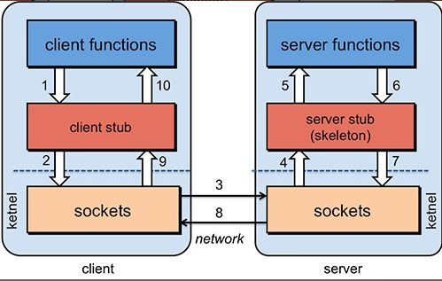

## RPC 框架

### RPC 基础、原理？

`RPC (Remote Procedure Call)` 即远程过程调用。

#### 为什么要用 RPC ？

不同服务器上的服务提供的方法不在同一个内存空间。

所以需要通过网络编程传递方法调用所需要的参数，以及接收方法调用的结果。

使用 `RPC` 方便我们进行远程方法的调用，不需要考虑底层的传输协议和序列化方式等。

#### RPC 的原理？

`RPC` 由这几部分组成

* 客户端 (服务消费端)：调用远程方法的一端。
* 客户端 `Stub (桩)`：代理类。把需要调用的方法、参数等信息传递到服务器端。
* 网络传输：传输方法、参数到服务端；传输返回结果到客户端。可以使用 `Socket` 或 `Netty`。
* `服务端 Stub (桩)`：不是代理类，是接收到客户端执行方法的请求后，去指定对应的方法并返回结果给客户端的类。
* 服务端 (服务提供端)：提供远程方法的一端。




执行流程：

1. **客户端** (`client`) 以本地调用的方式调用远程服务。
2. **客户端桩** (`client stub`)
   1. 接收到调用后，将方法、参数等组装成能进行网络传输的消息体，即生成 `RpcRequest`，并将其序列化。
   2. 找到远程服务的地址，并将消息发送到**服务端**。
3. **服务端桩**
   1. 收到消息后将消息反序列化为 `Java` 对象，即 `RpcRequest`。
   2. 根据 `RpcRequest` 中的类、方法和参数等信息调用本地方法。
   3. 得到方法执行结果，组装成 `RpcResponse` 序列化之后发送给**客户端**。
4. **客户端**接收到消息，将消息反序列化为 `RpcResponse` 得到执行结果。

#### 如何设计一个 RPC 框架？


---

一个基本的 `RPC 框架` 需要：

##### 1. 注册中心

一般使用 `Zookeeper`、`Nacos`。

注册中心负责服务地址的注册与查找，相当于目录服务。

服务端启动后将自身的服务名称及对应的地址 (`ip + port`) 注册到注册中心。

客户端根据服务名称找到对应的服务地址，对服务端发起网络请求。

调用关系：

1. 服务容器启动和加载服务端。
2. 服务端 (服务提供者) 启动后，向注册中心注册自己的服务。
3. 客户端 (消费者) 启动后，向注册中心订阅自己所需的服务。
4. 注册中心返回服务地址列表给客户端，如有变更，注册中心将推送变更数据给客户端。
5. 客户端从服务地址列表中，基于负载均衡算法选择一个地址发起调用，如果调用失败再换一个。
6. 客户端和服务端，在内存中记录调用次数和调用时间，定时发送到监控中心。

##### 2. 网络传输

通过发送网络请求来传递目标类、方法的信息和方法的参数等信息到服务端。

Socket、Netty

##### 3. 序列化和反序列化

发送端将对象转化为二进制数据在网络中传输，接收端收到后将其转换为 Java 对象。

Java 自带 `Serializable` 接口。

比较常用 hessian、kyro。

##### 4. 动态代理

当调用远程方法时，实际会通过代理对象来传输网络请求。

##### 5. 负载均衡

避免单个服务器响应过多请求导致宕机、崩溃等问题。

##### 6. 传输协议

设计一个私有的 RPC 协议，提供给客户端和服务端进行交流。

### Socket 网络通信

#### 什么是 `Socket`？

Socket 是一个抽象概念。应用程序可以通过 Socket 将数据在网络中传输。

Socket 是 IP 与端口号的组合 (`IP` 地址`:`端口号)。

要让客户端和服务端进行网络通信，需要一对 Socket。

运行在服务器端的 Server Socket。运行在客户端的 Client Socket。

#### `Socket` 通信过程？


---

简单流程：

1. 启动服务端，开始监听客户端请求。
2. 客户端发起请求，服务端和客户端建立连接。
3. 进行数据传输。
4. 关闭连接。

具体流程：

1. **服务端**创建 `ServerSocket` 对象并且绑定 `ip` 和 `port`。通过 `accept()` 方法监听客户端请求。
2. **客户端**创建 `Socket` 对象并且向指定服务器的 `ip` 和 `port` 发起连接。
3. 连接建立后，**客户端**通过输出流向服务器发送请求，**服务端**通过输入流读取客户端的请求。
4. **服务端**通过输出流向客户端发送响应信息。**客户端**通过输入流接收响应信息。
5. 双方都关闭资源。

#### Socket 的缺点？

使用 `BIO` 的话，一个线程只能处理一个客户端请求。

直接使用 `NIO` 编码非常繁琐，建议使用基于 `NIO` 的网络编程框架 `Netty`。

### Netty 网络通信

`Netty` 是一个基于 `NIO` 的 `client-server` 框架，可以简化网络应用程序的开发。

#### 用 Netty 可以做什么？

1. 作为 `RPC` 框架的网络通信工具。
2. 用于实现基本的 `HTTP` 服务器。
3. 用于实现即时通讯系统。

`Dubbo`、`RocketMQ`、`Elasticsearch` 都用到了 `Netty`。

#### Netty 的优点？

**并发高：**

`Netty` 是基于 `NIO (Nonblocking I/O)` 开发的同步非阻塞网络通信框架。

如果使用 `BIO` 模型，在服务端和客户端建立连接后，等待客户端发送数据这个过程是阻塞的，一个线程只能处理一个请求。

如果使用 `NIO` 模型，服务端会将请求交给 `Selector`，通过选择器监听多个 `Socket` 如果数据到达就返回数据处理再发送给客户端。这样就能让一个线程处理多个请求。

**传输快：**

`Netty` 传输快也是依赖了 `NIO` 的一个特性——*零拷贝*。

// TODO

一般数据如果需要通过 `IO` 读取到堆内存，中间需要经过 `Socket` 缓冲区，一个数据会被拷贝两次才能到达他的的终点，如果数据量大，会造成大量资源浪费。

使用 NIO后，需要接收数据时，会在堆内存之外开辟一块内存，数据就直接通过 `IO` 读到了那块内存中，`Netty` 可以通过 `ByteBuf` 可以直接对这些数据进行操作，从而加快了传输速度。

**封装好**


#### Netty 核心组件？


---

##### Bytebuf (字节容器)

网络通信最终都是通过字节流进行传输的。

`ByteBuf` 就是 `Netty` 提供的一个字节容器，内部是一个字节数组。

##### Bootstrap 和 ServerBootstrap (启动引导类)

客户端启动引导类 `Bootstrap`

```java
// Bootstrap 只需要配置一个线程组发送请求
EventLoopGroup group = new NioEventLoopGroup();
try {
    // 创建客户端启动引导类
    Bootstrap b = new Bootstrap();
    // 指定线程模型
    b.group(group).(...);
    // 使用 connect() 方法尝试连接到远程主机的端口号上作为 TCP 通信中的客户端
    // 也可以使用 bind() 方法绑定一个本地端口，作为 UDP 通信中的一端
    ChannelFuture f = b.connect(host, port).sync();
    f.channel().closeFuture().sync();
} finally {
    // 关闭相关线程组资源
    group.shutdownGracefully();
}
```

服务端启动引导类 `ServerBootstrap`

```java
// ServerBootstrap 需要配置两个线程组
// bossGroup 用于接收连接; workerGroup 用于具体的 IO 处理
EventLoopGroup bossGroup = new NioEventLoopGroup(1);
EventLoopGroup workerGroup = new NioEventLoopGroup();
try {
    // 2.创建服务端启动引导类
    ServerBootstrap b = new ServerBootstrap();
    // 3.给引导类配置两大线程组, 确定了线程模型
    b.group(bossGroup, workerGroup).(...);
    // 使用 bind() 方法绑定本地端口，等待客户端的连接
    ChannelFuture f = b.bind(port).sync();
    // 等待连接关闭
    f.channel().closeFuture().sync();
} finally {
    // 7.关闭相关线程组资源
    bossGroup.shutdownGracefully();
    workerGroup.shutdownGracefully();
}
```

##### Channel (网络操作抽象类)

`Channel` 为 `Netty` 网络操作 (读写等操作) 的抽象类。通过 `Channel` 可以进行 `I/O` 操作。

当客户端成功连接服务端，服务端就会新建一个 `Channel` 与该客户端绑定。

比较常用的是 `NioServerSocketChannel` (服务端) 和 `NioSocketChannel` (客户端)。

> 可以把 `Channel` 看做一个客户端和服务端之间的连接。

```java
// 通过 Bootstrap 的 connect 方法连接到服务端
public Channel doConnect(InetSocketAddress inetSocketAddress) {
    CompletableFuture<Channel> completableFuture = new CompletableFuture<>();
    bootstrap.connect(inetSocketAddress).addListener((ChannelFutureListener) future -> {
        if (future.isSuccess()) {
            completableFuture.complete(future.channel());
        } else {
            throw new IllegalStateException();
        }
    });
    return completableFuture.get();
}
```

##### EventLoop (事件循环)

负责监听注册到 `EventLoop` 上的 `Channel`，与 `Channel` 配合进行 `I/O` 操作。

一般一个 `EventLoop` 关联一个线程，该线程处理注册在该 `EventLoop` 上的 `Channel` 的所有事件和任务。

> 可以把一个 EventLoop 看做一个处理 I/O 操作的线程。

##### EventLoopGroup (事件循环组)

`EventLoopGroup` 包含多个 `EventLoop`，管理这些 `EventLoop` 的生命周期。

> 可以把一个 EventLoopGroup 看做线程组。其中管理着多个线程。


---

##### ChannelHandler (消息处理器) 和 ChannelPipeline (消息流水线)

`ChannelHandler` 是消息的具体处理器，负责处理客户端/服务端接收和发送数据。

当 `Channel` 被创建时，会自动分配到一个专属的 `ChannelPipline`。

一个 `ChannelPipline` 上可以有多个 `ChannelHandler`。当一个 `ChannelHandler` 处理完之后就会将数据交给下一个 `ChannelHandler`。


##### ChannelFuture (操作执行结果)

`Netty` 中的所有 `I/O` 操作都为异步的，不能立刻得到操作是否执行成功。

可以通过 `ChannelFuture` 接口的 `addListener()` 方法注册一个 `ChannelFutureListener`，该监听器会自动返回结果。


#### Reactor 线程模型？

经典的线程模型，基于事件驱动，采用多路复用将事件分发给相应的 Handler 处理，适合处理 I/O 较多的场景。

分为单线程模型、多线程模型和主从多线程模型。

##### 单线程 Reactor

**连接请求** (OP_ACCEPT) 和**处理 I/O 操作** (OP_READ/OP_WRITE) 都由同一个 NIO 线程完成。

系统资源消耗小，但无法支撑大量请求。


##### 多线程 Reactor

一个线程负责接收**连接请求**，一组 NIO 线程负责**处理 IO 操作**。

因为只有一个线程处理连接，当并发连接数较多时，会存在性能问题。


##### 主从多线程 Reactor

一组 NIO 线程负责**连接请求**，一组 NIO 线程**处理 IO 操作**。


#### Netty 线程模型？

网络框架基本都是基于 Reactor 模式设计开发的。

对应 Reactor 模式的三种线程模型。


#### 什么是 TCP 沾包/拆包？怎么解决？

基于 TCP 发送数据的时候，出现了多个字符串 “粘” 在一起或者一个字符串被 “拆” 开的问题。

对于粘包和拆包问题，常见的解决方案有四种：

- 发送端将每个包都封装成固定的长度，比如100字节大小。如果不足100字节可通过补0或空等进行填充到指定长度;
- 发送端在每个包的末尾使用固定的分隔符，例如\r\n。如果发生拆包需等待多个包发送过来之后再找到其中的\r\n进行合并;例如，FTP协议;
- 将消息分为头部和消息体，头部中保存整个消息的长度，只有读取到足够长度的消息之后才算是读到了一个完整的消息;
- 通过自定义协议进行粘包和拆包的处理。

Netty

* 使用 Netty 自带的解码器。
* 自定义序列化解码器。

#### Netty 长连接/短连接？

TCP 建立连接需要三次握手，释放连接需要四次挥手，这个过程比较消耗网络资源。

* **长连接**

  客户端和服务端建立连接后，连接不会主动关闭。如果客户端频繁请求资源，非常适合。

* **短连接**

  客户端和服务端建立连接后，完成一次请求就关闭连接，下一次请求需要重新连接。频繁建立/关闭连接比较浪费资源。

#### Netty 心跳机制？

在 TCP 保持长连接的过程中，可能会出现网络中断等网络异常。发生异常的时候，客户端和服务端之间如果没有交互的话，它们是无法发现对方已经掉线的。为了解决这个问题，需要引入**心跳机制**。

客户端和服务端之间在一定时间内没有数据交互时，即处于空闲状态时，客户端或服务端就会发送一个特殊的数据包给对方，接收方收到这个数据包后，也会立即发送一个特殊的数据包来回应发送方。所以，当某一端收到新天消息后，就知道了对方仍然在线，确保了 TCP 连接的有效性。

TCP 自带有长连接选项 (`SO_KEEPALIVE`)，但是 TCP 层面的长连接灵活性不够，一般会在应用层协议上实现自定义心跳机制。即在 Netty 中通过编码实现，核心类是 `IdleStateHandler`。


#### 如何使用 Netty 传输对象？

##### 定义传输实体类

定义客户端与服务端进行交互的实体类。

客户端将 `RpcRequest` 类型的对象发送给服务端，服务端处理后，返回 `RpcResponse` 类型的对象给客户端。

##### 初始化客户端

创建一个 client 类


通过 `sendMessage()` 方法将 `RpcRequest` 对象发送给服务端。

`sendMessage()` 过程：

1. 首先初始化了一个 Bootstrap。
2. 通过 Bootstrap 对象连接服务端。
3. 通过 Channel 向服务端发送消息 RpcRequest。
4. 发送成功后，阻塞等待，知道 Channel 关闭。
5. 拿到服务端返回的结果 RpcResponse。


