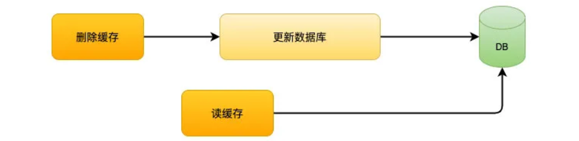
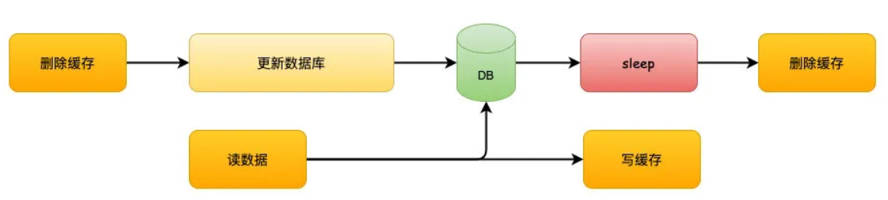
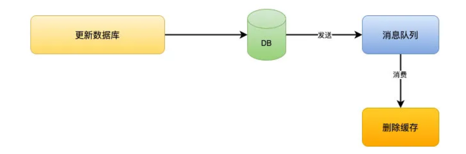
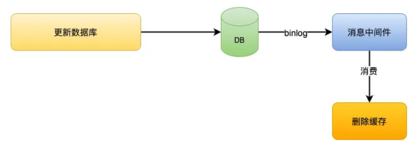

## Redis

内存数据库，`Key-Value` 数据库。

`Redis` 除了做缓存之外，也经常用来做分布式锁，甚至是消息队列。

`Redis` 提供了多种数据类型来支持不同的业务场景。`Redis` 还支持事务 、持久化、`Lua` 脚本、多种集群方案。

### 为什么要用 `Redis` / 缓存？

**高性能**：

把用户访问频率较高的数据放在 `Redis` 中，可以提高读取速度。

**高并发**：

一般像 `MySQL` 这类的数据库的 `QPS` 大概都在 `1w` 左右 (4 核 8g)，但是使用 `Redis` 缓存之后很容易达到 `10w+`，`redis` 集群会更高。

> QPS (Query Per Second)：服务器每秒可以执行的查询次数；

直接操作缓存能够承受的数据库请求数量是远远大于直接访问数据库的，所以如果把数据库中的部分数据转移到缓存中去，用户的一部分请求会直接到缓存而不用经过数据库。提高了系统整体的并发。

### `Redis` 除了做缓存，还能做什么？

- **分布式锁**： 通过 `Redis` 来做分布式锁是一种比较常见的方式。通常情况下，我们都是基于 `Redisson` 来实现分布式锁。相关阅读：[《分布式锁中的王者方案 - Redisson》open in new window](https://mp.weixin.qq.com/s/CbnPRfvq4m1sqo2uKI6qQw)。
- **限流**：一般是通过 `Redis + Lua` 脚本的方式来实现限流。相关阅读：[《我司用了 6 年的 Redis 分布式限流器，可以说是非常厉害了！》open in new window](https://mp.weixin.qq.com/s/kyFAWH3mVNJvurQDt4vchA)。
- **消息队列**：`Redis` 自带的 `list` 数据结构可以作为一个简单的队列使用。`Redis 5.0` 中增加的 `Stream` 类型的数据结构更加适合用来做消息队列。它比较类似于 `Kafka`，有主题和消费组的概念，支持消息持久化以及 `ACK` 机制。
- **复杂业务场景**：通过 `Redis` 以及 `Redis` 扩展 (比如 `Redisson`) 提供的数据结构，我们可以很方便地完成很多复杂的业务场景比如通过 `bitmap` 统计活跃用户、通过 `sorted set` 维护排行榜。

### `Redis` 常见数据结构？

#### **string**

`string` 数据结构是简单的 `key-value` 类型。

 一般常用在需要计数的场景，比如用户的访问次数、热点文章的点赞转发数量等等。

#### **list**

`Redis` 的 `list` 是由 **双向链表** 实现的，可以支持反向查找和遍历，更方便操作，不过带来了部分额外的内存开销。

发布与订阅或者消息队列、慢查询。

#### **hash**

`hash` 类似于 `JDK1.8` 前的 `HashMap`，内部实现使用 (数组 + 链表)。

`hash` 是一个 `string` 类型的 `field` 和 `value` 的映射表，**适合用于存储对象**。 

可以使用 `hash` 来存储用户信息，商品信息等等。

#### **set**

`set` 类似于 `Java` 中的 `HashSet`。基于 `set` 很容易实现交集、并集、差集的操作。

可以方便实现共同关注、共同粉丝、共同喜好等功能。这个过程也就是求交集的过程。

#### **sorted set**

和 `set` 相比，`sorted set` 增加了一个权重参数 `score`，使得集合中的元素能够按 `score` 进行有序排列，还可以通过 `score` 的范围来获取元素的列表。

> 像 `Java` 中 `HashMap` 和 `TreeSet` 的结合体。

用于需要对数据根据某个权重进行排序的场景。

例如直播系统中的实时排行信息，各种礼物排行榜，弹幕消息等。

#### **bitmap**

`bitmap` 存储的是连续的二进制数字 (`0` 和 `1`)，通过 `bitmap`，只需要一个 `bit` 位来表示某个元素对应的值或者状态，极大的节省储存空间。

适合需要保存状态信息 (比如是否签到、是否登录...) 并需要进一步对这些信息进行分析的场景。

例如用户签到情况、活跃用户情况、用户行为统计 (是否点赞过某个视频...)。

### Redis数据结构实际用途

#### 怎么做限流？

### Redis 线程模型？

#### Redis 单线程模型？

`Redis` 基于 `Reactor` 模式来设计开发了一套高效的事件处理模型，这套事件处理模型对应的是 `Redis` 中的文件事件处理器 (`file event handler`)。由于文件事件处理器是单线程方式运行的，所以一般都说 `Redis` 是单线程模型。

#### 单线程模型怎么监听大量的客户端连接？

`Redis` 的文件事件处理器基于 `I/O` 多路复用模型，通过使用 `Selector`，来同时监听多个 `socket`，并根据 `socket` 目前执行的任务来关联不同的事件处理器。

文件事件处理器主要包含 4 个部分：

- 监听多个 socket（客户端连接）
- IO 多路复用程序（支持多个客户端连接的关键）
- 文件事件分派器（将 socket 关联到相应的事件处理器）
- 事件处理器（连接应答处理器、命令请求处理器、命令回复处理器）

#### Redis6.0 之前为什么不使用多线程、之后为什么引入多线程？

不使用：

1. 单线程编程容易并且更容易维护；
2. `Redis` 的性能瓶颈不在 `CPU`，主要在内存和网络；
3. 多线程就会存在死锁、线程上下文切换等问题，甚至会影响性能。

使用：

引入多线程主要是为了提高网络 `IO` 读写性能。

### Redis 内存管理

#### 为什么要给数据设置过期时间？

内存有限，一直保存可能会 `OOM`。

有业务场景需要某个数据只在某一时间段内存在，比如短信验证码、用户登录的 `token`。

#### Redis 是如何判断数据是否过期？

`Redis` 中有 `redisDb` 这个数据结构，其中存放着 `expires` 过期字典 (可以看作是 `hash` 表) 来保存数据过期的时间。

过期字典的键指向 `Redis` 数据库中的某个 `key`，过期字典的值是一个 `long long` 类型的整数，这个整数保存了 `key` 所指向的数据库键的过期时间 (毫秒精度的 `UNIX` 时间戳)。

#### 过期的数据的删除策略？

1. **惰性删除** ：只在取出 `key` 的时候才对数据进行过期检查。这样对 `CPU` 最友好，但是可能会造成太多过期 `key` 没有被删除。
2. **定期删除** ：每隔一段时间抽取一批 `key` 执行删除过期 `key` 操作。并且，`Redis` 底层会通过限制删除操作执行的时长和频率来减少删除操作对 `CPU` 的影响。

**定期删除**对内存更加友好，**惰性删除**对 `CPU` 更加友好。两者各有千秋，所以 `Redis` 采用的是 **定期删除+惰性删除** 。

可能存在定期删除和惰性删除漏掉了很多过期 `key` 的情况。这样就导致大量过期 `key` 堆积在内存里，然后就 `OOM` 了。所以需要内存淘汰机制。

#### Redis 内存淘汰机制？

1. **volatile-lru (least recently used)**：从已设置过期时间的数据 (server.db[i].expires) 中挑选**最近最少使用**的数据淘汰。
2. **volatile-ttl**：从已设置过期时间的数据中挑选**将要过期**的数据淘汰。
3. **volatile-random**：从已设置过期时间的数据中挑选**任意**数据淘汰。
4. ***allkeys-lru (least recently used)**：当内存不足时，从所有数据 (server.db[i].dict) 中挑选**最近最少使用**的数据淘汰。用的最多。
5. **allkeys-random**：从所有数据中挑选**任意**数据淘汰。
6. **no-eviction**：**禁止淘汰**数据，当内存不足以容纳新写入数据时会报错。

`4.0` 版本后增加以下两种：

1. **volatile-lfu (least frequently used)**：从已设置过期时间的数据中挑选**最不经常使用**的数据淘汰。
2. **allkeys-lfu (least frequently used)**：当内存不足时，挑选**最不经常使用**的数据淘汰。

### Redis 持久化机制

#### 怎么保证 Redis 挂掉之后再重启数据可以进行恢复？

持久化 `Redis` 数据。

**RDB 持久化：**

`Redis` 通过创建快照来获得存储在内存里面的数据在某个时间点上的副本。

可以将快照复制到其他服务器从而创建具有相同数据的服务器副本，还可以将快照留在原地以便重启服务器的时候使用。

**AOF 持久化：**

开启 `AOF` 持久化后每执行一条会更改 `Redis` 中的数据的命令，`Redis` 就会将该命令写入到内存缓存 `server.aof_buf` 中，然后再根据 `appendfsync` 配置来决定什么时候将其同步到硬盘中的 `AOF` 文件 `appendonly.aof`。

### Redis 事务

1. 开始事务 (`MULTI`)。
2. 命令入队 (批量操作 `Redis` 的命令，先进先出的顺序执行)。
3. 执行事务 (`EXEC`)。

不支持事务的原子性，执行过的命令不会被回滚。

### Redis 性能优化

* 避免写入 `bigkey`。内存空间消耗大。

  使用 `--bigkeys` 可以查找。

  > string 类型的 value 超过 10 kb，复合类型的 value 包含的元素超过 5000 个。

* 避免大量 `key` 集中过期。`redis` 会因为清理过期 `key`，导致不能及时处理客户端请求。

  给 `key` 设置随机过期时间。开启 `lazy-free`，将清理过期 `key` 的任务交给子线程操作。

#### 大Key 的影响？

redis 在 6.0 之前使用的还是基于 Reactor 的单线程模型，理论上处理请求还是串行的，处理 大key 数据比较耗时就会影响到后续的请求。如果 大Key 也是热Key 的话，读取操作频繁，影响会很大。

#### 大Key 的解决方法？

加监控提醒。

Unlink 异步的方式删除大 Key。

对于 String 这种不好拆分的类型，使用序列化压缩，但是序列化反序列化也会存在一定耗时。

对于 hash， set，zset，list 中存储过多的元素，可以进行拆分分片。

### Redis 生产问题

#### 缓存穿透

当用户访问的数据，**既不在缓存中，也不在数据库中**，导致请求在访问缓存时，发现缓存缺失，再去访问数据库时，发现数据库中也没有要访问的数据，没办法构建缓存数据，来服务后续的请求。那么当有大量这样的请求到来时，数据库的压力骤增。

缓存穿透的发生一般有这两种情况：

- 业务误操作，缓存中的数据和数据库中的数据都被误删除了，所以导致缓存和数据库中都没有数据；
- 黑客恶意攻击，故意大量访问某些读取不存在数据的业务；

应对缓存穿透的方案，常见的方案有三种：

- **参数校验。**

  不合法的参数直接抛出异常信息给客户端。

- **缓存无效 `key`。**

  如果缓存和数据库都查不到某个 `key`，就把这个 `key` 写到 `Redis` 中并设置过期时间。这种方式可以解决请求的 `key` 变化不频繁的情况。如果遭到恶意攻击，每次构建不同的请求 `key`，会导致 `Redis` 中缓存大量无效的 `key`。

* 布隆过滤器可以快速判断一个元素是否存在。

  **布隆过滤器判断某个元素存在，小概率会误判。布隆过滤器判断某个元素不在，那么这个元素一定不在。**

  把所有可能存在的请求的值都存放在布隆过滤器中，先判断客户端发来的请求的值是否存在于布隆过滤器中。不存在的话，直接返回请求参数错误信息，存在的话再继续去缓存和数据库中寻找数据。

#### 缓存击穿

如果缓存中的**某个热点数据过期**了，此时大量的请求访问了该热点数据，就无法从缓存中读取，直接访问数据库，数据库很容易就被高并发的请求冲垮，这就是**缓存击穿**的问题。

- 互斥锁方案，保证同一时间只有一个业务线程更新缓存，未能获取互斥锁的请求，要么等待锁释放后重新读取缓存，要么就返回空值或者默认值。
- **不给热点数据设置过期时间**，由后台异步更新缓存，或者在热点数据准备要过期前，提前通知后台线程更新缓存以及重新设置过期时间；

#### 缓存雪崩

缓存在同一时间大面积的失效，请求直接落到了数据库上，造成数据库短时间内承受大量请求。

解决办法：

* **针对 `Redis` 服务不可用的情况：**
  1. 采用 `Redis` 集群，避免单机出现问题整个缓存服务都没办法使用。
  2. 限流，避免同时处理大量的请求。

* **针对热点缓存失效的情况：**
  1. 设置不同的失效时间 (随机设置缓存失效时间)。
  2. 热点数据缓存永不失效。
  3. 在缓存失效后，通过加锁或者队列来控制读数据库写缓存的线程数量。⽐如对某个key 只允许⼀个线程查询数据和写缓存，其他线程等待。 
  4. 做⼆级缓存，A1为原始缓存，A2为拷贝缓存，A1失效时，可以访问A2，A1缓存失效时 间设置为短期，A2设置为长期

#### 如何保证缓存和数据库数据的一致性？

##### 先删缓存，再更新数据库

先删除缓存，数据库还没有更新成功，此时如果读取缓存，缓存不存在，去数据库中读取到的是旧值，缓存不一致发生。

##### 延时双删

延时双删的方案的思路是，为了避免更新数据库的时候，其他线程从缓存中读取不到数据，就在更新完数据库之后，再sleep一段时间，然后再次删除缓存。

sleep的时间要对业务读写缓存的时间做出评估，sleep时间大于读写缓存的时间即可。

流程如下：

1. 线程1删除缓存，然后去更新数据库
2. 线程2来读缓存，发现缓存已经被删除，所以直接从数据库中读取，这时候由于线程1还没有更新完成，所以读到的是旧值，然后把旧值写入缓存
3. 线程1，根据估算的时间，sleep，由于sleep的时间大于线程2读数据+写缓存的时间，所以缓存被再次删除
4. 如果还有其他线程来读取缓存的话，就会再次从数据库中读取到最新值

##### 先更新数据库，再删除缓存

如果反过来操作，先更新数据库，再删除缓存呢？

这个就更明显的问题了，更新数据库成功，如果删除缓存失败或者还没有来得及删除，那么，其他线程从缓存中读取到的就是旧值，还是会发生不一致。

##### 消息队列

这是网上很多文章里都有写过的方案。但是这个方案的缺陷会更明显一点。

先更新数据库，成功后往消息队列发消息，消费到消息后再删除缓存，借助消息队列的重试机制来实现，达到最终一致性的效果。

这个解决方案其实问题更多。

1. 引入消息中间件之后，问题更复杂了，怎么保证消息不丢失更麻烦
2. 就算更新数据库和删除缓存都没有发生问题，消息的延迟也会带来短暂的不一致性，不过这个延迟相对来说还是可以接受的

##### 进阶版消息队列

为了解决缓存一致性的问题单独引入一个消息队列，太复杂了。

其实，一般大公司本身都会有监听binlog消息的消息队列存在，主要是为了做一些核对的工作。

这样，我们可以借助监听binlog的消息队列来做删除缓存的操作。这样做的好处是，不用你自己引入，侵入到你的业务代码中，中间件帮你做了解耦，同时，中间件的这个东西本身就保证了高可用。

当然，这样消息延迟的问题依然存在，但是相比单纯引入消息队列的做法更好一点。

而且，如果并发不是特别高的话，这种做法的实时性和一致性都还算可以接受的。

## 其他解决方案

### 设置缓存过期时间

每次放入缓存的时候，设置一个过期时间，比如5分钟，以后的操作只修改数据库，不操作缓存，等待缓存超时后从数据库重新读取。

如果对于一致性要求不是很高的情况，可以采用这种方案。

这个方案还会有另外一个问题，就是如果数据更新的特别频繁，不一致性的问题就很大了。

在实际生产中，我们有一些活动的缓存数据是使用这种方式处理的。

因为活动并不频繁发生改变，而且对于活动来说，短暂的不一致性并不会有什么大的问题。

## 为什么是删除，而不是更新缓存？

我们以**先更新数据库，再删除缓存**来举例。

如果是更新的话，那就是**先更新数据库，再更新缓存**。

举个例子：如果数据库1小时内更新了1000次，那么缓存也要更新1000次，但是这个缓存可能在1小时内只被读取了1次，那么这1000次的更新有必要吗？

反过来，如果是删除的话，就算数据库更新了1000次，那么也只是做了1次缓存删除，只有当缓存真正被读取的时候才去数据库加载。

## 总结

首先，我们要明确一点，缓存不是更新，而应该是删除。

删除缓存有两种方式：

1. 先删除缓存，再更新数据库。解决方案是使用延迟双删。
2. 先更新数据库，再删除缓存。解决方案是消息队列或者其他binlog同步，引入消息队列会带来更多的问题，并不推荐直接使用。

针对缓存一致性要求不是很高的场景，那么只通过设置超时时间就可以了。

其实，如果不是很高的并发，无论你选择先删缓存还是后删缓存的方式，都几乎很少能产生这种问题，但是在高并发下，你应该知道怎么解决问题。

### 缓存读写策略？

#### Cache Aside Pattern (旁路缓存模式)

适合读请求较多的场景

写：

* 先更新 DB。
* 再直接删除 cache。

读：

* 从 cache 中读取数据，读到就直接返回。
* cache 中读不到的话，从 DB 中读取数据返回。
* 再把数据放到 cache 中。

##### 在写数据的过程中，可以先删除 cache，后更新 DB 吗？

不可以。会造成数据库和缓存的数据不一致。

> 1. 写请求 1 先把 cache 中的数据 A 删除。
>
> 2. 读请求 2 发现 cache 中没有数据 A，就会去数据库中读取，读完之后会写入 cache。
> 3. 写请求 1 再把修改过的数据 A 写入到数据库。
>
> 很明显此时 cache 中是旧数据，数据库中是新数据，两者数据不一致。

##### 在写数据的过程中，如果程先更新数据库，后删除 cache，还会造成数据不一致吗？

理论上说是还会有的，但是概率比较小。因为缓存写入速度比数据库写入速度快很多。

> 1. 读请求 1 从数据库中读数据 A。
> 2. 写请求 2 在数据库中更新数据 A，并删除 cache 中的数据 A。
> 3. 读请求 1 从将数据 A 写入 cache。
>
> 很明显此时 cache 中是旧数据，数据库中是新数据，两者数据不一致。

##### 旁路缓存缺陷

* 首次请求数据一定不在 cache。

  将热点数据提前放入 cache。

* 写操作比较频繁时，cache 中的数据会被频繁删除，影响缓存命中率。

  数据库和缓存强一致场景：更新数据库的同时也更新 cache，需要加锁来保证更新 cache 的时候不会产生线程安全问题。

  短暂允许数据库和缓存不一致的场景：更新数据库的时候也更新 cache，但是给 cache 中更新的数据加一个比较短的过期时间，即使数据不一致影响也比较小。

#### Read/Write Through Pattern (读写穿透)

读写穿透中，服务端把 cache 视为主要数据存储，从中读写数据。

其中 cache 负责对数据库进行读写 (Redis 没有提供写入数据库的功能)。

写：

* 先查 cache，cache 中不存在，直接更新数据库。
* cache 中存在，先更新 cache，cache 服务去更新数据库 (同步更新 cache 和数据库)。

读：

* 从 cache 中读取数据，读到直接返回。
* 读不到的话，先从数据库读取数据，将数据写入到 cache 后返回响应。

与旁路模式的不同就是，由 cache 服务来负责 cache 和数据库的读写，而不是客户端。

#### Write Behind Pattern (异步缓存写入)

读写穿透是同步更新 cache 和数据库。

**异步缓存写入**只更新缓存，不同步更新数据库。使用异步的方式批量更新数据库。

适合数据经常变化，但对数据一致性不那么高的场景。比如浏览量、点击量的更新。

### Redis 集群？

#### 主从复制

master 负责写请求，slave 负责读请求。

maser 发生宕机要手动将 slave 提升为 master，容易出错。

无法缓解写压力和存储压力。

#### Redis Sentinel

Redis 哨兵会对 运行的节点进行监控。当节点出现故障时，哨兵会自动将一台 slave 升级为 master。

哨兵本身是一个分布式系统，是高可用的。要通过分布式共识算法选出Leader 对外服务。

支持故障自动切换，耗费更多的服务器资源，无法缓解写压力和存储压力。不支持横向扩展。

#### Redis Cluster

如果写压力或者缓存的数据量太大的话，可以用Redis切片集群。

切片的redis实例都对外提供读写操作，缓存的数据会比较均匀的分布在这些实例上。

Redis Cluster 采用的是 虚拟槽分区，每个键值对都属于一个 hash slot。

假设一个集群由 3 个 Redis节点 组成，每个节点负责一部分数据。比如节点0负责0-100，101-200，201-300 的 hash slot。

可以横向扩展缓解写压力和存储压力。

