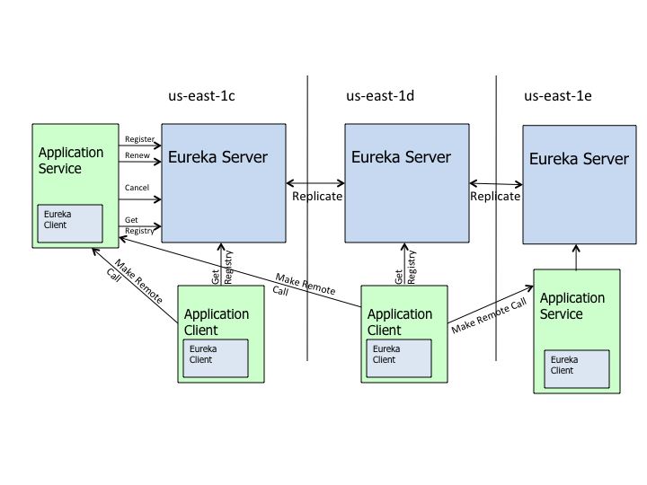
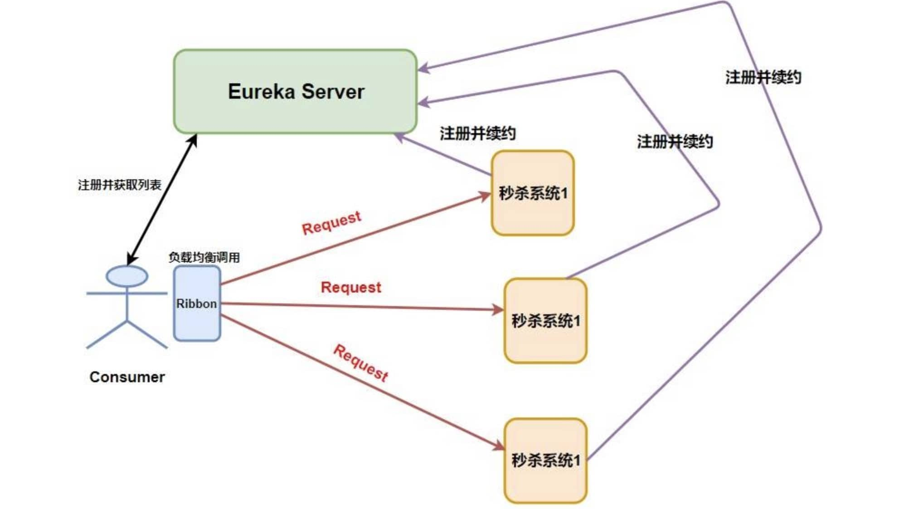
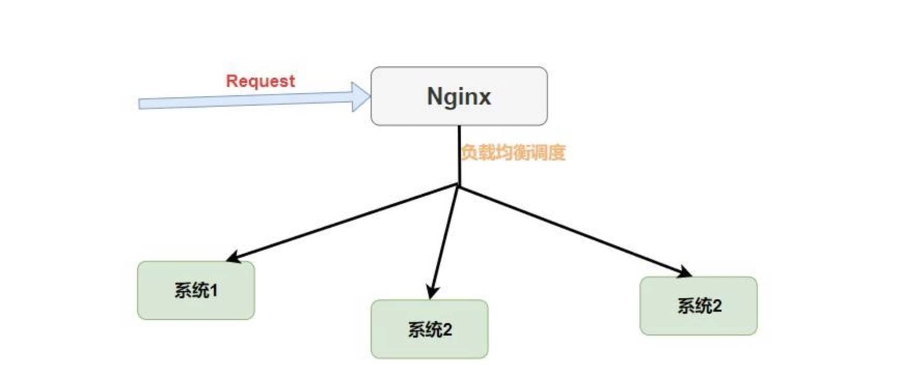
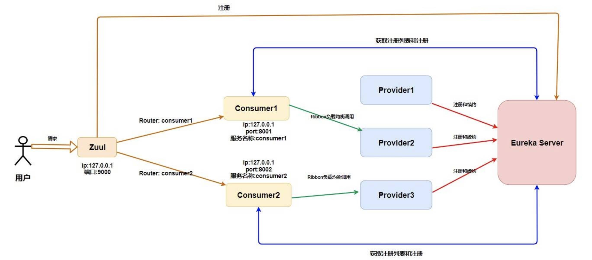
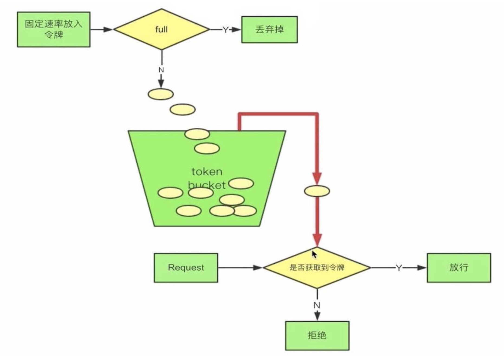
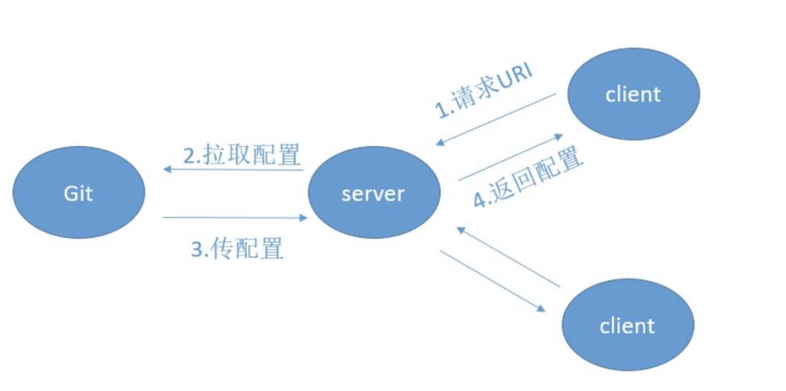

# Spring Cloud

微服务系统架构的一站式解决方案

## 服务发现框架 Eureka

### 服务注册 Register

Eureka 客户端向 Eureka 服务器提供自身的元数据，例如 IP 地址、端口等。

即将微服务注册在 Eureka 服务器中。

### 服务续约 Renew

提供微服务的**`Eureka` 客户端会每隔 30 秒 (默认情况下) 发送一次心跳来续约**。 通过续约来告知 `Eureka Server` 该 `Eureka` 服务仍然存在，没有出现问题。 正常情况下，如果 `Eureka Server` 在 90 秒没有收到 `Eureka` 客户端的续约，它会将实例从其注册表中删除。

### 获取注册列表信息 Fetch Registries

`Eureka` 客户端从服务器获取注册表信息，并将其缓存在本地。客户端会使用该信息查找服务，从而进行远程调用。该注册列表信息定期（每 30 秒钟）更新一次。每次返回注册列表信息可能与 `Eureka` 客户端的缓存信息不同, `Eureka` 客户端自动处理。如果由于某种原因导致注册列表信息不能及时匹配，`Eureka` 客户端则会重新获取整个注册表信息。 

### 服务下线 Cancel

Eureka 客户端在程序关闭时向 Eureka 服务器发送取消请求。发送请求后，该客户端实例信息将从服务器的实例注册表中删除。

### 服务剔除 Eviction

在默认的情况下，**当 Eureka 客户端连续 90 秒 (3 个续约周期) 没有向 Eureka 服务器发送服务续约，即心跳，Eureka 服务器会将该服务实例从服务注册列表删除**，即服务剔除。

## 负载均衡

### Ribbon

`Ribbon` 是 `Netflix` 公司的一个开源的 **负载均衡** 项目，是一个客户端/进程内负载均衡器，**运行在消费者端**。

消费者端首先到 注册中心 获取服务列表，在内部使用负载均衡算法，进行对多个系统的调用。

先进行了负载均衡，再发出 request 调用。

### Nginx

一种**集中式**的负载均衡器。

简单理解就是 **将所有请求都集中起来，然后再进行负载均衡**。

request 到达 Nginx 之后，集中进行负载均衡调度。

---

### 负载均衡算法

轮询、随机、先随机再重试。

## 远程过程调用 Open Feign

使服务间的调用像调用本地方法一样简单。

### Open Feign

...

## 熔断和降级 Hystrix

`Hystrix` 就是一个能进行 **熔断** 和 **降级** 的库，通过使用它能提高整个系统的弹性。

### 服务雪崩

例如，此时整个微服务系统是这样的。

服务 A 调用了服务 B，服务 B 再调用了服务 C，但是因为某些原因，服务 C 顶不住了，这个时候大量请求会在服务 C 阻塞。

服务 C 阻塞了还好，毕竟只是一个系统崩溃了。但是请注意这个时候因为服务 C 不能返回响应，那么服务 B 调用服务 C 的的请求就会阻塞，同理服务 B 阻塞了，那么服务 A 也会阻塞崩溃。

### 熔断

**熔断** 是服务雪崩的一种有效解决方案。当指定时间窗内的请求失败率达到设定阈值时，系统将通过 **断路器** 直接将此请求链路断开。

例如，服务 B 调用服务 C 在指定时间窗内，调用的失败率到达了一定的值，那么 `Hystrix` 则会自动将 服务 B 与 C 之间的请求都断了，以免导致服务雪崩现象。

Hystrix 的**断路器模式**。

### 降级

**降级是为了更好的用户体验，当一个方法调用异常时，通过执行另一种代码逻辑来给用户友好的回复**。

例如，系统推荐热点新闻给用户，用户会通过 id 去查询新闻的详情，但是因为这条新闻太火了，大量用户同时访问可能会导致系统崩溃，那么我们就进行 **服务降级** ，一些请求会做一些降级处理比如当前人数太多请稍后查看等等。

Hystrix 的**后备处理模式**。

## 微服务网关 Zuul

服务端如果没有统一的调用入口，不便于访问与管理。

网关是系统唯一对外的入口，介于客户端与服务器端之间，用于对请求进行**鉴权**、**限流**、 **路由**、**监控**等功能。

### 路由

---

### 过滤

实现 **限流**，**灰度发布**，**权限控制** 等等。

#### 令牌桶限流

---

首先我们会有个桶，如果里面没有满那么就会以一定 **固定的速率** 会往里面放令牌，一个请求过来首先要从桶中获取令牌，如果没有获取到，那么这个请求就拒绝，如果获取到那么就放行。

`Zuul` 作为网关肯定也存在 **单点问题** ，如果我们要保证 `Zuul` 的高可用，我们就需要进行 `Zuul` 的集群配置，这个时候可以借助额外的一些负载均衡器比如 `Nginx` 。

## 配置管理 Config

当我们的微服务系统开始慢慢地庞大起来，那么多 `Consumer` 、`Provider` 、`Eureka Server` 、`Zuul` 系统都会持有自己的配置，这个时候我们在项目运行的时候可能需要更改某些应用的配置，如果我们不进行配置的统一管理，我们只能**去每个应用下一个一个寻找配置文件然后修改配置文件再重启应用**。

---

使用 Spring Cloud Bus 可以动态刷新配置。