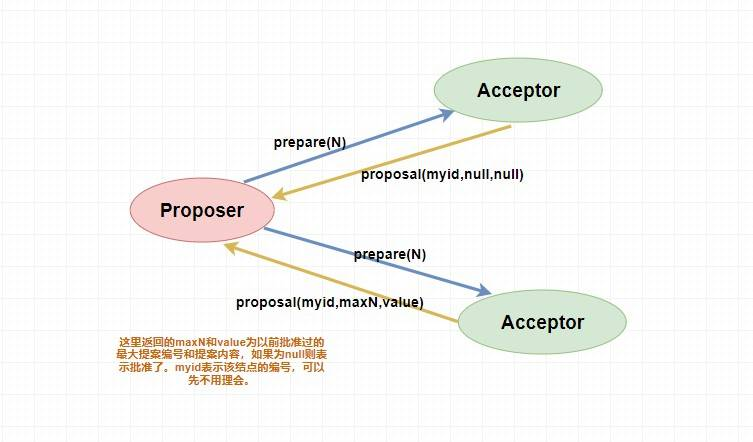
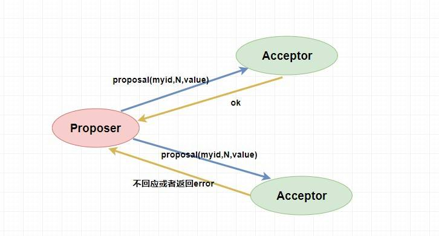
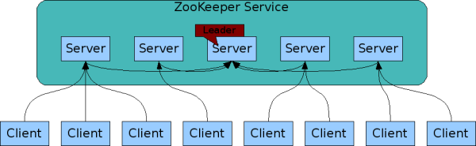

# 分布式

## 理论&算法&协议

### `Paxos` 算法

`Paxos` 算法是基于**消息传递且具有高度容错特性的一致性算法**，是目前公认的解决分布式一致性问题最有效的算法之一，**其解决的问题就是在分布式系统中如何就某个值（决议）达成一致** 。

在 `Paxos` 中主要有三个角色，分别为 `Proposer提案者`、`Acceptor表决者`、`Learner学习者`。`Paxos` 算法和 `2PC` 一样，也有两个阶段，分别为 `Prepare` 和 `accept` 阶段。

#### prepare 阶段

- `Proposer提案者`：负责提出 `proposal`，每个提案者在提出提案时都会首先获取到一个 **具有全局唯一性的、递增的提案编号N**，即在整个集群中是唯一的编号 N，然后将该编号赋予其要提出的提案，在**第一阶段是只将提案编号发送给所有的表决者**。
- `Acceptor表决者`：每个表决者在 `accept` 某提案后，会将该提案编号N记录在本地，这样每个表决者中保存的已经被 accept 的提案中会存在一个**编号最大的提案**，其编号假设为 `maxN`。每个表决者仅会 `accept` 编号大于自己本地 `maxN` 的提案，在批准提案时表决者会将以前接受过的最大编号的提案作为响应反馈给 `Proposer` 。

> 下面是 `prepare` 阶段的流程图，你可以对照着参考一下。

#### accept 阶段

当一个提案被 `Proposer` 提出后，如果 `Proposer` 收到了超过半数的 `Acceptor` 的批准（`Proposer` 本身同意），那么此时 `Proposer` 会给所有的 `Acceptor` 发送真正的提案（你可以理解为第一阶段为试探），这个时候 `Proposer` 就会发送提案的内容和提案编号。

表决者收到提案请求后会再次比较本身已经批准过的最大提案编号和该提案编号，如果该提案编号 **大于等于** 已经批准过的最大提案编号，那么就 `accept` 该提案（此时执行提案内容但不提交），随后将情况返回给 `Proposer` 。如果不满足则不回应或者返回 NO 。

当 `Proposer` 收到超过半数的 `accept` ，那么它这个时候会向所有的 `acceptor` 发送提案的提交请求。需要注意的是，因为上述仅仅是超过半数的 `acceptor` 批准执行了该提案内容，其他没有批准的并没有执行该提案内容，所以这个时候需要**向未批准的 `acceptor` 发送提案内容和提案编号并让它无条件执行和提交**，而对于前面已经批准过该提案的 `acceptor` 来说 **仅仅需要发送该提案的编号** ，让 `acceptor` 执行提交就行了。

而如果 `Proposer` 如果没有收到超过半数的 `accept` 那么它将会将 **递增** 该 `Proposal` 的编号，然后 **重新进入 `Prepare` 阶段** 。

> 对于 `Learner` 来说如何去学习 `Acceptor` 批准的提案内容，这有很多方式，读者可以自己去了解一下，这里不做过多解释。

#### `paxos` 算法的死循环问题

其实就有点类似于两个人吵架，小明说我是对的，小红说我才是对的，两个人据理力争的谁也不让谁🤬🤬。

比如说，此时提案者 P1 提出一个方案 M1，完成了 `Prepare` 阶段的工作，这个时候 `acceptor` 则批准了 M1，但是此时提案者 P2 同时也提出了一个方案 M2，它也完成了 `Prepare` 阶段的工作。然后 P1 的方案已经不能在第二阶段被批准了（因为 `acceptor` 已经批准了比 M1 更大的 M2），所以 P1 自增方案变为 M3 重新进入 `Prepare` 阶段，然后 `acceptor` ，又批准了新的 M3 方案，它又不能批准 M2 了，这个时候 M2 又自增进入 `Prepare` 阶段。。。

就这样无休无止的永远提案下去，这就是 `paxos` 算法的死循环问题。

那么如何解决呢？很简单，人多了容易吵架，我现在 **就允许一个能提案** 就行了。

### CAP 理论

**CAP** 包含 **Consistency（一致性）**、**Availability（可用性）**、**Partition Tolerance（分区容错性）**。

CAP 定理（CAP theorem）指出对于一个分布式系统来说，当设计读写操作时，只能同时满足以下三点中的两个：

- **一致性（Consistency）**: 所有节点访问同一份最新的数据副本
- **可用性（Availability）**: 非故障的节点在合理的时间内返回合理的响应（不是错误或者超时的响应）。
- **分区容错性（Partition tolerance）**: 分布式系统出现网络分区的时候，仍然能够对外提供服务。

> 多个节点之前的网络本来是连通的，但是因为某些故障（比如部分节点网络出了问题）某些节点之间不连通了，整个网络就分成了几块区域。

**分布式系统 只能选择 CP 或者 AP 架构。**

1. **ZooKeeper 保证的是 CP。**任何时刻对 ZooKeeper 的读请求都能得到一致性的结果，但是， ZooKeeper 不保证每次请求的可用性比如在 Leader 选举过程中或者半数以上的机器不可用的时候服务就是不可用的。
2. **Eureka 保证的则是 AP。**Eureka 在设计的时候就是优先保证 A（可用性）。在 Eureka 中不存在什么 Leader 节点，每个节点都是一样的、平等的。因此 Eureka 不会像 ZooKeeper 那样出现选举过程中或者半数以上的机器不可用的时候服务就是不可用的情况。 Eureka 保证即使大部分节点挂掉也不会影响正常提供服务，只要有一个节点是可用的就行了。只不过这个节点上的数据可能并不是最新的。
3. **Nacos 不仅支持 CP 也支持 AP。**

**选择 CP 还是 AP 的关键在于当前的业务场景，没有定论，比如对于需要确保强一致性的场景如银行一般会选择保证 CP 。**

#### 为什么不能选择 CA 架构呢？ 

举个例子：若系统出现“分区”，系统中的某个节点在进行写操作。为了保证 C， 必须要禁止其他节点的读写操作，这就和 A 发生冲突了。如果为了保证 A，其他节点的读写操作正常的话，那就和 C 发生冲突了。

### BASE 理论

**BASE** 包含 **Basically Available（基本可用）** 、**Soft-state（软状态）** 和 **Eventually Consistent（最终一致性）**。

**本质上是对 CAP 的延伸和补充，更具体地说，是对 CAP 中 AP 方案的一个补充。**

#### 1. 基本可用

基本可用是指分布式系统在出现不可预知故障的时候，允许损失部分可用性。

- **响应时间上的损失**: 正常情况下，处理用户请求需要 0.5s 返回结果，但是由于系统出现故障，处理用户请求的时间变为 3 s。
- **系统功能上的损失**：正常情况下，用户可以使用系统的全部功能，但是由于系统访问量突然剧增，系统的部分非核心功能无法使用。

####  2. 软状态

软状态指允许系统中的数据存在中间状态（**CAP 理论中的数据不一致**），并认为该中间状态的存在不会影响系统的整体可用性，即允许系统在不同节点的数据副本之间进行数据同步的过程存在延时。

#### 3. 最终一致性

最终一致性强调的是系统中所有的数据副本，在经过一段时间的同步后，最终能够达到一个一致的状态。因此，最终一致性的本质是需要系统保证最终数据能够达到一致，而不需要实时保证系统数据的强一致性。

##### 实现最终一致性的具体方式？

- **读时修复** : 在读取数据时，检测数据的不一致，进行修复。比如 Cassandra 的 Read Repair 实现，具体来说，在向 Cassandra 系统查询数据的时候，如果检测到不同节点 的副本数据不一致，系统就自动修复数据。
- **写时修复** : 在写入数据，检测数据的不一致时，进行修复。比如 Cassandra 的 Hinted Handoff 实现。具体来说，Cassandra 集群的节点之间远程写数据的时候，如果写失败 就将数据缓存下来，然后定时重传，修复数据的不一致性。
- **异步修复** : 这个是最常用的方式，通过定时对账检测副本数据的一致性，并修复。

## 分布式 ID

在分库之后， 数据遍布在不同服务器上的数据库，数据库的自增主键已经没办法满足生成的主键唯一了。**我们如何为不同的数据节点生成全局唯一主键呢？**

### 分布式 ID 需要满足哪些要求?

- **全局唯一** ：ID 的全局唯一性肯定是首先要满足的。
- **高性能** ： 分布式 ID 的生成速度要快，对本地资源消耗要小。
- **高可用** ：生成分布式 ID 的服务要保证可用性无限接近于 100%。
- **方便易用** ：拿来即用，使用方便，快速接入。

### 分布式 ID 常见解决方案

#### 数据库主键自增

- **优点** ：实现起来比较简单、ID 有序递增、存储消耗空间小
- **缺点** ： 支持的并发量不大、存在数据库单点问题（可以使用数据库集群解决，不过增加了复杂度）、ID 没有具体业务含义、安全问题（比如根据订单 ID 的递增规律就能推算出每天的订单量，商业机密啊！ ）、每次获取 ID 都要访问一次数据库（增加了对数据库的压力，获取速度也慢）。

#### 数据库号段模式

数据库主键自增这种模式，每次获取 ID 都要访问一次数据库，ID 需求比较大的时候，肯定是不行的。

如果我们可以批量获取，然后存在在内存里面，需要用到的时候，直接从内存里面拿。这也就是我们说的 **基于数据库的号段模式来生成分布式 ID。**

- **优点** ：ID 有序递增、存储消耗空间小
- **缺点** ：存在数据库单点问题（可以使用数据库集群解决，不过增加了复杂度）、ID 没有具体业务含义、安全问题（比如根据订单 ID 的递增规律就能推算出每天的订单量，商业机密啊！ ）

#### Redis 自增

- **优点** ： 性能不错并且生成的 ID 是有序递增的
- **缺点** ： 和数据库主键自增方案的缺点类似

#### UUID

- **优点** ：生成速度比较快、简单易用
- **缺点** ： 存储消耗空间大（32 个字符串，128 位） 、 不安全（基于 MAC 地址生成 UUID 的算法会造成 MAC 地址泄露)、无序（非自增）、没有具体业务含义、需要解决重复 ID 问题（当机器时间不对的情况下，可能导致会产生重复 ID）

#### 一些开源框架

......

## Dubbo

### RPC基础

远程过程调用...

### Dubbo 架构

Dubbo 是一个 RPC 框架。

#### Dubbo 架构中的核心角色有哪些？

---

- **Container：** 服务运行容器，负责加载、运行服务提供者。必须。
- **Provider：** 暴露服务的服务提供方，会向注册中心注册自己提供的服务。必须。
- **Consumer：** 调用远程服务的服务消费方，会向注册中心订阅自己所需的服务。必须。
- **Registry：** 服务注册与发现的注册中心。注册中心会返回服务提供者地址列表给消费者。非必须。
- **Monitor：** 统计服务的调用次数和调用时间的监控中心。服务消费者和提供者会定时发送统计数据到监控中心。 非必须。

#### Dubbo 中的 Invoker 概念了解么？

简单来说，`Invoker` 就是 Dubbo 对远程调用的抽象。

#### Dubbo 的工作原理了解么？

---

- **config 配置层**：Dubbo相关的配置。支持代码配置，同时也支持基于 Spring 来做配置，以 `ServiceConfig`, `ReferenceConfig` 为中心
- **proxy 服务代理层**：调用远程方法像调用本地的方法一样简单的一个关键，真实调用过程依赖代理类，以 `ServiceProxy` 为中心。
- **registry 注册中心层**：封装服务地址的注册与发现。
- **cluster 路由层**：封装多个提供者的路由及负载均衡，并桥接注册中心，以 `Invoker` 为中心。
- **monitor 监控层**：RPC 调用次数和调用时间监控，以 `Statistics` 为中心。
- **protocol 远程调用层**：封装 RPC 调用，以 `Invocation`, `Result` 为中心。
- **exchange 信息交换层**：封装请求响应模式，同步转异步，以 `Request`, `Response` 为中心。
- **transport 网络传输层**：抽象 mina 和 netty 为统一接口，以 `Message` 为中心。
- **serialize 数据序列化层** ：对需要在网络传输的数据进行序列化。

#### Dubbo 的 SPI 机制了解么？ 如何扩展 Dubbo 中的默认实现？

SPI（Service Provider Interface） 机制被大量用在开源项目中，它可以帮助我们动态寻找服务/功能（比如负载均衡策略）的实现。

SPI 的具体原理是这样的：我们将接口的实现类放在配置文件中，我们在程序运行过程中读取配置文件，通过反射加载实现类。这样，我们可以在运行的时候，动态替换接口的实现类。和 IoC 的解耦思想是类似的。

Java 本身就提供了 SPI 机制的实现。不过，Dubbo 没有直接用，而是对 Java原生的 SPI机制进行了增强，以便更好满足自己的需求。

#### Dubbo 的负载均衡策略

在集群负载均衡时，Dubbo 提供了多种均衡策略，默认为 `random` 随机调用。我们还可以自行扩展负载均衡策略（参考Dubbo SPI机制）。

##### RandomLoadBalance

根据权重随机选择（对加权随机算法的实现）。这是Dubbo默认采用的一种负载均衡策略。

`RandomLoadBalance` 具体的实现原理非常简单，假如有两个提供相同服务的服务器 S1,S2，S1的权重为7，S2的权重为3。

我们把这些权重值分布在坐标区间会得到：S1->[0, 7) ，S2->[7, 10)。我们生成[0, 10) 之间的随机数，随机数落到对应的区间，我们就选择对应的服务器来处理请求。

##### LeastActiveLoadBalance

**最小活跃数负载均衡**。

初始状态下所有服务提供者的活跃数均为 0（每个服务提供者的中特定方法都对应一个活跃数，我在后面的源码中会提到），每收到一个请求后，对应的服务提供者的活跃数 +1，当这个请求处理完之后，活跃数 -1。

因此，**Dubbo 就认为谁的活跃数越少，谁的处理速度就越快，性能也越好，这样的话，我就优先把请求给活跃数少的服务提供者处理。**

##### ConsistentHashLoadBalance

...

##### RoundRobinLoadBalance

加权轮询负载均衡。

#### Dubbo序列化协议

Dubbo 默认使用的序列化方式是 hessian2。

Kryo /krie/

一般我们不会直接使用 JDK 自带的序列化方式。主要原因有两个：

1. **不支持跨语言调用** : 如果调用的是其他语言开发的服务的时候就不支持了。
2. **性能差** ：相比于其他序列化框架性能更低，主要原因是序列化之后的字节数组体积较大，导致传输成本加大。

## 网关

微服务背景下，一个系统被拆分为多个服务，但是像安全认证，流量控制，日志，监控等功能是每个服务都需要的，没有网关的话，就需要在每个服务中单独实现，这使得系统做了很多重复的事情并且没有一个全局的视图来统一管理这些功能。

综上：**一般情况下，网关都会提供请求转发、安全认证（身份/权限认证）、流量控制、负载均衡、容灾、日志、监控这些功能。**

实际上，网关主要做了一件事情：**请求过滤** 。

## ZooKeeper

ZooKeeper 是一个开源的**分布式协调服务**，它的设计目标是将那些复杂且容易出错的分布式一致性服务封装起来，构成一个高效可靠的原语集，并以一系列简单易用的接口提供给用户使用。

**ZooKeeper 提供了高可用、高性能、稳定的分布式数据一致性解决方案，通常被用于实现诸如数据发布/订阅、负载均衡、命名服务、分布式协调/通知、集群管理、Master 选举、分布式锁和分布式队列等功能。**

另外，**ZooKeeper 将数据保存在内存中，性能是非常棒的。 在“读”多于“写”的应用程序中尤其地高性能，因为“写”会导致所有的服务器间同步状态。（“读”多于“写”是协调服务的典型场景）。**

> ZooKeeper 主要为 Kafka 提供 Broker 和 Topic 的注册以及多个 Partition 的负载均衡等功能。

**ZooKeeper 底层其实只提供了两个功能：① 管理（存储、读取）用户程序提交的数据；② 为用户程序提供数据节点监听服务。**

### ZooKeeper 特点

- **顺序一致性：**从同一客户端发起的事务请求，最终将会严格地按照顺序被应用到 ZooKeeper 中去。？
- **原子性：**所有事务请求的处理结果在整个集群中所有机器上的应用情况是一致的，也就是说，要么整个集群中所有的机器都成功应用了某一个事务，要么都没有应用。？
- **单一系统映像 ：**无论客户端连到哪一个 ZooKeeper 服务器上，其看到的服务端数据模型都是一致的。
- **可靠性：**一旦一次更改请求被应用，更改的结果就会被持久化，直到被下一次更改覆盖。

### ZooKeeper 典型应用场景

典型的应用场景：

1. **分布式锁**：通过创建唯一节点获得分布式锁，当获得锁的一方执行完相关代码或者是挂掉之后就释放锁。
2. **命名服务**：可以通过 ZooKeeper 的顺序节点生成全局唯一 ID。
3. **数据发布/订阅**：通过 **Watcher 机制** 可以很方便地实现数据发布/订阅。将数据发布到 ZooKeeper 被监听的节点上，其他机器可通过监听 ZooKeeper 上节点的变化来实现配置的动态更新。

### ZooKeeper 重要概念

#### Data model（数据模型）

ZooKeeper 数据模型采用层次化的多叉树形结构，每个节点上都可以存储数据，这些数据可以是数字、字符串或者是二级制序列。并且。每个节点还可以拥有 N 个子节点，最上层是根节点以“/”来代表。每个数据节点在 ZooKeeper 中被称为 **znode**，它是 ZooKeeper 中数据的最小单元。并且，每个 znode 都一个唯一的路径标识。

#### znode（数据节点）

ZooKeeper 中数据的最小单元。

**ZooKeeper 主要是用来协调服务的，而不是用来存储业务数据的，所以不要放比较大的数据在 znode 上，ZooKeeper 给出的上限是每个结点的数据大小最大是 1M。**

##### znode 4 种类型

- **持久（PERSISTENT）节点** ：一旦创建就一直存在即使 ZooKeeper 集群宕机，直到将其删除。
- **临时（EPHEMERAL）节点** ：临时节点的生命周期是与 **客户端会话（session）** 绑定的，**会话消失则节点消失** 。并且，**临时节点只能做叶子节点** ，不能创建子节点。
- **持久顺序（PERSISTENT_SEQUENTIAL）节点** ：除了具有持久（PERSISTENT）节点的特性之外， 子节点的名称还具有顺序性。比如 `/node1/app0000000001` 、`/node1/app0000000002` 。
- **临时顺序（EPHEMERAL_SEQUENTIAL）节点** ：除了具备临时（EPHEMERAL）节点的特性之外，子节点的名称还具有顺序性。

##### znode 数据结构

每个 znode 由 2 部分组成:

- **stat** ：状态信息
- **data** ： 节点存放的数据的具体内容

#### 版本（version）

Stat 中记录了 znode 的三个相关的版本：

- **dataVersion** ：当前 znode 节点的版本号
- **cversion** ： 当前 znode 子节点的版本
- **aclVersion** ： 当前 znode 的 ACL 的版本。

#### ACL（权限控制）

ZooKeeper 采用 ACL（AccessControlLists）策略来进行权限控制，类似于 UNIX 文件系统的权限控制。

对于 znode 操作的权限，ZooKeeper 提供了以下 5 种：

- **CREATE** : 能创建子节点
- **READ** ：能获取节点数据和列出其子节点
- **WRITE** : 能设置/更新节点数据
- **DELETE** : 能删除子节点
- **ADMIN** : 能设置节点 ACL 的权限

其中尤其需要注意的是，**CREATE** 和 **DELETE** 这两种权限都是针对 **子节点** 的权限控制。

对于身份认证，提供了以下几种方式：

- **world** ： 默认方式，所有用户都可无条件访问。
- **auth** :不使用任何 id，代表任何已认证的用户。
- **digest** :用户名:密码认证方式： *username:password* 。
- **ip** : 对指定 ip 进行限制。

#### Watcher（事件监听器）

ZooKeeper 允许用户在指定节点上注册一些 Watcher，并且在一些特定事件触发的时候，ZooKeeper 服务端会将事件通知到感兴趣的客户端上去，该机制是 ZooKeeper 实现分布式协调服务的重要特性。

---

#### 会话（Session）

Session 可以看作是 ZooKeeper 服务器与客户端的之间的一个 TCP 长连接，通过这个连接，客户端能够通过心跳检测与服务器保持有效的会话，也能够向 ZooKeeper 服务器发送请求并接受响应，同时还能够通过该连接接收来自服务器的 Watcher 事件通知。

Session 有一个属性叫做：`sessionTimeout` ，`sessionTimeout` 代表会话的超时时间。当由于服务器压力太大、网络故障或是客户端主动断开连接等各种原因导致客户端连接断开时，只要在`sessionTimeout`规定的时间内能够重新连接上集群中任意一台服务器，那么之前创建的会话仍然有效。

另外，在为客户端创建会话之前，服务端首先会为每个客户端都分配一个 `sessionID`。由于 `sessionID`是 ZooKeeper 会话的一个重要标识，许多与会话相关的运行机制都是基于这个 `sessionID` 的，因此，无论是哪台服务器为客户端分配的 `sessionID`，都务必保证全局唯一。

### ZooKeeper 集群

为了保证高可用，最好是以集群形态来部署 ZooKeeper，这样只要集群中大部分机器是可用的（能够容忍一定的机器故障），那么 ZooKeeper 本身仍然是可用的。通常 3 台服务器就可以构成一个 ZooKeeper 集群了。ZooKeeper 官方提供的架构图就是一个 ZooKeeper 集群整体对外提供服务。

---

组成 ZooKeeper 服务的服务器都会在内存中维护当前的服务器状态，并且每台服务器之间都互相保持着通信。集群间通过 **ZAB 协议**（ZooKeeper Atomic Broadcast）来保持数据的一致性。

**最典型集群模式： Master/Slave 模式（主备模式）**。在这种模式中，通常 Master 服务器作为主服务器提供写服务，其他的 Slave 服务器从服务器通过异步复制的方式获取 Master 服务器最新的数据提供读服务。

#### ZooKeeper 集群角色

在 ZooKeeper 中没有选择传统的 Master/Slave 概念，而是引入了 Leader、Follower 和 Observer 三种角色。如下图所示：

---

集群中的所有机器通过一个 **Leader 选举过程** 来选定一台称为 “**Leader**” 的机器，Leader 既可以为客户端提供写服务又能提供读服务。除了 Leader 外，**Follower** 和 **Observer** 都只能提供读服务。Follower 和 Observer 唯一的区别在于 Observer 机器不参与 **Leader 的选举过程**，也不参与写操作的“**过半写成功**”策略，因此 Observer 机器可以在不影响写性能的情况下提升集群的读性能。

| 角色     | 说明                                                         |
| -------- | ------------------------------------------------------------ |
| Leader   | 为客户端提供读和写的服务，负责投票的发起和决议，更新系统状态。 |
| Follower | 为客户端提供读服务，如果是写服务则转发给 Leader。参与选举过程中的投票。 |
| Observer | 为客户端提供读服务，如果是写服务则转发给 Leader。不参与选举过程中的投票，也不参与“过半写成功”策略。在不影响写性能的情况下提升集群的读性能。此角色于 ZooKeeper3.3 系列新增的角色。 |

当 Leader 服务器出现网络中断、崩溃退出与重启等异常情况时，就会进入 Leader 选举过程，这个过程会选举产生新的 Leader 服务器。

选举过程：

1. **Leader election（选举阶段）**：节点在一开始都处于选举阶段，只要有一个节点得到超半数节点的票数，它就可以当选准 leader。
2. **Discovery（发现阶段）**：在这个阶段，followers 跟准 leader 进行通信，同步 followers 最近接收的事务提议。
3. **Synchronization（同步阶段）**：同步阶段主要是利用 leader 前一阶段获得的最新提议历史，同步集群中所有的副本。同步完成之后 准 leader 才会成为真正的 leader。
4. **Broadcast（广播阶段）**：到了这个阶段，ZooKeeper 集群才能正式对外提供事务服务，并且 leader 可以进行消息广播。同时如果有新的节点加入，还需要对新节点进行同步。

#### ZooKeeper 集群中的服务器状态

- **LOOKING**：寻找 Leader。
- **LEADING**：Leader 状态，对应的节点为 Leader。
- **FOLLOWING**：Follower 状态，对应的节点为 Follower。
- **OBSERVING**：Observer 状态，对应节点为 Observer，该节点不参与 Leader 选举。

#### ZooKeeper 集群为什么最好为奇数台？

ZooKeeper 集群在宕掉几个 ZooKeeper 服务器之后，如果剩下的 ZooKeeper 服务器个数大于宕掉的个数的话整个 ZooKeeper 才依然可用。假如我们的集群中有 n 台 ZooKeeper 服务器，那么也就是剩下的服务数必须大于 n/2。先说一下结论，2n 和 2n-1 的容忍度是一样的，都是 n-1，大家可以先自己仔细想一想，这应该是一个很简单的数学问题了。

比如假如我们有 3 台，那么最大允许宕掉 1 台 ZooKeeper 服务器，如果我们有 4 台的的时候也同样只允许宕掉 1 台。 假如我们有 5 台，那么最大允许宕掉 2 台 ZooKeeper 服务器，如果我们有 6 台的的时候也同样只允许宕掉 2 台。

#### ZooKeeper 选举的过半机制防止脑裂

##### 何为集群脑裂？

对于一个集群，通常多台机器会部署在不同机房，来提高这个集群的可用性。保证可用性的同时，会发生一种机房间网络线路故障，导致机房间网络不通，而集群被割裂成几个小集群。这时候子集群各自选主导致“脑裂”的情况。

举例说明：比如现在有一个由 6 台服务器所组成的一个集群，部署在了 2 个机房，每个机房 3 台。正常情况下只有 1 个 leader，但是当两个机房中间网络断开的时候，每个机房的 3 台服务器都会认为另一个机房的 3 台服务器下线，而选出自己的 leader 并对外提供服务。若没有过半机制，当网络恢复的时候会发现有 2 个 leader。仿佛是 1 个大脑（leader）分散成了 2 个大脑，这就发生了脑裂现象。脑裂期间 2 个大脑都可能对外提供了服务，这将会带来数据一致性等问题。

##### 过半机制是如何防止脑裂现象产生的？

ZooKeeper 的过半机制导致不可能产生 2 个 leader，因为少于等于一半是不可能产生 leader 的，这就使得不论机房的机器如何分配都不可能发生脑裂。

#### ZAB 协议

ZAB（ZooKeeper Atomic Broadcast 原子广播） 协议是为分布式协调服务 ZooKeeper 专门设计的一种支持崩溃恢复的原子广播协议。 在 ZooKeeper 中，主要依赖 ZAB 协议来实现分布式数据一致性，基于该协议，ZooKeeper 实现了一种主备模式的系统架构来保持集群中各个副本之间的数据一致性。

ZAB 协议包括两种基本的模式。

##### 崩溃恢复

当整个服务框架在启动过程中，或是当 Leader 服务器出现网络中断、崩溃退出与重启等异常情况时，ZAB 协议就会进入恢复模式并选举产生新的 Leader 服务器。当选举产生了新的 Leader 服务器，同时集群中已经有过半的机器与该 Leader 服务器完成了状态同步之后，ZAB 协议就会退出恢复模式。其中，**所谓的状态同步是指数据同步，用来保证集群中存在过半的机器能够和 Leader 服务器的数据状态保持一致**。

##### 消息广播

**当集群中已经有过半的 Follower 服务器完成了和 Leader 服务器的状态同步，那么整个服务框架就可以进入消息广播模式了。** 当一台同样遵守 ZAB 协议的服务器启动后加入到集群中时，如果此时集群中已经存在一个 Leader 服务器在负责进行消息广播，那么新加入的服务器就会自觉地进入数据恢复模式：找到 Leader 所在的服务器，并与其进行数据同步，然后一起参与到消息广播流程中去。

### Zookeeper的几个典型应用场景

#### 选主

......

#### 分布式锁

分布式锁的实现方式有很多种，比如 `Redis` 、数据库 、`zookeeper` 等。个人认为 `zookeeper` 在实现分布式锁这方面是非常非常简单的。

上面我们已经提到过了 **zk在高并发的情况下保证节点创建的全局唯一性**，这玩意一看就知道能干啥了。实现互斥锁呗，又因为能在分布式的情况下，所以能实现分布式锁呗。

如何实现呢？这玩意其实跟选主基本一样，我们也可以利用临时节点的创建来实现。

首先肯定是如何获取锁，因为创建节点的唯一性，我们可以让多个客户端同时创建一个临时节点，**创建成功的就说明获取到了锁** 。然后没有获取到锁的客户端也像上面选主的非主节点创建一个 `watcher` 进行节点状态的监听，如果这个互斥锁被释放了（可能获取锁的客户端宕机了，或者那个客户端主动释放了锁）可以调用回调函数重新获得锁。

> `zk` 中不需要向 `redis` 那样考虑锁得不到释放的问题了，因为当客户端挂了，节点也挂了，锁也释放了。

那能不能使用 `zookeeper` 同时实现 **共享锁和独占锁** 呢？答案是可以的，不过稍微有点复杂而已。

还记得 **有序的节点** 吗？

这个时候我规定所有创建节点必须有序，当你是读请求（要获取共享锁）的话，如果 **没有比自己更小的节点，或比自己小的节点都是读请求** ，则可以获取到读锁，然后就可以开始读了。**若比自己小的节点中有写请求** ，则当前客户端无法获取到读锁，只能等待前面的写请求完成。

如果你是写请求（获取独占锁），若 **没有比自己更小的节点** ，则表示当前客户端可以直接获取到写锁，对数据进行修改。若发现 **有比自己更小的节点，无论是读操作还是写操作，当前客户端都无法获取到写锁** ，等待所有前面的操作完成。

这就很好地同时实现了共享锁和独占锁，当然还有优化的地方，比如当一个锁得到释放它会通知所有等待的客户端从而造成 **羊群效应** 。此时你可以通过让等待的节点只监听他们前面的节点。

具体怎么做呢？其实也很简单，你可以让 **读请求监听比自己小的最后一个写请求节点，写请求只监听比自己小的最后一个节点** ，感兴趣的小伙伴可以自己去研究一下。

#### 命名服务

`zookeeper` 是通过 **树形结构** 来存储数据节点的，那也就是说，对于每个节点的 **全路径**，它必定是唯一的，我们可以使用节点的全路径作为命名方式了。而且更重要的是，路径是我们可以自己定义的，这对于我们对有些有语意的对象的ID设置可以更加便于理解。

#### 集群管理

可能我们会有这样的需求，我们需要了解整个集群中有多少机器在工作，我们想对集群中的每台机器的运行时状态进行数据采集，对集群中机器进行上下线操作等等。

而 `zookeeper` 天然支持的 `watcher` 和 临时节点能很好的实现这些需求。我们可以为每条机器创建临时节点，并监控其父节点，如果子节点列表有变动（我们可能创建删除了临时节点），那么我们可以使用在其父节点绑定的 `watcher` 进行状态监控和回调。

#### 注册中心

让 **服务提供者** 在 `zookeeper` 中创建一个临时节点并且将自己的 `ip、port、调用方式` 写入节点，当 **服务消费者** 需要进行调用的时候会 **通过注册中心找到相应的服务的地址列表(IP端口什么的)** ，并缓存到本地(方便以后调用)，当消费者调用服务时，不会再去请求注册中心，而是直接通过负载均衡算法从地址列表中取一个服务提供者的服务器调用服务。

当服务提供者的某台服务器宕机或下线时，相应的地址会从服务提供者地址列表中移除。同时，注册中心会将新的服务地址列表发送给服务消费者的机器并缓存在消费者本机

