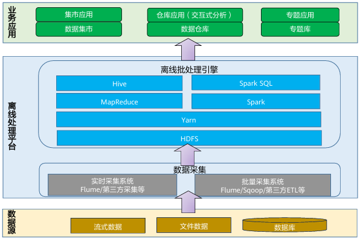
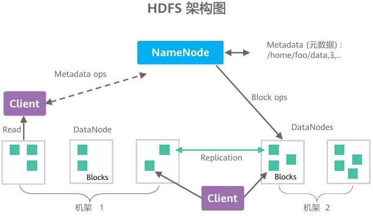

## 大数据


### 离线批处理场景

离线批处理，是指对海量历史数据进行处理和分析，生成结果数据，供下一步使用的过程。

* 处理时延要求不高
* 处理数据量大，占用存储资源多
* 处理数据格式多样
* 支持SQL类作业和自定义作业

离线批处理流程




#### Hadoop

核心组件：HDFS、YARN、MapReduce、Hadoop Common

生态系统工具：

- **计算引擎**：Spark（内存计算）、Flink（流处理）、Tez（优化 DAG 执行）。
- **数据仓库**：Hive（Hive 3.x 支持 LLAP 实时查询）、Impala。
- **NoSQL 存储**：HBase（基于 HDFS 的列式数据库）。
- **协调服务**：ZooKeeper（集群协调）、Apache Atlas（元数据治理）。


#### HDFS

`HDFS(Hadoop Distributed File System)`是基于Google发布的`GFS(Google File System)`论文设计开发的分布式文件系统，为各种批处理引擎提供数据存储，可以存储各种文件格式数据。

* 高容错性：认为硬件不可靠。由于HDFS采用数据多副本方案，所以部分硬件的损坏不会导致全部数据的丢失。
* 高吞吐量：为大量数据访问的应用提供高吞吐量支持。
* 大文件存储：适合`大文件（TB-PB级别）`存储存储与访问、`流式数据`访问；不适合大量小文件存储，数据的随机写入和低延迟读取。
* 简单一致性模型：适合于一次写入多次读取 (`write-once-read-many`) 的访问模型。支持将内容追加到文件末尾， 但不支持数据的随机访问，不能从文件任意位置新增数据。
* 跨平台移植性

##### HDFS架构




HDFS为主/从架构，由单个`NameNode(NN)`和多个`DataNode(DN)`组成：

* `NameNode`：负责执行有关`文件系统命名空间`的操作，例如打开，关闭、重命名文件和目录等，并记录对命名空间的修改。 它同时还负责集群元数据的存储，记录着文件中各个数据块的位置信息。HDFS`文件系统命名空间`的层次结构与Linux系统类似， 支持目录和文件的创建、移动、删除和重命名等操作，支持配置用户和访问权限，但不支持硬链接和软连接。
* `DataNode`：负责执行来自文件系统客户端的读写请求，执行块的创建，删除等操作。

##### 数据复制

为了保证容错性，HDFS提供了数据复制机制。HDFS将每一个文件存储为一系列**块**，每个块由多个**副本**来保证容错，块的大小和**复制因子**可以自行配置（默认情况下，块大小是`128M`，默认复制因子是`3`）。

大型的HDFS实例在通常分布在多个机架的多台服务器上，不同机架上的两台服务器之间通过交换机进行通讯。在大多数情况下，同一机架中的服务器间的网络带宽大于不同机架中的服务器之间的带宽。

因此HDFS采用`机架感知副本放置策略`，当复制因子为3时，HDFS的放置策略是： 

？在写入程序位于  datanode 上时，就优先将写入文件的一个副本放置在该  datanode 上，否则放在随 机 datanode 上。之后在另一个远程机架上的任意一个节点上放置另一个副本，并在该机架上的另一 个节点上放置最后一个副本。此策略可以减少机架间的写入流量，从而提高写入性能。

如果复制因子大于 3，则随机确定第 4 个和之后副本的放置位置，同时保持每个机架的副本数量低于上 限，上限值通常为（复制系数 - 1）/机架数量 + 2，需要注意的是不允许同一个  dataNode 上具有同一个块的多个副本。


##### HDFS回收站机制

在HDFS删除文件时，其实是将文件放入回收站，回收站可以用来快速恢复误删的文件。

可以设置时间阈值（单位：分钟），当回收站里的文件存放时间超过这个阈值或清空回收站时，文件才会被彻底删除，并释放占用的数据块。

Hadoop回收站trash，默认是关闭的，若开启需要修改配置文件`core-site.xml`。

```xml
<property>
	<name>fs.trash.interval</name>
	<value>1440</value>
</property>
```


如何删除数据？

##### 常用Shell命令

```shell
# 显示文件内容
hdfs dfs -cat
# 显示目录列表
hdfs dfs -ls
# 
hdfs dfs -rm
hdfs dfs -put 
hdfs dfs -get
hdfs dfs -mkdir
# 修改文件或目录的权限
hdfs dfs -chmod
# 修改文件或目录的所有者和所属组
hdfs dfs -chown
# 安全模式操作
hdfs dfsadmin -safemode
# 报告服务状态
hdfs dfsadmin -report
```

#### MapReduce

Hadoop MapReduce 是一个分布式计算框架，用于编写批处理应用程序。编写好的程序可以提交到  Hadoop 集群上用于并行处理大规模的数据集。

1. **Map（映射）阶段**：
   - 输入数据被分割成多个块，每个块由一个Map任务处理。
   - Map函数将输入数据转换为键值对（key-value pairs），例如在词频统计中，将每个单词映射为`(word, 1)`。
2. **Reduce（归约）阶段**：
   - 对Map输出的键值对按键进行分组和聚合，例如将相同单词的计数相加。
   - Reduce任务汇总最终结果，如`(word, total_count)`。

##### 工作流程

1. **输入分片**：数据被分割为固定大小的块（如HDFS的128MB/块）。
2. Map阶段：
   - 每个Map任务处理一个数据块，生成中间键值对。
   - 可选的**Combiner**在Map端本地聚合数据，减少网络传输（如本地合并`(word, 1)`为`(word, 5)`）。
3. Shuffle与Sort：
   - 中间数据按键排序并分发到对应的Reduce节点，此阶段可能成为性能瓶颈。
4. Reduce阶段：
   - 对相同键的值执行聚合操作，输出最终结果到分布式文件系统（如HDFS）。

##### 优缺点

- 优点：
  - 简化分布式编程，开发者只需实现Map和Reduce函数。
  - 适合处理海量静态数据，扩展性强。
- 缺点：
  - 中间结果写入磁盘，I/O开销较大（后续Spark通过内存计算优化了此问题）。
  - 不适合实时或迭代计算

#### Hive

Hive是基于Hadoop的数据仓库软件，可以查询和管理PB级别的分布式数据。

Hive特性：

* 灵活`ETL（Extract/Transform/Load）`
* 支持MapReduce、Tez、Spark多种计算引擎
* 可直接访问HDFS文件以及HBase
* 易用易编程

##### Hive架构


##### Hive数据存储模型


###### 元数据（Metadata）

- **定义**：元数据是 **描述数据的数据**，即表的 **结构信息** 和 **存储属性**。
- 内容：
  - 表名、列名、数据类型、表注释等表结构信息。
  - 表的存储格式（如 ORC、Parquet）、压缩方式（如 Snappy）。
  - 分区信息（如按 `date` 字段分区）、分桶规则。
  - 数据在 HDFS 上的存储路径（如 `/user/hive/warehouse/db_name/table_name`）。
- 存储位置：
  - 元数据存储在 **外部数据库**（如 MySQL、PostgreSQL）中，由 Hive 的 **Metastore 服务** 管理。
  - 与数据分离，**不保存在 HDFS 上**。

###### 数据（Data）

- **定义**：数据是表中存储的 **实际内容**，即用户写入的原始记录或处理后的结果。
- 内容：
  - 例如表中的每一行记录：`1, "Alice", 28`。
- 存储位置：
  - 数据以文件形式存储在 **HDFS**（默认）或其他 Hadoop 兼容存储系统（如 S3）中。
  - 文件格式可以是 TextFile、ORC、Parquet 等（由用户定义）。

###### 表（Table）

Hive 的**基本数据单元**，类似于关系型数据库中的表，但数据存储在 HDFS 上。

- 内部表（Managed Table）
  - 管理表的元数据meta data和数据data。删除表时，元数据和 HDFS 上的数据会被一并删除。
  - 默认存储路径：`/user/hive/warehouse/<database>.db/<table>`。
- 外部表（External Table）
  - 仅管理元数据，数据存储在用户指定的 HDFS 路径中。删除表时，仅删除元数据，数据保留。
  - 适用场景：与其他工具（如 Spark、Pig）共享数据，避免误删数据。

###### 分区（Partition）

- **作用**：按某个字段的值（如日期、地区）将数据划分为不同的子目录，**减少查询时的数据扫描量**。
- 存储方式：每个分区对应 HDFS 上的一个子目录。
  - 示例：按 `date` 分区的表路径为 `/user/hive/warehouse/logs/date=2023-10-01/`。
- **适用场景**：常用于时间序列数据或高基数字段（如国家、城市）。

###### 分区分桶区别

- **分区**：通过目录隔离数据，适合按 **列值过滤** 的场景，减少扫描范围。
- **分桶**：通过哈希均匀分布数据，适合 **JOIN、采样和聚合** 场景，提升计算效率。
- **联合使用**：可先分区（粗粒度隔离），再分桶（细粒度优化），兼顾数据过滤与计算性能。
- **关键区别**：分区是 **垂直划分**（按值切分目录），分桶是 **水平划分**（按哈希分文件）。

###### 分桶（Bucketing）

- **作用**：对数据按哈希值分桶，每个桶对应一个文件，**优化 JOIN 和采样效率**。
- 存储方式：数据按分桶字段的哈希值分配到固定数量的桶中。
  - 示例：按 `user_id` 分 10 个桶，相同哈希值的 `user_id` 数据落在同一个桶文件。
- **适用场景**：需要高效 JOIN 或频繁数据采样的场景。

##### UDF（User-Defined Function，用户自定义函数）

当 Hive 内置函数无法满足特定需求时（如复杂字符串处理、数据清洗、业务逻辑封装），可通过 UDF 实现：

- **数据转换**：例如将手机号脱敏、解析 JSON 字段。
- **复杂计算**：例如自定义聚合、地理哈希编码。
- **适配外部系统**：例如调用外部 API 或算法模型。

| **类型** |             **全称**              |        **输入/输出**        |                 **示例**                 |
| :------: | :-------------------------------: | :-------------------------: | :--------------------------------------: |
| **UDF**  |       User-Defined Function       |     单行输入 → 单行输出     |         字符串转大写、日期格式化         |
| **UDAF** | User-Defined Aggregation Function | 多行输入 → 单行输出（聚合） |      自定义统计指标（如分位数计算）      |
| **UDTF** |    User-Defined Table Function    |  单行输入 → 多行/多列输出   | 将 JSON 数组拆分为多行（类似 `EXPLODE`） |

##### 数据倾斜调优

数据倾斜指计算数据的时候，数据的分散度不够，导致大量的数据集中到了一台或几台机器上计算，这些数据的计算速度远远低于平均计算速度，导致整个计算过程过慢。

造成数据倾斜的原因：group by、distinct count(distinct xx)、join

- **GROUP BY** 或 **COUNT DISTINCT** 操作中，某个 Key 值的数据量极大。
- **JOIN** 操作中，一侧表的某个 Key 值过多（如 `NULL` 值或默认值）。
- **数据分布不均**：如日志数据中某个城市用户占比过高。

调优方法：

**开启 Map 端聚合**：合并 Map 阶段的重复 Key，减少传输到 Reduce 的数据量。

> SET hive.map.aggr = true;  *-- 默认开启*

**启用倾斜优化**：自动识别和处理倾斜 Key，可实现数据倾斜时负载均衡。

> SET hive.groupby.skewindata = true;  *-- 对GROUP BY的倾斜Key进行两次MR计算*

**增加 Reduce 数量**：避免单个 Reduce 处理过多数据。

> SET hive.exec.reducers.bytes.per.reducer = 256000000;  *-- 每个Reduce处理的数据量（默认256MB）* SET mapreduce.job.reduces = 200;  *-- 手动指定Reduce数量*

**将 MapJoin 用于小表**：避免 Reduce 阶段的 Shuffle。

当连接一个较小或较大表的时候，把较小的表之间放到内存中，再对较大的表进行map操作。

并行化执行：


##### 数据集市

数据集市（Data Mart）：也叫数据市场，数据集市就是满足特定用户的需求，按照多维的方式存储数据，包括定义维度、需要计算的指标、维度的层次等，生成面向决策分析需求的数据立方体。

##### 数据仓库

为满足各类零散分析的需求，通过数据分层和数据模型的方式，并以基于业务和应用的角度将数据进行模块化的存储。

数据仓库分层：

* ODS（Operational Data Store）：原始数据层。
* DWD（Data WareHouse Detail）：结构和粒度与原始数据保持一致，简单清洗。
* DWS（Data WareHouse Service）：以DWD为基础，进行轻度汇总。
* ADS（Application Data Store）：为各种统计报表提供数据。

分层优点：

* 复杂问题简单化：将任务分解为多个步骤完成，每一层处理单一的任务。
* 减少重复开发：规范数据分层，通过中间层数据，减少重复计算，增加计算结果的复用性。
* 隔离原始数据：避免数据异常和数据敏感，使真实数据和统计数据解耦。

#### Spark

Spark是基于内存的分布式批处理系统，它把任务拆分，分配到多个CPU上进行处理，处理数据时产生的中间产物（计算结果）存放在内存中，减少了对磁盘的IO操作，提升了数据处理速度。

##### 应用场景

* 数据处理（Data Processing）：可以快速处理数据，兼具容错性和可扩展性。
  * 迭代计算（Iterative Computation）：支持迭代计算，有效应对复杂的数据处理逻辑。
  * 流式处理（Streaming Processing）：支持秒级延迟的流处理，可支持多种外部数据源。
* 数据挖掘（Data Mining）：在海量数据基础上进行复杂的挖掘分析，可支持多种数据挖掘和机器学习算法。
  * 查询分析（Query Analysis）：支持SQL查询分析，同时提供领域特定语言（DSL）以方便操作结构化数据，并支持多种外部数据源。

##### 对比MapReduce

* 性能提升100倍。Spark的中间数据存放在内存中，对于迭代运算的效率更高。进行批处理时更高效，同时有更低的时延。
* Spark提供更多的数据集操作类型，编程模型更灵活，开发效率更高。
* 更高的容错能力（血统机制）？。

##### RDD

RDD（Resilient Distributed Dataset）是`弹性分布式数据集`。

Spark会把所有要操作的数据，加载到RDD上，


##### Shuffle

洗牌操作。跨节点数据传输


##### Transformation

在 Apache Spark 中，**Transformation（转换操作）** 是定义数据处理逻辑的核心概念，是RDD的算子类型，它表示对 RDD（弹性分布式数据集）的**惰性操作**，即不会立即执行，而是记录操作逻辑，直到遇到 **Action（触发操作）** 时才真正执行计算。

1. **惰性求值（Lazy Evaluation）**：
   Transformation 只是构建计算逻辑的蓝图，不会触发实际计算。
   ​**​示例​**​：`map`、`filter` 等操作不会立即执行，直到调用 `collect()`、`count()` 等 Action。
2. **生成新的 RDD**：
   每个 Transformation 都会基于父 RDD 生成一个新的 RDD，形成依赖链（Lineage）。
3. **支持容错**：
   通过 RDD 的依赖链（Lineage），Spark 可以在数据丢失时重新计算丢失的分区。

###### 窄依赖宽依赖

在分布式计算框架（如Apache Spark）中，**宽依赖**和**窄依赖**是用于描述RDD（弹性分布式数据集）之间依赖关系的核心概念，直接影响任务的执行优化和阶段划分。

窄依赖：父RDD的每个分区只被子RDD的一个分区所使用，子RDD的每个分区仅依赖于**父RDD的一个分区**，且数据无需跨节点传输（**无需Shuffle**）。

map、filter、flatMap、union、`coalesce`（合并分区且不触发Shuffle时）

宽依赖：父RDD的每个分区都可能被多个子RDD分区使用，子RDD的每个分区依赖于**父RDD的多个分区**，且需要**跨节点数据传输（Shuffle）**。

groupByKey、reduceByKey、distinct、join、repartition

|          |         **窄依赖**         |          **宽依赖**          |
| :------: | :------------------------: | :--------------------------: |
| **本质** |     数据不动，原地处理     |    数据必须搬家，重新分组    |
| **代价** |         快、省资源         |  慢、耗资源（网络/磁盘IO）   |
| **场景** | `map`, `filter` 等简单操作 | `groupBy`, `join` 等聚合操作 |


##### Action

在 Apache Spark 中，**Action（触发操作）** 是实际触发计算并返回结果（或输出数据）的操作。与 **Transformation（转换操作）** 不同，Action 不再是“定义计算逻辑”，而是“执行计算并输出结果”的关键步骤。

1. **触发实际计算**：
   Action 会强制 Spark 执行所有积累的 Transformation（从初始 RDD 到最终结果的整个计算链）。
2. **返回非 RDD 结果**：
   Action 的返回值通常是 ​**​标量值​**​（如 `count()` 返回一个数字）、​**​集合​**​（如 `collect()` 返回列表）或 ​**​输出到外部存储​**​（如 `saveAsTextFile()`），而不是生成新的 RDD。
3. **立即执行**：
   调用 Action 后，Spark 会生成执行计划（DAG），划分 Stage，调度 Task 到集群执行。

###### **为什么需要 Action？**

Spark 的 **惰性计算（Lazy Evaluation）** 机制决定了：

- **优化执行计划**：Spark 可以将多个 Transformation 合并为流水线操作（如 `map` → `filter` → `map`），减少中间数据落盘。
- **避免无效计算**：如果用户仅定义 Transformation 但未调用 Action，Spark 不会执行任何实际计算（节省资源）。


##### Stage

- **定义**：
  Stage 是一组​**​可以并行执行的 Task 的集合​**​，这些 Task 执行的操作之间​**​没有 Shuffle 依赖​**​。
  - **窄依赖操作**（如 `map`、`filter`）会被合并到同一个 Stage 中，形成**流水线（pipelining）执行**。
  - **宽依赖操作**（如 `groupByKey`、`join`）会触发 Stage 的划分，形成新的 Stage。
- **核心规则**：
  ​**​每遇到一个宽依赖，就会生成一个新的 Stage​**​。
  Spark 会按 Stage 的顺序依次执行，前一个 Stage 的所有 Task 完成后，才能执行下一个 Stage。

###### 为什么需要划分 Stage？

1. **优化执行效率**：
   - 窄依赖的操作可以流水线执行（无需等待前一步完成所有数据），减少中间数据落盘。
   - 宽依赖必须等待所有父分区数据就绪，因此需要划分 Stage 作为执行边界。
2. **容错恢复**：
   - 如果某个 Task 失败，只需重新执行对应 Stage 的 Task，无需回溯整个计算链。
3. **资源管理**：
   - Stage 的划分让 Spark 可以分批次调度任务，避免资源被长时间占用。


##### SparkConf

SparkConf是用来对Spark进行任务参数配置的对象。

通过键值对的形式，设置Spark任务执行时所需参数。

读取任务参数优先级：代码配置>动态参数>配置文件


##### SparkContext

SparkContext是Spark的入口，与Spark集群连接，相当于应用程序的main函数。

在 Apache Spark 中，**SparkContext** 是 Spark 应用程序的**核心入口点**，负责与集群资源管理器（如 YARN、Mesos 或 Spark Standalone）建立连接，并管理应用程序的整个生命周期。它是所有 Spark 功能的起点，开发者通过它创建 RDD、配置参数、提交任务等。


|     **功能**     |                           **说明**                           |
| :--------------: | :----------------------------------------------------------: |
|   **连接集群**   | 与集群资源管理器通信，分配和管理计算资源（Executor、内存、CPU）。 |
|   **创建 RDD**   |     通过 `parallelize`、`textFile` 等方法创建初始 RDD。      |
|   **管理配置**   | 设置 Spark 应用参数（如 `spark.executor.memory`、`spark.default.parallelism`）。 |
|   **协调任务**   |         将 Task 分发到 Executor，监控任务执行状态。          |
| **管理共享变量** | 创建广播变量（Broadcast Variables）和累加器（Accumulators）。 |

###### SparkContext 与 SparkSession 的关系

- **Spark 1.x**：
  `SparkContext` 是唯一的入口，用于操作 RDD。
- **Spark 2.x+**：
  引入了 `SparkSession`（通过 `spark = SparkSession.builder.getOrCreate()` 创建），它是 `SparkContext` 的封装，同时支持 DataFrame、Dataset 和 SQL 操作。
  - 底层仍依赖 `SparkContext`：可通过 `spark.sparkContext` 访问。
  - **优先使用 `SparkSession`**：除非需要直接操作 RDD。
  - 封装了SparkConf和SparkContext，方便用户使用各种API（SparkContext、StreamContext、SQLContext）

##### SparkSQL

在 Apache Spark 中，**Spark SQL** 是专为**结构化数据处理**设计的核心模块，它允许开发者使用 SQL 查询或 DataFrame/Dataset API 对结构化数据执行高性能分析，同时无缝集成 Spark 的分布式计算能力。

SQL语句通过SparkSQL模块解析为RDD执行计划，交给SparkCore执行。

1. **统一数据处理**：
   - 支持 SQL 语法、DataFrame/Dataset API 和 RDD 操作，可混合使用。
   - 直接处理多种数据源：JSON、Parquet、Hive、CSV、JDBC 等。
2. **高性能优化**：
   - 通过 **Catalyst 优化器** 自动优化查询计划，提升执行效率。
   - **Tungsten 引擎**：使用堆外内存和二进制格式，减少序列化开销。
3. **与 Hive 集成**：
   - 兼容 Hive 的元数据、UDF 和 HQL 查询，可直接访问 Hive 表（需配置 `hive-site.xml`）。
4. **结构化流处理（Structured Streaming）**：
   - 以 DataFrame/Dataset 为基础，支持实时数据流的 SQL 查询。

###### **DataFrame 和 Dataset 的定义**


|   **特性**   |                 **DataFrame**                  |                  **Dataset**                   |
| :----------: | :--------------------------------------------: | :--------------------------------------------: |
|   **本质**   |   一种特殊的 `Dataset`（即 `Dataset[Row]`）    |       强类型 API（仅支持 Scala 和 Java）       |
| **数据结构** |   按列组织的分布式数据集合，具有 Schema 信息   | 类型化的分布式数据集合（如 `Dataset[Person]`） |
| **类型安全** | 运行时类型检查（如字段名错误在运行时抛出异常） | 编译时类型检查（字段名或类型错误在编译时捕获） |
| **适用语言** |             Scala、Java、Python、R             |                  Scala、Java                   |

#### YARN

YARN（Yet Another Resource Negotiator）是Hadoop生态系统中的核心资源管理和作业调度组件，自Hadoop 2.0引入以来，极大地提升了集群的资源利用率和灵活性。

YARN将资源管理与作业调度解耦，支持多种计算框架（如Spark、Flink等）在同一个集群上运行，形成通用的分布式资源管理平台。

##### 核心架构

YARN采用主从架构，包含以下关键组件：

1. **ResourceManager（RM）**：
   - **全局资源管理**：负责整个集群的资源分配，处理客户端提交的作业。
   - **调度器（Scheduler）**：根据策略（如容量调度器、公平调度器）分配资源，不参与具体任务监控。
   - **高可用（HA）**：支持Active/Standby模式，通过ZooKeeper实现故障切换。
2. **NodeManager（NM）**：
   - **单节点资源管理**：部署在集群每个节点上，监控资源（CPU、内存、磁盘等）使用情况，并向RM汇报。
   - **任务执行**：根据指令启动/销毁Container，管理本地化资源（如JAR文件）。
3. **ApplicationMaster（AM）**：
   - **作业生命周期管理**：每个应用（如MapReduce作业、Spark任务）对应一个AM，负责向RM申请资源、与NM协作启动任务，并监控任务状态。
   - **容错机制**：失败后由RM重启，恢复任务进度。
4. **Container**：
   - **资源抽象单元**：封装了节点的资源（如内存、CPU核心），任务在Container中运行，支持资源隔离（通过Linux cgroups等技术）。

##### YARN的工作流程

1. **作业提交**：客户端将应用提交至RM，例如MapReduce把任务提交给RM。
2. **启动AM**：RM分配Container，在某个节点上启动AM。
3. **资源申请**：AM向RM申请资源（Container）。
4. **任务执行**：RM分配资源后，AM与NM通信，在Container中启动任务。
5. **监控与完成**：AM监控任务状态，任务完成后注销并释放资源。


#### Sqoop

Apache Sqoop 是一款专为在 **Hadoop 生态系统（如 HDFS、Hive、HBase）** 和 **关系型数据库（Relational Database Management System：*RDBMS*）（如 MySQL、Oracle、PostgreSQL）** 之间高效传输批量数据而设计的工具。

Sqoop是一款开源工具，用于Hadoop（Hive）与传统数据库（MySQL、PostgreSQL）之间进行数据传递。

可以将关系型数据库中的数据导入到HDFS中，也可以将HDFS的数据导入到关系型数据库。

##### import 原理

Sqoop 的 `import` 命令通过 **MapReduce 框架** 实现高效批量数据导入，其核心原理是将数据库表数据切分为多个分片，并行读取并写入 Hadoop（如 HDFS、Hive）。

1. **连接数据库并获取元数据**

- **JDBC 连接**：Sqoop 通过 JDBC 连接到目标数据库，验证用户权限。

- 元数据查询：

  - 获取表结构（字段名、数据类型、主键等）。
- 若未指定 `--split-by`，默认使用主键作为分片依据（若表无主键，需手动指定分片列）。

2. **数据分片（Splitting）**

- 分片策略：
  - 根据 `--split-by` 列的值范围，将数据划分为多个逻辑分片（split）。
  - 例如：若 `--split-by id` 的取值范围是 `1~1000`，且 `-m 4`（4个并行任务），则每个分片处理 `1-250`, `251-500`, `501-750`, `751-1000`。
- 分片算法：
  - Sqoop 执行 `SELECT MIN(split-by), MAX(split-by) FROM table` 确定边界，然后均匀划分区间。
  - 若分片列分布不均，可能导致数据倾斜（某些 Map 任务负载过重）。

3. 生成并提交 MapReduce 任务

##### export原理

* 获取导出表等schema、meta信息，和Hadoop中的字段match。
* 将Hadoop上的文件划分成若干个分片，每个分片由一个Map Task进行导入。


#### Loader

Loder是实现FusionInsight与关系型数据库、文件系统之间交换数据和文件的数据加载工具。

* 提供可视化向导式的作业配置管理页面
* 提供定时调度任务，周期性执行Loader作业
* 在界面中可指定多种不同的数据源、配置数据的清洗和转换步骤、配置集群存储系统等

基于开源Sqoop开发，做了大量优化和扩展。


### 实时检索场景

实时检索就是根据关键词对系统内的一些信息进行快速搜索，实现即搜即得的效果，强调的是实时低延迟。其能够方便人们快速拿到搜索的结果，而这些内容往往才是人们真正关心的、可用的数据。

高并发、查询速度快、查询条件简单、存在海量视频、图片等小文件。


#### HBase

HBase是一个分布式的NOSQL数据库，其特点高可靠、高性能、面向列、可伸缩。

* 适合存储大表数据 ，并且可实时读写大表数据;
* 表结构稀疏;
* 数据底层存储于分布式文件系统;
* 利用ZooKeeper作为协同服务。

##### 应用场景

HBase适合具有如下需求的应用

* 海量数据(TB、PB);
* 不需要完全拥有传统关系型数据库所具备的ACID特性；
* 高吞吐量;
* 需要在海量数据中实现高效的随机读取；
* 需要很好的性能伸缩能力;
* 能够同时处理结构化和非结构化的数据。

##### 系统架构


* ZooKeeper：
  * **集群状态管理**：维护活跃HMaster及HRegionServer的心跳。
  * **元数据路由**：存储META表的位置信息，供客户端定位数据。
  * **分布式锁**：协助HMaster故障恢复与Region分配。
* HMaster：
  * **集群管理**：负责Region的分配、负载均衡及RegionServer故障恢复。
  * **元数据操作**：处理DDL操作（如创建/删除表、修改列族）。
  * **协调操作**：管理Region的拆分（Split）与合并（Merge）。
  * **高可用**：通过ZooKeeper实现多HMaster的主备选举，避免单点故障。
* HRegionServer：
  - **数据读写**：直接处理客户端PUT/GET/SCAN等请求。
  - **Region管理**：每个RegionServer托管多个Region（表的分区），处理Region的拆分触发。
  - **刷写机制**：MemStore数据定期刷写到HDFS生成HFile，提升写入性能。

* HRegion：
  - **Store**：每个列族对应一个Store，包含内存中的**MemStore**和持久化的**HFile**。
  - **WAL（Write-Ahead Log）**：预写日志，确保数据写入的可靠性。

##### 存储模型

HBase的底层数据以KeyValue的形式存在，KeyValue具有特定的格式。

KeyValue中拥有时间戳、类型等关键信息。

同一个Key值可以关联多个Value，每一个KeyValue都拥有一个Qualifier标识。

即使是Key值相同，Qualifier也相同的多个KeyValue，也可能有多个版本，此时使用时间戳来区分，这就是同一条数据记录的多版本。


##### 缓存机制

HBase提供2种类型的缓存结构：MemStore和BlockCache。

* MemStore：HBase数据先写入HLog 之中，并同时写入MemStore，待满足一定条件后将MemStore中数据刷到磁盘，能提升HBase的写性能和读性能。
* BlockCache：HBase会将一次文件查找的Block块缓存到cache中，以便后续同一请求或者相邻口数据查找请求，可以直接从内存中获取，避免IO操作。

##### BloomFilter

布隆过滤器可以快速判断一个元素是否存在。**布隆过滤器判断某个元素存在，小概率会误判。布隆过滤器判断某个元素不在，那么这个元素一定不在。**

把所有可能存在的请求的值都存放在布隆过滤器中，先判断客户端发来的请求的值是否存在于布隆过滤器中。不存在的话，直接返回请求参数错误信息，存在的话再继续去缓存和数据库中寻找数据。

* BloomFilter用来优化一些随机读取的场景，即Get场景。它可以被用来快速的判断一条数据在一个大的数据集合中是否存在。
* BloomFilter在判断一个数据是否存在时，拥有一定的误判率。但对于“该条数据不存在的判断结果是可信的。
* HBase的BloomFilter的相关数据，被保存在HFile中。

#### ElasticSearch

ElasticSearch是一个高性能，基于Lucene的全文检索服务，是一个分布式的Restful风格的搜索和数据分析引擎，也可以作为NoSQL数据库使用:

* 对Lucene进行了扩展;
* 原型环境和生产环境可无缝切换;
* 能够水平扩展;
* 支持结构化和非结构化数据。

##### 应用场景

用于日志搜索和分析、时空检索、时序检索智能搜索等场景

* 检索的数据类型复杂：如需要查询的数据有结构化数据、半结构化数据、非结构化数据等。ElasticSearch可以对以上数据类型进行清洗、分词、建立倒排索引等一系列操作，然后提供全文检索的能力;

* 检索条件多样化：全文检索条件可以包括词或短语；

* 边写边读：写入的数据可以实时的进行检索。

##### 系统结构


###### **物理层：节点（Node）与集群（Cluster）**

- 节点（Node）
  - 一个 Elasticsearch 实例（JVM 进程）即一个节点，可运行在物理机、虚拟机或容器中。
  - 节点角色：
    - **主节点（Master Node）**：负责集群元数据管理（如索引创建、分片分配）、节点状态监控。通过选举机制产生（基于 Zen Discovery 或 Raft 协议），建议部署 3 个专用主节点以保障高可用。
    - **数据节点（Data Node）**：存储分片数据并执行搜索、聚合操作，需高磁盘 I/O 和内存资源。
    - **协调节点（Coordinating Node）**：接收客户端请求，路由至数据节点并合并结果，无数据存储职责。
    - **Ingest 节点**：执行数据预处理管道（如字段提取、格式转换）。
- 集群（Cluster）
  - 多个节点组成一个集群，通过唯一名称标识（默认 `elasticsearch`）。
  - **自动发现**：节点通过 `discovery.seed_hosts` 配置自动加入集群。

###### **逻辑层：索引（Index）、分片（Shard）与副本（Replica）**

- 索引（Index）
  - 类似关系型数据库中的“表”，是文档的集合。
  - **动态映射（Dynamic Mapping）**：自动推断字段类型（如 `text`、`keyword`、`date`）。
- 分片（Shard）
  - **水平拆分数据**：每个索引被划分为多个分片（Lucene 索引），分片数在创建索引时指定且不可修改。
  - **主分片（Primary Shard）**：数据写入的入口，每个主分片对应一个副本分片（Replica Shard）。
  - **副本分片**：主分片的完整拷贝，提供数据冗余和读取负载均衡。
- 分片分配策略：
  - 主分片与副本分片不在同一节点，确保容错性（例如：节点宕机时副本分片可接管）。
  - 分片分布遵循均匀原则，避免热点问题。

###### 1. **文档（Document）**

- 基本数据单元：类似数据库表中的一行记录，以 JSON 格式存储。


- **唯一标识**：每个文档有唯一 `_id`（可自定义或由系统生成）。

- **归属关系**：文档属于某个索引（Index），不再严格绑定类型（Type）。

###### 2. **索引（Index）**

- **逻辑数据容器**：类似关系型数据库中的“表”，是文档的集合。

- **物理分片**：索引被拆分为多个分片（Shard），分布式存储于集群节点。

- 版本演进：

  - **7.x 之前**：一个索引可包含多个 Type（如 `users` 和 `products`）。
- **7.x+**：官方废弃 Type，每个索引仅允许一个隐式 Type（`_doc`）。

###### 3. **类型（Type）**（已废弃）

- 历史作用：在 6.x 及更早版本中，用于逻辑划分同一索引中不同数据结构。

  - 示例：索引 `library` 可包含 Type `books` 和 `authors`，但共享同一物理存储。

- 废弃原因：

  - 同一索引下不同 Type 的字段冲突问题（如 `books` 和 `authors` 都有 `name` 但类型不同）。
  - Lucene 底层存储未严格隔离不同 Type，导致性能损耗。
  
- 替代方案：

  - 为不同数据模型创建独立索引（如 `books_index` 和 `authors_index`）。
- 使用字段前缀或嵌套对象区分数据类型。

###### 4. **映射（Mapping）**

- **数据结构定义**：类似数据库表结构（Schema），规定文档字段的类型、格式及索引规则。

- 核心配置项：

  - **字段类型**：`text`（分词搜索）、`keyword`（精确匹配）、`date`、`boolean` 等。
- **索引选项**：是否可搜索（`index: true|false`）。
  - **分词器**：指定 `analyzer`（写入时）和 `search_analyzer`（查询时）。

- 动态映射（Dynamic Mapping）：

  - 写入新字段时自动推断类型（如字符串默认设为 `text` 并生成 `keyword` 子字段）。

- 显式映射（Explicit Mapping）：

  - 手动定义字段类型，避免自动推断不符合预期。

##### 缓存机制 ?

ElasticSearch缓存主要分三种：Query Cache、Fielddata Cache、Request Cache。

* Query Cache：Node级别的缓存，是对一个查询中包含的过滤器执行结果进行缓存;
* Fielddata Cache：Fielddata是专门针对分词的字段在查询期间的数据结构的缓存;
* Request Cache：shard级别的缓存，是为了缓存“分片级”的本地结果集。

|    **缓存类型**     |   **作用层级**    |                   **缓存内容**                   |               **适用场景**               |     **生命周期**      |          **配置参数**          |
| :-----------------: | :---------------: | :----------------------------------------------: | :--------------------------------------: | :-------------------: | :----------------------------: |
|   **Query Cache**   |  分片级（Shard）  |     缓存 `filter` 查询的匹配结果（文档集合）     | 高频重复的过滤查询（如 `term`、`range`） |  分片数据变更时失效   | `index.queries.cache.enabled`  |
| **Fielddata Cache** |  字段级（Field）  | 缓存字段的聚合/排序数据（如 `text` 字段的词项）  |   聚合（`terms`）、排序（`sort`）操作    | 内存不足时按 LRU 淘汰 | `indices.fielddata.cache.size` |
|  **Request Cache**  | 请求级（Request） | 缓存整个请求的结果（聚合结果或 `size=0` 的查询） |         高频重复的聚合或统计请求         |  分片数据变更时失效   |      `request_cache=true`      |


##### 倒排索引

倒排索引是搜索引擎的核心数据结构，专为**快速全文检索**设计。与传统数据库的**正排索引**（通过文档ID查找内容）不同，倒排索引通过**词项（Term）反向映射到文档**，使得关键词搜索能在毫秒级返回结果。以下是其核心原理与应用解析：

* 正排索引：是通过Kev寻找Valye，即从关键点出发，然后再通过关键点找到信息中满足搜索条件的特定信息。
* 倒排索引：ElasticSearch所采用得排序方式，是通过Value找Key。而在全文搜索中Value就是要搜索的关键词，通过Value找到对应的文档。

|   **类型**   |              **数据结构**               |         **适用场景**         |         **查询逻辑**          |
| :----------: | :-------------------------------------: | :--------------------------: | :---------------------------: |
| **正排索引** |     文档ID → 文档内容（如B树索引）      |      按ID检索、范围查询      |       `WHERE id = 1001`       |
| **倒排索引** | 词项 → 文档ID列表（如“苹果” → [1,3,5]） | 全文搜索、模糊匹配、语义分析 | `WHERE content LIKE '%苹果%'` |

##### 索引流程

客户端请求 → 2. 协调节点路由 → 3. 主分片处理 → 4. 副本同步 → 5. Lucene 提交与段合并 → 6. 可搜索性

##### 搜索流程

客户端请求 → 2. 协调节点路由 → 3. 分片级查询（Query Phase） → 4. 结果聚合（Fetch Phase） → 5. 返回结果

##### 性能优化

###### 分片副本策略

索引一旦创建好后，就无法调整分片的数量，而ElasticSearch一个分片实际上对应一个存储数据Lucene索引，Lucene索引的读写会占用很多的系统资源，因此分片副本数需要合理的配置：

* 分片数不超过节点数的3倍，用较少的分片获导更佳的性能;
* 副本数建议设置为1，过多的副本需要更多存诸空间;
* 分片最大容量不要超过ElasticSearch推荐的最大JVM堆空间32G。

###### 快速平衡

* 集群扩容后新旧节点之间数据不均衡，可通过修改参数加快数据平衡过程

  > 建议设置为实例个数
  >
  > cluster.routing.allocation.cluster_concurrent_rebalance=2
  >
  > 建议设置为1G+
  >
  > indices.recovery.max bytes_per_sec=40mb

* 参数使用完毕后，需要修改回默认值。


#### GES（Graph Engine Service）

GES是一种高性能、分布式的云原生图数据库，专为处理大规模图数据设计，适用于复杂关系分析和实时查询场景。

GES基于HBase和ElasticSearch的分布式图数据库，将数据构建成属性图模型进行存储，提供强大的图查询、分析、遍历能力。具有以下特点：

* 提供多实例部署，可横向扩展;
* 提供属性图模型的建模方案，可以将数据映身成图进行存储，
* 提供灵活的图元数据更新、修改;
* 提供易用的Rest接口，方便数据的查询分析，
* 提供强大的Gremlin图遍历功能，可实现复杂的业务逻辑。

##### 系统架构


* 接口层
  * Gremlin APl：兼容 Apache TinkerPop Gremlin提供开源**标准图交互式查询语言接口**；
  * REST API:提供包括图查询、图修改、图管理和华为增强的在线分析算法在内的全套接口；REST接口是对开源标准 Gremlin 接口的补充;
* **计算层**
  * 提供图数据库核心引擎，包括数据管理、元数据管理等；
  * 后端存储和索引接口适配层；
* 存储层
  * 分布式KV存储：提供海量图数据存储能力;
  * 集成分布式搜索引擎ElasticSearch，提供模糊检索，全文检索等能力。

##### 基本概念

* 图（Graph）
* 节点/顶点（Vertex）：实体对象
* 节点标签（Vertex Label）：节点的类型，用于表示现实世界中的实体类型，比如“人”，“电话”。在GES中，每一个节点有且只有一个Vertex Label。当不显式指定Vertex Label时，采用默认的Vertex Label。
* 边（Edge）：用于表示顶点间的联系。GES的边都是单向边，如果需要双向边，则通过两条相反方向的单向边组成。GES不存在无向边。
* 边标签（Edge Label）：边的类型，用于表示现实世界中的关系类型，比如“属于关系”、“认识/朋友关系”等。
* 属性（Property）：，用于表示顶点的附加信息，采用KeyValue结构。Key就是PropertyKey，Value就是具体的值。
* 属性的类型（Property key）：比如“姓名”，“年龄”，“电话号码”等。

##### REST接口

* 接口适用于GES2.8.1版本，提供给基于GES平台做二次开发的开发人员使用。
* GES API向上层应用提供统一的访问入口，通过高度灵活的REST API接口，封装GES平台的统一操作。
* HTTP请求方在和服务器建立连接并发出HTTP请求后，不能在该连接上再发出其他请求请，必须等待所发请求的响应，之后才可以继续发请求。
* 请求分为 HEAD、GET、PUT、POST、DELE

##### Gremlin

Gremlin是Apache TinkerPop框架下的图遍历语言。Gremlin是一种函数式数据流语言,用户可以使用简洁的方式实现对复杂的属性图(property graph)的遍历或查询。每个Gremlin遍历由一系列步骤(可能存在嵌套)组成，每一步都在数据流(data stream)上执行一个原子操作。

### 实时流处理场景

#### 什么是数据实时处理

数据从生成、实时采集、实时缓存存储、实时计算、实时落地、实时展示、实时分析，这一个流程线下来，处理速度在秒级甚至在毫秒级。


#### Flume

Flume是一个分布式、高可靠和高可用的海量日志采集、聚合与传输的系统，支持在系统中定制各类数据发送方，用于收集数据；同时，Flume提供对数据进行简单处理，并写到各种数据接受方（可定制）的能力。

* 提供从固定目录下采集日志信息到目的地(HDFS，HBase，Kafka)能力。
* 提供实时采集日志信息(taildir )到目的地的能力。
* Flume支持级联 (多个Flume对接起来)，合并数据的能力。
* Flume支持按照用户定制采集数据的能力。

##### Event

* Event是flume数据传输的基本单元。
* Event由Header和Body两部分组成：
  * Header用来存放该event下的一些属性信息，通常使用<Key,Value>的结构；
  * Body用来存放数据，数据结构为字节数组(Byte Array)。

##### Source

* Source负责接收events或通过特殊机制产生events，并将events批量放到一个或多个Channels。有驱动和轮询两种类型的Source。
  * 驱动型source：是外部主动发送数据给Flume，驱动Flume接受数据;
  * 轮询source：是Flume周期性主动去获取数据。
* Source必须至少和一个channel关联。

###### Source 类型

* exec source：执行某个命令或者脚本，并将其执行结果的输出作为数据源。
* avro source：提供一个基于avro协议的server，bind到某个端口上，等待avro协议客户端发过来的数据。
* thrift source：同avro，不过传输协议为thrift。
* http source：支持http的post发送数据。
* syslog source：采集系统syslog。
* spooling directory source：采集本地静态文件。
* jms source：从消息队列获取数据。
* Kafka source：从Kafka中获取数据。

##### Channel

* Channel位于Source和Sink之间，Channel的作用类似队列，用于临时缓存进来的events，当sink成功地将events发送到下一跳的Channel或最终目的，events从Channel移除。
* 不同的channel提供的持久化水平也是不一样
  * Memory channel：不会持久化 。
  * File Channel：基于WAL(预写式日志Write-Ahead Log )实现。
  * JDBC Channel：基于嵌入式Database实现。
* Channels支持事务，提供较弱的顺序保证，可以连接任何数量的Source和Sink。

* Memory channel：消息存放在内存中，提供高吞吐，但不提供可靠性;因此在程序关闭或者机器宕机时可能丢失数据。
* File Channel：对数据持久化；但是配置较麻烦，需要配置数据目录和checkpoint目录；不同的File channel均需要配置一个checkpoint 目录。
* JDBC Channel:内置的derby数据库，对event进行了持久化，提供高可靠性；可以取代同样具有持久特性的File channel。

##### Sink

* Sink负责将events传输到下一跳或最终目的，成功完成后将events从channel移除。
* 必须作用于一个确切的channel。

###### Sink类型

hdfs sink：将数据写到hdfs上。
avro sink：使用avro协议将数据发送给另下一跳的Flume。
thift sink：同avro，不过传输协议为thrift。
file roll sink：将数据保存在本地文件系统中。
hbase sink：将数据写到HBase中。
Kafka sink：将数据写入到Kafka中。
MorphlineSolr sink：将数据写入到Solr中。

##### Flume架构


* Flume基础架构：Flume可以单节点直接采集数据，主要应用于集群内数据。


* Flume多agent架构：Flume可以将多个节点连接起来，将最初的数据源经过收集，存储到最终的存储系统中。主要应用于集群外的数据导入到集群内。


##### 多级级联和多路复置

* Flume支持将多个Flume级联起来，同时级联节点内部支持数据复制。


##### 高级组件

###### Source Interceptors

* Flume可以在source阶段修改/删除event，这是通过拦截器Interceptors来实现的。拦截器可以设置多个，它采用责任链模式，多个拦截器可以按指定顺序拦截。
  * 比如：在收集的数据的event的head中加入处理的时间戳、agent的主机或者IP、固定key-value等等。
* 常见的拦截器:
  * Timestamp Interceptor | Host Interceptor | Static Interceptor | UUlD Interceptor | Search and Replace Interceptor | Regex Filtering lnterceptor
  * 自定义拦截器

###### Channel Selectors

* Channel Selectors：Channel选择器
* 主要作用：对于一个source发往多个channel的策略设置。
* Channel Selectors类型：
  * Replicating Channel Selectorselector(default)：将source过来的events发往所有channel;
  * Multiplexing Channel Selector: Multiplexing selector会根据event中某个header对应的value来将event发往不同的channel(header与value就是KV结构)。

###### Sink Processor

* Sink Processor：sink处理器。
* 主要作用：针对Sink groups的处理策略设置。
* 三种类型:
  * Default Sink Processor、 Failover Sink Processor、 Load balance Sink Processor;
* Default是默认类型，不需要配置Sink groups；Failover是故障转移机制；Load balance是负载均衡机制。后两个需要定义Sink groups。
  * 应用：负载均衡、故障转移；
  * 用户可以通过定义多个Sink组成一个Sink Group，Sink可以用于提供组内所有的Sink的负载均衡，并且支持从一个Sink到另一个Sink的故障转移。

#### Kafka

Kafka是一个高吞吐、分布式、基于发布订阅的消息系统。它最初由Linkedln公司开发使用Scala语言编写，之后成为Apache项目的一部分。Kafka是一个分布式的、可划分的、多订阅者、冗余备份的持久性的日志服务。它主要用于处理活跃的流式数据。

##### 系统结构


##### Topic

每条发布到Kafka的消息都有一个类别，这个类别被称为Topic，也可以理解为一个存储消息的队列。例如：天气作为一个Topic，每天的温度消息就可以存储在“天气”这个队列里。


##### Broker

* Broker：缓存代理，Kafka集群中的一台或多台服务器统称为Broker。
* 为了减少磁盘写入的次数，Broker会将消息暂时buffer起来，当消息的个数达到一定阀值时，再flush到磁盘，这样减少了磁盘I0调用的次数。
* Broker的无状态机制：
  * Broker没有副本机制，一旦Broker宕机，该Broker的消息将都不可用；
  * Broker不保存订阅者的状态，由订阅者自己保存;
  * 无状态导致消息的删除成为难题（可能删除的消息正在被订阅），Kafka采用基于时间的SLA(服务水平保证)，消息保存一定时间(通常为7天)后会被删除;
  * 消息订阅者可以rewind back到任意位置重新进行消费，当订阅者故障时，可以选择最小的offset(id)进行重新读取消费消息。

##### Logs

Kafka把Topic中一个Partition大文件分成多个小文件段，通过多个小文件段，就容易定期清除或删除已经消费完的文件，减少磁盘占用。

###### Log Cleanup

日志的清理方式有两种：delete和compact。

删除的阈值有两种：过期的时间和分区内总日志大小。


##### 消费组

* 允许Consumer Group(包含多个Consumer，如一个集群同时消费)对一个topic进行消费，不同的Consumer Group之间独立订阅。
* 为了减小一个Consumer Group中不同Consumer之间的分布式协调开销，指定partition为最小的并行消费单位，即一个Group内的Consumer只能消费不同的partition。


#### Flink

Flink是一个批处理和流处理结合的统一计算框架，其核心是一个提供了数据分发以及并行化计算的流数据处理引擎，对无界和有界数据流进行状态计算。

Flink可以部署在各种资源提供者(如YARN，Apache Mesos和Kubernetes)上，也可以作为裸机硬件上的独立群集。配置为高可用性，Flink没有单点故障，提供高吞吐量和低延迟，并为世界上最苛刻的流处理应用程序提供支持。


#### Structured Streaming

计算框架

|           框架           |             处理模型              |      核心抽象      |     延迟      |
| :----------------------: | :-------------------------------: | :----------------: | :-----------: |
|      **MapReduce**       |    批处理（Map + Reduce 阶段）    |  文件分片（HDFS）  | 高（分钟级+） |
|        **Spark**         |   批处理（基于内存的 DAG 执行）   | RDD（弹性数据集）  |  低（秒级）   |
|   **Spark Streaming**    |   微批处理（固定时间窗口分片）    | DStream（离散流）  |     秒级      |
| **Structured Streaming** |  微批处理或连续处理（可选模式）   | DataFrame/Dataset  |   毫秒~秒级   |
|        **Flink**         | 原生流处理（逐事件处理） + 批处理 | DataStream/DataSet |    毫秒级     |

##### 核心特性对比

|         特性          | MapReduce |     Spark     | Spark Streaming | Structured Streaming |            Flink             |
| :-------------------: | :-------: | :-----------: | :-------------: | :------------------: | :--------------------------: |
|    **流处理能力**     |     ❌     |       ❌       | 准实时（微批）  |    准实时/近实时     |           原生实时           |
|    **批处理能力**     |     ✔️     |       ✔️       |        ❌        |    ✔️（流批一体）     |        ✔️（流批一体）         |
|     **状态管理**      |     ❌     |     有限      |      有限       |         支持         |             强大             |
|   **事件时间处理**    |     ❌     |       ❌       |        ❌        |          ✔️           |              ✔️               |
| **Exactly-Once 语义** |     ❌     |       ✔️       |    ✔️（微批）    |          ✔️           |              ✔️               |
|      **低延迟**       |     ❌     |      中       |   中（秒级）    |   中（毫秒级可选）   |         高（毫秒级）         |
|     **容错机制**      | 高可靠性  | 基于 RDD 血缘 |   基于检查点    |      基于检查点      | 分布式快照（Chandy-Lamport） |


#### Redis

Redis是一个高性能key-value内存数据库。支持在服务器端计算集合的并、交和补集等，还支持多种排序功能。

Redis使用场景有如下几个特点：**高性能、低时延、数据类型丰富、支持持久化**。

##### 系统架构

* 无中心自组织的结构，节点之间使用Gossip协议来交换节点状态信息。

* 各节点维护Key->Server的映射关系。

* Client可以向任意节点发起请求，节点不会转发请求，只是重定向Client。

* 如果在Client第一次请求和重定向请求之间，Cluster拓扑发生改变，则第二次重定向请求将被再次重定向，直到找到正确的Server为止。

##### 多数据库特性

* 多数据库
  * 每个数据库对外都是以一个从0开始的递增数字命名，不支持自定义;
  * Redis默认支持16个数据库，可以通过修改databases参数来修改这个默认值
  * Redis默认选择的是0号数据库
  * 多个数据库之间并不是完全隔离的
* 数据库操作
  * SELECT 数字：可以切换数据库。
  * flushall：清空Redis实例下所有数据库的数据;
  * flushdb：清空当前数据库的数据。

##### 基础命令

xxx


##### 持久化

###### RDB持久化

* rdb方式的持久化是通过快照完成的，当符合一定条件时Redis会自动将内存中的所有数据执行快照操作并存储到硬盘上，默认存储在dump.rdb文件中。

* redis进行快照的时机(在配置文件redis.conf中)
  * save 900 1:表示900秒内至少一个键被更改则进行快照。 
  * save 300 10
  * save 60 10000
* 手动执行save或者bgsave命令让redis执行快照
  * 两个命令的区别在于，save是由主进程进行快照操作，会阻塞其它请求。bgsave是由redis执行fork函数复制出一个子进程来进行快照操作。

###### AOF持久化

* AOF方式的持久化是通过日志文件的方式默认情况下Redis没有开启AOF，可以通过参数appendonly参数开启。
  * appendonly yes
* Redis写命令同步的时机:
  * appendfsync always:每次都会执行
  * appendfsync everysec：默认，每秒一次
  * appendfsync no：不主动同步，由系统同步，30s一次

###### 动态切换Redis持久方式

* 从RDB 切换至AOF(支持Redis 2.2及以上)
  * CONFIG SET appendonly yes
  * CONFIG SET save ""(可选)
* 注意：当Redis启动时，如果RDB持久作和AOF持久化都打开了，那么程序会优先使用AOF方式来恢复数据集，因为AOF方式斤保存的数据通常是最完整的。如果AOF文件丢失了，则启动之后数据库内容为空。
* 注意：如果想把正在运行的Redis数据库从RDB切换到AOF，建议先使用动态切换方式，再修改配置文件。(不能自己修改配置文件，重启数据库，否则数据库中数据就为空了)
