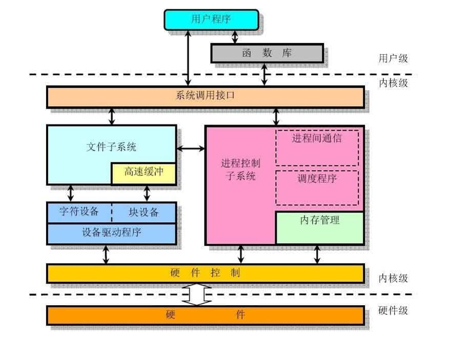

## 操作系统

**本质上是一个运行在计算机上的软件程序 ，用于管理计算机硬件和软件资源。**

**内核（Kernel）是操作系统的核心部分，它负责系统的内存管理，硬件设备的管理，文件系统的管理以及应用程序的管理**。

### 系统调用

进程在系统上的运行分为两个级别：

1. 用户态 (user mode) ：用户态运行的进程可以直接读取用户程序的数据。
2. 系统态 (kernel mode) ：系统态运行的进程或程序几乎可以访问计算机的任何资源，不受限制。

在用户程序中，凡是与系统态级别的资源有关的操作 (如文件管理、进程控制、内存管理等)，都必须通过**系统调用**方式向操作系统提出服务请求，并由操作系统代为完成。

系统调用按功能大致可分为如下几类：

- 设备管理。完成设备的请求或释放，以及设备启动等功能。
- 文件管理。完成文件的读、写、创建及删除等功能。
- 进程控制。完成进程的创建、撤销、阻塞及唤醒等功能。
- 进程通信。完成进程之间的消息传递或信号传递等功能。
- 内存管理。完成内存的分配、回收以及获取作业占用内存区大小及地址等功能。

### 进程和线程

#### 进程和线程的区别？

从 JVM 的角度来解释进程和线程的区别。

一个进程中可以有多个线程。线程是进程划分成的更小的运行单位。

多个线程共享**堆**和**方法区 (元空间)**。

每个线程有自己的**程序计数器**、**虚拟机栈** 和 **本地方法栈**。

线程执行开销小，但不利于资源的管理和保护；而进程正相反。

#### 进程/线程有哪几种状态？

- **创建状态 (new)** ：进程正在被创建，尚未到就绪状态。
- **就绪状态 (ready)** ：进程已处于准备运行状态，即进程获得了除了处理器之外的一切所需资源，一旦得到处理器资源 (处理器分配的时间片) 即可运行。
- **运行状态 (running)** ：进程正在处理器上上运行。
- **阻塞状态 (waiting)** ：又称为等待状态，进程正在等待某一事件而暂停运行如等待某资源为可用或等待 IO 操作完成。即使处理器空闲，该进程也不能运行。
- **结束状态 (terminated)** ：进程正在从系统中消失。可能是进程正常结束或其他原因中断退出运行。

#### 进程间的通信方式？

1. ~~**管道/匿名管道(Pipes)** ：用于具有亲缘关系的父子进程间或者兄弟进程之间的通信。~~
2. ~~**有名管道(Names Pipes)** : 匿名管道由于没有名字，只能用于亲缘关系的进程间通信。为了克服这个缺点，提出了有名管道。有名管道严格遵循**先进先出(first in first out)**。有名管道以磁盘文件的方式存在，可以实现本机任意两个进程通信。~~
3. ~~**信号(Signal)** ：信号是一种比较复杂的通信方式，用于通知接收进程某个事件已经发生；~~
4. ~~**消息队列(Message Queuing)** ：消息队列是消息的链表,具有特定的格式,存放在内存中并由消息队列标识符标识。管道和消息队列的通信数据都是先进先出的原则。与管道（无名管道：只存在于内存中的文件；命名管道：存在于实际的磁盘介质或者文件系统）不同的是消息队列存放在内核中，只有在内核重启(即，操作系统重启)或者显式地删除一个消息队列时，该消息队列才会被真正的删除。消息队列可以实现消息的随机查询,消息不一定要以先进先出的次序读取,也可以按消息的类型读取.比 FIFO 更有优势。**消息队列克服了信号承载信息量少，管道只能承载无格式字 节流以及缓冲区大小受限等缺点。**~~
5. ~~**信号量(Semaphores)** ：信号量是一个计数器，用于多进程对共享数据的访问，信号量的意图在于进程间同步。这种通信方式主要用于解决与同步相关的问题并避免竞争条件。~~
6. ~~**共享内存(Shared memory)** ：使得多个进程可以访问同一块内存空间，不同进程可以及时看到对方进程中对共享内存中数据的更新。这种方式需要依靠某种同步操作，如互斥锁和信号量等。可以说这是最有用的进程间通信方式。~~
7. ~~**套接字(Sockets)** : 此方法主要用于在客户端和服务器之间通过网络进行通信。套接字是支持 TCP/IP 的网络通信的基本操作单元，可以看做是不同主机之间的进程进行双向通信的端点，简单的说就是通信的两方的一种约定，用套接字中的相关函数来完成通信过程。~~

？

#### 线程间的同步的方式？

线程同步是两个或多个共享资源的线程的并发执行。应该同步线程以避免资源使用冲突。

1. **互斥量 (Mutex)**：采用互斥对象机制，只有拥有互斥对象的线程才有访问公共资源的权限。因为互斥对象只有一个，所以可以保证公共资源不会被多个线程同时访问。比如 Java 中的 synchronized 关键词和各种 Lock 都是这种机制。
2. **信号量 (Semaphore)**：它允许同一时刻多个线程访问同一资源，但是需要控制同一时刻访问此资源的最大线程数量。
3. **事件 (Event)**：通过通知 (`Wait/Notify`) 操作的方式来保持多线程同步。

#### 进程的调度算法？

为了确定首先执行哪个进程、最后执行哪个进程，以实现最大 CPU 利用率。

- **先到先服务 (FCFS) 调度算法**：从就绪队列中选择一个最先进入该队列的进程为之分配资源。

- **短作业优先 (SJF) 的调度算法**：从就绪队列中选出一个估计运行时间最短的进程为之分配资源。

- **时间片轮转 RR(Round robin) 调度算法**：每个进程被分配一个时间段，即该进程允许运行的时间。

- **多级反馈队列调度算法**：

  UNIX 使用的调度算法。既能使高优先级的作业得到响应又能使短作业迅速完成。

  * 该方法设置了多个不同优先级的就绪队列，并赋予各个队列大小不同的时间片，使优先级越高的时间片越小。

  * 新就绪的进程总是进入最高优先级队列的队尾，并按 FCFS 原则等待调度；当轮到该进程执行时，如果不能在规定的时间片内完成，就会转入第二级队列末尾，再同样按 FCFS 原则等待调度，……，如此下去，当一个长作业从第一级队列降到最后一级队列时，便在该队列中采取 RR 算法运行。

  * 系统总是调度第一级队列中的进程执行，仅当第一级队列空时，才调度第二级上队列上的进程执行。以此类推，仅当第 1~（i - 1）级队列空时，才调度第 i 级队列上的程序执行。

- **优先级调度**：为每个流程分配优先级，首先执行具有最高优先级的进程，依此类推。具有相同优先级的进程以 FCFS 方式执行。可以根据内存要求，时间要求或任何其他资源要求来确定优先级。

#### 什么是死锁？

多个线程同时无限期地阻塞，它们中的一个或者全部都在等待某个资源被释放。程序不能正常终止。

#### 产生死锁的四个必要条件？

- 互斥条件：该资源任意一个时刻只由一个线程占用。
- 请求与保持条件：一个线程因请求资源而阻塞时，不释放已经获得的资源。
- 不剥夺条件：线程已获得的资源在未使用完之前不能被其他线程强行剥夺，只有自己使用完毕后才释放资源。
- 循环等待条件：若干线程之间形成循环等待资源关系。

#### 如何预防死锁？

1. **破坏请求与保持条件**：一次性申请所有的资源。
2. **破坏不剥夺条件**：占用部分资源的线程进一步申请其他资源时，如果申请不到，可以主动释放它占有的资源。
3. **破坏循环等待条件**：线程按顺序申请资源，按反序释放资源，这样破坏了循环等待条件。

#### 如何避免死锁？

避免死锁就是在资源分配时，借助于算法 (比如银行家算法) 对资源分配进行计算评估，使其进入安全状态。

####  死锁检测？

先画出进程资源分配图。

利用下列步骤编写一个 **死锁检测** 程序，检测系统是否产生了死锁。

1. 如果进程-资源分配图中无环路，则此时系统没有发生死锁
2. 如果进程-资源分配图中有环路，且每个资源类仅有一个资源，则系统中已经发生了死锁。
3. 如果进程-资源分配图中有环路，且涉及到的资源类有多个资源，此时系统未必会发生死锁。

### 内存管理

操作系统的内存管理主要负责内存的分配与回收，将逻辑地址转换成相应的物理地址等功能。

#### 内存管理机制？

简单分为**连续分配管理方式**和**非连续分配管理方式**这两种。

连续分配管理方式是指为一个用户程序分配一个连续的内存空间，常见的如 **块式管理** 。同样地，非连续分配管理方式允许一个程序使用的内存分布在不相邻的内存中，常见的如**页式管理** 和 **段式管理**。

1. **块式管理**：将内存分为固定大小的块，以块为单位分配给程序。如果程序运行只需要很小的空间，分配的内存会有很大浪费。这些浪费的空间称为碎片。

2. **页式管理**：把主存分为大小相等且固定的一页一页的形式，页较小，相比于块式管理的划分粒度更小，提高了内存利用率，减少了碎片。页式管理通过页表对应逻辑地址和物理地址。

   ...

3. **段式管理**：页式管理虽然提高了内存利用率，但是页式管理其中的页并无任何实际意义。 段式管理把主存分为一段段的，段是有实际意义的，每个段定义了一组逻辑信息 (例如：主程序段 MAIN、子程序段 X、数据段 D 及栈段 S 等)。 段式管理通过段表对应逻辑地址和物理地址。

   ... 

4. **段页式管理**：结合了段式管理和页式管理的优点。把主存先分成若干段，每个段又分成若干页。

页是物理单位，段是逻辑单位。分页可以有效提高内存利用率，分段可以更好满足用户需求。

#### 分页机制和分段机制的共同点和区别

1. 共同点：
   - 分页机制和分段机制都是为了提高内存利用率，减少内存碎片。
   - 页和段都是离散存储的，每个页和段中的内存是连续的。
2. 区别：
   - 页的大小是固定的，由操作系统决定；而段的大小不固定，取决于我们当前运行的程序。
   - 分页仅仅是为了满足操作系统内存管理的需求，而段是逻辑信息的单位，在程序中可以体现为代码段，数据段，能够更好满足用户的需要。

#### 逻辑(虚拟)地址和物理地址

比如在 C 语言中，指针里面存储的数值就可以理解成为内存里的一个地址，这个地址是逻辑地址，逻辑地址由操作系统决定。物理地址指的是内存单元真正的地址。

#### 为什么需要虚拟地址空间？

直接操作物理地址，在多个程序同时运行时容易造成问题。

通过虚拟地址访问内存有以下优势：

- 程序可以使用一系列相邻的虚拟地址来访问物理内存中不相邻的内存。
- 不同进程使用的虚拟地址彼此隔离。一个进程中的代码无法更改正在由另一进程或操作系统使用的物理内存。

#### 快表和多级页表？

在分页内存管理中，很重要的两点是：

1. 虚拟地址到物理地址的转换要快。
2. 解决虚拟地址空间大，页表也会很大的问题。

##### 快表

为了提高虚拟地址到物理地址的转换速度，操作系统在 **页表方案** 基础之上引入了 **快表** 来加速虚拟地址到物理地址的转换。我们可以把快表理解为一种特殊的高速缓冲存储器（Cache），其中的内容是页表的一部分或者全部内容。作为页表的 Cache，它的作用与页表相似，但是提高了访问速率。由于采用页表做地址转换，读写内存数据时 CPU 要访问两次主存。有了快表，有时只要访问一次高速缓冲存储器，一次主存，这样可加速查找并提高指令执行速度。

使用快表之后的地址转换流程是这样的：

1. 根据虚拟地址中的页号查快表；
2. 如果该页在快表中，直接从快表中读取相应的物理地址；
3. 如果该页不在快表中，就访问内存中的页表，再从页表中得到物理地址，同时将页表中的该映射表项添加到快表中；
4. 当快表填满后，又要登记新页时，就按照一定的淘汰策略淘汰掉快表中的一个页。

##### 多级页表

引入多级页表的主要目的是为了避免把全部页表一直放在内存中占用过多空间，特别是那些根本就不需要的页表就不需要保留在内存中。

以空间换时间。

### 虚拟内存

通过 **虚拟内存** 可以让程序可以拥有超过系统物理内存大小的可用内存空间 (使用硬盘空间来扩展内存)。

虚拟内存为每个进程提供了一个一致的、私有的地址空间，它让每个进程产生了一种自己在独享主存的错觉（每个进程拥有一片连续完整的内存空间）。

#### 局部性原理

1. **时间局部性**：如果程序中的某条指令一旦执行，不久以后该指令可能再次执行；如果某数据被访问过，不久以后该数据可能再次被访问。产生时间局部性的典型原因，是由于在程序中存在着大量的循环操作。
2. **空间局部性**：一旦程序访问了某个存储单元，在不久之后，其附近的存储单元也将被访问，即程序在一段时间内所访问的地址，可能集中在一定的范围之内。

#### 虚拟内存的技术实现？

1. **请求分页存储管理**：建立在分页管理之上，为了支持虚拟存储器功能而增加了请求调页功能和页面置换功能。请求分页存储管理中，在作业开始运行之前，仅装入当前要执行的部分段即可运行。假如在作业运行的过程中发现要访问的页面不在内存 (**缺页中断**)，则由处理器通知操作系统按照对应的页面置换算法将相应的页面调入到主存，将暂时不用的页面置换到外存。
2. **请求分段存储管理**：建立在分段存储管理之上，增加了请求调段功能、分段置换功能。请求分段储存管理方式就如同请求分页储存管理方式一样，在作业开始运行之前，仅装入当前要执行的部分段即可运行；在执行过程中，可使用请求调入中断动态装入要访问但又不在内存的程序段；当内存空间已满，而又需要装入新的段时，根据置换功能适当调出某个段，以便腾出空间而装入新的段。
3. **请求段页式存储管理**

#### 页面置换算法？

当发生缺页中断时，如果当前内存中并没有空闲的页面，操作系统就必须在内存选择一个页面将其移出内存，以便为即将调入的页面让出空间。用来选择淘汰哪一页的规则叫做页面置换算法，我们可以把页面置换算法看成是淘汰页面的规则。

- **OPT 页面置换算法（最佳页面置换算法）** ：最佳(Optimal, OPT)置换算法所选择的被淘汰页面将是以后永不使用的，或者是在最长时间内不再被访问的页面,这样可以保证获得最低的缺页率。但由于人们目前无法预知进程在内存下的若千页面中哪个是未来最长时间内不再被访问的，因而该算法无法实现。一般作为衡量其他置换算法的方法。
- **FIFO（First In First Out） 页面置换算法（先进先出页面置换算法）** : 总是淘汰最先进入内存的页面，即选择在内存中驻留时间最久的页面进行淘汰。
- **LRU （Least Recently Used）页面置换算法（最近最久未使用页面置换算法）** ：LRU 算法赋予每个页面一个访问字段，用来记录一个页面自上次被访问以来所经历的时间 T，当须淘汰一个页面时，选择现有页面中其 T 值最大的，即最近最久未使用的页面予以淘汰。
- **LFU （Least Frequently Used）页面置换算法（最少使用页面置换算法）** : 该置换算法选择在之前时期使用最少的页面作为淘汰页。

