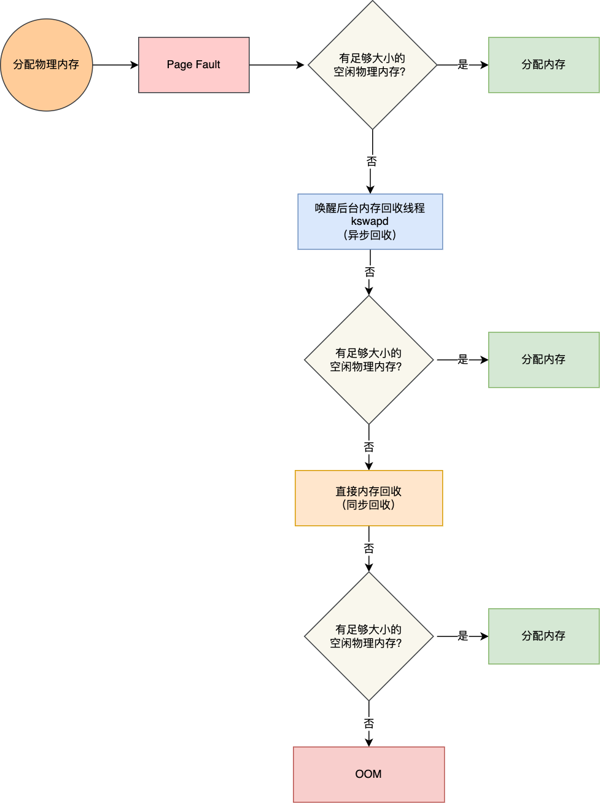

# 操作系统

**本质上是一个运行在计算机上的软件程序 ，用于管理计算机硬件和软件资源。**

## 内核

**内核作为应用连接硬件设备的桥梁**，应用程序只需关心与内核交互，不用关心硬件的细节。

---

### 内核有哪些能力？

- 管理进程、线程，决定哪个进程、线程使用 CPU，也就是**进程调度**的能力；
- 管理内存，决定内存的分配和回收，也就是**内存管理**的能力；
- 管理硬件设备，为进程与硬件设备之间提供通信能力，也就是**硬件通信**能力；
- **提供系统调用**，如果应用程序要运行更高权限运行的服务，那么就需要有系统调用，它是用户程序与操作系统之间的接口。

### 内核是怎么工作的？

操作系统把内存分成了两个区域：

- 内核空间，只有内核程序可以访问；
- 用户空间，专门给应用程序使用；

用户空间的代码只能访问一个局部的内存空间，而内核空间的代码可以访问所有内存空间。

当程序使用用户空间时，该程序在**用户态**执行，而当程序使内核空间时，程序则在**内核态**执行。

#### 系统调用

用来执行内核态才能执行的操作，例如读文件。

当应用程序使用系统调用时，会产生一个中断。发生中断后，CPU 会中断当前在执行的用户程序，转而执行内核程序。内核处理完后，主动触发中断，把 CPU 执行权限交回给用户程序，回到用户态继续工作。

## 进程管理

### 进程和线程的区别？

从 JVM 的角度来解释进程和线程的区别。

一个进程中可以有多个线程。线程是进程划分成的更小的运行单位。

多个线程共享**堆**和**方法区 (元空间)**。

每个线程有自己的**程序计数器**、**虚拟机栈** 和 **本地方法栈**。

线程执行开销小，但不利于资源的管理和保护；而进程正相反。

#### 进程/线程有哪几种状态？

- **创建状态 (new)** ：进程正在被创建，尚未到就绪状态。
- **就绪状态 (ready)** ：进程已处于准备运行状态，即进程获得了除了处理器之外的一切所需资源，一旦得到处理器资源 (处理器分配的时间片) 即可运行。
- **运行状态 (running)** ：进程正在处理器上上运行。
- **阻塞状态 (waiting)** ：又称为等待状态，进程正在等待某一事件而暂停运行如等待某资源为可用或等待 IO 操作完成。即使处理器空闲，该进程也不能运行。
- **结束状态 (terminated)** ：进程正在从系统中消失。可能是进程正常结束或其他原因中断退出运行。

如果有大量处于阻塞状态的进程，进程可能会占用着物理内存空间，显然不是我们所希望的，毕竟物理内存空间是有限的，被阻塞状态的进程占用着物理内存就一种浪费物理内存的行为。

所以，在虚拟内存管理的操作系统中，通常会把阻塞状态的进程的物理内存空间换出到硬盘，等需要再次运行的时候，再从硬盘换入到物理内存。

那么，就需要一个新的状态，来**描述进程没有占用实际的物理内存空间的情况，这个状态就是挂起状态**。这跟阻塞状态是不一样，阻塞状态是等待某个事件的返回。

另外，挂起状态可以分为两种：

- **阻塞挂起状态：**进程在外存（硬盘）并等待某个事件的出现；
- **就绪挂起状态：**进程在外存（硬盘），但只要进入内存，即刻立刻运行；

#### 进程间的通信方式？

1. **管道/匿名管道(Pipes)** ：用于具有亲缘关系的父子进程间或者兄弟进程之间的通信。
2. **有名管道(Names Pipes)** : 匿名管道由于没有名字，只能用于亲缘关系的进程间通信。为了克服这个缺点，提出了有名管道。有名管道严格遵循**先进先出(first in first out)**。有名管道以磁盘文件的方式存在，可以实现本机任意两个进程通信。
3. **信号(Signal)** ：信号是一种比较复杂的通信方式，用于通知接收进程某个事件已经发生；
4. **消息队列(Message Queuing)** ：消息队列是消息的链表,具有特定的格式,存放在内存中并由消息队列标识符标识。管道和消息队列的通信数据都是先进先出的原则。与管道（无名管道：只存在于内存中的文件；命名管道：存在于实际的磁盘介质或者文件系统）不同的是消息队列存放在内核中，只有在内核重启(即，操作系统重启)或者显式地删除一个消息队列时，该消息队列才会被真正的删除。消息队列可以实现消息的随机查询,消息不一定要以先进先出的次序读取,也可以按消息的类型读取.比 FIFO 更有优势。**消息队列克服了信号承载信息量少，管道只能承载无格式字 节流以及缓冲区大小受限等缺点。**
5. **信号量(Semaphores)** ：信号量是一个计数器，用于多进程对共享数据的访问，信号量的意图在于进程间同步。这种通信方式主要用于解决与同步相关的问题并避免竞争条件。
6. **共享内存(Shared memory)** ：使得多个进程可以访问同一块内存空间，不同进程可以及时看到对方进程中对共享内存中数据的更新。这种方式需要依靠某种同步操作，如互斥锁和信号量等。可以说这是最有用的进程间通信方式。
7. **套接字(Sockets)** : 此方法主要用于在客户端和服务器之间通过网络进行通信。套接字是支持 TCP/IP 的网络通信的基本操作单元，可以看做是不同主机之间的进程进行双向通信的端点，简单的说就是通信的两方的一种约定，用套接字中的相关函数来完成通信过程。

由于每个进程的用户空间都是独立的，不能相互访问，这时就需要借助内核空间来实现进程间通信，原因很简单，每个进程都是共享一个内核空间。

Linux 内核提供了不少进程间通信的方式，其中最简单的方式就是管道，管道分为「匿名管道」和「命名管道」。

**匿名管道**顾名思义，它没有名字标识，匿名管道是特殊文件只存在于内存，没有存在于文件系统中，shell 命令中的「`|`」竖线就是匿名管道，通信的数据是**无格式的流并且大小受限**，通信的方式是**单向**的，数据只能在一个方向上流动，如果要双向通信，需要创建两个管道，**匿名管道只能用于存在父子关系的进程间通信**，生命周期随着进程创建而建立，随着进程终止而消失。

**命名管道**突破了匿名管道只能在亲缘关系进程间的通信限制，因为使用命名管道的前提，需要在文件系统创建一个类型为 p 的设备文件，那么毫无关系的进程就可以通过这个设备文件进行通信。另外，不管是匿名管道还是命名管道，进程写入的数据都是**缓存在内核**中，另一个进程读取数据时候自然也是从内核中获取，同时通信数据都遵循**先进先出**原则，不支持 lseek 之类的文件定位操作。

**消息队列**克服了管道通信的数据是无格式的字节流的问题，消息队列实际上是保存在内核的「消息链表」，消息队列的消息体是可以用户自定义的数据类型，发送数据时，会被分成一个一个独立的消息体，当然接收数据时，也要与发送方发送的消息体的数据类型保持一致，这样才能保证读取的数据是正确的。消息队列通信的速度不是最及时的，毕竟**每次数据的写入和读取都需要经过用户态与内核态之间的拷贝过程。**

**共享内存**可以解决消息队列通信中用户态与内核态之间数据拷贝过程带来的开销，**它直接分配一个共享空间，每个进程都可以直接访问**，就像访问进程自己的空间一样快捷方便，不需要陷入内核态或者系统调用，大大提高了通信的速度，享有**最快**的进程间通信方式之名。但是便捷高效的共享内存通信，**带来新的问题，多进程竞争同个共享资源会造成数据的错乱。**

那么，就需要**信号量**来保护共享资源，以确保任何时刻只能有一个进程访问共享资源，这种方式就是互斥访问。**信号量不仅可以实现访问的互斥性，还可以实现进程间的同步**，信号量其实是一个计数器，表示的是资源个数，其值可以通过两个原子操作来控制，分别是 **P 操作和 V 操作**。

与信号量名字很相似的叫**信号**，它俩名字虽然相似，但功能一点儿都不一样。信号是**异步通信机制**，信号可以在应用进程和内核之间直接交互，内核也可以利用信号来通知用户空间的进程发生了哪些系统事件，信号事件的来源主要有硬件来源（如键盘 Cltr+C ）和软件来源（如 kill 命令），一旦有信号发生，**进程有三种方式响应信号 1. 执行默认操作、2. 捕捉信号、3. 忽略信号**。有两个信号是应用进程无法捕捉和忽略的，即 `SIGKILL` 和 `SIGSTOP`，这是为了方便我们能在任何时候结束或停止某个进程。

前面说到的通信机制，都是工作于同一台主机，如果**要与不同主机的进程间通信，那么就需要 Socket 通信了**。Socket 实际上不仅用于不同的主机进程间通信，还可以用于本地主机进程间通信，可根据创建 Socket 的类型不同，分为三种常见的通信方式，一个是基于 TCP 协议的通信方式，一个是基于 UDP 协议的通信方式，一个是本地进程间通信方式。

#### 线程通信间的方式呢？

同个进程下的线程之间都是共享进程的资源，只要是共享变量都可以做到线程间通信，比如全局变量，所以对于线程间关注的不是通信方式，而是关注多线程竞争共享资源的问题，信号量也同样可以在线程间实现互斥与同步：

- 互斥的方式，可保证任意时刻只有一个线程访问共享资源；
- 同步的方式，可保证线程 A 应在线程 B 之前执行；

#### 线程间的同步的方式？

线程同步是两个或多个共享资源的线程的并发执行。应该同步线程以避免资源使用冲突。

1. **互斥量 (Mutex)**：采用互斥对象机制，只有拥有互斥对象的线程才有访问公共资源的权限。因为互斥对象只有一个，所以可以保证公共资源不会被多个线程同时访问。比如 Java 中的 synchronized 关键词和各种 Lock 都是这种机制。
2. **信号量 (Semaphore)**：它允许同一时刻多个线程访问同一资源，但是需要控制同一时刻访问此资源的最大线程数量。
3. **事件 (Event)**：通过通知 (`Wait/Notify`) 操作的方式来保持多线程同步。

#### 进程的调度算法？

为了确定首先执行哪个进程、最后执行哪个进程，以实现最大 CPU 利用率。

- **先到先服务 (FCFS) 调度算法**：从就绪队列中选择一个最先进入该队列的进程为之分配资源。

- **短作业优先 (SJF) 的调度算法**：从就绪队列中选出一个估计运行时间最短的进程为之分配资源。

- **时间片轮转 RR(Round robin) 调度算法**：每个进程被分配一个时间段，即该进程允许运行的时间。

- **多级反馈队列调度算法**：

  UNIX 使用的调度算法。既能使高优先级的作业得到响应又能使短作业迅速完成。

  * 该方法设置了多个不同优先级的就绪队列，并赋予各个队列大小不同的时间片，使优先级越高的时间片越小。

  * 新就绪的进程总是进入最高优先级队列的队尾，并按 FCFS 原则等待调度；当轮到该进程执行时，如果不能在规定的时间片内完成，就会转入第二级队列末尾，再同样按 FCFS 原则等待调度，……，如此下去，当一个长作业从第一级队列降到最后一级队列时，便在该队列中采取 RR 算法运行。

  * 系统总是调度第一级队列中的进程执行，仅当第一级队列空时，才调度第二级上队列上的进程执行。以此类推，仅当第 1~（i - 1）级队列空时，才调度第 i 级队列上的程序执行。

- **优先级调度**：为每个流程分配优先级，首先执行具有最高优先级的进程，依此类推。具有相同优先级的进程以 FCFS 方式执行。可以根据内存要求，时间要求或任何其他资源要求来确定优先级。

#### 什么是死锁？

多个线程同时无限期地阻塞，它们中的一个或者全部都在等待某个资源被释放。程序不能正常终止。

#### 产生死锁的四个必要条件？

- 互斥条件：该资源任意一个时刻只由一个线程占用。
- 请求与保持条件：一个线程因请求资源而阻塞时，不释放已经获得的资源。
- 不剥夺条件：线程已获得的资源在未使用完之前不能被其他线程强行剥夺，只有自己使用完毕后才释放资源。
- 循环等待条件：若干线程之间形成循环等待资源关系。

#### 如何预防死锁？

1. **破坏请求与保持条件**：一次性申请所有的资源。
2. **破坏不剥夺条件**：占用部分资源的线程进一步申请其他资源时，如果申请不到，可以主动释放它占有的资源。
3. **破坏循环等待条件**：线程按顺序申请资源，按反序释放资源，这样破坏了循环等待条件。

#### 如何避免死锁？

避免死锁就是在资源分配时，借助于算法 (比如银行家算法) 对资源分配进行计算评估，使其进入安全状态。

####  死锁检测？

先画出进程资源分配图。

利用下列步骤编写一个 **死锁检测** 程序，检测系统是否产生了死锁。

1. 如果进程-资源分配图中无环路，则此时系统没有发生死锁
2. 如果进程-资源分配图中有环路，且每个资源类仅有一个资源，则系统中已经发生了死锁。
3. 如果进程-资源分配图中有环路，且涉及到的资源类有多个资源，此时系统未必会发生死锁。

### 内存管理

操作系统的内存管理主要负责内存的分配与回收，将逻辑地址转换成相应的物理地址等功能。

#### 内存管理机制？

简单分为**连续分配管理方式**和**非连续分配管理方式**这两种。

连续分配管理方式是指为一个用户程序分配一个连续的内存空间，常见的如 **块式管理** 。同样地，非连续分配管理方式允许一个程序使用的内存分布在不相邻的内存中，常见的如**页式管理** 和 **段式管理**。

1. **块式管理**：将内存分为固定大小的块，以块为单位分配给程序。如果程序运行只需要很小的空间，分配的内存会有很大浪费。这些浪费的空间称为碎片。

2. **页式管理**：把主存分为大小相等且固定的一页一页的形式，页较小，相比于块式管理的划分粒度更小，提高了内存利用率，减少了碎片。页式管理通过页表对应逻辑地址和物理地址。

   ...

3. **段式管理**：页式管理虽然提高了内存利用率，但是页式管理其中的页并无任何实际意义。 段式管理把主存分为一段段的，段是有实际意义的，每个段定义了一组逻辑信息 (例如：主程序段 MAIN、子程序段 X、数据段 D 及栈段 S 等)。 段式管理通过段表对应逻辑地址和物理地址。

   ... 

4. **段页式管理**：结合了段式管理和页式管理的优点。把主存先分成若干段，每个段又分成若干页。

页是物理单位，段是逻辑单位。分页可以有效提高内存利用率，分段可以更好满足用户需求。

#### 分页机制和分段机制的共同点和区别

1. 共同点：
   - 分页机制和分段机制都是为了提高内存利用率，减少内存碎片。
   - 页和段都是离散存储的，每个页和段中的内存是连续的。
2. 区别：
   - 页的大小是固定的，由操作系统决定；而段的大小不固定，取决于我们当前运行的程序。
   - 分页仅仅是为了满足操作系统内存管理的需求，而段是逻辑信息的单位，在程序中可以体现为代码段，数据段，能够更好满足用户的需要。

#### 逻辑(虚拟)地址和物理地址

比如在 C 语言中，指针里面存储的数值就可以理解成为内存里的一个地址，这个地址是逻辑地址，逻辑地址由操作系统决定。物理地址指的是内存单元真正的地址。

#### 为什么需要虚拟地址空间？

直接操作物理地址，在多个程序同时运行时容易造成问题。

通过虚拟地址访问内存有以下优势：

- 程序可以使用一系列相邻的虚拟地址来访问物理内存中不相邻的内存。
- 不同进程使用的虚拟地址彼此隔离。一个进程中的代码无法更改正在由另一进程或操作系统使用的物理内存。

#### 快表和多级页表？

在分页内存管理中，很重要的两点是：

1. 虚拟地址到物理地址的转换要快。
2. 解决虚拟地址空间大，页表也会很大的问题。

##### 快表

为了提高虚拟地址到物理地址的转换速度，操作系统在 **页表方案** 基础之上引入了 **快表** 来加速虚拟地址到物理地址的转换。我们可以把快表理解为一种特殊的高速缓冲存储器（Cache），其中的内容是页表的一部分或者全部内容。作为页表的 Cache，它的作用与页表相似，但是提高了访问速率。由于采用页表做地址转换，读写内存数据时 CPU 要访问两次主存。有了快表，有时只要访问一次高速缓冲存储器，一次主存，这样可加速查找并提高指令执行速度。

使用快表之后的地址转换流程是这样的：

1. 根据虚拟地址中的页号查快表；
2. 如果该页在快表中，直接从快表中读取相应的物理地址；
3. 如果该页不在快表中，就访问内存中的页表，再从页表中得到物理地址，同时将页表中的该映射表项添加到快表中；
4. 当快表填满后，又要登记新页时，就按照一定的淘汰策略淘汰掉快表中的一个页。

##### 多级页表

引入多级页表的主要目的是为了避免把全部页表一直放在内存中占用过多空间，特别是那些根本就不需要的页表就不需要保留在内存中。

以空间换时间。

### 虚拟内存

* 为每个进程提供了一个一致的、私有的地址空间，让每个进程拥有一片连续完整的内存空间。解决了多进程之间地址冲突的问题。
* 可以让程序可以拥有超过系统物理内存大小的可用内存空间 (使用硬盘空间来扩展内存)。

操作系统引入了虚拟内存，进程持有的虚拟地址会通过 CPU 芯片中的**内存管理单元（MMU）**的映射关系，来转换变成物理地址，然后再通过物理地址访问内存。

#### 内存分配过程

应用程序通过 malloc 函数申请内存的时候，实际上申请的是虚拟内存，此时并不会分配物理内存。

当应用程序读写了这块虚拟内存，CPU 就会去访问这个虚拟内存， 这时会发现这个虚拟内存没有映射到物理内存， CPU 就会产生**缺页中断**，进程会从用户态切换到内核态，并将缺页中断交给内核的 Page Fault Handler （缺页中断函数）处理。

缺页中断处理函数会看是否有空闲的物理内存，如果有，就直接分配物理内存，并建立虚拟内存与物理内存之间的映射关系。

如果没有空闲的物理内存，那么内核就会开始进行**回收内存**的工作，回收的方式主要是两种：直接内存回收和后台内存回收。

##### 没有开启 **Swap** 机制：

如果直接内存回收后，空闲的物理内存仍然无法满足此次物理内存的申请，那么内核就会**触发 OOM （Out of Memory）机制**。

OOM Killer 机制会根据算法选择一个占用物理内存较高的进程，然后将其杀死，以便释放内存资源，如果物理内存依然不足，OOM Killer 会继续杀死占用物理内存较高的进程，直到释放足够的内存位置。

---

##### 开启 Swap 机制：

当系统的物理内存不够用的时候，就需要将物理内存中的一部分空间释放出来，以供当前运行的程序使用。那些被释放的空间可能来自一些很长时间没有什么操作的程序，这些被释放的空间会被临时保存到磁盘，等到那些程序要运行时，再从磁盘中恢复保存的数据到内存中。

另外，当内存使用存在压力的时候，会开始触发内存回收行为，会把这些不常访问的内存先写到磁盘中，然后释放这些内存，给其他更需要的进程使用。再次访问这些内存时，重新从磁盘读入内存就可以了。

Swap 就是把一块磁盘空间或者本地文件，当成内存来使用，它包含换出和换入两个过程：

- **换出（Swap Out）** ，是把进程暂时不用的内存数据存储到磁盘中，并释放这些数据占用的内存；
- **换入（Swap In）**，是在进程再次访问这些内存的时候，把它们从磁盘读到内存中来；

#### 局部性原理

1. **时间局部性**：如果程序中的某条指令一旦执行，不久以后该指令可能再次执行；如果某数据被访问过，不久以后该数据可能再次被访问。产生时间局部性的典型原因，是由于在程序中存在着大量的循环操作。
2. **空间局部性**：一旦程序访问了某个存储单元，在不久之后，其附近的存储单元也将被访问，即程序在一段时间内所访问的地址，可能集中在一定的范围之内。

#### 虚拟内存的技术实现？

1. **请求分页存储管理**：建立在分页管理之上，为了支持虚拟存储器功能而增加了请求调页功能和页面置换功能。请求分页存储管理中，在作业开始运行之前，仅装入当前要执行的部分段即可运行。假如在作业运行的过程中发现要访问的页面不在内存 (**缺页中断**)，则由处理器通知操作系统按照对应的页面置换算法将相应的页面调入到主存，将暂时不用的页面置换到外存。
2. **请求分段存储管理**：建立在分段存储管理之上，增加了请求调段功能、分段置换功能。请求分段储存管理方式就如同请求分页储存管理方式一样，在作业开始运行之前，仅装入当前要执行的部分段即可运行；在执行过程中，可使用请求调入中断动态装入要访问但又不在内存的程序段；当内存空间已满，而又需要装入新的段时，根据置换功能适当调出某个段，以便腾出空间而装入新的段。
3. **请求段页式存储管理**

#### 页面置换算法？

当发生缺页中断时，如果当前内存中并没有空闲的页面，操作系统就必须在内存选择一个页面将其移出内存，以便为即将调入的页面让出空间。用来选择淘汰哪一页的规则叫做页面置换算法，我们可以把页面置换算法看成是淘汰页面的规则。

- **OPT 页面置换算法（最佳页面置换算法）** ：最佳(Optimal, OPT)置换算法所选择的被淘汰页面将是以后永不使用的，或者是在最长时间内不再被访问的页面,这样可以保证获得最低的缺页率。但由于人们目前无法预知进程在内存下的若千页面中哪个是未来最长时间内不再被访问的，因而该算法无法实现。一般作为衡量其他置换算法的方法。
- **FIFO（First In First Out） 页面置换算法（先进先出页面置换算法）** : 总是淘汰最先进入内存的页面，即选择在内存中驻留时间最久的页面进行淘汰。
- **LRU （Least Recently Used）页面置换算法（最近最久未使用页面置换算法）** ：LRU 算法赋予每个页面一个访问字段，用来记录一个页面自上次被访问以来所经历的时间 T，当须淘汰一个页面时，选择现有页面中其 T 值最大的，即最近最久未使用的页面予以淘汰。
- **LFU （Least Frequently Used）页面置换算法（最少使用页面置换算法）** : 该置换算法选择在之前时期使用最少的页面作为淘汰页。

