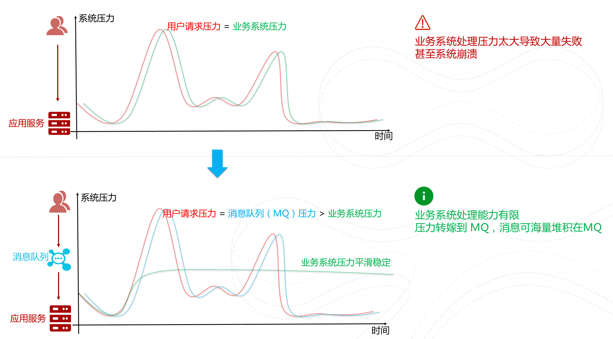

# 消息队列

可以把消息队列看作是一个存放消息的容器，当需要使用消息的时候，直接从容器中取出消息即可。

消息队列是分布式系统中重要的组件之一。

使用消息队列主要是为了通过异步处理提高系统性能和削峰、降低系统耦合性。

队列 Queue 是一种先进先出的数据结构，所以消费消息时也是按照顺序来消费的。

## 为什么要用消息队列

### 通过异步处理提高系统性能（减少响应所需时间）

将用户的请求数据存储到消息队列之后就立即返回结果。随后，系统再对消息进行消费。

因为用户请求数据写入消息队列之后就立即返回响应了，但是请求数据在后续的业务校验、写数据库等操作中可能失败。

因此，**使用消息队列进行异步处理之后，需要适当修改业务流程进行配合**。

比如用户在提交订单之后，订单数据写入消息队列，不能立即返回用户订单提交成功，需要在消息队列的订单消费者进程真正处理完该订单之后，甚至出库后，再通过电子邮件或短信通知用户订单成功，以免交易纠纷。这就类似我们平时手机订火车票和电影票。

### 削峰/限流

**先将短时间高并发产生的事务消息存储在消息队列中，然后后端服务再慢慢根据自己的能力去消费这些消息，这样就避免直接把后端服务打垮。**

> 举例：在电子商务一些秒杀、促销活动中，合理使用消息队列可以有效抵御促销活动刚开始大量订单涌入对系统的冲击。

### 降低系统耦合性

生产者（客户端）发送消息到消息队列中去，接受者（服务端）处理消息，需要消费的系统直接去消息队列取消息进行消费即可而不需要和其他系统有耦合，这显然也提高了系统的扩展性。

**消息队列使用发布-订阅模式工作，消息发送者（生产者）发布消息，一个或多个消息接受者（消费者）订阅消息。** **消息发送者（生产者）和消息接受者（消费者）之间没有直接耦合**，消息发送者将消息发送至分布式消息队列即结束对消息的处理，消息接受者从分布式消息队列获取该消息后进行后续处理，并不需要知道该消息从何而来。

**对新增业务，只要对该类消息感兴趣，即可订阅该消息，对原有系统和业务没有任何影响，从而实现网站业务的可扩展性设计**。

消息接受者对消息进行过滤、处理、包装后，构造成一个新的消息类型，将消息继续发送出去，等待其他消息接受者订阅该消息。因此基于事件（消息对象）驱动的业务架构可以是一系列流程。

另外，为了避免消息队列服务器宕机造成消息丢失，会将成功发送到消息队列的消息存储在消息生产者服务器上，等消息真正被消费者服务器处理后才删除消息。在消息队列服务器宕机后，生产者服务器会选择分布式消息队列服务器集群中的其他服务器发布消息。

## 使用消息队列带来的一些问题

- **系统可用性降低：**在加入 MQ 之前，不用考虑消息丢失或者说 MQ 挂掉等等的情况，但是，引入 MQ 之后就需要去考虑了。
- **系统复杂性提高：**加入 MQ 之后，你需要保证消息没有被重复消费、处理消息丢失的情况、保证消息传递的顺序性等等问题。
- **一致性问题：**消息队列带来的异步可以提高系统响应速度。但是，如果消费者并没有正确消费消，就会导致数据不一致的情况。

## JMS VS AMQP

### JMS

JMS（JAVA Message Service,java 消息服务）是 java 的消息服务，JMS 的客户端之间可以通过 JMS 服务进行异步的消息传输。**JMS（JAVA Message Service，Java 消息服务）API 是一个消息服务的标准或者说是规范**。

**ActiveMQ 就是基于 JMS 规范实现的。**

#### JMS 两种消息模型

##### 点到点（P2P）模型

使用**队列（Queue）**作为消息通信载体；满足 **生产者与消费者模式**。

一条消息只能被一个消费者使用，未被消费的消息在队列中保留直到被消费或超时。

> 比如：我们生产者发送 100 条消息的话，两个消费者来消费一般情况下两个消费者会按照消息发送的顺序各自消费一半（也就是你一个我一个的消费。

##### 发布/订阅（Pub/Sub）模型

发布订阅模型（Pub/Sub） 使用 **主题（Topic）** 作为消息通信载体，类似于 **广播模式**。

发布者发布一条消息，该消息通过主题传递给所有的订阅者，**在一条消息广播之后才订阅的用户则是收不到该条消息的**。

### AMQP

AMQP，即 Advanced Message Queuing Protocol，一个提供统一消息服务的应用层标准 **高级消息队列协议**（二进制应用层协议），是应用层协议的一个开放标准，为面向消息的中间件设计，兼容 JMS。

**RabbitMQ 就是基于 AMQP 协议实现的。**

AMQP 跨语言、跨平台。

提供了五种消息模型：①direct exchange；②fanout exchange；③topic change；④headers exchange；⑤system exchange。本质来讲，后四种和 JMS 的 pub/sub 模型没有太大差别，仅是在路由机制上做了更详细的划分。

## 常见的消息队列对比

| 对比方向 | 概要                                                         |
| -------- | ------------------------------------------------------------ |
| 吞吐量   | 万级的 ActiveMQ 和 RabbitMQ 的吞吐量（ActiveMQ 的性能最差）要比 十万级甚至是百万级的 RocketMQ 和 Kafka 低一个数量级。 |
| 可用性   | 都可以实现高可用。ActiveMQ 和 RabbitMQ 都是基于主从架构实现高可用性。RocketMQ 基于分布式架构。 kafka 也是分布式的，一个数据多个副本，少数机器宕机，不会丢失数据，不会导致不可用 |
| 时效性   | RabbitMQ 基于 erlang 开发，所以并发能力很强，性能极其好，延时很低，达到微秒级。其他三个都是 ms 级。 |
| 功能支持 | 除了 Kafka，其他三个功能都较为完备。 Kafka 功能较为简单，主要支持简单的 MQ 功能，在大数据领域的实时计算以及日志采集被大规模使用，是事实上的标准 |
| 消息丢失 | ActiveMQ 和 RabbitMQ 丢失的可能性非常低， RocketMQ 和 Kafka 理论上不会丢失。 |

**总结：**

- ActiveMQ 的社区算是比较成熟，但是较目前来说，ActiveMQ 的性能比较差，而且版本迭代很慢，不推荐使用。
- RabbitMQ 在吞吐量方面虽然稍逊于 Kafka 和 RocketMQ ，但是由于它基于 erlang 开发，所以并发能力很强，性能极其好，延时很低，达到微秒级。但是也因为 RabbitMQ 基于 erlang 开发，所以国内很少有公司有实力做 erlang 源码级别的研究和定制。如果业务场景对并发量要求不是太高（十万级、百万级），那这四种消息队列中，RabbitMQ 一定是你的首选。如果是大数据领域的实时计算、日志采集等场景，用 Kafka 是业内标准的，绝对没问题，社区活跃度很高，绝对不会黄，何况几乎是全世界这个领域的事实性规范。
- RocketMQ 阿里出品，Java 系开源项目，源代码我们可以直接阅读，然后可以定制自己公司的 MQ，并且 RocketMQ 有阿里巴巴的实际业务场景的实战考验。RocketMQ 社区活跃度相对较为一般，不过也还可以，文档相对来说简单一些，然后接口这块不是按照标准 JMS 规范走的有些系统要迁移需要修改大量代码。还有就是阿里出台的技术，你得做好这个技术万一被抛弃，社区黄掉的风险，那如果你们公司有技术实力我觉得用 RocketMQ 挺好的
- Kafka 的特点其实很明显，就是仅仅提供较少的核心功能，但是提供超高的吞吐量，ms 级的延迟，极高的可用性以及可靠性，而且分布式可以任意扩展。同时 kafka 最好是支撑较少的 topic 数量即可，保证其超高吞吐量。kafka 唯一的一点劣势是有可能消息重复消费，那么对数据准确性会造成极其轻微的影响，在大数据领域中以及日志采集中，这点轻微影响可以忽略这个特性天然适合大数据实时计算以及日志收集。

## Kafka

Kafka 是一个分布式流式处理平台。

流平台具有三个关键功能：

1. **消息队列**：发布和订阅消息流，这个功能类似于消息队列，这也是 Kafka 也被归类为消息队列的原因。
2. **容错的持久方式存储记录消息流**： Kafka 会把消息持久化到磁盘，有效避免了消息丢失的风险。
3. **流式处理平台：** 在消息发布的时候进行处理，Kafka 提供了一个完整的流式处理类库。

### 和其他消息队列相比，Kafka的优势在哪里？

高性能。基于 Scala 和 Java 语言开发，最高可以每秒处理千万级别的消息。

生态系统优秀。Kafka 与周边生态系统的兼容性是最好的，尤其在大数据和流计算领域。

### 什么是 Producer、Consumer、Broker、Topic、Partition？

Kafka 将生产者发布的消息发送到 **Topic（主题）** 中，需要这些消息的消费者可以订阅这些 **Topic（主题）**。

---

* **Producer（生产者）**：产生消息的一方。

* **Consumer（消费者）**：消费消息的一方。

* **Broker（代理）**：可以看作是一个独立的 Kafka 实例。多个 Broker 组成一个 Kafka Cluster，每个 Broker 中含有集群的部分数据。

  * **Topic（主题）**：Producer 将消息发送到特定的主题，Consumer 通过订阅特定的 Topic (主题) 来消费消息。

    * **Partition（分区）**：Kafka 中 Topic 被分成多个 Partition 分区。Topic 是一个**逻辑概念**，Partition 是最小的**存储单元**，掌握着一个 Topic 的部分数据。每个 Partition 都是一个单独的 log 文件，每条记录 (消息) 都以追加的形式写入。

      > 可以将一个 partition 理解为一个队列

      * **Offset (偏移量)**：Partition 中的每条记录都会被分配一个唯一的序号，称为 **Offset**（偏移量）。Offset 是一个递增的、不可变的数字，由 Kafka 自动维护。当一条记录写入 Partition 的时候，它就被追加到 log 文件的末尾，并被分配一个序号，作为 Offset。

        > 向 Topic 发送消息的时候，实际上是被写入某一个 Partition，并赋予 Offset。

### 如何保证消息顺序性？

一个 Topic 如果有多个 Partition 的话，那么从 Topic 这个层面来看，消息是无序的。但单独看 Partition 的话，Partition 内部消息是有序的。所以，一个 Partition 内部消息有序，一个 Topic 跨 Partition 是无序的。

* 如果强制要求 Topic 整体有序，有一种比较简单的方法 **让 Topic 只有一个 Partition**。

Kafka 中发送消息的时候，可以指定 topic, partition, key, data（数据） 4 个参数。

如果发送消息的时候指定了 Partition，所有消息都会被发送到指定的 Partition。并且，同一个 key 的消息可以保证只发送到同一个 partition，这个我们可以采用表/对象的 id 来作为 key 。

* 发送消息的时候指定 key/Partition。

### 如何保证消息不丢失？

#### 生产者丢失消息

生产者 (Producer) 调用`send`方法发送消息之后，消息可能因为网络问题并没有发送过去。因为 `send()` 方法发送消息是异步的操作，所以不能马上得知消息是否发送成功。

* 可以通过 `get()` 方法获取调用结果，但是这样也让它变为了同步操作。一般不推荐这么做。
* 可以采用为其添加回调函数的形式。如果消息发送失败，检查失败的原因之后重新发送即可。需要设置合理的重试次数和重试间隔时间。

#### 消费者丢失消息的情况

消息在被追加到 Partition(分区)的时候都会分配一个特定的偏移量（offset）。偏移量 (offset) 表示 Consumer 当前消费到的 Partition (分区) 的所在的位置。通过偏移量（offset）可以保证消息在分区内的顺序性。

当消费者拉取到了分区的某个消息之后，消费者会自动提交 offset。

当消费者刚拿到这个消息准备进行真正消费的时候，突然挂掉了，消息并没有被消费，但是 offset 却被自动提交了。

针对上述问题，可以 **关闭自动提交 offset，每次在真正消费完消息之后再自己手动提交 offset 。**

但是会带来重复消费的问题。消费完消息之后，还没提交 offset，自己挂了，那么这个消息理论上就会被消费两次。

### 如何保证消息不重复消费？

### Kafka 把 Topic 的多个 Partition 分布在多个 Broker 中的优点？

* 如果把 Topic 的所有 Partition 都放在一个 Broker 上，那么这个 Topic 的可扩展性就大大降低了，会受限于这个 Broker 的 IO 能力。把 Partition 分散开之后，Topic 就可以水平扩展 。如果 Topic 的所有 Partition 都在一个 Broker，那么支持的 Consumer 数量就有限，而分散之后，可以支持更多的 Consumer。
* 一个 Consumer 可以有多个实例，Partition 分布在多个 Broker 的话，Consumer 的多个实例就可以连接不同的 Broker，大大提升了消息处理能力。可以让一个 Consumer 实例负责一个 Partition，这样消息处理既清晰又高效。

### Kafka 的多副本机制了解吗？带来了什么好处？

Kafka 为分区（Partition）引入了多副本（Replica）机制。

分区（Partition）中的多个副本之间会选举出一个 leader，其他副本为 follower。生产者和消费者只与 leader 副本交互。消息发送到 leader 后 follower 副本才能从 leader 副本中拉取消息进行同步。当 leader 副本发生故障时会从 follower 中选举出一个 leader。

* 通过给特定 Topic 指定多个 Partition，而各个 Partition 可以分布在不同的 Broker 上，这样便能提供比较好的并发能力。
* Partition 可以指定对应的 Replica 数, 这也极大地提高了消息存储的安全性, 提高了容灾能力，也相应的增加了所需要的存储空间。

### Zookeeper 在 Kafka 中的作用？

ZooKeeper 主要为 Kafka 提供元数据的管理的功能。

Zookeeper 主要为 Kafka 做了下面这些事情：

1. **Broker 注册**：在 Zookeeper 上会有一个专门**用来进行 Broker 服务器列表记录**的节点。每个 Broker 在启动时，都会到 Zookeeper 上进行注册，即到 `/brokers/ids` 下创建属于自己的节点。每个 Broker 就会将自己的 IP 地址和端口等信息记录到该节点中去。

2. **Topic 注册**：在 Kafka 中，同一个**Topic 的消息会被分成多个分区**并将其分布在多个 Broker 上，**这些分区信息及与 Broker 的对应关系**也都是由 Zookeeper 在维护。

   > 比如创建一个名字为 my-topic 的主题并且它有两个分区。对应到 zookeeper 中会创建这些文件夹：
   >
   > `/brokers/topics/my-topic/Partitions/0`、`/brokers/topics/my-topic/Partitions/1`。

3. **负载均衡**：Kafka 可以给特定 Topic 指定多个 Partition，各个 Partition 也可以分布在不同的 Broker 上。这样便能提供比较好的并发能力。 对于同一个 Topic 的不同 Partition，Kafka 会尽力将这些 Partition 分布到不同的 Broker 服务器上。当生产者产生消息后也会尽量投递到不同 Broker 的 Partition 里面。当 Consumer 消费的时候，Zookeeper 会根据当前的 Partition 数量以及 Consumer 数量来实现动态负载均衡。

### 

