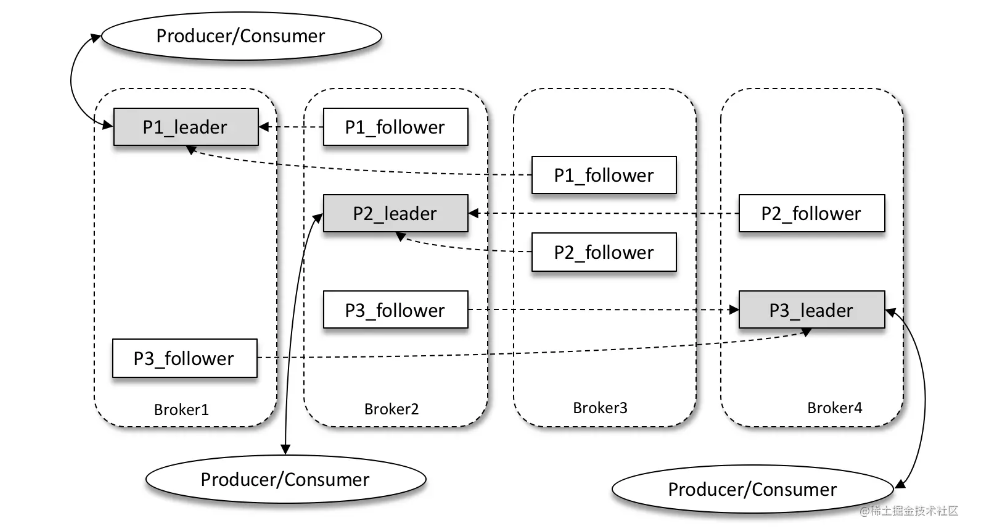

# 消息队列

可以把消息队列看作是一个存放消息的容器，当需要使用消息的时候，直接从容器中取出消息即可。

消息队列是分布式系统中重要的组件之一。

使用消息队列主要是为了通过异步处理提高系统性能和削峰、降低系统耦合性。

队列 Queue 是一种先进先出的数据结构，所以消费消息时也是按照顺序来消费的。

## 为什么要用消息队列

### 通过异步处理提高系统性能（减少响应所需时间）

将用户的请求数据存储到消息队列之后就立即返回结果。随后，系统再对消息进行消费。

因为用户请求数据写入消息队列之后就立即返回响应了，但是请求数据在后续的业务校验、写数据库等操作中可能失败。

因此，**使用消息队列进行异步处理之后，需要适当修改业务流程进行配合**。

比如用户在提交订单之后，订单数据写入消息队列，不能立即返回用户订单提交成功，需要在消息队列的订单消费者进程真正处理完该订单之后，甚至出库后，再通过电子邮件或短信通知用户订单成功，以免交易纠纷。这就类似我们平时手机订火车票和电影票。

### 削峰/限流

**先将短时间高并发产生的事务消息存储在消息队列中，然后后端服务再慢慢根据自己的能力去消费这些消息，这样就避免直接把后端服务打垮。**

> 举例：在电子商务一些秒杀、促销活动中，合理使用消息队列可以有效抵御促销活动刚开始大量订单涌入对系统的冲击。

### 降低系统耦合性

生产者（客户端）发送消息到消息队列中去，接受者（服务端）处理消息，需要消费的系统直接去消息队列取消息进行消费即可而不需要和其他系统有耦合，这显然也提高了系统的扩展性。

**消息队列使用发布-订阅模式工作，消息发送者（生产者）发布消息，一个或多个消息接受者（消费者）订阅消息。** **消息发送者（生产者）和消息接受者（消费者）之间没有直接耦合**，消息发送者将消息发送至分布式消息队列即结束对消息的处理，消息接受者从分布式消息队列获取该消息后进行后续处理，并不需要知道该消息从何而来。

**对新增业务，只要对该类消息感兴趣，即可订阅该消息，对原有系统和业务没有任何影响，从而实现网站业务的可扩展性设计**。

消息接受者对消息进行过滤、处理、包装后，构造成一个新的消息类型，将消息继续发送出去，等待其他消息接受者订阅该消息。因此基于事件（消息对象）驱动的业务架构可以是一系列流程。

另外，为了避免消息队列服务器宕机造成消息丢失，会将成功发送到消息队列的消息存储在消息生产者服务器上，等消息真正被消费者服务器处理后才删除消息。在消息队列服务器宕机后，生产者服务器会选择分布式消息队列服务器集群中的其他服务器发布消息。

## 使用消息队列带来的一些问题

- **系统可用性降低：**在加入 MQ 之前，不用考虑消息丢失或者说 MQ 挂掉等等的情况，但是，引入 MQ 之后就需要去考虑了。
- **系统复杂性提高：**加入 MQ 之后，你需要保证消息没有被重复消费、处理消息丢失的情况、保证消息传递的顺序性等等问题。
- **一致性问题：**消息队列带来的异步可以提高系统响应速度。但是，如果消费者并没有正确消费消，就会导致数据不一致的情况。

## JMS VS AMQP

### JMS

JMS（JAVA Message Service,java 消息服务）是 java 的消息服务，JMS 的客户端之间可以通过 JMS 服务进行异步的消息传输。**JMS（JAVA Message Service，Java 消息服务）API 是一个消息服务的标准或者说是规范**。

**ActiveMQ 就是基于 JMS 规范实现的。**

#### JMS 两种消息模型

##### 点到点（P2P）模型

使用**队列（Queue）**作为消息通信载体；满足 **生产者与消费者模式**。

一条消息只能被一个消费者使用，未被消费的消息在队列中保留直到被消费或超时。

> 比如：我们生产者发送 100 条消息的话，两个消费者来消费一般情况下两个消费者会按照消息发送的顺序各自消费一半（也就是你一个我一个的消费。

##### 发布/订阅（Pub/Sub）模型

发布订阅模型（Pub/Sub） 使用 **主题（Topic）** 作为消息通信载体，类似于 **广播模式**。

发布者发布一条消息，该消息通过主题传递给所有的订阅者，**在一条消息广播之后才订阅的用户则是收不到该条消息的**。

### AMQP

AMQP，即 Advanced Message Queuing Protocol，一个提供统一消息服务的应用层标准 **高级消息队列协议**（二进制应用层协议），是应用层协议的一个开放标准，为面向消息的中间件设计，兼容 JMS。

**RabbitMQ 就是基于 AMQP 协议实现的。**

AMQP 跨语言、跨平台。

提供了五种消息模型：①direct exchange；②fanout exchange；③topic change；④headers exchange；⑤system exchange。本质来讲，后四种和 JMS 的 pub/sub 模型没有太大差别，仅是在路由机制上做了更详细的划分。

## 常见的消息队列对比

| 对比方向 | 概要                                                         |
| -------- | ------------------------------------------------------------ |
| 吞吐量   | 万级的 ActiveMQ 和 RabbitMQ 的吞吐量（ActiveMQ 的性能最差）要比 十万级甚至是百万级的 RocketMQ 和 Kafka 低一个数量级。 |
| 可用性   | 都可以实现高可用。ActiveMQ 和 RabbitMQ 都是基于主从架构实现高可用性。RocketMQ 基于分布式架构。 kafka 也是分布式的，一个数据多个副本，少数机器宕机，不会丢失数据，不会导致不可用 |
| 时效性   | RabbitMQ 基于 erlang 开发，所以并发能力很强，性能极其好，延时很低，达到微秒级。其他三个都是 ms 级。 |
| 功能支持 | 除了 Kafka，其他三个功能都较为完备。 Kafka 功能较为简单，主要支持简单的 MQ 功能，在大数据领域的实时计算以及日志采集被大规模使用，是事实上的标准 |
| 消息丢失 | ActiveMQ 和 RabbitMQ 丢失的可能性非常低， RocketMQ 和 Kafka 理论上不会丢失。 |

**总结：**

- ActiveMQ 的社区算是比较成熟，但是较目前来说，ActiveMQ 的性能比较差，而且版本迭代很慢，不推荐使用。
- RabbitMQ 在吞吐量方面虽然稍逊于 Kafka 和 RocketMQ ，但是由于它基于 erlang 开发，所以并发能力很强，性能极其好，延时很低，达到微秒级。但是也因为 RabbitMQ 基于 erlang 开发，所以国内很少有公司有实力做 erlang 源码级别的研究和定制。如果业务场景对并发量要求不是太高（十万级、百万级），那这四种消息队列中，RabbitMQ 一定是你的首选。如果是大数据领域的实时计算、日志采集等场景，用 Kafka 是业内标准的，绝对没问题，社区活跃度很高，绝对不会黄，何况几乎是全世界这个领域的事实性规范。
- RocketMQ 阿里出品，Java 系开源项目，源代码我们可以直接阅读，然后可以定制自己公司的 MQ，并且 RocketMQ 有阿里巴巴的实际业务场景的实战考验。RocketMQ 社区活跃度相对较为一般，不过也还可以，文档相对来说简单一些，然后接口这块不是按照标准 JMS 规范走的有些系统要迁移需要修改大量代码。还有就是阿里出台的技术，你得做好这个技术万一被抛弃，社区黄掉的风险，那如果你们公司有技术实力我觉得用 RocketMQ 挺好的
- Kafka 的特点其实很明显，就是仅仅提供较少的核心功能，但是提供超高的吞吐量，ms 级的延迟，极高的可用性以及可靠性，而且分布式可以任意扩展。同时 kafka 最好是支撑较少的 topic 数量即可，保证其超高吞吐量。kafka 唯一的一点劣势是有可能消息重复消费，那么对数据准确性会造成极其轻微的影响，在大数据领域中以及日志采集中，这点轻微影响可以忽略这个特性天然适合大数据实时计算以及日志收集。

## JMQ 和 Kafka 的区别

JMQ在服务端存储设计上与KAFKA有一些相似的地方，借鉴了文件按照偏移位置管理、顺序追加等特点。

JMQ的存储和消费模型有自己的特点：

**消息存放**

JMQ 每个存储系统只有一个分段存储的日志文件，不同类的消息按照服务端接收的顺序存放在日志文件中，通过索引程序按照不同的消息（主题）分类名异步创建各自的索引，方便消费端获取消息时快速定位该客户端所关心的（主题）分类消息。每个（主题）分类的索引划分了多个分区，同一（主题）分类的消息分配在多组服务器上的分区数是相同的。每个索引分区都是以链表按照时间序存放消息引用信息。

**消费**

JMQ也采用客户端主动拉取的方式，但是客户端不需要协调自己应该从哪个服务器上获取消息，服务端会控制好每个索引分区里对应的消息在同一时刻只会被一个客户端线程取走，直到客户端反馈消费成功或者消费异常，消费异常会被重试程序转移到重试服务中。如果客户端长时间没有反馈信息，达到了超时时间，那么锁定的消息可以被其他的线程拉取走。

由于服务端储存了每个消费者消费的位置，因此服务器可以随时把已经消费的消息移除走。

## Kafka

Kafka 是一个分布式流式处理平台。

流平台具有三个关键功能：

1. **消息队列**：发布和订阅消息流，这个功能类似于消息队列，这也是 Kafka 也被归类为消息队列的原因。
2. **容错的持久方式存储记录消息流**： Kafka 会把消息持久化到磁盘，有效避免了消息丢失的风险。
3. **流式处理平台：** 在消息发布的时候进行处理，Kafka 提供了一个完整的流式处理类库。

### 和其他消息队列相比，Kafka的优势在哪里？

高性能。基于 Scala 和 Java 语言开发，最高可以每秒处理千万级别的消息。

生态系统优秀。Kafka 与周边生态系统的兼容性是最好的，尤其在大数据和流计算领域。

### 什么是 Producer、Consumer、Broker、Topic、Partition？

Kafka 将生产者发布的消息发送到 **Topic（主题）** 中，需要这些消息的消费者可以订阅这些 **Topic（主题）**。

---

* **Producer（生产者）**：产生消息的一方。

* **Consumer（消费者）**：消费消息的一方。

* **Broker（代理）**：可以看作是一个独立的 Kafka 实例。多个 Broker 组成一个 Kafka Cluster，每个 Broker 中含有集群的部分数据。

  * **Topic（主题）**：Producer 将消息发送到特定的主题，Consumer 通过订阅特定的 Topic (主题) 来消费消息。

    * **Partition（分区）**：Kafka 中 Topic 被分成多个 Partition 分区。Topic 是一个**逻辑概念**，Partition 是最小的**存储单元**，掌握着一个 Topic 的部分数据。每个 Partition 都是一个单独的 log 文件，每条记录 (消息) 都以追加的形式写入。消息在被追加到分区日志文件的时候都会分配一个特定的偏移量（offset）。

      > 可以将一个 partition 理解为一个队列

      * **Offset (偏移量)**：Partition 中的每条记录都会被分配一个唯一的序号，称为 **Offset**（偏移量）。Offset 是一个递增的数字，由 Kafka 自动维护。当一条记录写入 Partition 的时候，它就被追加到 log 文件的末尾，并被分配一个序号，作为 Offset。

        > 向 Topic 发送消息的时候，实际上是被写入某一个 Partition，并赋予 Offset。

### 分区副本机制

Kafka 为分区引入了多副本（Replica）机制，通过增加副本数量可以提升容灾能力。

同一分区的不同副本中保存的是相同的消息（在同一时刻，副本之间并非完全一样），副本之间是“一主多从”的关系，其中 leader 副本负责处理读写请求，follower 副本只负责与 leader 副本的消息同步。副本处于不同的 broker 中，当 leader 副本出现故障时，从 follower 副本中重新选举新的 leader 副本对外提供服务。Kafka 通过多副本机制实现了故障的自动转移，当 Kafka 集群中某个 broker 失效时仍然能保证服务可用。

---

分区中的所有副本统称为 AR（Assigned Replicas）。所有与 leader 副本保持一定程度同步的副本（包括 leader 副本在内）组成ISR（In-Sync Replicas），ISR 集合是 AR 集合中的一个子集。消息会先发送到 leader 副本，然后 follower 副本才能从 leader 副本中拉取消息进行同步，同步期间内 follower 副本相对于 leader 副本而言会有一定程度的滞后。

前面所说的“一定程度的同步”是指可忍受的滞后范围，这个范围可以通过参数进行配置。与 leader 副本同步滞后过多的副本（不包括 leader 副本）组成 OSR（Out-of-Sync Replicas），由此可见，AR=ISR+OSR。在正常情况下，所有的 follower 副本都应该与 leader 副本保持一定程度的同步，即 AR=ISR，OSR 集合为空。

leader 副本负责维护和跟踪 ISR 集合中所有 follower 副本的滞后状态，当 follower 副本落后太多或失效时，leader 副本会把它从 ISR 集合中剔除。如果 OSR 集合中有 follower 副本“追上”了 leader 副本，那么 leader 副本会把它从 OSR 集合转移至 ISR 集合。

默认情况下，**当 leader 副本发生故障时**，只有在 ISR 集合中的副本才有资格被选举为新的 leader，而在 OSR 集合中的副本则没有任何机会（不过这个原则也可以通过修改相应的参数配置来改变）。

ISR 与 HW 和 LEO 也有紧密的关系。HW 是 High Watermark 的缩写，俗称高水位，它标识了一个特定的消息偏移量（offset），消费者只能拉取到这个 offset 之前的消息。

（1）follower故障
follower发生故障后会被临时踢出ISR，待该follower恢复后，follower会读取本地磁盘记录的上次的HW，并将log文件高于HW的部分截取掉，从HW开始向leader进行同步。等该follower的LEO大于等于该Partition的HW，即follower追上leader之后，就可以重新加入ISR了。

（2）leader故障
leader发生故障之后，会从ISR中选出一个新的leader，之后，为保证多个副本之间的数据一致性，其余的follower会先将各自的log文件高于HW的部分截掉，然后从新的leader同步数据。

### 生产者发送消息过程

消息在通过 send() 方法发往 broker 的过程中，有可能需要经过拦截器（Interceptor）、序列化器（Serializer）和分区器（Partitioner）的一系列作用之后才能被真正地发往 broker。

#### 生产者拦截器

生产者拦截器既可以用来在消息发送前做一些准备工作，比如按照某个规则过滤不符合要求的消息、修改消息的内容等，也可以用来在发送回调逻辑前做一些定制化的需求，比如统计类工作。

#### 序列化器

生产者需要用序列化器（Serializer）把对象转换成字节数组才能通过网络发送给 Kafka。

#### 分区器

消息经过序列化之后就需要确定它发往的分区，如果消息 ProducerRecord 中指定了 partition 字段，那么就不需要分区器的作用，因为 partition 代表的就是所要发往的分区号。

如果消息 ProducerRecord 中没有指定 partition 字段，那么就需要依赖分区器，根据 key 这个字段来计算 partition 的值。分区器的作用就是为消息分配 分区。

如果 key 不为 null，那么默认的分区器会对 key 进行哈希（采用 MurmurHash2 算法，具备高运算性能及低碰撞率），最终根据得到的哈希值来计算分区号，拥有相同 key 的消息会被写入同一个分区。如果 key 为 null，那么消息将会以轮询的方式发往主题内的各个可用分区。

也可以自定义分区器，通过 key 来确定消息发往的分区。

#### 消息累加器

消息缓存到消息累加器。里面的消息也会按分区进行存放。为每个分区都维护了一个双端队列。队列中的内容就是 ProducerBatch，即 Deque。消息写入缓存时，追加到双端队列的尾部；Sender 读取消息时，从双端队列的头部读取。一次读取一个 Batch。

Sender 线程负责从 消息累加器 中获取消息送到 Kafka 集群里。

RecordAccumulator 主要用来缓存消息以便 Sender 线程可以批量发送，进而减少网络传输的资源消耗以提升性能。

#### 创建Request

Sender 从 RecordAccumulator 中获取缓存的消息之后，将 <分区, 消息列表> 这种二元组转换成 <Node, Request> 的形式，方便消息发往指定的 broker。

> 将原本<分区, Deque< ProducerBatch>> 的保存形式转变成 <Node, List< ProducerBatch> 的形式，其中 Node 表示 Kafka 集群的 broker 节点。Sender 还会进一步封装成 <Node, Request> 的形式，这样就可以将 Request 请求发往各个 Node 了，这里的 Request 是指 Kafka 的各种协议请求，对于消息发送而言就是指具体的 ProduceRequest。

#### InFlightRequests

请求会先缓存到 InFlightRequests 这个数据结构中，具体形式是一个哈希表，key是NodeId，value是缓存的请求队列。它的主要作用是缓存了已经发出去但还没有收到响应的请求。通过 队列 的 size 大小可以判断对应的 Node 中是否已经堆积了很多未响应的消息，如果真是如此，那么说明这个 Node 节点负载较大或网络连接有问题，再继续给这个 Node 发请求很可能会超时。

> 与此同时，InFlightRequests 还提供了许多管理类的方法，并且通过配置参数还可以限制每个连接（也就是客户端与 Node 之间的连接）最多缓存的请求数。这个配置参数为 max.in.flight.requests. per. connection，默认值为5，即每个连接最多只能缓存5个未响应的请求，超过该数值之后就不能再向这个连接发送更多的请求了，除非有缓存的请求收到了响应（Response）。

#### 元数据更新

在 InFlightRequests 中可以通过等待响应的队列的长度来找到负载最小的一个节点。

生产者要把消息追加到指定主题的某个分区所对应的 leader 副本之前，首先需要知道主题的分区数量，然后经过计算得出（或者直接指定）目标分区，之后 KafkaProducer 需要知道目标分区的 leader 副本所在的 broker 节点的地址、端口等信息才能建立连接，最终才能将消息发送到 Kafka，在这一过程中所需要的信息都属于元数据信息。

分区数量、leader副本位置等等这些元数据是有可能动态变化的，客户端也需要动态更新这些数据。

当需要更新元数据时，会先挑选出 负载最小的节点，然后向这个 Node 发送 MetadataRequest 请求来获取具体的元数据信息。更新操作是由 Sender 线程发起的，在创建完 MetadataRequest 之后同样会存入 InFlightRequests，之后的步骤就和发送消息时的类似。元数据虽然由 Sender 线程负责更新，但是主线程也需要读取这些信息，这里的数据同步通过 synchronized 和 final 关键字来保障。

### 消费者

#### 消费者与消费者组

...

一个正常的消费逻辑需要具备以下几个步骤：

1. 配置消费者客户端参数及创建相应的消费者实例。
2. 订阅主题。
3. 拉取消息并消费。
4. 提交消费位移。
5. 关闭消费者实例。

#### 位移提交

在每次调用 `poll()` 方法时，它返回的是还没有被消费过的消息，要做到这一点，就需要记录上一次消费时的消费位移。

并且这个消费位移必须做持久化保存，而不是单单保存在内存中，否则消费者重启之后就把消费位移丢了。

再考虑一种情况，当有新的消费者加入时，那么必然会有再均衡的动作，对于同一分区而言，它可能在再均衡动作之后分配给新的消费者，如果不持久化保存消费位移，那么这个新的消费者也无法知晓之前的消费位移。

在 Kafka-0.9 之前消费位移是存储在 ZooKeeper 中的。

之后消费位移存储在 Kafka 内部的主题 __consumer_offsets 中。消费位移的“提交”指的就是持久化，消费者在消费完消息之后需要执行消费位移的提交。

#### 重复消费

...

#### 消息丢失

...

### Zookeeper 在 Kafka 中的作用？

ZooKeeper 主要为 Kafka 提供元数据的管理的功能。

1. **Broker 注册** ：在 Zookeeper 上会有一个专门**用来进行 Broker 服务器列表记录**的节点。每个 Broker 在启动时，都会到 Zookeeper 上进行注册，即到 `/brokers/ids` 下创建属于自己的节点。每个 Broker 就会将自己的 IP 地址和端口等信息记录到该节点中去
2. **Topic 注册** ： 在 Kafka 中，同一个**Topic 的消息会被分成多个分区**并将其分布在多个 Broker 上，**这些分区信息及与 Broker 的对应关系**也都是由 Zookeeper 在维护。比如我创建了一个名字为 my-topic 的主题并且它有两个分区，对应到 zookeeper 中会创建这些文件夹：`/brokers/topics/my-topic/Partitions/0`、`/brokers/topics/my-topic/Partitions/1`
3. **负载均衡** ：上面也说过了 Kafka 通过给特定 Topic 指定多个 Partition, 而各个 Partition 可以分布在不同的 Broker 上, 这样便能提供比较好的并发能力。 对于同一个 Topic 的不同 Partition，Kafka 会尽力将这些 Partition 分布到不同的 Broker 服务器上。当生产者产生消息后也会尽量投递到不同 Broker 的 Partition 里面。当 Consumer 消费的时候，Zookeeper 可以根据当前的 Partition 数量以及 Consumer 数量来实现动态负载均衡。

### 如何保证消息顺序性？

Kafka 中每次消息是添加到一个 Partition 的尾部的。

一个 Topic 如果有多个 Partition 的话，从 Topic 这个层面来看，消息是无序的。但 Partition 内部消息是有序的。

* 如果强制要求 Topic 整体有序，有一种比较简单的方法 **让 Topic 只有一个 Partition**。

Kafka 中发送消息的时候，可以指定 topic, partition, key, data（数据） 4 个参数。

如果发送消息的时候指定了 Partition，所有消息都会被发送到指定的 Partition。并且，同一个 key 的消息可以保证只发送到同一个 partition，这个我们可以采用表/对象的 id 来作为 key 。

* 发送消息的时候指定 key/Partition。

### 如何保证消息不丢失？

#### 生产者丢失消息

生产者 (Producer) 调用 `send` 方法发送消息之后，消息可能因为网络问题并没有发送过去。

因为 `send()` 方法发送消息是异步的操作，所以不能马上知道消息是否发送成功。

* 生产者(Producer) 可以通过 `get()` 方法获取调用结果，但是这样也让它变为了同步操作。
* 可以添加回调函数的形式。如果消息发送失败，检查失败的原因之后重新发送，一般是重发三次。需要设置合理的重试次数和重试间隔时间。间隔时间太小的话，一次网络波动就重试完了。

#### 消费者丢失消息的情况

每个 Consumer 在当前的消费的 Partition 中会有一个 offset 来标记当前消费到的位置。通过偏移量（offset）可以保证消息在分区内的顺序性。当消费者拉取到了 Partition 中的一个消息之后，会自动提交 offset。

当消费者刚拿到这个消息准备进行真正消费的时候，突然挂掉了，消息并没有被消费，但是 offset 却被自动提交了。这个消费者就丢失了这条消息。

针对这种问题，可以 **关闭自动提交 offset，每次在真正消费完消息之后再自己手动提交 offset 。**

但是会带来重复消费的问题。消费完消息之后，还没提交 offset，自己挂了，那么下一次还会消费同样的消息，造成重复消费。

#### Kafka 丢失消息

Kafka 分区有多副本机制。消息会先被发送的到 leader 副本，然后 follower 副本才能从 leader 副本中拉取消息进行同步。生产者和消费者只与 leader 副本交互。

**如果 leader 副本所在的 broker 突然挂掉，就要从ISR follower 副本重新选出一个 leader ，但是 leader 的数据还有一些没有被 follower 副本的同步的话，就会造成消息丢失。**

**设置 acks = all**

生产者在消息发送之后，需要等待 ISR 中的所有副本都成功写入消息之后才能够收到来自服务端的成功响应。如果在消息成功写入 leader 副本之后，并且在被 ISR 中的所有副本同步之前 leader 副本宕机了，那么生产者会收到异常以此告知此次发送失败。

在其他配置环境相同的情况下，acks 设置为 -1（all） 可以达到最强的可靠性。

但这并不意味着消息就一定可靠，因为ISR中可能只有 leader 副本，这样就退化成了 acks=1 的情况。

Kafka 也考虑到了这种情况，并为此提供了 min.insync.replicas 参数（默认值为1）来作为辅助（配合 acks = -1 来使用），这个参数指定了 ISR 集合中最小的副本数，如果不满足条件就会抛出异常。在正常的配置下，需要满足 副本数 > min.insync.replicas 参数的值。

一个典型的配置方案为：副本数配置为3，min.insync.replicas 参数值配置为2。注意 min.insync.replicas 参数在提升可靠性的时候会从侧面影响可用性。试想如果 ISR 中只有一个 leader 副本，那么最起码还可以使用，而此时如果配置 min.insync.replicas>1，则会使消息无法写入。

### 如何保证消息不重复消费？

Kafka 出现消息重复消费的原因：

- 已经消费的数据没有成功提交 offset（根本原因）。
- 由于服务端处理业务时间长或者网络链接等等原因让 Kafka 认为服务挂了，触发了分区再平衡。新的 消费者消费了相同的消息。

**解决方案：**

- 消费消息服务做幂等校验，比如 Redis 的 set、MySQL 的主键等天然的幂等功能。这种方法最有效。

- 将 `enable.auto.commit` 参数设置为 false，关闭自动提交，开发者在代码中手动提交 offset。那么这里会有个问题：

  什么时候提交offset合适？

  - 处理完消息再提交：依旧有消息重复消费的风险，和自动提交一样
  
  - 拉取到消息即提交：会有消息丢失的风险。允许消息延时的场景，一般会采用这种方式。然后，通过定时任务在业务不繁忙（比如凌晨）的时候做数据兜底。
  
    对于消费端，Kafka 还提供了一个可以兜底的功能，即回溯消费，通过这个功能可以让我们能够有机会对漏掉的消息相应地进行回补，进而可以进一步提高可靠性。

### Kafka 把 Topic 的多个 Partition 分布在多个 Broker 中的优点？

* 如果把 Topic 的所有 Partition 都放在一个 Broker 上，那么这个 Topic 的可扩展性就大大降低了，会受限于这个 Broker 的 IO 能力。把 Partition 分散开之后，Topic 就可以水平扩展 。如果 Topic 的所有 Partition 都在一个 Broker，那么支持的 Consumer 数量就有限，而分散之后，可以支持更多的 Consumer。
* 一个 Consumer 可以有多个实例，Partition 分布在多个 Broker 的话，Consumer 的多个实例就可以连接不同的 Broker，大大提升了消息处理能力。可以让一个 Consumer 实例负责一个 Partition，这样消息处理既清晰又高效。

### Kafka 的多副本机制了解吗？带来了什么好处？

Kafka 为分区（Partition）引入了多副本（Replica）机制。

分区（Partition）中的多个副本之间会选举出一个 leader，其他副本为 follower。生产者和消费者只与 leader 副本交互。消息发送到 leader 后 follower 副本才能从 leader 副本中拉取消息进行同步。当 leader 副本发生故障时会从 follower 中选举出一个 leader。

* 通过给特定 Topic 指定多个 Partition，而各个 Partition 可以分布在不同的 Broker 上，这样便能提供比较好的并发能力。
* Partition 可以指定对应的 Replica 数, 这也极大地提高了消息存储的安全性, 提高了容灾能力，也相应的增加了所需要的存储空间。

## 磁盘存储

Kafka 依赖于文件系统（更底层地来说就是磁盘）来存储和缓存消息。

Kafka 在设计时采用了文件追加的方式来写入消息，即只能在日志文件的尾部追加新的消息，并且也不允许修改已写入的消息，这种方式属于典型的顺序写盘的操作。

### 页缓存

页缓存是操作系统实现的一种主要的磁盘缓存，以此用来减少对磁盘 I/O 的操作。具体来说，就是把磁盘中的数据缓存到内存中，把对磁盘的访问变为对内存的访问。

当一个进程准备读取磁盘上的文件内容时，操作系统会先查看待读取的数据所在的页（page）是否在页缓存（pagecache）中，如果存在（命中）则直接返回数据，从而避免了对物理磁盘的 I/O 操作；如果没有命中，则操作系统会向磁盘发起读取请求并将读取的数据页存入页缓存，之后再将数据返回给进程。

同样，如果一个进程需要将数据写入磁盘，那么操作系统也会检测数据对应的页是否在页缓存中，如果不存在，则会先在页缓存中添加相应的页，最后将数据写入对应的页。被修改过后的页也就变成了脏页，操作系统会在合适的时间把脏页中的数据写入磁盘，以保持数据的一致性。

### 磁盘I/O流程

- **写操作**：用户调用 fwrite 把数据写入 C 库标准 IObuffer 后就返回，即写操作通常是异步操作；数据写入 C 库标准 IObuffer 后，不会立即刷新到磁盘，会将多次小数据量相邻写操作先缓存起来合并，最终调用 write 函数一次性写入（或者将大块数据分解多次 write 调用）页缓存；数据到达页缓存后也不会立即刷新到磁盘，内核有 pdflush 线程在不停地检测脏页，判断是否要写回到磁盘，如果是则发起磁盘 I/O 请求。
- **读操作**：用户调用 fread 到 C 库标准 IObuffer 中读取数据，如果成功则返回，否则继续；到页缓存中读取数据，如果成功则返回，否则继续；发起 I/O 请求，读取数据后缓存 buffer 和 C 库标准 IObuffer 并返回。可以看出，读操作是同步请求。
- **I/O请求处理**：通用块层根据 I/O 请求构造一个或多个 bio 结构并提交给调度层；调度器将 bio 结构进行排序和合并组织成队列且确保读写操作尽可能理想：将一个或多个进程的读操作合并到一起读，将一个或多个进程的写操作合并到一起写，尽可能变随机为顺序（因为随机读写比顺序读写要慢），读必须优先满足，而写也不能等太久。

### 零拷贝

Kafka 还使用零拷贝（Zero-Copy）技术来进一步提升性能。

所谓的零拷贝是指将数据直接从磁盘文件复制到网卡设备中，而不需要经由应用程序之手。零拷贝大大提高了应用程序的性能，减少了内核和用户模式之间的上下文切换。对 Linux 操作系统而言，零拷贝技术依赖于底层的 sendfile() 方法实现。

例如将静态内容（类似图片、文件）展示给用户。这个情形就意味着需要先将静态内容从磁盘中复制出来放到一个内存 buf 中，然后将这个 buf 通过套接字（Socket）传输给用户，进而用户获得静态内容。

----

首先调用 read() 将静态内容（这里假设为文件 A ）读取到 tmp_buf，然后调用 write() 将 tmp_buf 写入 Socket，如下图所示。

在这个过程中，文件 A 经历了4次复制的过程：

1. 调用 read() 时，文件 A 中的内容被复制到了内核模式下的 Read Buffer 中。
2. CPU 控制将内核模式数据复制到用户模式下。
3. 调用 write() 时，将用户模式下的内容复制到内核模式下的 Socket Buffer 中。
4. 将内核模式下的 Socket Buffer 的数据复制到网卡设备中传送。

**如果采用了零拷贝技术，那么应用程序可以直接请求内核把磁盘中的数据传输给 Socket。**

---

零拷贝技术通过 DMA（Direct Memory Access）技术将文件内容复制到内核模式下的 Read Buffer 中。不过没有数据被复制到 Socket Buffer，相反只有包含数据的位置和长度的信息的文件描述符被加到 Socket Buffer 中。DMA 引擎直接将数据从内核模式中传递到网卡设备（协议引擎）。这里数据只经历了2次复制就从磁盘中传送出去了，并且上下文切换也变成了2次。零拷贝是针对内核模式而言的，数据在内核模式下实现了零拷贝。

