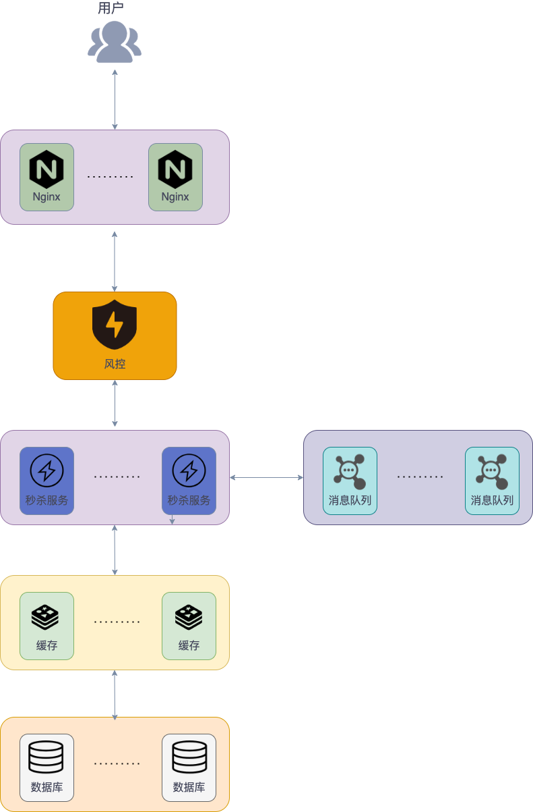

# 系统设计

## 回答步骤

1. 问清系统具体要求

   功能性需求：

   系统包含哪些核心功能。

   非功能性需求：

   约束条件，比如系统需要达到多少 QPS。

2. 对系统进行抽象设计

   画抽象架构图，包含系统的组件及它们之间的联系。

   

   ---

3. 考虑系统目前需要优化的点

   * 部署机器数量，负载均衡。
   * 数据库处理速度，增加索引，读写分离，缓存。
   * 数据量过大，分库分表。
   * 安全隐患。
   * 分布式文件系统。

4. 第三点中的问题优化具体方法。

## 各种指标

### 性能相关指标

#### 响应时间 RT (Response-time)

用户发出请求到用户收到系统处理结果所需要的时间。

#### 并发数

系统能够同时供多少人访问使用，即同时能处理的请求数量。

并发数反应了系统的负载能力。

**`QPS (Query Per Second)`**

服务器每秒可以执行的查询次数。

**`TPS (Transaction Per Second)`**

服务器每秒处理的事务数。

> 这里的事务可以理解为用户发出请求到请求完成的过程。
>
> 对于一个页面的访问，形成一个 TPS；但一次页面请求，可能产生多次对服务器的请，即多个 QPS。

#### 吞吐量

系统单位时间内处理的请求数量。

`TPS`、`QPS` 是吞吐量的量化指标。

* `QPS` (`TPS`) = 并发数/平均响应时间 (`RT`)
* 并发数 = `QPS` * 平均响应时间 (`RT`)

### 系统活跃度指标

PV (Page View)

页面浏览量或点击量。多次刷新可累计。

UV (Unique Visitor)

独立访客量。一天内相同访客多次刷访问，只算一次。

DAU (Daliy Active User)

日活跃用户量。

MAU (Monthly Active Users)

月活跃用户量。

> 某网站 DAU 为 1200w，用户日均使用时长 1h，RT 为 0.5s，求并发量和 QPS。
>
> 平均并发量 = DAU * 日均使用时长 / (24 * 60 * 60) = 1200w / 24 = 50w
>
> 真实并发量 = DAU * 日均使用时长 / (16 * 60 * 60) = 1200w / 16 = 75w
>
> 峰值并发量 = 平均并发量 * 6 = 300w
>
> QPS = 真实并发量 / RT = 75w / 0.5 = 150w/s

### 性能测试工具

就用过 Jmeter 和 Postman。

### 常见软件的 QPS

* Nginx：单机 QPS 可以达到 30w+。一般不会是性能瓶颈。
* Redis：单机 QPS 可以达到 8w+。
* MySQL：单机 QPS 为 4k。
* Tomcat：单机 QPS 为 2w 左右。可以通过配置优化。

### 性能优化法则

 优先级从上到下：

1. SQL 优化，JVM，DB，Tomcat 参数调优。
2. 硬件性能优化 (加内存、加 CPU 核心、换固态硬盘)。
3. 业务逻辑优化
4. 加缓存
5. 读写分离、集群
6. 分库分表

## 如何设计秒杀系统？

* 秒杀开始的时候，有大量用户同时参数，所以秒杀系统要满足**高并发**和**高性能**。
* 为了保证流程顺利进行，整个系统要满足**高可用**。
* 商品库存有限，不能超卖，所以要保证数据的**一致性**。

### 高并发&高性能

#### 热点数据处理

热点数据指的是某一时间段内被大量访问的数据，比如爆款商品的数据、新闻热点。

热点数据可能占比少，但是访问量非常大。

* 静态热点数据：可以提前预测到的热点数据，比如要秒杀的商品。
* 动态热点数据：不能提前预测到的热点数据，需要通过监测系统运行情况获得。

如何处理：

1. 热点数据获取：将静态热点数据直接预测。使用热 key 探测中间件，实时获取动态热点数据。
2. 热点数据存放：在 Redis 中放一份，最好也能在 JVM 内存中也放一部分。实现多级缓存，提高性能。

#### 流量削锋

消息队列

秒杀开始后请求量非常大，后端服务没有能力去处理，可以先把这些请求放到消息队列中。后端服务按照自己的能力慢慢消费这些消息，这就避免大量请求把后端服务击垮。

---

回答问题/验证码

在用户发起秒杀请求之前进行答题或者输入验证码。

* 避免请求过于集中
* 避免用户使用脚本作弊。对提交时间做校验，提交时间过短，很大概率是使用脚本。

### 高可用

#### 集群化

想要保证系统中某个组件的高可用，需要搭建集群来避免单点风险。

比如 `Redis` 集群。

#### 限流

对服务端的接口请求的频率进行限制，防止请求过多导致服务挂掉。

比如使用 Sentinel、Hystrix 进行限流。

#### 排队

另一种限流，限流直接拒绝了用户请求。排队让系统暂时处理不了的请求等待一段时间。

例如当请求量到达一定阈值时，通知用户进行排队，等到系统可以继续处理再放行。

？

#### 降级

当服务器压力剧增的情况下，根据流量及业务情况，对一些服务和页面降级，释放服务器资源保证核心任务的正常运行。

例如当请求量到达一定阈值时，关闭系统的一些非核心功能，这样留下更多系统资源给核心功能。

#### 熔断

目的是应对当前系统以来的外部系统或第三方系统的故障。

例如：秒杀功能位于服务 A 上，服务 A 上同时还有其他的一些功能，比如商品管理。如果服务 A 上的商品管理接口响应非常慢的话，其他服务直接不再请求 A 上的商品管理接口，可以避免其他服务被拖慢。

### 一致性

#### 减库存方案

* 下单即减库存：只要用户下单了，即使不付款，也扣库存。超时不付款释放库存。
* 付款再减库存：付款之后再减库存。但是会造成下单成功，但是付款失败。

提前将秒杀商品信息放到 redis 中。通过 Redis 对库存进行原子操作。

？

#### 接口幂等

在分布式系统中，

？

### 总体架构

---

## 如何设计一个排行榜？

### MySQL ORDER BY

数据量较少的时候，可以直接使用 order by 对 score 进行排序。对 score 字段索引可以加快排序速度。

### Redis sorted set

轻松解决百万级的数据排序。

sorted set 类型会按照权重参数 score 的值进行排序。

Redis 中只保存了排行榜展示所需的数据，用户具体数据信息，还需要使用 ID 去数据库中查找。

#### 多条件排序？

根据特定的条件来拼接 score 的值。

比如要加上时间先后的条件，直接 score 加上时间戳就行。

