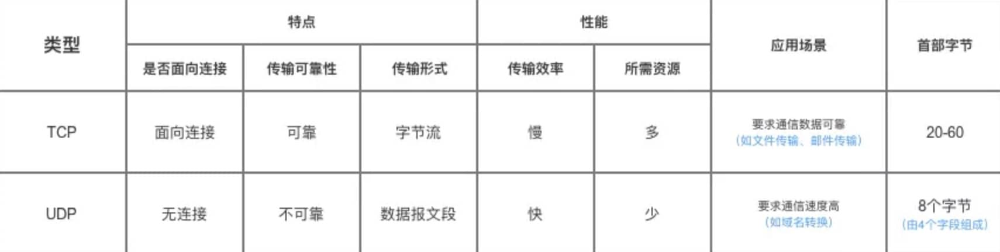

# 计算机网络

## 1 OSI 七层模型

## 2 TCP/IP 四层模型

### 传输层

1. 网络层
2. 网络接口层

**为什么要分层？**

1. 各层之间相互独立，关注本层的功能，为上层提供服务。
2. 符合编程中的 “高内聚，低耦合” 思想。
3. 分层将功能分解，复杂的问题分解成更小的问题。

### 2.1 应用层

最上层的，也是我们能直接接触到的就是**应用层**（*Application Layer*），我们电脑或手机使用的应用软件都是在应用层实现。那么，当两个不同设备的应用需要通信的时候，应用就把应用数据传给下一层，也就是传输层。

所以，应用层只需要专注于为用户提供应用功能，比如 HTTP、FTP、Telnet、DNS、SMTP等。

应用层是不用去关心数据是如何传输的，就类似于，我们寄快递的时候，只需要把包裹交给快递员，由他负责运输快递，我们不需要关心快递是如何被运输的。

而且应用层是工作在操作系统中的用户态，传输层及以下则工作在内核态。

#### 2.1.1 超文本传输协议 (Hyper Text Transfer Protocol, HTTP) 

HTTP 协议是超文本传输协议。它是基于TCP协议的应用层传输协议，定义客户端和服务端进行数据传输的规则。

服务端默认使用 TCP 的 80 端口提供服务。

**HTTP 1.0 和 1.1 的区别？**

1. **连接方式**：HTTP 1.0 默认使用短连接，每一个请求都是一个单独的连接，做不到连接的复用。大量的 “握手报文” 和 “挥手报文” 占用带宽。HTTP 1.1 默认使用长连接，TCP 连接建立之后会一直保持连接状态。

2. **状态响应码**：HTTP/1.1 中新加入了大量的状态码。

   > 比如说，`100 (Continue)`——在请求大资源前的预热请求，`206 (Partial Content)`——范围请求的标识码，`409 (Conflict)`——请求与当前资源的规定冲突，`410 (Gone)`——资源已被永久转移，而且没有任何已知的转发地址。

3. **缓存处理**：HTTP/1.1 在 algorithm.header 中引入了更多的缓存控制策略。

   > 例如 Entity tag，If-Unmodified-Since, If-Match, If-None-Match 等

4. **Host头处理** : HTTP/1.1 在请求头中加入了 `Host` 字段。当一个 IP 绑定多个 Host 时，服务器能进行区分。

> HTTP 2.0：提出多路复用。多路复用前，文件是串行传输的，请求a文件，b文件只能等待。引入多路复用，a文件b文件可以同时传输。

**浏览器中输入 url 到显示页面，发生了什么？**

*// TODO*

**HTTP 如何保存用户状态？**

使用 Cookie 和 Session。

Cookie 和 Session 都是用来跟踪浏览器用户身份的会话方式，但是两者的应用场景不太一样。

**Cookie**：是由服务端产生，再发送给客户端保存，当客户端再次访问的时候，服务器可根据 Cookie 识别客户端，以此可以做个性化推送，免账号密码登录等等

**Session**：是另一种记录客户状态的机制，不同的是 Cookie 保存在客户端浏览器中，而 Session 保存在服务器上。客户端浏览器访问服务器的时候，服务器会分配 SessionID 给客户端，并且把客户端信息记录在服务器上。客户端浏览器再次访问时只需要将 SessionID 放在 Cookie 中，服务端就可以查找到该用户信息。

> Cookie 存储在客户端中，而 Session 存储在服务器上，相对来说 Session 安全性更高。如果要在 Cookie 中存储一些敏感信息，不要直接写入 Cookie 中，最好能将 Cookie 信息加密，使用到时再去服务器端解密。

**转发和重定向的区别？**

转发是服务器行为。服务器直接向目标地址访问URL,将相应内容读取之后发给浏览器，用户浏览器地址栏URL不变，转发页面和转发到的页面可以共享 request 里面的数据。

重定向是利用服务器返回的状态码来实现的，如果服务器返回 301 或者 302，浏览器收到新的消息后自动跳转到新的网址重新请求资源。用户的地址栏 url 会发生改变，而且不能共享数据。

#### 2.1.2 超文本传输安全协议 (Hyper Text Transfer Protocol over SecureSocket Layer, HTTPS)

HTTPS  是 HTTP 的加强安全版本。

使用 TCP 作为底层协议，并额外使用 SSL/TLS 协议用作加密和安全认证。默认端口号是 443。

**SSL/TLS 的工作原理？**

TLS 是基于 SSL 的。

*// TODO*

#### 2.1.3 邮件传输协议 (Simple Mail Transfer Protocol, SMTP)

负责**发送**电子邮件。SMTP 不提供加密服务。

工作在 TCP 的 25 端口。

邮件发送过程：如果接收方和发送方使用的是同一种邮箱如 163，用户通过 SMTP 发送给 163 的邮箱服务器，163 邮箱服务器通知接收方来收取邮件，接收的用户通过 POP3/IMAP 协议取邮件。如果接收方和发送方使用的不是同一种邮箱，发送方的邮箱服务器还需要通过 SMTP 将邮件发送给接受方的邮箱服务器。

#### 2.1.4 邮件收取协议 (POP3 / IMAP)

POP3 / IMAP 都是收取邮件的协议

邮局协议 (Post Office Protocol, POP)：目前 POP3 版本。工作在 TCP 110 端口。

Internet 邮件访问协议 (Internet Message Access Protocol, IMAP)：目前 IMAP4 版本，作为 POP3 的替代协议，提供邮件检索和邮件处理功能，不用下载邮件就可以看标题和摘要。工作在 TCP 143 端口。

#### 2.1.5 文件传输协议 (File Transfer Protocol, FTP)

提供文件传输服务。

基于客户端-服务器 (C/S) 模型设计。

1. 当需要传输数据时，客户端从任意一个非系统端口 N (N > 1024) 连接到 FTP 服务器的 21 端口 (控制连接)
2. 客户端监听端口 N+1 并告诉 FTP 服务器已经打开了端口 N+1 等待接收数据
3. 服务器从 20 端口 (数据连接) 向客户端的 N+1 端口发起连接请求，并传输数据

> 还有一些
>
> SNMP、Telnet、SSH...

### 2.2 传输层

#### 2.2.1 TCP 三次握手

1. 第一次握手：客户端将标志位SYN置为1，随机产生一个值序列号seq=x，并将该数据包发送给服务端，客户端 进入syn_sent状态，等待服务端确认。
2. 第二次握手：服务端收到数据包后由标志位SYN=1知道客户端请求建立连接，服务端将标志位SYN和 ACK都置为1，ack=x+1,随机产生一个值seq=y，并将该数据包发送给客户端以确认连接请求，服务端进入syn_rcvd状态。
3. 第三次握手：客户端收到确认后检查,如果正确则将标志位ACK为1，ack=y+1，并将该数据包发送给服务端，服务端进行检查如果正确则连接建立成功，客户端和服务端进入established状态，完成三次握手，随后客户端和服务端之间可以开始传输数据了

**为什么要三次握手？**

为了确认双方的发送和接收都是正常的。

第一次握手：Client 什么都不能确认；Server 确认了对方发送正常，自己接收正常

第二次握手：Client 确认了：自己发送、接收正常，对方发送、接收正常；Server 确认了：对方发送正常，自己接收正常

第三次握手：Client 确认了：自己发送、接收正常，对方发送、接收正常；Server 确认了：**自己发送**、接收正常，对方发送、**接收正常**

如果只有两次握手，服务端无法确认客户端是否能收到发送的数据。即无法知道客户端的发送是否正常，客户端的接收是否正常。

#### 2.2.2 TCP 四次挥手

1. 第一次挥手：客户端发送一个 FIN=1，用来关闭客户端到服务端的数据传送，客户端进入 `fin-wait-1` 状态。
2. 第二次挥手：服务端收到 FIN=1 后，发送一个 ACK=1 给客户端，确认序号为收到序号+1，服务端进入 `close-wait` 状态。此时 TCP连接处于半关闭状态，即客户端已经没有要发送的数据了，但服务端可能还要数据要发送。客户端收到 ACK 后进入 `fin-wait-2`。
3. 第三次挥手：服务端发送一个 FIN=1，用来关闭服务端到客户端的数据传送，服务端进入 `last-ack` 状态。
4. 第四次挥手：客户端收到 FIN 后，客户端进入 `time-wait` 状态，接着发送一个 ACK=1 给服务端，确认后，服务端进入 `closed` 状态，完成四次挥手。等 `time-wait` 计时器时间结束，客户端也进入 `closed` 状态。

**为什么关闭连接要四次挥手？建立连接只要三次握手。**

这是因为在建立连接时，服务端将 ACK 和 SYN (ACK 起应答作用，SYN 起同步作用）放在一个报文里来发送。但关闭连接时，当收到客户端的 FIN 报文时，仅仅表示客户端没有数据发送了；但未必服务端所有的数据都发送完毕，所以服务端未必会马上会关闭 SOCKET，等待数据发送完，再发送 FIN 报文给客户端来表示可以关闭连接了，所以需要比建立连接多一次。

#### 2.2.3 TCP 与 UDP 的区别

比如说用的比较多的 FTP、HTTP 协议都是基于 TCP 的。DNS、SNMP 都是基于 UDP 的。

* TCP 向上层提供面向连接的可靠服务，建立连接 (三次握手) 会增加网络的开销；UDP 向上层提供无连接不可靠服务，接收端收到 UDP 报文不需要返回确认。
* 对数据准确性要求高，速度可以相对较慢的，选用 TCP。对数据的实时性要求高的服务，选用 UDP。

**为何 TCP 可靠？为何 UDP 不可靠？**

* **三次握手**建立连接，确认双方都能收到对方发送的数据；**四次挥手**关闭连接，确认双方的数据发送完毕。

* **流量控制**，使用滑动窗口控制发送方数据发送速率。

* **拥塞控制** (慢启动、拥塞避免、快重传、快回复...)，防止过多数据注入网络导致路由器过载而发生拥塞，降低网络整体性能。

  > 当某个网络节点收到的数据包数量超出了可处理的范围就可能会发生网络拥塞。那么理论上来说当某个节点发生拥塞时，只要让向它发送数据的节点少发一点就行了。
  >
  > TCP中的拥塞控制当拥塞窗口 cwnd 小于门限值时，使用慢开始算法，拥塞窗口指数增加。当拥塞窗口大于门限值时，使用拥塞避免算法，拥塞窗口线性增加1。当探测到网络发生拥塞，把门限值设置为拥塞窗口的一半，拥塞窗口设置为门限值的一半，再继续使用慢开始算法。

* **超时重传机制**，发送方每发送一个 TCP 报文段，就开启一个重传计时器。当计时器超时还没有收到接收方的确认，就会重传该报文段。

* **校验和机制**，检验传输过程中数据是否出现差错。

* TCP 会给传输的数据编号，接收方会对收到的数据包按编号进行排序，当收到重复的数据接收方会丢弃。

### 2.3 网络层

*// TODO*

### 2.4 网络接口层

*// TODO*

### 键入网址到网页显示，期间发生了什么？

---

1. 进行 URL 解析，确定访问的域名。

2. 生成 HTTP 请求报文。

3. 通过域名查询 IP地址，先看浏览器的缓存，再查操作系统缓存，再查hosts 文件，最后去访问DNS服务器。

   查询的时候有递归和迭代两种方式，一般都是使用迭代的方式查询。

4. 浏览器的 Socket库 调用操作系统协议栈中的 TCP/IP 协议进行数据传输。

5. 三次握手建立连接。

   1. 将传输的数据拼上TCP头部和IP头部，TCP头部寻找目的端口号，IP头部寻找目的IP。
   2. 查路由表找到下一条的 ip 地址，通过ARP协议查到对应的 MAC地址，把 MAC头部拼上。
   3. 网卡再拼上报头和分界符
   4. 网卡把数据包发到交换机，交换机去查MAC地址表找对应的出口端口号，转发到路由器上。也可以从网卡直接发到路由器上。
   5. 路由器收到数据包之后就把MAC头丢弃，得到IP头里的IP地址，去查路由表，找到下一跳地址IP，再通过 ARP协议找到对应MAC地址，再把MAC头拼回去，把数据包转发出去。

6. 最终服务器收到了客户端发过来的数据包，一层层拆包之后得到了 HTTP 报文。

7. 生成对应的响应报文，通过TCP/IP协议发回客户端。

8. 浏览器收到之后渲染页面，就显示出来了。

### HTTP 协议

**HTTP 是一个在计算机世界里专门在「两点」之间「传输」文字、图片、音频、视频等「超文本」数据的「约定和规范」。**

#### HTTP 常见的状态码有哪些？

- 「**200 OK**」是最常见的成功状态码，表示一切正常。如果是非 `HEAD` 请求，服务器返回的响应头都会有 body 数据。
- 3xx 重定向
- 「**404 Not Found**」表示请求的资源在服务器上不存在或未找到，所以无法提供给客户端。
- 「**500 Internal Server Error**」与 400 类型，是个笼统通用的错误码，服务器发生了什么错误，我们并不知道。

#### HTTP 常见字段有哪些？

* *Host* 字段；客户端发送请求时，用来指定服务器的域名。
* *Content-Length 字段*；服务器在返回数据时，会有 `Content-Length` 字段，表明本次回应的数据长度。
* *Connection 字段*；一般是 Keep-Alive 保持 TCP 长连接。
* *Content-Type 字段*；用于服务器回应时，告诉客户端，本次数据是什么格式。一般是 `text/html;` 要返回 excel 文件、压缩文件，要填别的类型。
* *Content-Encoding 字段*；说明数据的压缩方法。表示服务器返回的数据使用了什么压缩格式。

#### GET 和 POST 有什么区别？

* **GET 的语义是从服务器获取指定的资源**
* **POST 的语义是根据请求负荷（报文body）对指定的资源做出处理**

### HTTPS

#### HTTP 与 HTTPS 有哪些区别？

1. HTTP 信息是明文传输，存在安全风险的问题。HTTPS 在 TCP 和 HTTP 网络层之间加入了 SSL/TLS 安全协议，使得报文能够加密传输。
2. HTTP 连接建立相对简单， TCP 三次握手之后便可进行 HTTP 的报文传输。而 HTTPS 在 TCP 三次握手之后，还需进行 SSL/TLS 的握手过程，才可进入加密报文传输。
3. HTTP 的端口号是 80，HTTPS 的端口号是 443。
4. HTTPS 协议需要向 CA（证书权威机构）申请数字证书，来保证服务器的身份是可信的。

#### HTTP/1.1 相比 HTTP/1.0 提高了什么性能？

HTTP/1.1 相比 HTTP/1.0 性能上的改进：

- 使用长连接的方式改善了 HTTP/1.0 短连接造成的性能开销。
- 支持管道（pipeline）网络传输，只要第一个请求发出去了，不必等其回来，就可以发第二个请求出去，可以减少整体的响应时间。

但 HTTP/1.1 还是有性能瓶颈：

- 请求 / 响应头部（Header）未经压缩就发送，首部信息越多延迟越大。只能压缩 `Body` 的部分；
- 发送冗长的首部。每次互相发送相同的首部造成的浪费较多；
- **服务器是按请求的顺序响应的，如果服务器响应慢，会招致客户端一直请求不到数据，也就是队头阻塞；**
- 没有请求优先级控制；
- 请求只能从客户端开始，服务器只能被动响应。

#### 如何优化 HTTP/1.1？

这次主要从 3 个方面介绍了优化 HTTP/1.1 协议的思路。

第一个思路是，通过缓存技术来避免发送 HTTP 请求。客户端收到第一个请求的响应后，可以将其缓存在本地磁盘，下次请求的时候，如果缓存没过期，就直接读取本地缓存的响应数据。如果缓存过期，客户端发送请求的时候带上响应数据的摘要，服务器比对后发现资源没有变化，就发出不带包体的 304 响应，告诉客户端缓存的响应仍然有效。

第二个思路是，减少 HTTP 请求的次数，有以下的方法：

1. 将原本由客户端处理的重定向请求，交给代理服务器处理，这样可以减少重定向请求的次数；
2. 将多个小资源合并成一个大资源再传输，能够减少 HTTP 请求次数以及 头部的重复传输，再来减少 TCP 连接数量，进而省去 TCP 握手和慢启动的网络消耗；小图合大图
3. 按需访问资源，只访问当前用户看得到/用得到的资源，当客户往下滑动，再访问接下来的资源，以此达到延迟请求，也就减少了同一时间的 HTTP 请求次数。

第三思路是，通过压缩响应资源，降低传输资源的大小，从而提高传输效率，所以应当选择更优秀的压缩算法。

#### HTTP/2 做了什么优化？

HTTP/2 协议是基于 HTTPS 的。

头部压缩、二进制格式报文

HTTP/2 是可以在**一个连接中并发多个请求或回应，而不用按照顺序一一对应**。

移除了 HTTP/1.1 中的串行请求，不需要排队等待，也就不会再出现「队头阻塞」问题，**降低了延迟，大幅度提高了连接的利用率**。

举例来说，在一个 TCP 连接里，服务器收到了客户端 A 和 B 的两个请求，如果发现 A 处理过程非常耗时，于是就回应 A 请求已经处理好的部分，接着回应 B 请求，完成后，再回应 A 请求剩下的部分。

### TCP

#### 三次握手

1. 第一次握手：客户端将标志位SYN置为1，随机产生一个值序列号seq=x，并将该数据包发送给服务端，客户端 进入syn_sent状态，等待服务端确认。
2. 第二次握手：服务端收到数据包后由标志位SYN=1知道客户端请求建立连接，服务端将标志位SYN和 ACK都置为1，ack=x+1,随机产生一个值seq=y，并将该数据包发送给客户端以确认连接请求，服务端进入syn_rcvd状态。
3. 第三次握手：客户端收到确认后检查，如果正确则将标志位ACK为1，ack=y+1，并将该数据包发送给服务端，服务端进行检查如果正确则连接建立成功，客户端和服务端进入established状态，完成三次握手，随后客户端和服务端之间可以开始传输数据了。**第三次握手是可以携带数据的，前两次握手是不可以携带数据的**。

##### 为什么要三次握手？

* 为了确认双方的发送和接收都是正常的。

  第一次握手：Client 什么都不能确认；Server 确认了对方发送正常，自己接收正常

  第二次握手：Client 确认了：自己发送、接收正常，对方发送、接收正常；Server 确认了：对方发送正常，自己接收正常

  第三次握手：Client 确认了：自己发送、接收正常，对方发送、接收正常；Server 确认了：**自己发送**、接收正常，对方发送、**接收正常**

  如果只有两次握手，服务端无法确认客户端是否能收到发送的数据。即无法知道客户端的发送是否正常，客户端的接收是否正常。

* 避免建立历史连接。

  客户端先发送了 SYN（seq = 10） 报文，然后客户端宕机了，而且这个 SYN 报文还被网络阻塞了，服务端并没有收到，接着客户端重启后，又重新向服务端建立连接，发送了 SYN（seq = 20） 报文（注意不是重传 SYN，重传的 SYN 的序列号是一样的）。此时 序列号为 10 的报文先到达了服务端。服务端返回序号为 11 的报文。

  如果只有两次握手。这个时候 客户端和服务端都处于 Established 状态，已经建立了连接，已经可以传输数据了。等到客户端收到了报文，发现序号不对，再发起 RST 报文请求终止连接，这就非常浪费资源。

  如果是三次握手。服务端返回序号为 11 的报文时，双方只是都在 SYN_SENT 状态，还没有建立连接，还不能发送数据。服务端收到之后，再发起 RST 报文请求终止连接。

#### 四次挥手

1. 第一次挥手：客户端发送一个 FIN=1，用来关闭客户端到服务端的数据传送，客户端进入 `fin-wait-1` 状态。
2. 第二次挥手：服务端收到 FIN=1 后，发送一个 ACK=1 给客户端，确认序号为收到序号+1，服务端进入 `close-wait` 状态。此时 TCP连接处于半关闭状态，即客户端已经没有要发送的数据了，但服务端可能还要数据要发送。客户端收到 ACK 后进入 `fin-wait-2`。
3. 第三次挥手：服务端发送一个 FIN=1，用来关闭服务端到客户端的数据传送，服务端进入 `last-ack` 状态。
4. 第四次挥手：客户端收到 FIN 后，客户端进入 `time-wait` 状态，接着发送一个 ACK=1 给服务端，确认后，服务端进入 `closed` 状态，完成四次挥手。等 `time-wait` 计时器时间结束，客户端也进入 `closed` 状态。

##### 为什么关闭连接要四次挥手？建立连接只要三次握手

这是因为在建立连接时，服务端将 ACK 和 SYN (ACK 起应答作用，SYN 起同步作用）放在一个报文里来发送。

但关闭连接时，当收到客户端的 FIN 报文时，仅仅表示客户端没有数据发送了；

但服务端可能还有数据没有发完，所以服务端会等待数据发送完，再发送 FIN 报文给客户端来表示可以关闭连接了，所以需要比建立连接多一次。

##### 为什么 TIME_WAIT 等待的时间是 2MSL？

TIME_WAIT 等待 2 倍的 MSL。

网络中可能存在来自发送方的数据包，当这些发送方的数据包被接收方处理后又会向对方发送响应，所以**一来一回需要等待 2 倍的时间**。

比如，客户端发出的第四次握手的ACK消息，服务端一直没有收到，就会触发第三次握手FIN报文的超时重传，客户端接收到 FIN 后，会重发 ACK 给被动关闭方， 一来一去正好 2 个 MSL。其实是相当于**至少允许报文丢失一次**。比如，若 ACK 在一个 MSL 内丢失，这样被动方重发的 FIN 会在第 2 个 MSL 内到达，TIME_WAIT 状态的连接可以应对。

为什么不是 4 或者 8 MSL 的时长呢？你可以想象一个丢包率达到百分之一的糟糕网络，连续两次丢包的概率只有万分之一，这个概率实在是太小了，忽略它比解决它更具性价比。

> `2MSL` 的时间是从**客户端接收到 FIN 后发送 ACK 开始计时的**。如果在 TIME-WAIT 时间内，因为客户端的 ACK 没有传输到服务端，客户端又接收到了服务端重发的 FIN 报文，那么 **2MSL 时间将重新计时**。
>
> 在 Linux 系统里 `2MSL` 默认是 `60` 秒，那么一个 `MSL` 也就是 `30` 秒。**Linux 系统停留在 TIME_WAIT 的时间为固定的 60 秒**。
>
> `MSL` 是 Maximum Segment Lifetime，**报文最大生存时间**，它是任何报文在网络上存在的最长时间，超过这个时间报文将被丢弃。因为 TCP 报文基于是 IP 协议的，而 IP 头中有一个 `TTL` 字段，是 IP 数据报可以经过的最大路由数，每经过一个处理他的路由器此值就减 1，当此值为 0 则数据报将被丢弃，同时发送 ICMP 报文通知源主机。
>
> MSL 与 TTL 的区别： MSL 的单位是时间，而 TTL 是经过路由跳数。所以 **MSL 应该要大于等于 TTL 消耗为 0 的时间**，以确保报文已被自然消亡。
>
> **TTL 的值一般是 64，Linux 将 MSL 设置为 30 秒，意味着 Linux 认为数据报文经过 64 个路由器的时间不会超过 30 秒，如果超过了，就认为报文已经消失在网络中了**。

#### 滑动窗口

一个请求一个应答的处理方式效率太低。数据包的**往返时间越长，通信的效率就越低**。

为解决这个问题，TCP 引入了**窗口**这个概念。即使在往返时间较长的情况下，它也不会降低网络通信的效率。

那么有了窗口，就可以指定窗口大小，窗口大小就是指**无需等待确认应答，而可以继续发送数据的最大值**。

TCP 有一个 `Window` 字段，也就是窗口大小。

**这个字段是接收端告诉发送端自己还有多少缓冲区可以接收数据。于是发送端就可以根据这个接收端的处理能力来发送数据，而不会导致接收端处理不过来。**

所以，通常窗口的大小是由接收方的窗口大小来决定的。

发送方发送的数据大小不能超过接收方的窗口大小，否则接收方就无法正常接收到数据。

#### 流量控制

用滑动窗口。

#### 拥塞控制

**拥塞控制** (慢启动、拥塞避免、快重传、快回复...)，防止过多数据注入网络导致路由器过载而发生拥塞，降低网络整体性能。

> 当某个网络节点收到的数据包数量超出了可处理的范围就可能会发生网络拥塞。那么理论上来说当某个节点发生拥塞时，只要让向它发送数据的节点少发一点就行了。
>
> TCP中的拥塞控制当拥塞窗口 cwnd 小于门限值时，使用慢开始算法，拥塞窗口指数增加。当拥塞窗口大于门限值时，使用拥塞避免算法，拥塞窗口线性增加1。当探测到网络发生拥塞，把门限值设置为拥塞窗口的一半，拥塞窗口设置为门限值的一半，再继续使用慢开始算法。

#### PING 的工作原理

PING 是工作在 ICMP协议 (互联网控制报文协议) 下的，ICMP协议 又是基于 IP协议的。

`ICMP` 主要的功能包括：**确认 IP 包是否成功送达目标地址、报告发送过程中 IP 包被废弃的原因和改善网络设置等。**

在 `IP` 通信中如果某个 `IP` 包因为某种原因未能达到目标地址，那么这个具体的原因将**由 ICMP 负责通知**。

当主机A ping 了主机B 之后：

ping 命令执行的时候，源主机首先会构建一个 **ICMP 回送请求消息**数据包。

ICMP 数据包内包含多个字段，最重要的是两个：

- 第一个是**类型**，对于回送请求消息而言该字段为 `8`；
- 另外一个是**序号**，主要用于区分连续 ping 的时候发出的多个数据包。

然后，由 ICMP 协议将这个数据包连同B的IP地址一起交给 IP 层。IP 层将以B的IP作为**目的地址**，本机 IP 地址作为**源地址**，**协议**字段设置为 `1` 表示是 `ICMP` 协议，再加上一些其他控制信息，构建一个 `IP` 数据包。再拼上MAC头发出去。

在规定的时候间内，源主机如果没有接到 ICMP 的应答包，则说明目标主机不可达；如果接收到了 ICMP 回送响应消息，则说明目标主机可达。用当前时刻减去该数据包最初从源主机上发出的时刻，就是 ICMP 数据包的时间延迟。

### Linux 发送网络包的流程

首先，应用程序会调用 Socket 发送数据包的接口，由于这个是系统调用，所以会从用户态陷入到内核态中的 Socket 层，Socket 层会将应用层数据拷贝到 Socket 发送缓冲区中。

接下来，网络协议栈从 Socket 发送缓冲区中取出数据包，并按照 TCP/IP 协议栈从上到下逐层处理。

如果使用的是 TCP 传输协议发送数据，那么会在传输层增加 TCP 包头，然后交给网络层，网络层会给数据包增加 IP 包，然后通过查询路由表确认下一跳的 IP，并按照 MTU 大小进行分片。

分片后的网络包，就会被送到网络接口层，在这里会通过 ARP 协议获得下一跳的 MAC 地址，然后增加帧头和帧尾，放到发包队列中。

这一些准备好后，会触发软中断告诉网卡驱动程序，这里有新的网络包需要发送，最后驱动程序通过 DMA，从发包队列中读取网络包，将其放入到硬件网卡的队列中，随后物理网卡再将它发送出去。

### Linux 接收网络包的流程

网卡是计算机里的一个硬件，专门负责接收和发送网络包，当网卡接收到一个网络包后，会通过 DMA 技术，将网络包放入到 Ring Buffer，这个是一个环形缓冲区。

那接收到网络包后，应该怎么告诉操作系统这个网络包已经到达了呢？

最简单的一种方式就是触发中断，也就是每当网卡收到一个网络包，就触发一个中断告诉操作系统。

但是，这存在一个问题，在高性能网络场景下，网络包的数量会非常多，那么就会触发非常多的中断，要知道当 CPU 收到了中断，就会停下手里的事情，而去处理这些网络包，处理完毕后，才会回去继续其他事情，那么频繁地触发中断，则会导致 CPU 一直没完没了的处理中断，而导致其他任务可能无法继续前进，从而影响系统的整体效率。

所以为了解决频繁中断带来的性能开销，Linux 内核在 2.6 版本中引入了 **NAPI 机制**，它是混合「中断和轮询」的方式来接收网络包，它的核心概念就是**不采用中断的方式读取数据**，而是首先采用中断唤醒数据接收的服务程序，然后 `poll` 的方法来轮询数据。

比如，当有网络包到达时，网卡发起硬件中断，于是会执行网卡硬件中断处理函数，**中断处理函数处理完需要「暂时屏蔽中断」，然后唤醒「软中断」来轮询处理数据，直到没有新数据时才恢复中断，这样一次中断处理多个网络包**，于是就可以降低网卡中断带来的性能开销。

那软中断是怎么处理网络包的呢？它会从 Ring Buffer 中拷贝数据到内核 struct sk_buff 缓冲区中，从而可以作为一个网络包交给网络协议栈进行逐层处理。

首先，会先进入到网络接口层，在这一层会检查报文的合法性，如果不合法则丢弃，合法则会找出该网络包的上层协议的类型，比如是 IPv4，还是 IPv6，接着再去掉帧头和帧尾，然后交给网络层。

到了网络层，则取出 IP 包，判断网络包下一步的走向，比如是交给上层处理还是转发出去。当确认这个网络包要发送给本机后，就会从 IP 头里看看上一层协议的类型是 TCP 还是 UDP，接着去掉 IP 头，然后交给传输层。

传输层取出 TCP 头或 UDP 头，根据四元组「源 IP、源端口、目的 IP、目的端口」 作为标识，找出对应的 Socket，并把数据拷贝到 Socket 的接收缓冲区。

最后，应用层程序调用 Socket 接口，从内核的 Socket 接收缓冲区读取新到来的数据到应用层。

