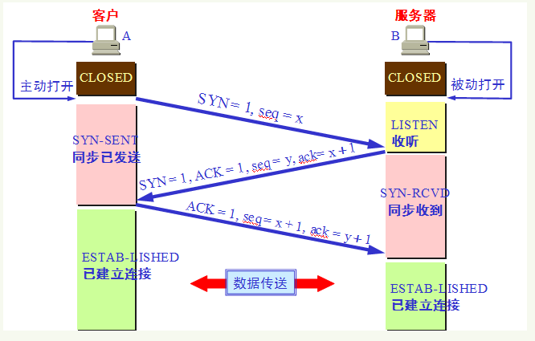

# 计算机网络

## 1 OSI 七层模型

## 2 TCP/IP 四层模型

### 传输层

1. 网络层
2. 网络接口层

**为什么要分层？**

1. 各层之间相互独立，关注本层的功能，为上层提供服务。
2. 符合编程中的 “高内聚，低耦合” 思想。
3. 分层将功能分解，复杂的问题分解成更小的问题。

### 2.1 应用层

最上层的，也是我们能直接接触到的就是**应用层**（*Application Layer*），我们电脑或手机使用的应用软件都是在应用层实现。那么，当两个不同设备的应用需要通信的时候，应用就把应用数据传给下一层，也就是传输层。

所以，应用层只需要专注于为用户提供应用功能，比如 HTTP、FTP、Telnet、DNS、SMTP等。

应用层是不用去关心数据是如何传输的，就类似于，我们寄快递的时候，只需要把包裹交给快递员，由他负责运输快递，我们不需要关心快递是如何被运输的。

而且应用层是工作在操作系统中的用户态，传输层及以下则工作在内核态。

#### 2.1.1 超文本传输协议 (Hyper Text Transfer Protocol, HTTP) 

HTTP 协议是超文本传输协议。它是基于TCP协议的应用层传输协议，定义客户端和服务端进行数据传输的规则。

服务端默认使用 TCP 的 80 端口提供服务。

**HTTP 1.0 和 1.1 的区别？**

1. **连接方式**：HTTP 1.0 默认使用短连接，每一个请求都是一个单独的连接，做不到连接的复用。大量的 “握手报文” 和 “挥手报文” 占用带宽。HTTP 1.1 默认使用长连接，TCP 连接建立之后会一直保持连接状态。

2. **状态响应码**：HTTP/1.1 中新加入了大量的状态码。

   > 比如说，`100 (Continue)`——在请求大资源前的预热请求，`206 (Partial Content)`——范围请求的标识码，`409 (Conflict)`——请求与当前资源的规定冲突，`410 (Gone)`——资源已被永久转移，而且没有任何已知的转发地址。

3. **缓存处理**：HTTP/1.1 在 algorithm.header 中引入了更多的缓存控制策略。

   > 例如 Entity tag，If-Unmodified-Since, If-Match, If-None-Match 等

4. **Host头处理** : HTTP/1.1 在请求头中加入了 `Host` 字段。当一个 IP 绑定多个 Host 时，服务器能进行区分。

> HTTP 2.0：提出多路复用。多路复用前，文件是串行传输的，请求a文件，b文件只能等待。引入多路复用，a文件b文件可以同时传输。

**浏览器中输入 url 到显示页面，发生了什么？**

*// TODO*

**HTTP 如何保存用户状态？**

使用 Cookie 和 Session。

Cookie 和 Session 都是用来跟踪浏览器用户身份的会话方式，但是两者的应用场景不太一样。

**Cookie**：是由服务端产生，再发送给客户端保存，当客户端再次访问的时候，服务器可根据 Cookie 识别客户端，以此可以做个性化推送，免账号密码登录等等

**Session**：是另一种记录客户状态的机制，不同的是 Cookie 保存在客户端浏览器中，而 Session 保存在服务器上。客户端浏览器访问服务器的时候，服务器会分配 SessionID 给客户端，并且把客户端信息记录在服务器上。客户端浏览器再次访问时只需要将 SessionID 放在 Cookie 中，服务端就可以查找到该用户信息。

> Cookie 存储在客户端中，而 Session 存储在服务器上，相对来说 Session 安全性更高。如果要在 Cookie 中存储一些敏感信息，不要直接写入 Cookie 中，最好能将 Cookie 信息加密，使用到时再去服务器端解密。

**转发和重定向的区别？**

转发是服务器行为。服务器直接向目标地址访问URL,将相应内容读取之后发给浏览器，用户浏览器地址栏URL不变，转发页面和转发到的页面可以共享 request 里面的数据。

重定向是利用服务器返回的状态码来实现的，如果服务器返回 301 或者 302，浏览器收到新的消息后自动跳转到新的网址重新请求资源。用户的地址栏 url 会发生改变，而且不能共享数据。

#### 2.1.2 超文本传输安全协议 (Hyper Text Transfer Protocol over SecureSocket Layer, HTTPS)

HTTPS  是 HTTP 的加强安全版本。

使用 TCP 作为底层协议，并额外使用 SSL/TLS 协议用作加密和安全认证。默认端口号是 443。

**SSL/TLS 的工作原理？**

TLS 是基于 SSL 的。

*// TODO*

#### 2.1.3 邮件传输协议 (Simple Mail Transfer Protocol, SMTP)

负责**发送**电子邮件。SMTP 不提供加密服务。

工作在 TCP 的 25 端口。

邮件发送过程：如果接收方和发送方使用的是同一种邮箱如 163，用户通过 SMTP 发送给 163 的邮箱服务器，163 邮箱服务器通知接收方来收取邮件，接收的用户通过 POP3/IMAP 协议取邮件。如果接收方和发送方使用的不是同一种邮箱，发送方的邮箱服务器还需要通过 SMTP 将邮件发送给接受方的邮箱服务器。

#### 2.1.4 邮件收取协议 (POP3 / IMAP)

POP3 / IMAP 都是收取邮件的协议

邮局协议 (Post Office Protocol, POP)：目前 POP3 版本。工作在 TCP 110 端口。

Internet 邮件访问协议 (Internet Message Access Protocol, IMAP)：目前 IMAP4 版本，作为 POP3 的替代协议，提供邮件检索和邮件处理功能，不用下载邮件就可以看标题和摘要。工作在 TCP 143 端口。

#### 2.1.5 文件传输协议 (File Transfer Protocol, FTP)

提供文件传输服务。

基于客户端-服务器 (C/S) 模型设计。

1. 当需要传输数据时，客户端从任意一个非系统端口 N (N > 1024) 连接到 FTP 服务器的 21 端口 (控制连接)
2. 客户端监听端口 N+1 并告诉 FTP 服务器已经打开了端口 N+1 等待接收数据
3. 服务器从 20 端口 (数据连接) 向客户端的 N+1 端口发起连接请求，并传输数据

> 还有一些
>
> SNMP、Telnet、SSH...

### 2.2 传输层

#### 2.2.1 TCP 三次握手

1. 第一次握手：客户端将标志位SYN置为1，随机产生一个值序列号seq=x，并将该数据包发送给服务端，客户端 进入syn_sent状态，等待服务端确认。
2. 第二次握手：服务端收到数据包后由标志位SYN=1知道客户端请求建立连接，服务端将标志位SYN和 ACK都置为1，ack=x+1,随机产生一个值seq=y，并将该数据包发送给客户端以确认连接请求，服务端进入syn_rcvd状态。
3. 第三次握手：客户端收到确认后检查,如果正确则将标志位ACK为1，ack=y+1，并将该数据包发送给服务端，服务端进行检查如果正确则连接建立成功，客户端和服务端进入established状态，完成三次握手，随后客户端和服务端之间可以开始传输数据了

**为什么要三次握手？**

为了确认双方的发送和接收都是正常的。

第一次握手：Client 什么都不能确认；Server 确认了对方发送正常，自己接收正常

第二次握手：Client 确认了：自己发送、接收正常，对方发送、接收正常；Server 确认了：对方发送正常，自己接收正常

第三次握手：Client 确认了：自己发送、接收正常，对方发送、接收正常；Server 确认了：**自己发送**、接收正常，对方发送、**接收正常**

如果只有两次握手，服务端无法确认客户端是否能收到发送的数据。即无法知道客户端的发送是否正常，客户端的接收是否正常。

#### 2.2.2 TCP 四次挥手

1. 第一次挥手：客户端发送一个 FIN=1，用来关闭客户端到服务端的数据传送，客户端进入 `fin-wait-1` 状态。
2. 第二次挥手：服务端收到 FIN=1 后，发送一个 ACK=1 给客户端，确认序号为收到序号+1，服务端进入 `close-wait` 状态。此时 TCP连接处于半关闭状态，即客户端已经没有要发送的数据了，但服务端可能还要数据要发送。客户端收到 ACK 后进入 `fin-wait-2`。
3. 第三次挥手：服务端发送一个 FIN=1，用来关闭服务端到客户端的数据传送，服务端进入 `last-ack` 状态。
4. 第四次挥手：客户端收到 FIN 后，客户端进入 `time-wait` 状态，接着发送一个 ACK=1 给服务端，确认后，服务端进入 `closed` 状态，完成四次挥手。等 `time-wait` 计时器时间结束，客户端也进入 `closed` 状态。

**为什么关闭连接要四次挥手？建立连接只要三次握手。**

这是因为在建立连接时，服务端将 ACK 和 SYN (ACK 起应答作用，SYN 起同步作用）放在一个报文里来发送。但关闭连接时，当收到客户端的 FIN 报文时，仅仅表示客户端没有数据发送了；但未必服务端所有的数据都发送完毕，所以服务端未必会马上会关闭 SOCKET，等待数据发送完，再发送 FIN 报文给客户端来表示可以关闭连接了，所以需要比建立连接多一次。

#### 2.2.3 TCP 与 UDP 的区别

比如说用的比较多的 FTP、HTTP 协议都是基于 TCP 的。DNS、SNMP 都是基于 UDP 的。

* TCP 向上层提供面向连接的可靠服务，建立连接 (三次握手) 会增加网络的开销；UDP 向上层提供无连接不可靠服务，接收端收到 UDP 报文不需要返回确认。
* 对数据准确性要求高，速度可以相对较慢的，选用 TCP。对数据的实时性要求高的服务，选用 UDP。

**为何 TCP 可靠？为何 UDP 不可靠？**

* **三次握手**建立连接，确认双方都能收到对方发送的数据；**四次挥手**关闭连接，确认双方的数据发送完毕。

* **流量控制**，使用滑动窗口控制发送方数据发送速率。

* **拥塞控制** (慢启动、拥塞避免、快重传、快回复...)，防止过多数据注入网络导致路由器过载而发生拥塞，降低网络整体性能。

  > 当某个网络节点收到的数据包数量超出了可处理的范围就可能会发生网络拥塞。那么理论上来说当某个节点发生拥塞时，只要让向它发送数据的节点少发一点就行了。
  >
  > TCP中的拥塞控制当拥塞窗口 cwnd 小于门限值时，使用慢开始算法，拥塞窗口指数增加。当拥塞窗口大于门限值时，使用拥塞避免算法，拥塞窗口线性增加1。当探测到网络发生拥塞，把门限值设置为拥塞窗口的一半，拥塞窗口设置为门限值的一半，再继续使用慢开始算法。

* **超时重传机制**，发送方每发送一个 TCP 报文段，就开启一个重传计时器。当计时器超时还没有收到接收方的确认，就会重传该报文段。

* **校验和机制**，检验传输过程中数据是否出现差错。

* TCP 会给传输的数据编号，接收方会对收到的数据包按编号进行排序，当收到重复的数据接收方会丢弃。

### 2.3 网络层

*// TODO*

### 2.4 网络接口层

*// TODO*

# 键入网址到网页显示，期间发生了什么？

---

