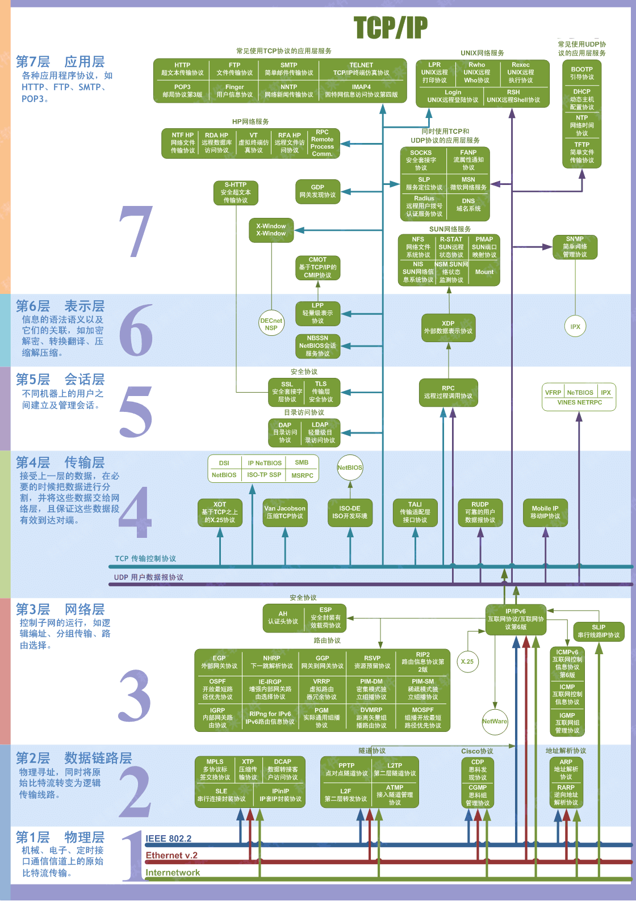

## 计算机网络

### 1 OSI 七层模型

## 2 TCP/IP 四层模型

### 2.1 应用层

#### 2.1.1 超文本传输协议 (Hyper Text Transfer Protocol, HTTP) 

主要是为浏览器与 Web 服务器之间的通信而设计的。规定了浏览器和服务器之间是怎样交流的。

服务端默认使用 TCP 的 80 端口提供服务。

HTTP 1.0

HTTP 1.1

HTTP 2.0

#### 2.1.2 简单邮件传输协议 (Simple Mail Transfer Protocol, SMTP)

负责**发送**电子邮件。SMTP 不提供加密服务。

工作在 TCP 的 25 端口。

邮件发送过程：如果接收方和发送方使用的是同一种邮箱如 163，用户通过 SMTP 发送给 163 的邮箱服务器，163 邮箱服务器通知接收方来收取邮件，接收的用户通过 POP3/IMAP 协议取邮件。如果接收方和发送方使用的不是同一种邮箱，发送方的邮箱服务器还需要通过 SMTP 将邮件发送给接受方的邮箱服务器。

#### 2.1.3 邮件收取协议 (POP3 / IMAP)

POP3 / IMAP 都是收取邮件的协议

邮局协议 (Post Office Protocol, POP)：目前 POP3 版本。工作在 TCP 110 端口。

Internet 邮件访问协议 (Internet Message Access Protocol, IMAP)：目前 IMAP4 版本，作为 POP3 的替代协议，提供邮件检索和邮件处理功能，不用下载邮件就可以看标题和摘要。工作在 TCP 143 端口。

#### 2.1.4 文件传输协议 (File Transfer Protocol, FTP)

提供文件传输服务。

基于客户端-服务器 (C/S) 模型设计。

1. 当需要传输数据时，客户端从任意一个非系统端口 N (N > 1024) 连接到 FTP 服务器的 21 端口 (控制连接)
2. 客户端监听端口 N+1 并告诉 FTP 服务器已经打开了端口 N+1 等待接收数据
3. 服务器从 20 端口 (数据连接) 向客户端的 N+1 端口发起连接请求，并传输数据

> 还有一些
>
> SNMP、Telnet、SSH...

### 2.2 传输层

#### 2.2.1 TCP 三次握手

1. 第一次握手：客户端将标志位SYN置为1，随机产生一个值序列号seq=x，并将该数据包发送给服务端，客户端 进入syn_sent状态，等待服务端确认。
2. 第二次握手：服务端收到数据包后由标志位SYN=1知道客户端请求建立连接，服务端将标志位SYN和 ACK都置为1，ack=x+1,随机产生一个值seq=y，并将该数据包发送给客户端以确认连接请求，服务端进入syn_rcvd状态。
3. 第三次握手：客户端收到确认后检查,如果正确则将标志位ACK为1，ack=y+1，并将该数据包发送给服务端，服务端进行检查如果正确则连接建立成功，客户端和服务端进入established状态，完成三次握手，随后客户端和服务端之间可以开始传输数据了

为什么要三次握手？

为了确认双方的发送和接收都是正常的。

第一次握手：Client 什么都不能确认；Server 确认了对方发送正常，自己接收正常

第二次握手：Client 确认了：自己发送、接收正常，对方发送、接收正常；Server 确认了：对方发送正常，自己接收正常

第三次握手：Client 确认了：自己发送、接收正常，对方发送、接收正常；Server 确认了：**自己发送**、接收正常，对方发送、**接收正常**

如果只有两次握手，服务端无法确认客户端是否能收到发送的数据。即无法知道客户端的发送是否正常，客户端的接收是否正常。

#### 2.2.2 TCP 四次挥手

1. 第一次挥手：客户端发送一个FIN=1，用来关闭客户端到服务端的数据传送，客户端进入fin_wait_1状态。
2. 第二次挥手：服务端收到FIN=1后，发送一个ACK=1给客户端，确认序号为收到序号+1，服务端进入Close_wait状态。此时TCP连接处于半关闭状态，即客户端已经没有要发送的数据了，但服务端若发送数据，则客户端仍要接收。客户端进入收到后进入 fin_wait_2
3. 第三次挥手：服务端发送一个FIN=1，用来关闭服务端到客户端的数据传送，服务端进入Last_ack状态。
4. 第四次挥手：客户端收到FIN后，客户端进入Time_wait状态，接着发送一个ACK=1给服务端，确认后，服务端进入Closed状态，完成四次挥手。等 time_wait 计时器时间结束，客户端也进入 closed 状态

为什么要四次挥手？建立连接只要三次。

这是因为在建立连接时，服务端将 ACK 和 SYN (ACK 起应答作用，SYN 起同步作用）放在一个报文里来发送。但关闭连接时，当收到客户端的 FIN 报文时，仅仅表示客户端没有数据发送了；但未必服务端所有的数据都发送完毕，所以服务端未必会马上会关闭 SOCKET，等待数据发送完，再发送 FIN 报文给客户端来表示可以关闭连接了，所以需要比建立连接多一次。